# 中心极限定理:现实生活中的应用

> 原文：<https://towardsdatascience.com/central-limit-theorem-a-real-life-application-f638657686e1?source=collection_archive---------6----------------------->

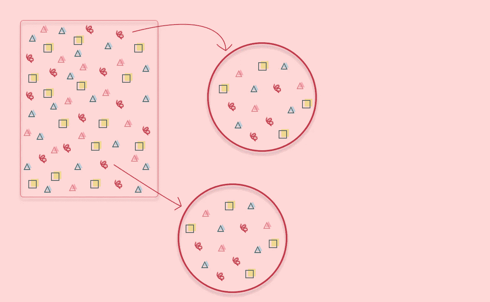

中心极限定理(CLT)是统计学中最流行的定理之一，在现实世界的问题中非常有用。在这篇文章中，我们将看到为什么中心极限定理是如此有用，以及如何应用它。

在许多使用统计的情况下，最终目标是识别*人口的特征。*

中心极限定理是一个近似值，当你研究的群体如此之大，需要很长时间来收集每个个体的数据时，你可以使用它。

# 人口

群体是你正在研究的一组个体。尽管他们被称为个体，但构成群体的元素不一定是人。

如果你是一家连锁杂货店的区域经理，你正努力提高效率，每周为每个商店的苏打水部分重新进货，这样你就能卖出尽可能多的苏打水，并避免最终出现大量未售出的存货，在那个特定的商店中售出的所有**箱*苏打水代表了总人数。*

*如果你是一个家禽饲养者，想订购鸡饲料，你需要知道你的母鸡通常吃多少磅谷物。所以在这里，*鸡*就是你的种群。*

# *研究人口是困难的*

*根据您正在解决的问题，收集整个群体的数据将会非常困难。*

*如果像可口可乐这样的公司想知道他们的美国消费者是否会喜欢他们正在开发的新产品，他们不可能派一大批研究人员去和美国的每一个人交谈。嗯，他们也许可以，但是那会非常昂贵，而且需要很长时间来收集所有的数据😀*

*这就是为什么公司要对代表产品受众的几组人进行用户研究，这样他们就可以收集数据并确定是否值得继续进行产品开发。所有这些，都没有和所有人谈过。*

*因此，从统计学的角度来说，你将从你的人口中收集*个样本*，通过结合样本中的信息，你可以得出关于你的人口的结论。*

*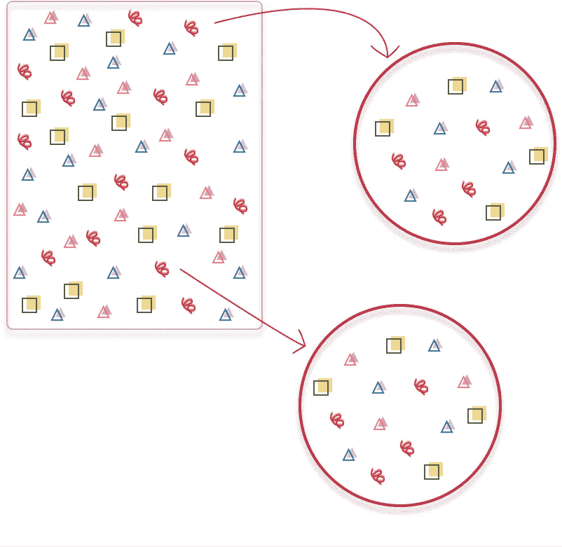*

**从总体中抽取两个样本。**

*好的样品必须是:*

*   *人口的代表，*
*   *大到足以从中得出结论，在统计学中样本量大于或等于 30。*
*   *随机挑选的，所以你不会偏向人群中的某些特征。*

## *代表性样品*

*一个有代表性的样本必须显示出人口的所有不同特征。*

*如果您想知道谁更有可能赢得超级碗，并决定对美国人口进行民意调查，即从美国人口中抽取样本，您需要确保与以下人群进行交谈:*

*   *所有不同的州都认为谁会赢，*
*   *不同的年龄组和不同的性别，*

*在你的研究中，只包括那些对运动或运动本身感兴趣的人，否则，他们不会是对你的研究感兴趣的人群的一部分。*

# *萨尔茨的箱子*

*你是一家杂货连锁店的区域经理，负责该地区的 350 家商店，下一个项目是优化萨尔茨矿泉水的每周补货。*

*您想知道每个商店每周订购多少箱苏打水，这样您就可以最大限度地减少商店货架上的闲置库存。*

*你知道必须有一个更好的方法来得到一个合理的答案，而不需要访问你所在地区的每一家商店并获得他们每周的销售数字。*

*既然你上过几堂统计学课，中心极限定理就会浮现在脑海里。你知道，应用于现实世界的问题，中心极限定理可以帮助你平衡收集所有数据所需的时间和成本，从而得出关于总体的结论。*

*你还记得样本均值中心极限定理的定义[1]:*

> *当我们从具有均值μ和标准差σ的总体中收集足够大的 *n* 个独立观测值的样本时，样本均值的抽样分布将接近正态分布，均值= μ，标准差= σ/ √n*

*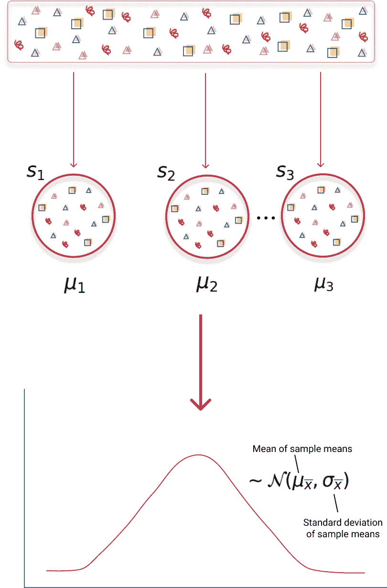*

*中心极限定理的可视化。从总体中抽取样本，获取它们的平均值，并创建样本均值分布。*

*中心极限定理告诉你，我们不必访问该地区的每一家商店，获得他们一周的苏打水销售数字，就可以知道下一个订单要放多少箱。你可以做的是从你的商店(总体)的每周销售中收集许多样本，计算它们的平均值(销售的苏打水的平均数量)并建立样本平均值的分布。这种分布也称为抽样分布。*

*如果这些样本满足中心极限定理的标准，您可以假设样本均值的分布可以近似为[正态分布](https://en.wikipedia.org/wiki/Normal_distribution)。所以现在你可以使用正态分布提供的所有统计工具。*

*从这一点开始，由于您知道了手头的分布，您可以计算概率和置信区间，并执行统计测试。*

## *中心极限定理的总体抽样准则*

*但是在使用中心极限定理和使用正态分布近似之前，您的样本必须满足一组特定的标准，这些标准扩展了好样本的特征。*

*您的样品应该是:*

*   **随机选取*，这样你就不会偏向于群体中的某些特征，并且保证样本中的每个观察值都独立于所有其他观察值。这也有助于确保样本中的每个观察都是独立的。*
*   **人口的代表*。*
*   **大到足以得出结论的*，在统计学上指样本量大于或等于 30。*
*   **包括不到 10%的人口*，如果你抽样*没有*替换的话。由于总体中的观察值并不都是相互独立的，如果您收集的样本太大，您可能最终会收集到相互不独立的观察值。即使这些观察是随机选取的。*

# *你不需要知道人口分布——中心极限定理的超级威力*

*如果你想使用任何一种[推断统计方法](https://en.wikipedia.org/wiki/Statistical_inference)，即了解你的数据的概率分布特征，你需要知道你的数据遵循的分布。否则，你可能会在工作中使用错误的工具。*

*所以想到的一个问题是*我需要知道我的人口分布才能使用中心极限定理吗？**

*简短的回答是*否*😁*

*中心极限定理真正强大的地方在于，你不需要事先知道你的人口分布。你所需要做的就是收集足够多的符合标准的样本，你就可以确定样本均值的分布将遵循正态分布。*

# *你每周需要补充多少箱苏打水？*

*为了回答这个问题，让我们生成一个随机数据集来代表总体，其中每个数据点都是你所监管区域的每个商店每周售出的苏打水的总数。*

**

*随机生成的萨尔茨啤酒销售数据集中的片段。*

```
*import pandas as pd
import random
import globdef create_dataset(dataset_size):
    *""" Creating the population dataset """* dataset = []

    while dataset_size > 0:
      dataset.append(random.randrange(3, 100))
      dataset_size -= 1 return dataset# Initializing the random number generator
random.seed(1234)# Reading the output directory in case we've already generated the population dataset
dataset_file_list = glob.glob("output/sales_dataset.csv")sales_data = None# Creating the population dataset and saving it to avoid always recreating the dataset
if len(dataset_file_list) == 0:    
    sales_data = pd.DataFrame(data=create_dataset(4200))
    sales_data.columns = ['sales']
    sales_data.to_csv("output/sales_dataset.csv", index=False)
else:
    sales_data = pd.read_csv('output/sales_dataset.csv')*
```

*然后你可以取不同数量的样本，所有样本的大小都相同，然后绘制销售数据，看看看起来怎么样。*

*样本数据本身的分布不一定具有正态分布的形状。还有，中心极限定理不需要你知道人口的分布。*

*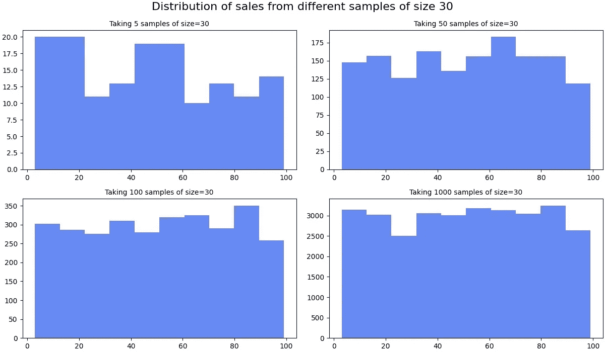*

*从总体中抽取不同数量样本的分布，每个样本有 30 个数据点。*

*在这个例子中，每个图表都有不同数量的样本，所有样本的大小都是 30，没有一个分布看起来像经典的*钟形曲线*。差远了。*

*当你取另一组样本时，这不会有太大变化，这次每个样本有 100 个数据点。*

*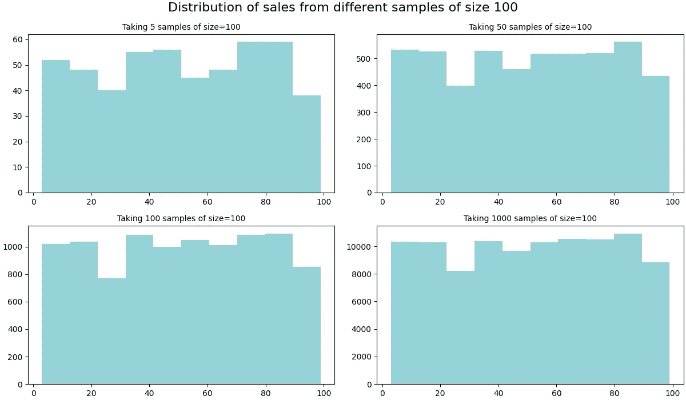*

*从总体中抽取不同数量样本的分布，每个样本有 100 个数据点。*

```
*import numpy as np
import matplotlib.pyplot as pltdef picking_n_samples(population, number_samples, sample_size):
    *""" Sampling without replacement with fixed size
        Returning the array of sample and array with their respective mean
    """* results = []
    sample_mean = []

    while number_samples > 0:
        new_sample = random.sample(population, sample_size)
        results += new_sample
        sample_mean += [np.mean(new_sample)]
        number_samples -= 1 return [results, sample_mean]def generate_sample_sets(dataset, number_samples, sample_size):
    *""" Generate multiple sets samples with fixed size
        Returns all sample sets and their corresponding set of means    
    """* samples_array = []
    sample_means_array = [] for sample_count in number_samples:
        new_sample, sample_mean = picking_n_samples(dataset, sample_count, sample_size)
        samples_array.append(new_sample)
        sample_means_array.append(sample_mean) return [samples_array, sample_means_array] def plot_samples(sample_array, number_samples, default_size, plot_color='#6689F2', title='', x_axis_title='', filename='plot'): fig, ((ax1, ax2), (ax3, ax4)) = plt.subplots(2, 2, figsize=(12, 7), constrained_layout=True)
    fig.suptitle(title, fontsize=16) ax1.hist(sample_array[0], color=plot_color)
    ax1.set_title("Taking " + str(number_samples[0]) + " samples of size=" + str(default_size), fontsize=10)
    ax1.set_xlabel(x_axis_title) ax3.hist(sample_array[2], color=plot_color)
    ax3.set_title("Taking " + str(number_samples[2]) + " samples of size=" + str(default_size), fontsize=10)
    ax3.set_xlabel(x_axis_title) ax2.hist(sample_array[1], color=plot_color)
    ax2.set_title("Taking " + str(number_samples[1]) + " samples of size=" + str(default_size), fontsize=10)
    ax2.set_xlabel(x_axis_title) ax4.hist(sample_array[3], color=plot_color)
    ax4.set_title("Taking " + str(number_samples[3]) + " samples of size=" + str(default_size), fontsize=10)
    ax4.set_xlabel(x_axis_title)

    fig.savefig("output/" + filename) ######################### Example 1####################### Setting the defaults for this example
example1_number_of_samples_array = [5, 50, 100, 1000, 10000]
example1_default_sample_size = 30# Picking multiple samples of size 30
example_1_samples, example_1_means = generate_sample_sets(list(sales_data['sales'].values), example1_number_of_samples_array, example1_default_sample_size)# Plot the different sets of samples
plot_title = 'Distribution of sales from different samples of size ' + str(example1_default_sample_size)plot_samples(example_1_samples, example1_number_of_samples_array, example1_default_sample_size, title=plot_title, filename="example_1_samples_distribution")########################## Example 2######################## Setting the defaults for this example
example_2_number_of_samples_array = [5, 50, 100, 1000, 10000]
example_2_default_sample_size = 100example_2_samples, example_2_means = generate_sample_sets(list(sales_data['sales'].values), example_2_number_of_samples_array, example_2_default_sample_size)# Plot the different sets of samples
plot_title = 'Distribution of sales from different samples of size ' + str(example_2_default_sample_size)plot_samples(example_2_samples, example_2_number_of_samples_array, example_2_default_sample_size, title=plot_title, filename="example_2_samples_distribution", plot_color="#96D2D9")*
```

*因为关键是取样并计算平均值！*

*看一下前面例子中样本均值的分布就清楚了。随着样本数量的增加，你就越接近正态分布的形状。*

*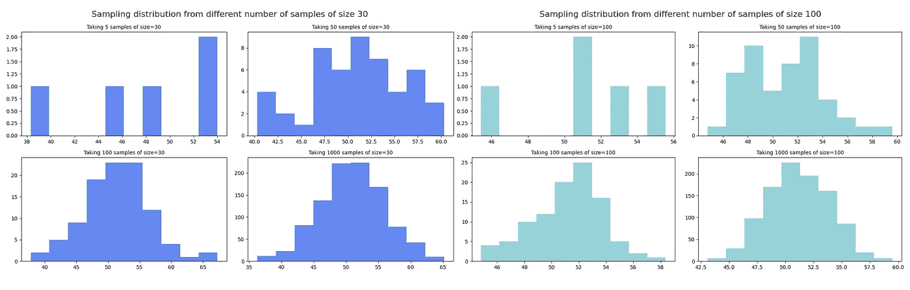*

*从总体中抽取不同样本的抽样分布，每个样本有 30 个数据点(左)和 100 个数据点(右)。*

*较高数量的样本还会降低采样分布的可变性。*

*如果你观察有 5 个和 50 个样本的分布，你会注意到后者有一个较小的标准差。*

*如果您收集的样本越大，获得极值的机会就越少，因此您的值会更加集中在一起。因此，标准偏差或与平均值的距离会更小。*

*从公式的角度来看，回顾中心极限定理的定义，采样分布的标准偏差(也称为标准误差)等于σ/ √n。因此，随着样本量的增加，分母也会增加，从而使总体标准值变小。*

*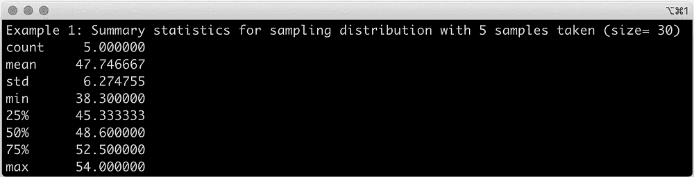**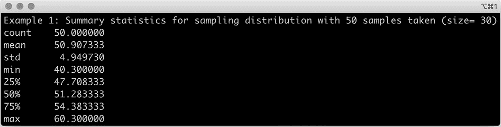*

*具有(顶部)5 个大小为 30 的样本和(底部)50 个大小为 30 的样本的抽样分布的汇总统计。*

```
*example_1_sampling_distribution_5_samples = pd.Series(example_1_means[0])print("Example 1: Summary statistics for sampling distribution with " + str(len(example_1_sampling_distribution_5_samples)) + " samples taken (size= " + str(example1_default_sample_size) + ")")
print(example_1_sampling_distribution_5_samples.describe()) example_1_sampling_distribution_5_samples = pd.Series(example_1_means[1])print("Example 1: Summary statistics for sampling distribution with " + str(len(example_1_sampling_distribution_5_samples)) + " samples taken (size= " + str(example1_default_sample_size) + ")")
print(example_1_sampling_distribution_5_samples.describe())*
```

*如果您从随机生成的销售数据集中抽取 10，000 个大小为 100 的样本，您将得到一个类似于正态分布的*钟形曲线*特征的采样分布。*

*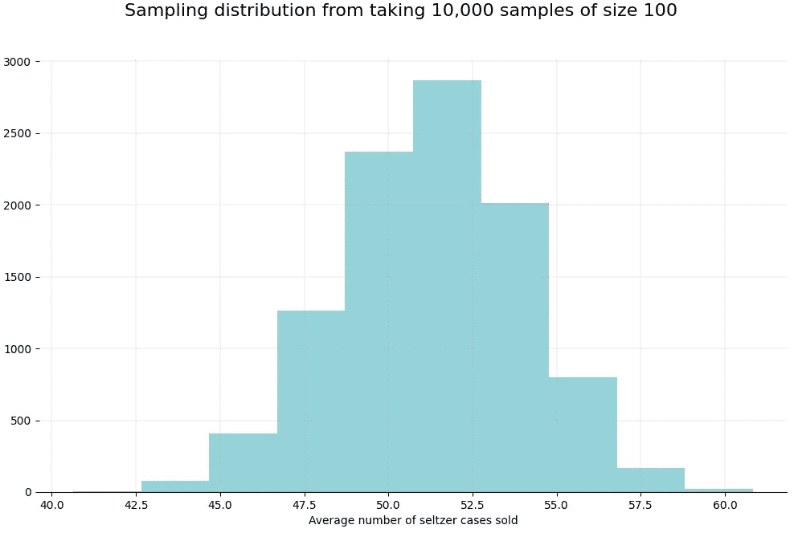*

```
*def plot_sample_means(sample_means_array, plot_color='#A9CBD9', title='', filename='plot'):
    fig, ax = plt.subplots(figsize=(12, 7))
    fig.suptitle(title, fontsize=16)
    ax.hist(sample_means_array, color=plot_color) 

    # removing to and right border
    ax.spines['top'].set_visible(False)
    ax.spines['left'].set_visible(False)
    ax.spines['right'].set_visible(False) # adding major gridlines
    ax.grid(color='grey', linestyle='-', linewidth=0.25, alpha=0.5) ax.set_xlabel("Average number of seltzer cases sold")
    fig.savefig("output/" + filename)plot_title = 'Sampling distribution from taking 10,000 samples of size 30 ' + str(example1_default_sample_size)plot_sample_means(example_1_means[4], title=plot_title, filename="example_1_sampling_dist_10ksamples")*
```

*回到原文，如果你想知道**每周需要重新备货多少箱苏打水**，看看这个最后抽样分布的汇总统计，一万个样本的那个。*

*抽样分布的平均值是 51，所以你需要每周每家商店平均 51 箱的*。**

**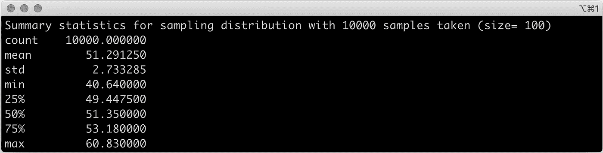**

**具有 10，000 个大小为 100 的样本的抽样分布的汇总统计数据。**

```
**example_2_sampling_distribution = pd.Series(example_2_means[4])print("Summary statistics for sampling distribution with " + str(example_2_number_of_samples_array[4]) + " samples taken (size= "+ str(example_2_default_sample_size) + ")")print(example_2_sampling_distribution.describe())**
```

**这是您所在地区所有商店的平均值。如果您想要每个商店的更精确的数字，您必须为每个商店做这个过程。每家商店都成为总体，你只从那家商店中抽取样本。**

# **你离人口平均数有多近？**

**既然您生成了销售数据集，您可以做另一个有趣的检查。看看抽样分布的均值离*真实*总体均值有多远。**

****人口平均 51！****

**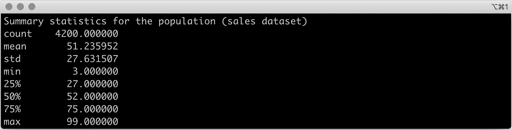**

**人口统计摘要。**

```
**# Population summary statisticsprint("Summary statistics for the population (sales dataset)")
print(sales_data['sales'].describe())**
```

# **结论**

**我们刚刚体验了中心极限定理的威力！**

**使用随机生成的集合，并且不知道原始分布的任何细节(您只在最后检查😀)你:**

1.  **取了越来越多的样本，发现样本的分布越来越接近正态分布。**
2.  **证实抽样分布的平均值非常接近总体分布，误差很小。**
3.  **用中心极限定理解决现实生活中的问题。**

***希望你喜欢这篇文章，感谢阅读！***

# **参考**

**[1] [开放简介统计—第四版(2019)](https://open.umn.edu/opentextbooks/textbooks/60)**