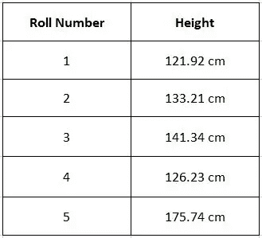
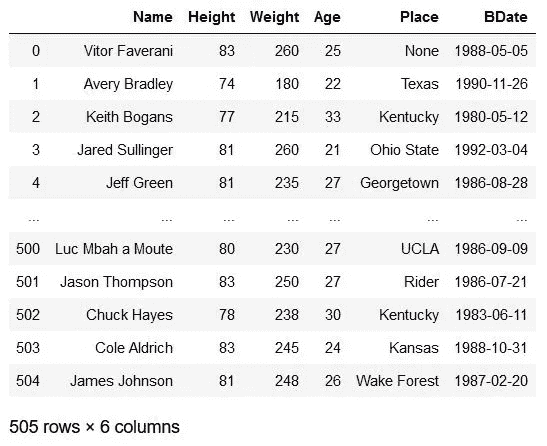
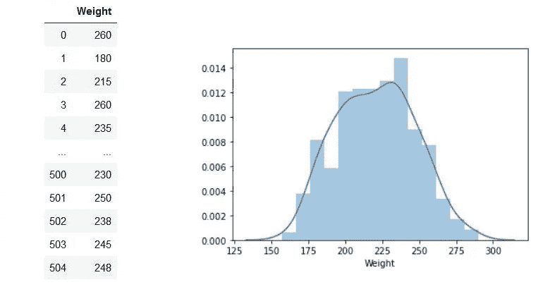
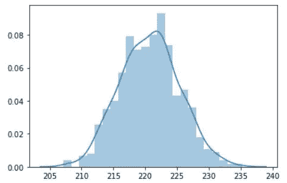
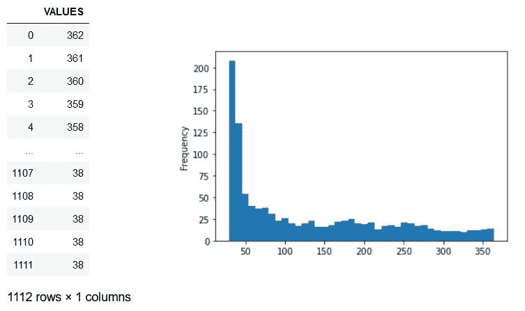
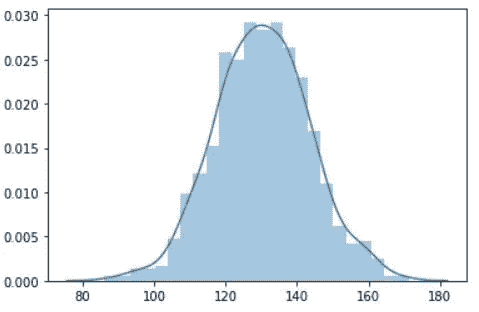
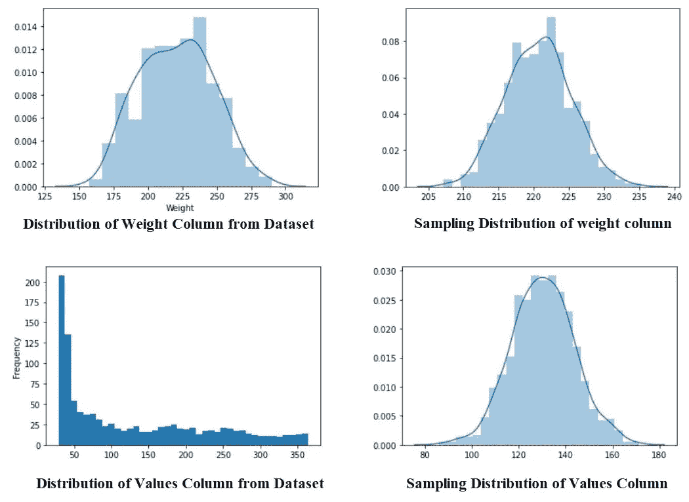
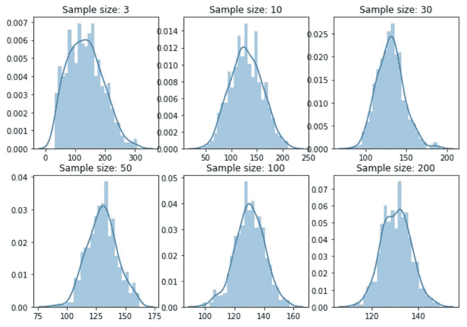
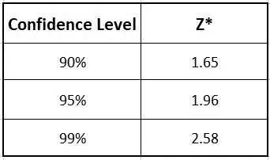

# 中心极限定理(CLT):数据科学

> 原文：<https://towardsdatascience.com/central-limit-theorem-clt-data-science-19c442332a32?source=collection_archive---------21----------------------->

## 使用推断统计学学习中心极限定理(CLT)及其在数据科学中的应用。


图片由[皮克斯拜](https://pixabay.com/?utm_source=link-attribution&utm_medium=referral&utm_campaign=image&utm_content=810025)的 Gerd Altmann 提供

正如我们在上一篇文章中看到的， [**推断统计**](/inferential-statistics-data-analysis-e59adc75c6eb)**在数据科学中起着举足轻重的作用。中心极限定理(CLT)是现实世界中数据科学家最常用的技术，是推断统计学的一部分。**

**要了解 CLT，首先，我们需要了解以下话题:**

1.  **样品**
2.  **抽样分布**

## ****1。样本****

**从整个员工/人群列表中选择一些员工/人群称为**样本**。**

**假设我们有一家公司，里面有 30，000 名员工。我们想知道所有员工每天的通勤时间。去找每个员工并记录他们的通勤时间将是非常繁琐和耗时的。**

**让我们看看是否有另一种方法来完成任务。在公司说；我们对 100 名随机雇员进行了调查。调查结束后，我们计算出员工的平均通勤时间为 36.6 分钟。仅仅考虑 100 名随机的雇员，这足以说明所有雇员的通勤时间是 36.6 分钟吗？**

**不，我们不能这么说。总体平均值大约为**36.6+误差**，即如果误差为 **3 分钟**，那么员工的总体平均值将介于“**36.6–3**”到“ **36.6+3** ”之间。现在，我们如何找出错误？**

**要回答这个问题，首先，我们必须了解**采样**术语。**

*   **项目总数/人口**，人口规模** = **N****
*   **总体均值，**总体均值(μ)=(σ* X)/N****
*   **总体方差，**总体方差(σ)=σ(Xi—μ)/N****
*   **项目数/总体，**样本量= n****
*   **样本员工的均值，**样本均值(x)**=**(σ* x)/n****
*   **样本方差，**样本方差(S)=σ(Xi—x)/n-1****

**让我们看看如何从给定的样本量中找到样本均值和样本方差，**

**我们需要从下面的样本数据中找出一个地区的人的平均身高。**

****

****样本量(n)** = 5
**样本均值(x)**=(121.92+133.21+141.34+126.23+175.74)/5 = 139.69
**样本方差(S)**= sqrt[{(121.92–139.69)+(133.21–139.69)+(141**

**这就是我们如何在样本数据的帮助下计算样本均值和方差。**

## **2.抽样分布**

**抽样分布是从总体列表中抽取的许多样本中获得的分布概率。**

**意思是，我们公司有 30000 名员工。首先，我们随机选择 50 名员工，计算他们的平均值，假设为 x 1。之后，我们将从整个列表中随机抽取另外 50 名员工，计算平均值，即 x ^ 2。假设我们继续这个过程，并计算平均值直到 x 100。**

**有趣的是，我们得到的是样本均值的分布。**

**如果我们把所有样本的均值分布绘制成一个图形，它就代表了二项分布。**

**抽样分布有一些有趣的性质，最终有助于发现总体均值的误差。**

**抽样分布的平均值用 **μₓ表示。****

****μₓ =(所有样本平均值之和)/(样本总数)****

****样本分布均值**有两个重要属性:**

1.  **抽样分布均值 **(μₓ )** =总体均值 **(μ)****
2.  **抽样分布的标准差(**标准差** ) = **σ/√n** ，其中σ为总体的标准差，n 为样本量**

## **中心极限定理**

**中心极限定理(CLT)指出，对于任何数据，只要有大量的样本。以下属性成立:**

1.  **抽样分布均值 **(μₓ )** =总体均值 **(μ)****
2.  **抽样分布的标准差(**标准差** ) = **σ/√n ≈S/√n****
3.  ****对于 n > 30** ，抽样分布变为**正态分布**。**

**让我们通过 Jupyter Notebook 验证一下 Python 中 CLT 的性质。**

**对于下面的 Python 代码，我们将使用人口和随机值的数据集，我们可以在这里找到。**

**首先，将必要的库导入 Jupyter 笔记本。**

**我们导入了我们在后续代码中使用的所有必需的包。因为我们将随机对信息进行采样，所以我们设置了一个随机种子`np.random.seed(42)`，以便分析是可重复的。**

**现在，让我们阅读我们正在处理的数据集，**

**数据集看起来像这样，**

****

**人口数据集**

**让我们从数据集中提取“Weight”列，并查看该列的分布。**

**这个重量柱和它的分布图看起来像这样，**

****

**正如我们所看到的，图表接近于一个**正态分布图**。**

**我们也通过代码找出权重列的均值和标准差。**

**均值= 220.67326732673268
Std。戴夫。= 26.643110470317723**

**这些值是重量列的精确平均值和标准偏差值。**

**现在，让我们开始采样数据。**

**首先，我们将从数据中抽取 30 个成员的样本。其原因是，在对观测值进行重复抽样后，我们需要确定抽样分布是否符合正态分布。**

**上述样本的平均值= 222.1，大于实际平均值 220.67。让我们重新运行代码，**

```
df.Weight.sample(samp_size).mean()
```

**上述样本的平均值= 220.5，几乎等于原始平均值。如果我们重新运行代码，我们将得到平均值= 221.6**

**每次我们取样时，平均值是不同的。样本均值本身存在可变性。让我们向前看，看看样本均值是否服从分布。**

**我们不是一次取一个样本平均值，而是取大约 1000 个这样的样本平均值，并将其赋给一个变量。**

**我们已经将 sample_means 转换为 Series 对象，因为 list 对象没有为我们提供均值和标准差函数。**

**样本总数= 1000**

**现在，我们有 1000 个样本，这是我们的平均值。让我们使用 seaborn 绘制分布图。**

**分布图看起来像这样，**

****

**正如我们所观察到的，上面的分布看起来近似正态分布。**

**这里我们需要检查的另一件事是样本的平均值和标准差。**

**样本平均值= 220.6945，这几乎与原始平均值 220.67 相似，样本标准偏差= 4.64426363765**

**让我们看看样本的标准差和实际数据的标准差之间的关系。
当我们用原始数据的标准差除以其大小时，**

```
df.Weight.std()/np.sqrt(samp_size)
```

**我们得到上面代码的值= 4.86
，该值接近于`sample_means.std()`。**

**所以，从上面的代码中，我们可以推断:**

*   ****抽样分布的均值** (μₓ ) = **总体均值** (μ)**
*   **抽样分布的标准差(**标准差** ) = σ/√n**

**到目前为止，我们已经看到“重量”栏的原始数据是正态分布的形式。让我们看看，即使原始数据不是正态分布，样本分布是否也是正态分布。**

**我们将采用另一个包含一些随机值的数据集，并将这些值绘制成分布图。**

**数据集和图表看起来像这样，**

****

**正如我们所看到的，值列不像正态分布图。它看起来有点像指数分布。**

**让我们从这个分布中挑选样本，计算它们的平均值，并绘制出抽样分布图。**

**现在，样本的分布图看起来像这样，**

****

**令人惊讶的是，我们从 Values 列获得的 sample_means 的分布，虽然远非正态分布，但在很大程度上仍然是正态分布。**

**让我们将`sample_means`平均值与其父平均值进行比较。**

```
sample_means.mean()
# The Output will be
130.39213999999996df1.Value.mean()
#The Output is
130.4181654676259
```

**正如我们所看到的，`sample_means`的平均值和原始数据集的平均值都是相似的。**

**类似地，样本平均值的标准偏差是`sample_means.std()`= 13。38860 . 68868888861**

**那个值应该非常接近于`df1.Value.std()/np.sqrt(samp_size)`= 14。36860 . 68686868661**

**让我们将每个数据集的分布图与其对应的采样分布进行比较。**

****

**作者图片**

**正如我们所见，无论原始数据集的分布如何，采样分布都类似于正态分布曲线。**

**现在只有一件事需要考虑，那就是样本量。我们将观察到，随着样本量的增加，抽样分布将更加接近正态分布。**

## **样本量对抽样分布的影响**

**让我们创建不同大小的样本，并绘制相应的分布图。**

**现在，样本量为 3，10，30，50，100，200 的分布图看起来像这样，**

****

**不同样本量的分布**

**正如我们所观察到的，样本量为 3 & 10 的分布图不像正态分布。然而，从样本大小 30 来看，随着样本大小的增加，样本分布类似于正态分布。**

**作为一个经验法则，我们可以说 30 或更大的样本量对于得出抽样分布接近正态的结论是理想的，并且可以从中得出进一步的推论。**

**通过这段 Python 代码，我们可以得出结论，CLT 的以下三个性质成立。**

1.  **抽样分布均值 **(μₓ )** =总体均值 **(μ)****
2.  **抽样分布的标准差(**标准差** ) = **σ/√n****
3.  ****对于 n > 30** ，抽样分布变为**正态分布**。**

## **使用 CLT 估计平均值**

**30000 名员工的平均通勤时间 **(μ)** = 36.6 ( **样本均值** ) +一定的**误差幅度。我们可以利用 CLT(中心极限定理)找到这个误差范围。现在我们知道了 CLT 是什么，让我们看看如何找到误差范围。****

**假设我们有 100 名员工的平均通勤时间是 **X =36.6 分钟**，样本的标准差是 **S=10 分钟**。利用 CLT，我们可以推断，**

1.  **抽样分布 Mean(μₓ ) =总体平均值(μ)**
2.  **抽样分布标准偏差= σ/√n ≈S/√n = 10/√100 = 1**
3.  **由于抽样分布是正态分布
    P(μ-2<36.6<μ+2)= 95.4%，我们通过正态分布曲线的 1–2–3 法则得到这个值。
    P(μ-2<36.6<μ+2)= P(36.6–2<μ<36.6+2)= 95.4%**

> **你可以在我的上一篇文章“T2 推断统计”中找到标准分布曲线、Z 表及其属性**

**现在，我们可以说，总体均值(μ)有 95.4%的概率位于(36.6–2，36.6+2)之间。换句话说，我们有 95.4%的把握估计均值的误差≤ 2。**

**因此，与索赔相关的概率被称为**置信水平**(这里是 95.4%)。
样本均值的最大误差称为**误差幅度**(此处为 2 分钟)。
值的最终区间称为**置信区间**{这里是:(34.6，38.6)}**

**我们可以用以下方式概括这个概念。**

**假设我们有一个样本大小为 n、平均值为 X、标准偏差为 s 的样本。现在，μ的 **y%置信区间**(即对应于 y%置信水平的置信区间)将由以下范围给出:**

**置信区间= (X — (Z* S/√n **)** ，X + (Z* S/√n))**

**其中 **Z*是与 y%置信水平**相关联的 Z 分数。**

**下面给出了一些常用的 Z*值:**

****

****Z*值****

**这就是我们如何在样本的帮助下计算误差幅度和估计总体均值的方法。**

# **结论**

**正如我们所看到的，对于只有少量代表性的**样本**，找到**均值**和**标准差**是有益的。由于时间和资金的限制，我们可能不得不这样做。利用 CLT 性质，我们可以找到总体均值(μ)、标准误差(σ/√n)，以及最重要的置信区间(y%)。CLT 有利在**民调结果与**置信区间、保险、**银行业等新闻上报道。这就是关于 CLT 及其属性以及它如何在数据科学中有用的全部内容。****

****感谢您阅读**和**快乐编码！！！****

# **在这里查看我以前关于 Python 的文章**

*   **[**推断统计:数据分析**](/inferential-statistics-data-analysis-e59adc75c6eb)**
*   **[**探索性数据分析(EDA): Python**](/exploratory-data-analysis-eda-python-87178e35b14)**
*   **[**使用 Python 对熊猫数据帧进行索引**](/indexing-in-pandas-dataframe-using-python-63dcc6242323)**
*   **[**Seaborn: Python**](/seaborn-python-8563c3d0ad41)**
*   **[**熊猫:蟒蛇**](https://levelup.gitconnected.com/pandas-python-e69f4829fee1)**
*   **[**Matplotlib:Python**](https://levelup.gitconnected.com/matplotlib-python-ecc7ba303848)**
*   **[**NumPy: Python**](https://medium.com/coderbyte/numpy-python-f8c8f2bbd13e)**
*   **[**数据可视化及其重要性:Python**](https://levelup.gitconnected.com/data-visualization-and-its-importance-python-7599c1092a09)**
*   **[**Python 中的时间复杂度及其重要性**](https://medium.com/swlh/time-complexity-and-its-importance-in-python-2b2ba03c786b)**

# **参考**

*   ****中心极限定理讲解:**[https://statisticsbyjim.com/basics/central-limit-theorem/](https://statisticsbyjim.com/basics/central-limit-theorem/)**
*   ****中心极限定理:**[https://en.wikipedia.org/wiki/Central_limit_theorem](https://en.wikipedia.org/wiki/Central_limit_theorem)**
*   ****中心极限定理(CLT):**[https://www . investopedia . com/terms/c/Central _ Limit _ theory . ASP](https://www.investopedia.com/terms/c/central_limit_theorem.asp)**
*   ****什么是中心极限定理？:**[https://www . statistics show to . com/probability-and-statistics/normal-distributions/central-limit-theory-definition-examples/](https://www.statisticshowto.com/probability-and-statistics/normal-distributions/central-limit-theorem-definition-examples/)**