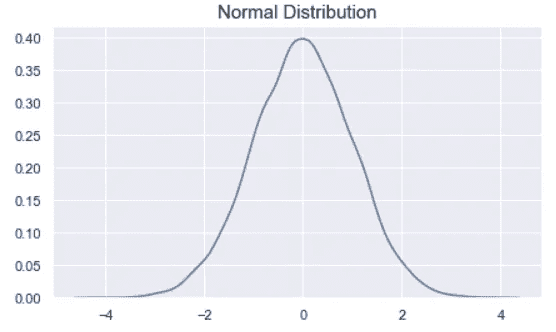
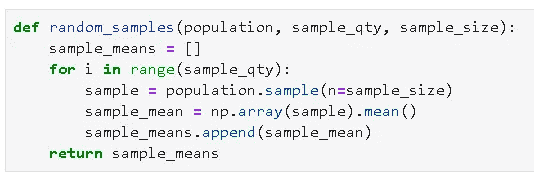
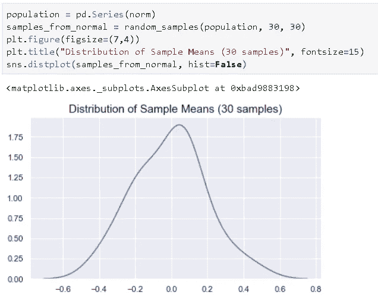
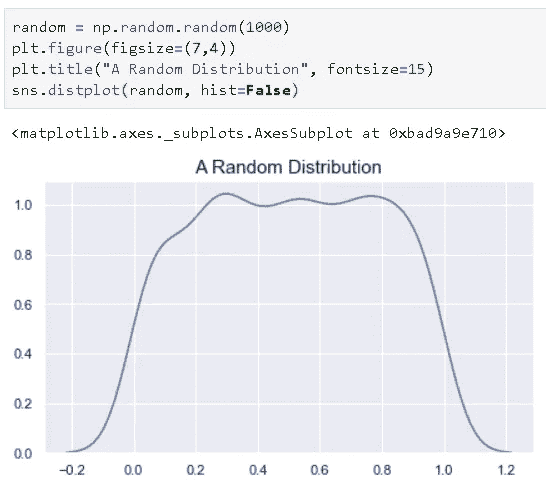
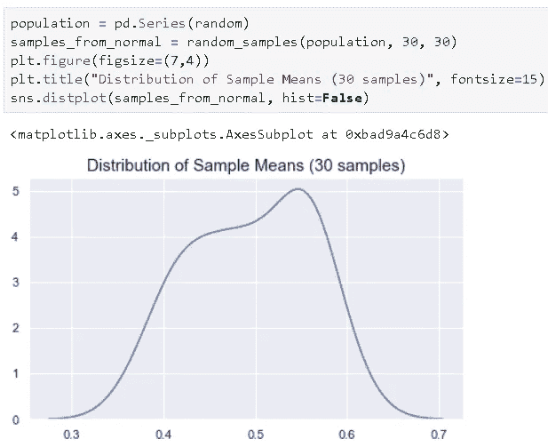
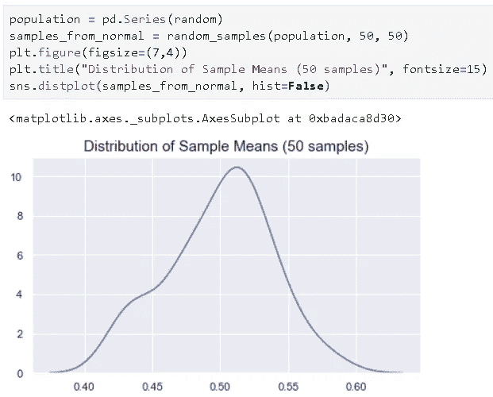
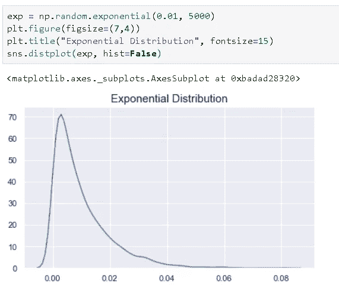
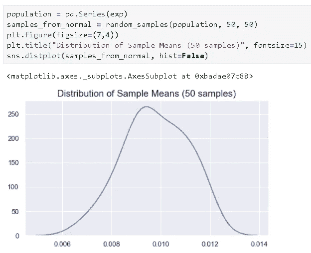
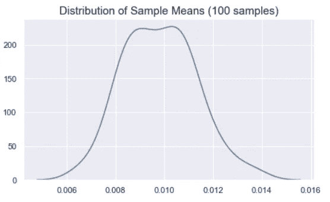

# 中心极限定理——举例说明

> 原文：<https://towardsdatascience.com/central-limit-theorem-explained-with-examples-4c10377ee58c?source=collection_archive---------27----------------------->

## 用实现清楚地解释


路易斯·佩尔迪戈在 [Unsplash](https://unsplash.com/s/photos/bell?utm_source=unsplash&utm_medium=referral&utm_content=creditCopyText) 上拍摄的照片

中心极限定理(CLT)是统计学领域中一个基本且广泛应用的定理。在我们详细讨论 CLT 之前，让我们先定义一些术语，以便更容易理解 CLT 背后的思想。

# **基本概念**

*   **群体**是一个群体中的所有元素。例如，美国的大学生是指包括美国所有大学生的人口。欧洲的 25 岁人群包括了所有符合描述的人。

对人口进行分析并不总是可行或可能的，因为我们无法收集人口的所有数据。因此，我们使用样本。

*   **样本**是总体的子集。例如，美国 1000 名大学生是“美国大学生”人口的一个子集。
*   **概率分布**:显示事件或实验结果概率的函数。考虑掷骰子的例子。有 6 种可能的结果(1，2，3，4，5，6)。如果骰子是无偏的，观察到顶面每个数字的概率是相等的，所以概率分布是离散的均匀分布。
*   **正态(高斯)分布**:一种看起来像钟的概率分布；



描述正态分布的两个术语是**均值**和**标准差**。Mean 是被观察到的概率最高的平均值。**标准偏差**是对数值分布程度的测量。随着标准差的增加，正态分布曲线变宽。

# **中心极限定理**

正态分布用于表示分布未知的随机变量。因此，它被广泛应用于包括自然科学和社会科学在内的许多领域。证明为什么它可以用来表示未知分布的随机变量的理由是**中心极限定理(CLT)** 。

根据 **CLT** ，当我们从一个分布中抽取更多样本时，样本平均值将趋向于一个正态分布**而不管总体分布如何。**

考虑一个案例，我们需要学习一个国家所有 20 岁人的身高分布。收集这些数据几乎是不可能的，当然也是不切实际的。所以，我们在全国范围内抽取 20 岁人群的样本，计算样本中人群的平均身高。根据 CLT，当我们从总体中抽取更多样本时，抽样分布将接近正态分布。

为什么正态分布如此重要？正态分布用平均值和标准偏差来描述，它们很容易计算。如果我们知道正态分布的均值和标准差，我们就可以计算出关于它的几乎所有东西。

# **证明 CLT 的例子**

让我们看几个例子，证明 CLT 是正确的。我们将使用 python 库来创建群体、样本和绘图。和往常一样，我们从导入相关库开始:

```
import numpy as np
import pandas as pd #Data visualization
import matplotlib.pyplot as plt
import seaborn as sns
sns.set(style='darkgrid')%matplotlib inline
```

我们首先定义一个从分布中创建随机样本的函数。我们可以使用熊猫的**样本**功能，它将选择随机元素而不替换。

```
def random_samples(population, sample_qty, sample_size):
    sample_means = []
    for i in range(sample_qty):
        sample = population.sample(n=sample_size)
        sample_mean = np.array(sample).mean()
        sample_means.append(sample_mean)
    return sample_means
```



我们只需要输入一个总体，我们需要多少个样本(sample_qty)，以及每个样本包含多少个观察值(sample_size)。然后，该函数将选择样本并计算它们的平均值。返回的列表将包括样本均值。

让我们首先定义一个实际上具有**正态分布**的总体。我们使用 np.random.randn 函数创建一个大小为 10000 且呈正态分布的数组。

```
norm = list(np.random.randn(10000))
plt.figure(figsize=(8,5))
plt.title("Normal Distribution", fontsize=18)
sns.distplot(norm, hist=False)
```


现在我们从总体中抽取 30 个样本，每个样本包含 30 个值。请注意，我们需要将人口转换为熊猫系列，因为样本函数不接受 numpy 数组。

```
population = pd.Series(norm)
samples_from_normal = random_samples(population, 30, 30)
plt.figure(figsize=(7,4))
plt.title("Distribution of Sample Means - Normal Distribution", fontsize=15)
sns.distplot(samples_from_normal, hist=False)
```



正态分布的抽样分布

抽样分布(样本平均值的分布)看起来非常接近正态分布。随着我们抽取越来越多的大样本，样本分布将看起来更“正常”。

让我们对随机分布为**的人群应用同样的程序。我们首先创建一个包含 1000 个随机数的数组:**

```
random = np.random.random(1000)
plt.figure(figsize=(7,4))
plt.title("A Random Distribution", fontsize=15)
sns.distplot(random, hist=False)
```



让我们看一下 30 个样本，每个样本有 30 个值时的采样分布情况:

```
population = pd.Series(random)
samples_from_normal = random_samples(population, 30, 30)
plt.figure(figsize=(7,4))
plt.title("Distribution of Sample Means (30 samples)", fontsize=15)
sns.distplot(samples_from_normal, hist=False)
```



随机分布的抽样分布(30 个样本)

它越来越接近正态分布。我们现在尝试使用 50 个样本，并将样本大小增加到 50:



随机分布的抽样分布(50 个样本)

看起来肯定更“正常”。我添加了文本代码，所以你可以复制粘贴，并尝试不同的样本数量和大小。

我们也可以试试**指数分布**，看看 CLT 是否适用:

```
exp = np.random.exponential(0.01, 5000)
plt.figure(figsize=(7,4))
plt.title("Exponential Distribution", fontsize=15)
sns.distplot(exp, hist=False)
```



如果我们随机抽取 50 个大小为 50 的样本，样本均值的分布如下所示:

```
population = pd.Series(exp)
samples_from_normal = random_samples(population, 50, 50)
plt.figure(figsize=(7,4))
plt.title("Distribution of Sample Means (50 samples)", fontsize=15)
sns.distplot(samples_from_normal, hist=False)
```



指数分布的抽样分布(50 个样本)

它看起来更像正态分布，而不是指数分布。对于 100 个样本，正态性更加突出:



指数分布的抽样分布(100 个样本)

正如我们在示例中看到的，不管总体分布如何，当我们获取更多样本时，样本均值的分布越接近正态分布。这正是中心极限定理所陈述的。

感谢您的阅读。如果您有任何反馈，请告诉我。