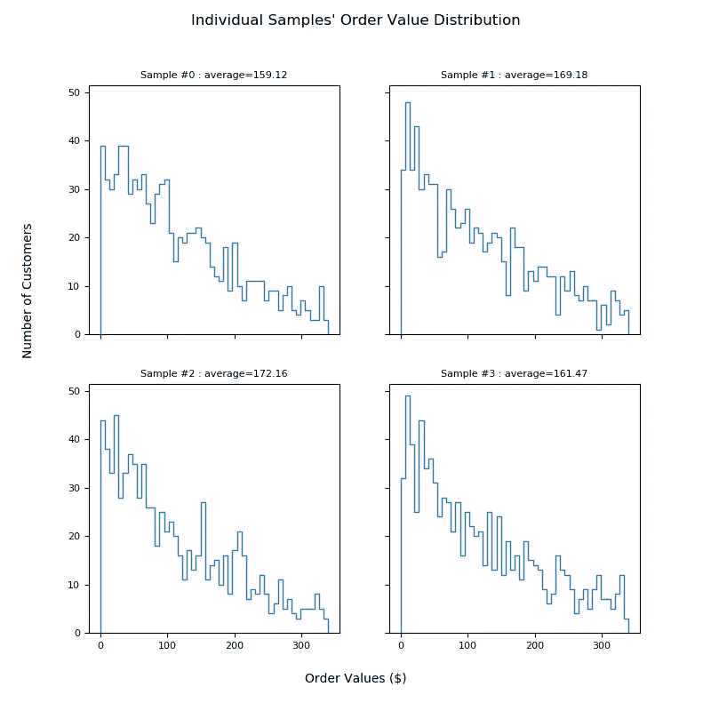
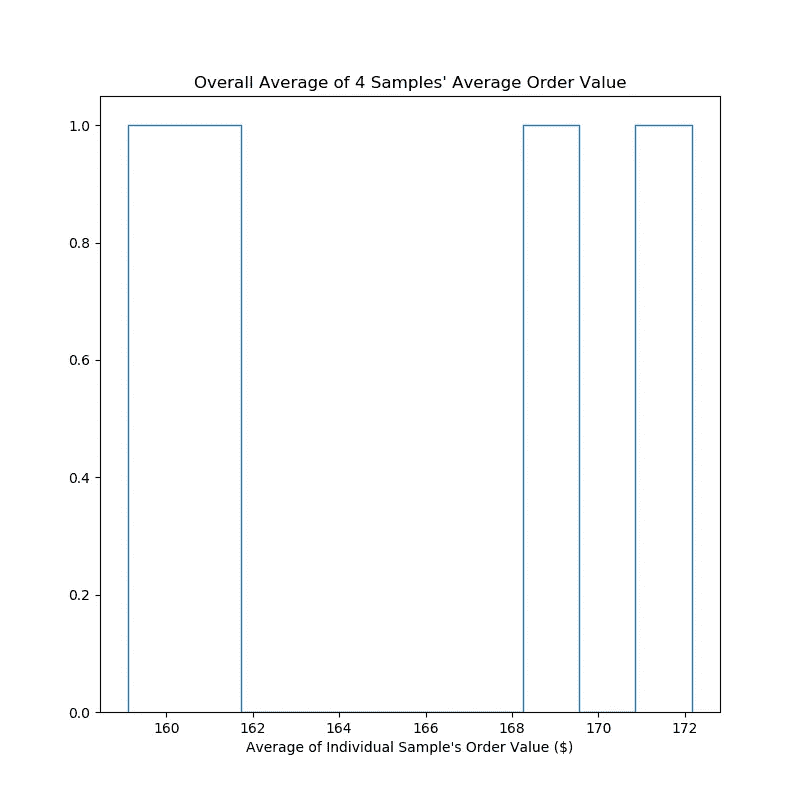
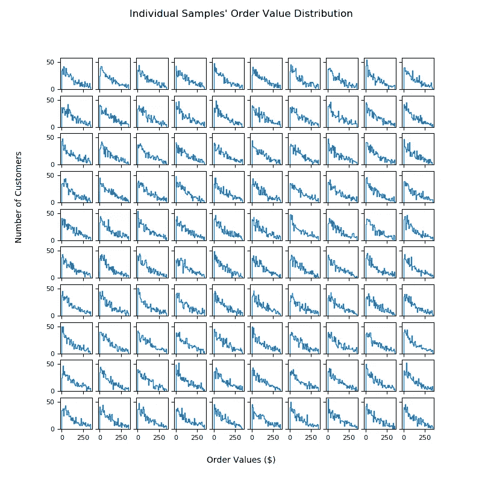
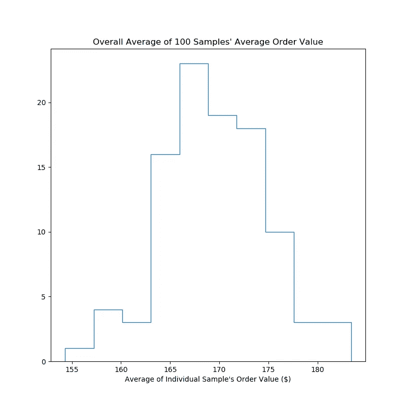
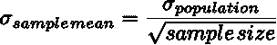
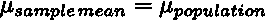

# 用 Python 代码解释的中心极限定理

> 原文：<https://towardsdatascience.com/central-limit-theorem-explained-with-python-code-230884d40ce0?source=collection_archive---------6----------------------->


马文·朗斯多夫在 [Unsplash](https://unsplash.com?utm_source=medium&utm_medium=referral) 上的照片

**一个解释中心极限定理的模拟:即使一个样本不是正态分布，如果你抽取多个样本，取它们的每个平均值，这些平均值将代表一个正态分布。**

条条大路通罗马！等等不要。条条大路通涩谷！等等不要。所有样本平均值都是总体平均值。

[中心极限定理](https://en.wikipedia.org/wiki/Central_limit_theorem)表明，如果你随机抽取一个客户样本，比如说 1000 个客户，这个样本本身可能不是正态分布的。但是如果你现在重复这个实验 100 次，那么这 100 个样本(1000 个客户)的 100 个平均值将构成一个正态分布。

这一行对我们很重要:“这个样本本身可能不是正态分布的”。为什么？因为生活中的大多数事物都不是正态分布的；不是等级，不是财富，不是食物，当然也不是我们的顾客在我们店里付了多少钱。但是生活中的一切都有泊松分布；更好的是，生活中的一切都可以用狄利克雷分布来解释，但为了简单起见，让我们坚持用泊松分布(泊松分布实际上是狄利克雷分布的简化情况)。

但实际上在一个电商店里，我们的客户大部分都是非购买客户。因此，分布实际上看起来像一个指数，因为泊松可以从指数得到，让我们做一些指数分布来反映我们的客户的购买。

# 让我们试一个例子

假设我们的客户群的平均订单价值为 170 美元，那么我们将用这个平均值创建指数分布。我们将尝试通过查看一些样本平均值来获得该值。

## 仅抽取四个样本

在这里，我抽取了 1000 名客户的样本。然后重复 4 次。我得到了以下四个分布(要得到与此类似的图形，请在末尾使用代码 repeat _ sample _ draws _ exponential(4，1000，170，True)):



从 1000 名顾客中随机抽取 4 个样本。每个样本都有一个平均值为 170 美元的指数分布。

下面是绘制的 4 个平均值(要获得类似的图形，请在结尾处使用代码 repeat _ sample _ draws _ exponential(4，1000，170，True)):



绘制的四个样本的平均值。

上述 4 个样本均值的平均值为 165.48 美元
上述 4 个样本均值的标准差为 5.36 美元

因此，如果您在这里停止实验，在四个样本中，您将报告您的客户群的平均订单价值为 166 美元，其中 68% ( [1 标准差包含 68%](https://en.wikipedia.org/wiki/Standard_deviation) )的客户购买了 161 美元到 171 美元之间的商品(从 166+/-$5 美元)。这将是一个错误的结论，因为我们所有的这些模拟都是基于最初的假设，即人口平均值是 170 美元！

## 抽取 100 个样本，但保持每个样本的大小与上述 1000 个客户相同

如果我们重复这个实验 100 次会发生什么？即抽取 1000 个客户的 100 个样本？

在末尾使用代码:
repeat _ sample _ draws _ index(100，1000，170，True)

我们将得到 100 个类似这样的指数分布(要得到类似的图形，请在末尾使用代码 repeat _ sample _ draws _ exponential(100，1000，170，True)):



从 1000 名顾客中随机抽取 100 个样本。每个样本都有一个平均值为 170 美元的指数分布。

100 个平均值的分布现在看起来像正态分布(要获得类似的图形，请在结尾处使用代码 repeat _ sample _ draws _ exponential(100，1000，170，True)):



绘制的 100 个样本的平均值。

上述 100 个样本均值的平均值为 169.55 美元
上述 100 个样本均值的标准差为 5.18 美元

因此，现在您会得出结论，您的客户群的平均支出为 170 美元(耶！这实际上是我们的第一个假设！)我们 68%的客户购买价格在 165 美元到 175 美元之间。

## 关于标准差的旁注

注意标准偏差没有变化:当我们抽取 4 个样本时是 5 美元，当我们抽取 100 个样本时是 5 美元。您可以对 10000 个样本运行下面的代码，并看到标准偏差不会从$5 改变。这是为什么呢？

这就把我们带到了经常被忽视的中心极限定理的第二部分:样本均值的标准差等于总体的标准差除以样本大小的平方根。



我们的人口是平均 170 美元的指数分布。指数有一个特殊的性质，即它的标准差等于它的平均值，所以总体平均值的标准差是 170 美元。因此，在这种情况下，我们预计样本均值的标准差为 170/sqrt(1000) = 5.4

这就是我们得到的结果，样本的标准差——意味着大约是 5 美元。无论我们重复抽样多少次，标准偏差都不会改变，因为它只取决于**样本量**(它也取决于总体平均值，但对于给定的总体来说，它保持不变)**。**

# 结论

这就是中心极限定理。抽取的样本越多，就越能准确预测总体均值。我们不可能测试/调查我们所有的客户(或我们所有的人群)，所以我们能做的下一个最好的事情是抽取几个较小数量的样本，并得到这些平均值的平均值。这里的关键是尽可能多地抽取样本。当我们这样做时，我们有:



而样本均值分布的标准差会随着你增加你的**样本量**而改变(样本量不是样本数；在我们的示例中，样本大小为 1000，样本数量为 100):


[在以后的帖子里，我会描述为什么这是 A/B 测试中的一个重要概念](https://medium.com/@sujeewak/basic-elements-of-a-b-testing-with-python-code-to-simulate-2b7f342f5ac6)。

代码重现了这一点:

```
**import** numpy **as** np
**import** matplotlib.pyplot **as** plt

**def** repeat_sample_draws_exponential(n, samp_size, mu, show_all=**False**):
    means = []

    samples = []
    **for** ii **in** range(0, n):
        samples.append(np.random.exponential(mu, samp_size))
        means.append(np.mean(samples[ii]))

    **if** show_all:
        pltdim = np.math.ceil(np.math.sqrt(n))
        fig, axs = plt.subplots(pltdim, pltdim, figsize=(8, 8), gridspec_kw={**'hspace'**: 0.2}, sharex=**True**, sharey=**True**)
        fig.suptitle(**'Individual Samples\' Order Value Distribution'**)
        fig.text(0.5, 0.04, **'Order Values ($)'**, ha=**'center'**)
        fig.text(0.04, 0.5, **'Number of Customers'**, ha=**'center'**, rotation=**'vertical'**)
        axs = axs.flatten()
        **for** ii **in** range(0, n):

            plt.sca(axs[ii])

            plt.gca().hist(samples[ii], bins=int(50), histtype=**'step'**,
                           label=**'$mean = {0:.2f}$'**.format(np.mean(samples[ii])), range=[0, 2 * mu])
            **if** n < 10:
                plt.gca().set_title(**'Sample #{0} : average={1:.2f}'**.format(ii, np.mean(samples[ii])))
            **for** item **in** ([axs[ii].title, axs[ii].xaxis.label, axs[ii].yaxis.label] +
                             axs[ii].get_xticklabels() + axs[ii].get_yticklabels()):
                item.set_fontsize(8)

        plt.savefig(**'expdist_{0}_mu_{1}_sample_{2}_sampsize'**.format(mu, n, samp_size))

    plt.clf()
    plt.hist(means, bins=int(10), histtype=**'step'**)
    plt.title(**'Overall Average of {} Samples\' Average Order Value'**.format(n))
    plt.xlabel(**'Average of Individual Sample\'s Order Value ($)'**)
    plt.savefig(**'average_of_expdist_{0}_mu_{1}_sample_{2}_sampsize'**.format(mu, n, samp_size))
    print(**'mean of the samples is {0:.2f}'**.format(np.mean(means)))
    print(**'standard deviation of the samples is {0:.2f}'**.format(np.std(means)))

repeat_sample_draws_exponential(100, 1000, 170, **True**)
```