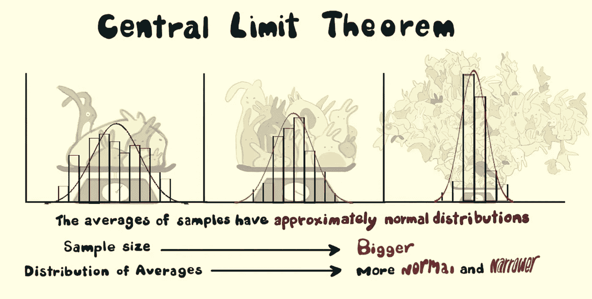
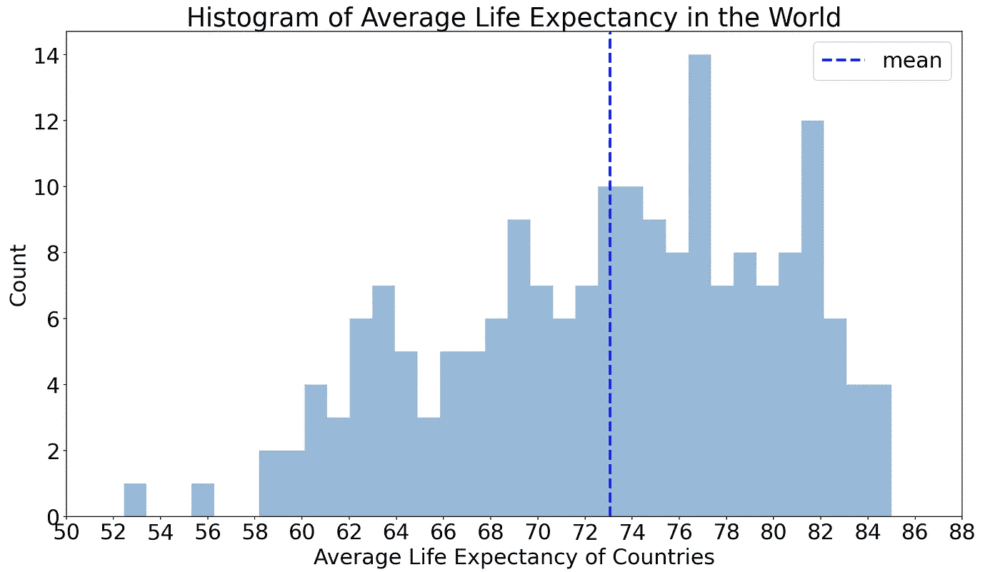
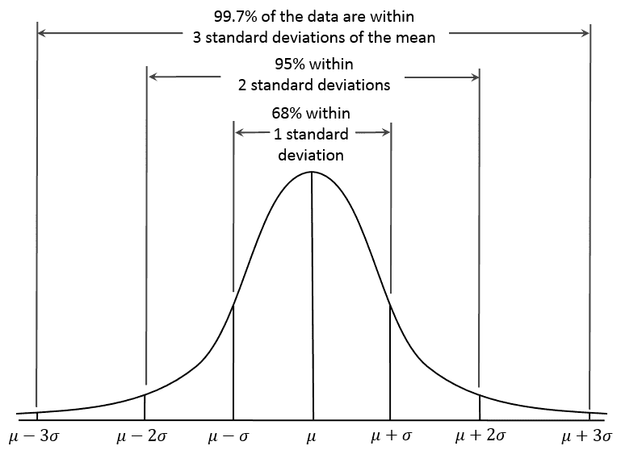
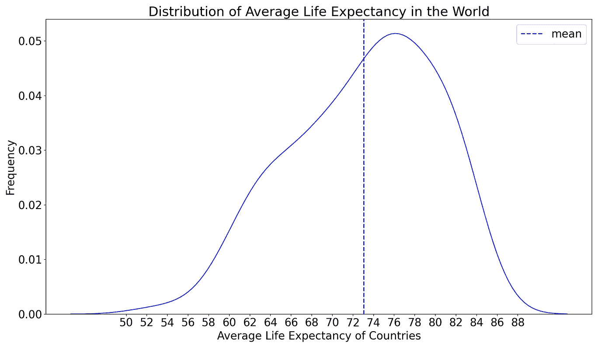
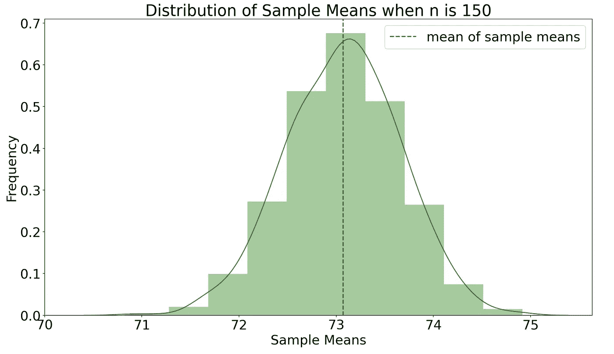
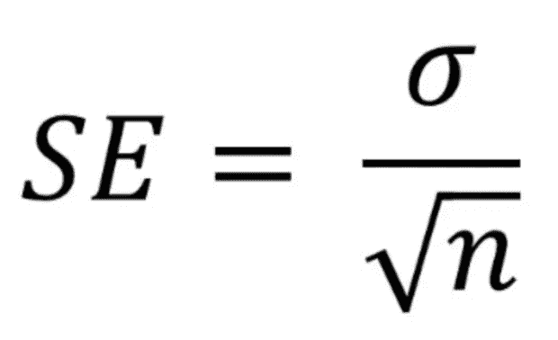
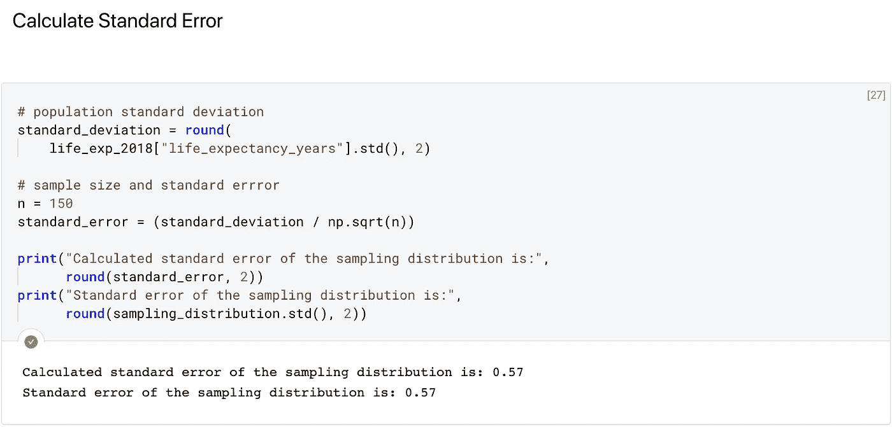

# 中心极限定理的应用

> 原文：<https://towardsdatascience.com/central-limit-theorem-in-action-1d4832599b7f?source=collection_archive---------7----------------------->

## [数据科学](https://towardsdatascience.com/data-science/home)

## 以及实际应用中的例子

图片来源:凯西·邓恩和《生物》剧组 [Vimeo](https://vimeo.com/75089338)

统计学是一个数据科学家的必备知识。中心极限定理是它的基石。

当我看到任何理论概念在实践中时，我学得更好。我相信有更多像我一样的人，所以我今天将用一个具体而又朗朗上口的例子来解释中心极限定理——希望让它永久留在你的脑海中，供你使用。

**你还记得当今世界的平均寿命是多少吗？**(提示:如果没有，请在此处查看)

> 是 73。

这是一个总结了全世界，确切地说是 186 个国家预期寿命数据的数字。如果我们把这个数字放到完整的上下文中，它会告诉我们更多。

**上下文是由统计术语组成的，所以我们先来了解一下:**

**群体:**包含来自您的实验空间的元素、个体或度量的所有数据的集合。我们的实验空间是世界，人口是所有国家的预期寿命数据——人口规模用 *N* 表示。

**样本:**是从总体中随机选择的一个子集，样本量用 *n* 表示。

**分布:** It 描述了数据/总体/样本范围以及数据在该范围内是如何分布的。截至 2018 年，全球预期寿命分布如下:

**平均值:**您的总体或样本的所有数据的平均值。在本例中，总体平均值为 73，用(Mu)表示总体，用 *x̄* (x 条)表示样本。

**标准差:**不是所有国家的平均寿命都是 73。它们分布在我们上面看到的范围内。标准差是对人口分布的一种度量，用 *σ* (适马)表示。

**正态分布—钟形曲线—高斯分布:**当你的总体围绕平均值以σ标准差完美对称分布时，你得到如下钟形曲线:

[维基百科上的正态分布](https://en.wikipedia.org/wiki/Normal_distribution)

我们只触及了在解释中心极限定理中使用的必要统计术语的表面，现在让我们来看看这个定理的实际应用！

**截至 2018 年全球平均预期寿命是怎样的分布？它是正态分布还是其他分布？**

嗯，这不是一个完美的正态分布，因为它似乎被拉向左侧，被称为左偏分布。

现在让我们从人群中抽取一些样本。换句话说，让我们从总体中抽取 1000 个大小为 150 的子集，并绘制每个样本均值的分布图(x̄).这个过程叫做**抽样分配**:

这是一个完美的正态分布！实际上，来自任何总体的任何抽样分布都显示正态分布，因为中心极限定理指出:

> 不管总体分布的初始形状如何，抽样分布将接近正态分布。随着样本量的增加，抽样分布将变得更窄且更正态。

这个视频用兔子和龙的翅膀以意想不到的有趣方式解释了这个定理🙂

视频致谢:生物演员&凯西·邓恩在 [Vimeo](https://vimeo.com/75089338) 上解释了中心极限定理

回到我们对中心极限定理的解释，它允许我们用下面的公式计算抽样分布的标准偏差——称为**标准误差**:

标准误差公式，其中 *σ是标准偏差，n 是样本量。* [*图像来源*](https://statisticsglobe.com/standard-error-in-r-example)

**让我们看看这个计算是否也适用于我们创建的人口和抽样分布:**

果然不出所料！这个公式的直观解释是；随着样本量的增加，抽样分布将更准确地表示总体参数(平均值和标准偏差)。

## 奖金定理:你知道抽样分布的中心在哪里吗？你认为抽样分布和总体均值都是 73 是巧合吗？

当然不是！这用统计学中的另一个基本定理来解释:**大数定律。**随着从总体中抽取的样本越多，样本量越大，抽样分布的均值将越接近总体均值。

## 中心极限定理的实际应用

在任何机器学习问题中，给定的数据集代表来自总体的样本。使用这个样本，我们试图捕捉数据中的主要模式。然后，在进行预测时，我们尝试将样本中的模式推广到总体。中心极限定理有助于我们对样本和总体参数进行推断，并使用它们构建更好的机器学习模型。

此外，该定理可以通过观察抽样分布来告诉我们一个样本是否可能属于一个总体。这个定理的力量也在于此。

当我为这篇博文键入第一个单词时，我打算写统计意义和假设检验，但我意识到中心极限定理是解释它们的核心。所以，我将把它们留给下一篇文章。关注我的[媒体账号](https://medium.com/@cereniyim)了解他们😉

感谢阅读！如果你想更仔细地看看这个定理的“作用”，你可以看看这个 [Deepnote 笔记本](https://beta.deepnote.com/project/0e38bb73-5710-402a-814b-69ca659d301d)。我这个吸引人的例子来源于 [Gapminder 的公开数据](https://open-numbers.github.io/)，可以在这里[找到](https://github.com/open-numbers/ddf--gapminder--systema_globalis)。

如果你喜欢这篇文章，你可以在这里查看我的其他文章:

*   [*为什么我决定成为一名数据科学家*](/why-i-decided-to-become-a-data-scientist-eec6f8cd435e?source=friends_link&sk=ea90fc26db800fcf4611d37942b23508)
*   [*数据分布可视化的方法*](/recipes-for-the-visualizations-of-data-distributions-a1527a0faf77?source=friends_link&sk=00343b1f4d854951384cd16161741f58)
*   [*用机器学习工作流预测森林覆盖类型*](/predicting-forest-cover-types-with-the-machine-learning-workflow-1f6f049bf4df?source=friends_link&sk=d740915895b002b7424703d60a80d2f3)
*   [*用机器学习进行客户细分*](/customer-segmentation-with-machine-learning-a0ac8c3d4d84?source=friends_link&sk=91a45f28699eda78766335947bed7044)

对于评论或建设性的反馈，您可以通过回复、 [Twitter](https://twitter.com/cereniyim) 或 [Linkedin](https://www.linkedin.com/in/ceren-iyim) 联系我！

**来源:**

 [## 机器学习的中心极限定理简介

### 中心极限定理是统计学和机器学习中经常被引用但被误解的支柱。这是…

machinelearningmastery.com](https://machinelearningmastery.com/a-gentle-introduction-to-the-central-limit-theorem-for-machine-learning/)