# 中心极限定理:证明&通过数学实际工作

> 原文：<https://towardsdatascience.com/central-limit-theorem-proofs-actually-working-through-the-math-a994cd582b33?source=collection_archive---------2----------------------->

## …不要再做另一个“手动波浪状”的 CLT 解释…让我们实际算一算

迭戈·PH 在 [Unsplash](https://unsplash.com?utm_source=medium&utm_medium=referral) 上的照片

# 背景和动机

对于任何从事数据科学、统计学或机器学习研究的人来说，说*“知道中心极限定理(CLT)很重要”*是一种保守的说法。特别是从数理统计的角度来看，在大多数情况下，CLT 使得恢复参数估计的有效推理覆盖成为一个易处理和可解决的问题。

媒体平台上有几篇关于 CLT 的文章。然而，我注意到没有一篇文章(就我所知)深入研究这个定理的数学，甚至也没有恰当地说明 CLT 成立的假设。在我看来，这是一个巨大的伤害。这些都是上述领域每个从业者都应该知道的数学基础。

不仅理解 CLT 的数学基础很重要，而且理解 CLT 不成立的条件也很重要。例如，如果我们有一系列 n . I . I . d .柯西分布 RVs，它们的均值中心和标准偏差比例样本均值**不会**收敛到标准正态分布，CLT 不适用；如果我们对 CLT 的理解是“摇摆不定的”,那就很难理解上面的柯西例子。我希望这篇文章中的信息可以为感兴趣的人弥补知识上的差距。

本文分为三个部分:

1.  CLT -数学定义*(特别是林德伯格-列维·CLT)*，我们为什么要关心？
2.  证明 CLT 的数学准备
3.  林德伯格的证明CLT

注意，中心极限定理其实不是一个定理；相反，它是一组相关的定理。这些定理依赖于不同的假设和约束。**在本文中，我们将具体介绍林德伯格-莱维·CLT**。这是 CLT 最常见的版本，也是大多数人在口语中提到 CLT 时实际引用的特定定理。

所以让我们开始吧！

# 1.CLT -数学定义，我们为什么要关心？ *:*

让我们用文字(以明确的方式)来描述林德伯格-莱维·CLT:

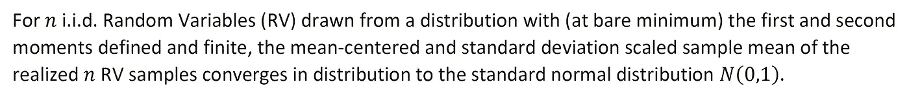

作者图片

好极了。但是我们如何用数学方法来写呢？：

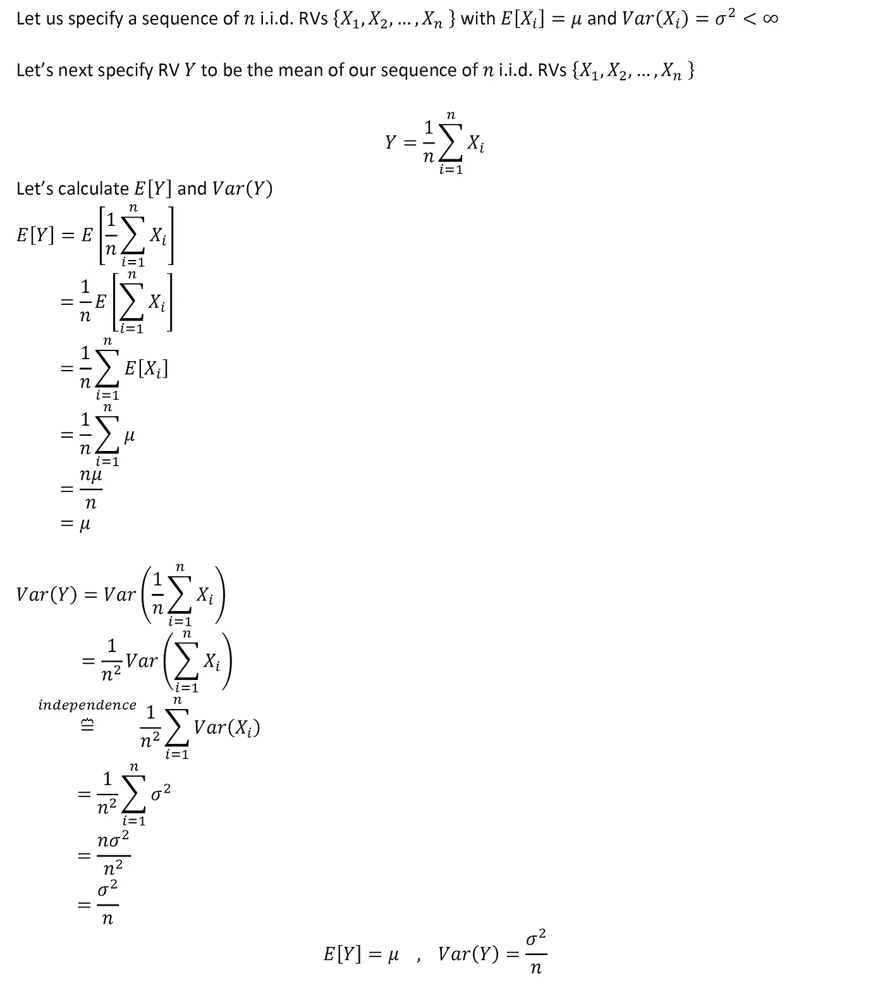

作者图片

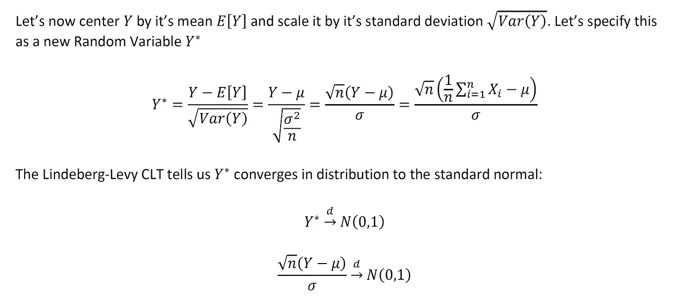

作者图片

因此，(林德伯格–莱维)CLT 告诉我们，在上面指定的假设下，Y*在分布上收敛于标准正态分布 N(0，1)。

那么…有什么大不了的？我为什么要关心这个？？

注意我们是如何为 CLT 搭建舞台的。我从没具体说过这 n 辆 RV 来自什么发行版。只是这 n 个 RVs 是独立的，并且是从具有定义的期望值和方差*(一阶和二阶矩)*的分布中抽取的。然而，即使有这种模糊的信息，我们可以说一些关于均值中心和标准差比例抽样估计的极限分布的建设性的东西。

CLT 是重要的和有影响力的，因为它(在许多情况下)可以使统计推断更容易处理。如果我们能以正确的形式参数化我们的抽样估计量，我们就能了解它的极限分布，即使我们不知道组成样本的 RVs 具体来自什么分布。从这些信息中，我们可以更容易地进行推理分析(即假设检验、p 值、置信区间等)，而不必知道各个 RVs 本身的具体分布。

# 2.证明 CLT 的数学准备；

为了证明 CLT，我们可以利用一些数学事实和定理:

**2A:变量变化:**

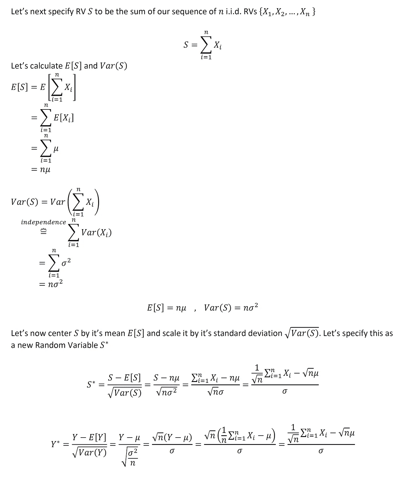

作者图片

上面我们可以看到 Y*和 S*是数学上等价的抽样估计量。为了证明 CLT，我们将使用 S*。这种选择仅仅是数学上的便利。用 S*证明 CLT 比直接用 Y*更容易

**2B:标准正常 RV 的力矩生成函数(MGF):**

下面我们导出标准正态随机变量 Z~N(0，1)的矩母函数(MGF)。我们将在第 3 节看到为什么这很重要。

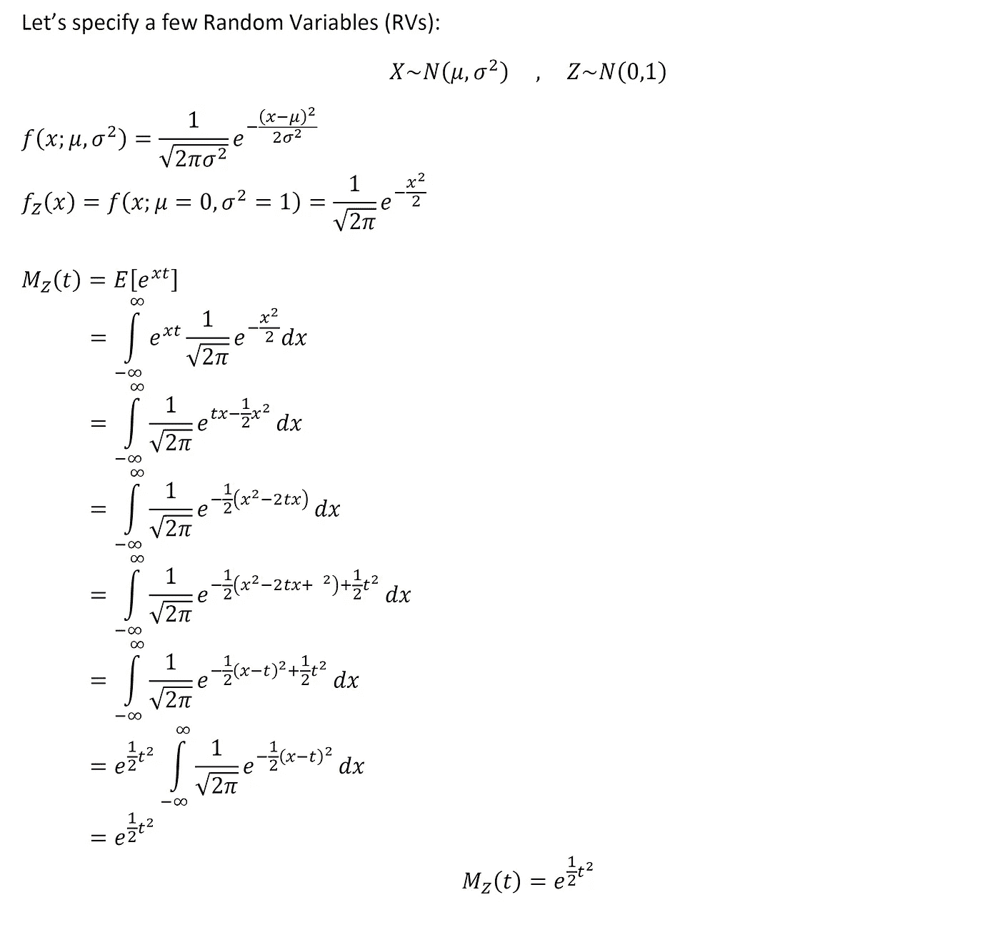

作者图片

**2C。矩母函数的性质(MGF):**

在第三节中，我们将代数操作 mgf。以下属性将会很有用:

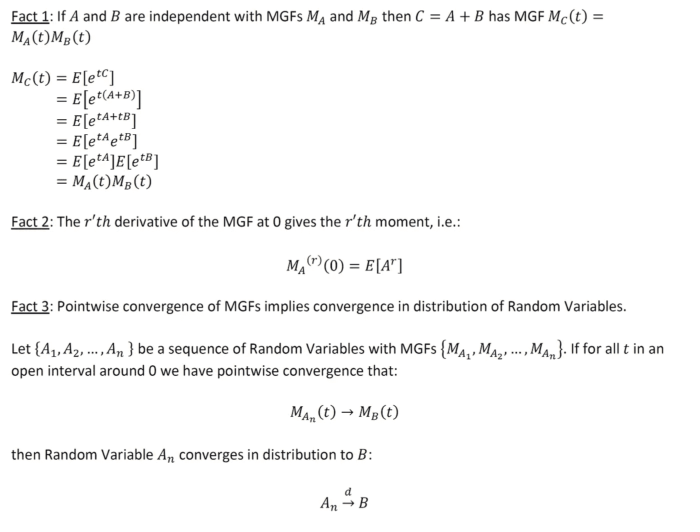

作者图片

# 3.林德伯格的证明CLT:

我们现在准备证明 CLT。

但是我们的证明策略是什么呢？仔细查看上面的 2C 部分*(MGFs 的属性)*。最后陈述的性质(本质上)告诉我们，如果 RV A 的 MGF 逐点收敛于 RV B 的 MGF，那么一定是 RV A 在分布上收敛于 RV B

我们证明 CLT 的方法是证明我们的抽样估计量 S*的 MGF 逐点收敛于标准正态 RV Z 的 MGF。在此过程中，我们证明了 S*以分布收敛于 Z，即 CLT，并结束了我们的证明。

所以让我们开始吧:

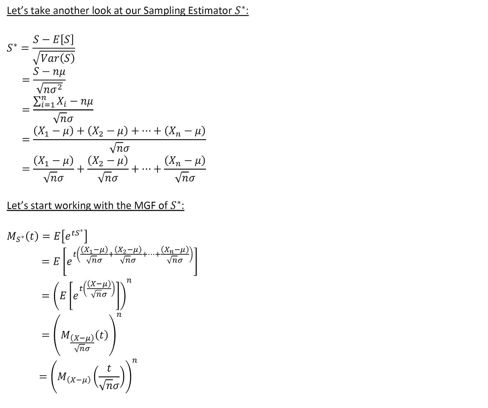

作者图片

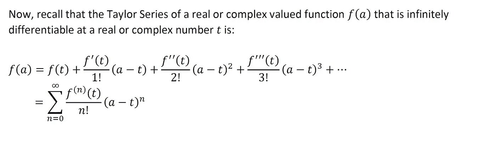

作者图片

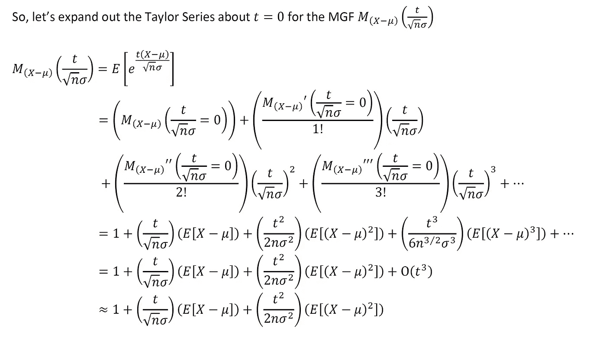

作者图片

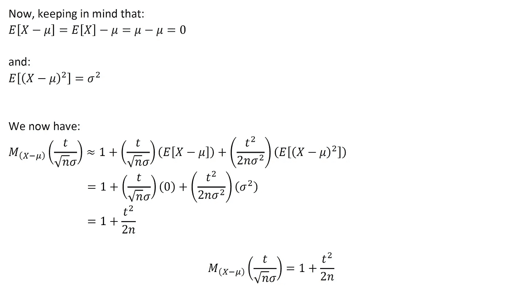

作者图片

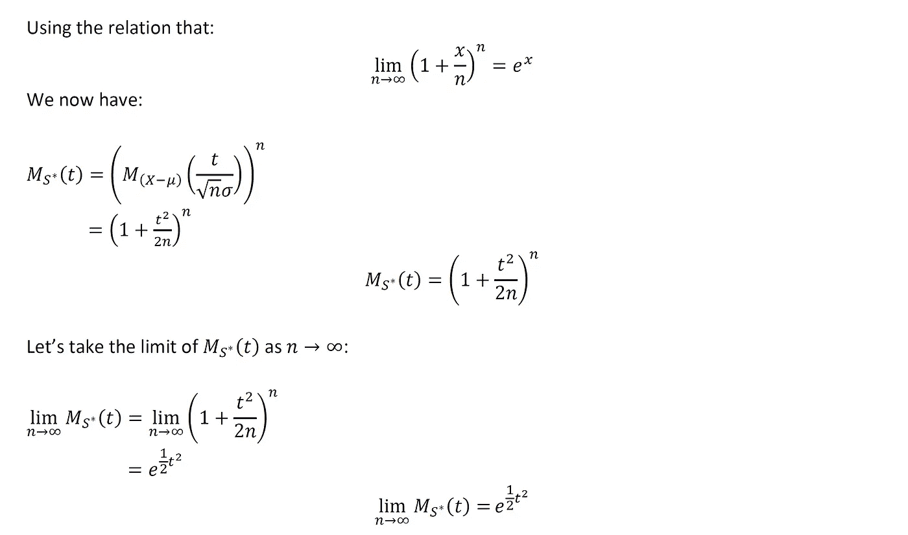

作者图片

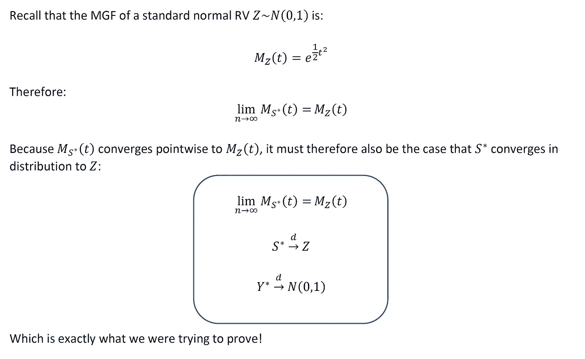

作者图片

这就是我们的证据！恭喜，你通过了数学考试:)

# 总结和最后的想法

我认为理解上面的推导对于任何数据科学、统计学或机器学习从业者来说都是一项有价值的工作。理解以上内容不仅能让你对 CLT 有所了解，更重要的是能让你理解 **CLT 不支持**的情况。

在本文的开头，我提到了 CLT 不适用于 n . I . I . d .柯西分布式房车。[柯西分布](https://en.wikipedia.org/wiki/Cauchy_distribution)是一种没有定义均值或方差的连续概率分布。因此，给定林德伯格-莱维*【CLT】*(一阶和二阶矩未定义)*所需的条件，CLT 在这里不成立。如果你(读者)能想到 CLT 不成立的其他常见例子，请在评论区发表你的想法。*

*希望以上有见地。正如我在以前的一些文章中提到的，我认为没有足够的人花时间去做这些类型的练习。对我来说，这种基于理论的洞察力让我在实践中更容易使用方法。我个人的目标是鼓励该领域的其他人采取类似的方法。我打算在未来写一些基础作品，所以请随时在 [**LinkedIn**](http://www.linkedin.com/in/andrew-rothman-49739630) 上与我联系，并在 Medium 上 [**关注我的更新！**](https://anr248.medium.com/)*