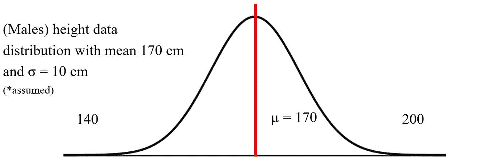
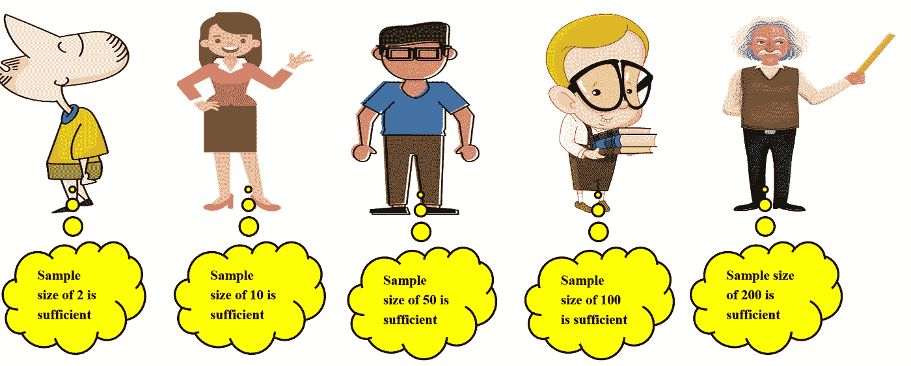
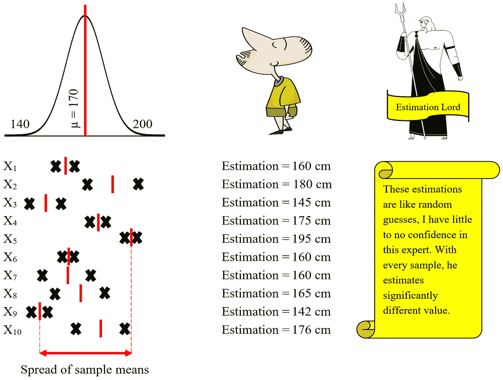
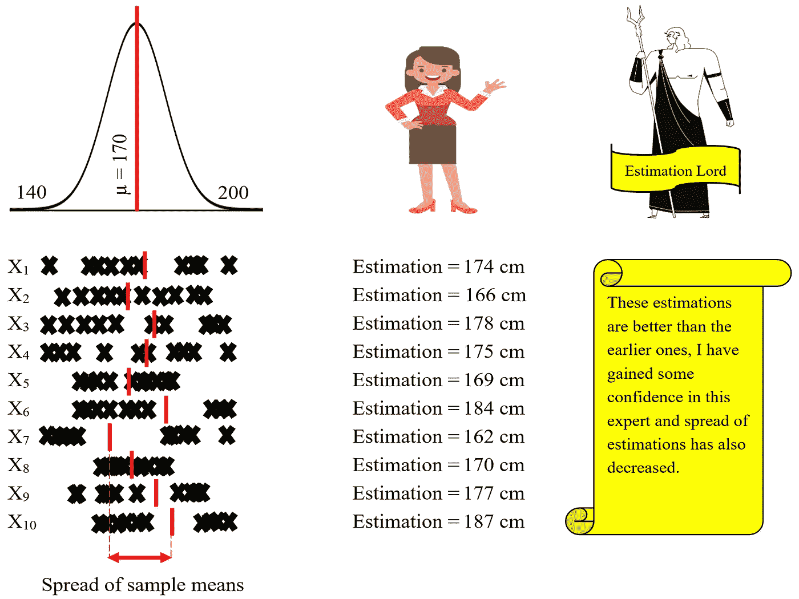
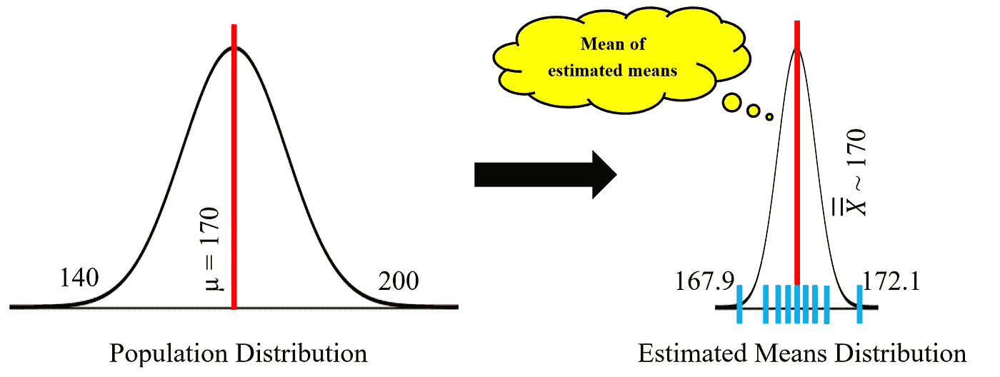
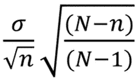

# 简化的中心极限定理

> 原文：<https://towardsdatascience.com/central-limit-theorem-simplified-7a0689519a46?source=collection_archive---------32----------------------->

## *感谢高斯所做的一切*

由[贾瑞德·克雷格](https://unsplash.com/@jaredd_craig?utm_source=medium&utm_medium=referral)在 [Unsplash](https://unsplash.com?utm_source=medium&utm_medium=referral) 上拍摄

推理统计学背景中的一个重要定理，没有它，推理统计学就没有意义。它有助于假设检验、回归分析和其他分析技术。

是的，我说的是**“中心极限定理”**

> 它表明，无论总体分布如何，随着从总体中导出(替换)的样本的样本大小(n)增加，样本均值或和的分布接近正态分布。

从数值上看，从任何具有均值和标准差σ的总体分布中抽取的随机样本的均值将具有近似正态分布，均值等于σ /√n，标准差为σ/√n。

## 举例理解(+视觉):

假设在行星“X”上有一群男性，我们想估计他们的平均身高，我们该怎么做呢？

1.用全部人口数据计算平均值？

2.用中心极限定理用样本估计？

选择 1 是不切实际的，因为没有人拥有这样的马格努斯活动所需的时间和精力。选择 2 是，让我们看看它是如何工作的:

假设下面的分布有身高(男性)——行星 x 上的全部男性人口的数据，为什么是正常的？因为任何在偶然/随机原因下可测/可数的东西，总会遵循正态分布曲线。即使它受到可指定原因的影响(不是正态分布曲线)，中心极限定理仍然成立。现在，我们举这个例子来理解这个定理的要点。测量所有男性的身高是不切实际的，我们将尝试用样本来推断总体平均值。

(图片由作者提供)

现在我们有 5 个自称的估计专家来估计不同抽样选择的平均值:

(图片由作者提供)

## 让我们看看谁得到的估计最准确(每个人可以得到 10 个样本):

## 专家 1 —练习

(图片由作者提供)

这里估算主的评论显示了对估算专家和他选择的样本量(n=2)的负面情绪。10 个估计平均值的分布也远离正态分布。现在轮到下一位专家了:

## 专家 2 —练习

(图片由作者提供)

这里估算主的评论显示了对估算专家和她选择的样本量(n=10)的一些积极的看法。我想我现在能够将中心极限定理的一些相关概念放入您的脑海中了——随着样本大小的增加，总体均值的估计值越来越接近实际总体均值，离散度/扩散度减小，形状复制正态分布(*样本估计均值)。据此，03 位剩余的估计专家中，哪一位将具有高置信度的总体均值的最佳估计(估计均值的低传播/分散)—

没错，就是最后一个家伙(爱因斯坦的二重身)。引入 CLT 的数值定义与同一盖伊的估计:

**样本估计值的标准差均值** = σ/√n = 10/√200 = 10/14.1 = 0.7

其中σ是总体分布的标准偏差，n 是总体中派生样本的样本大小

(图片由作者提供)

**估计均值分布具有近似等于实际总体均值的均值(*也称为估计均值的均值)，具有非常低的散布/离差，这描绘了估计的良好置信度。**

> 这种样本估计平均值的扩散/分散也被称为“**标准误差**”。

因此，一个至关重要的观点是，样本量越大，样本估计均值的分布越低，这导致估计的可信度越高。

现在对于不同的取样范围，标准误差的计算是不同的:

1.从无限总体中取样(上面已经讨论过)

2.从有限总体中抽样

3.总人口抽样

标准误差的一般公式(不考虑人口规模):

当总体标准差已知时，上述公式是适用的。当 N 接近无穷大时，我们得到上面讨论的公式(σ/√n)。当 n = N 时，标准误差为零。

现在我们已经到了这个博客的结尾，我希望通过看到一个非常规和简单的视觉练习，你已经理解了中心极限定理应用背后的基本思想。

> 主要的收获是“我们在推断统计学范围内所做的一切(使用总体样本进行估计)，中心极限定理总是在背景中出现”。

请关注更多即将发布的博客。

谢谢！！！