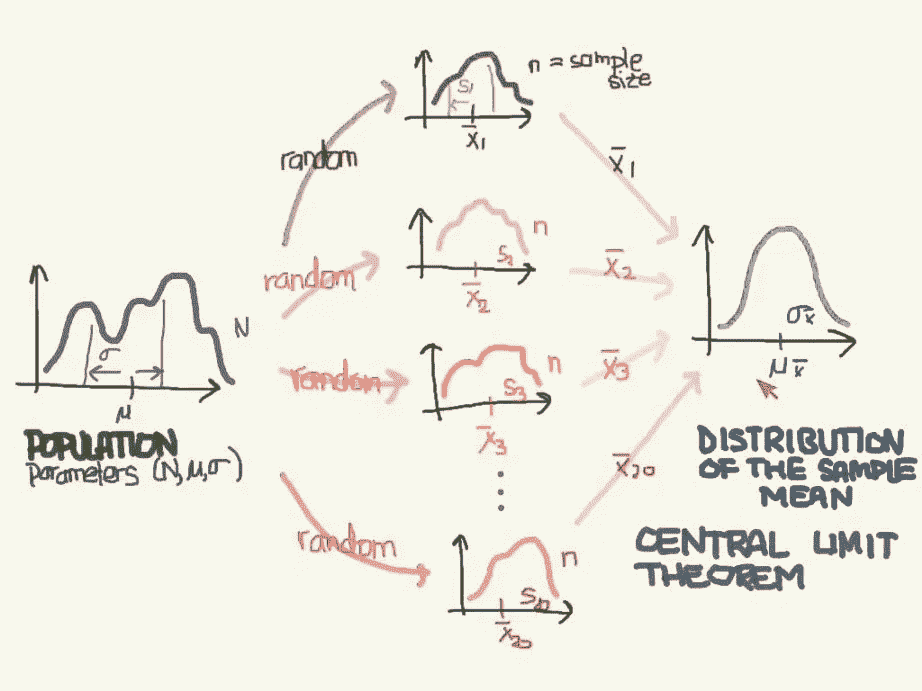
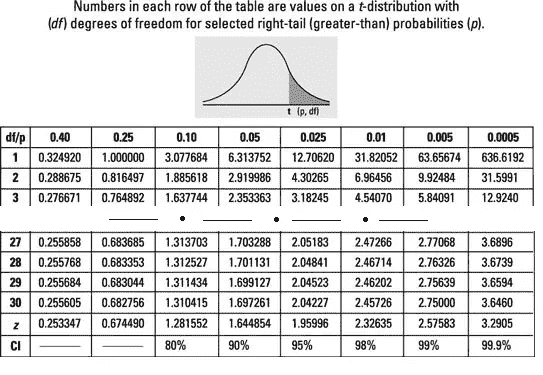
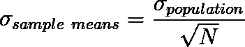
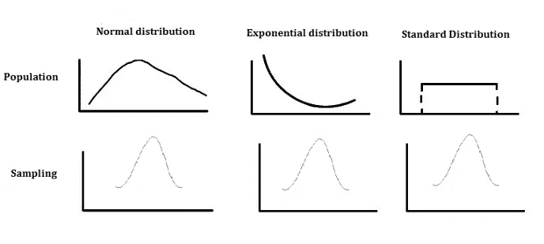
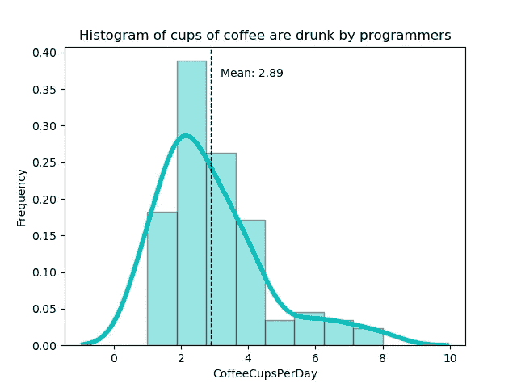
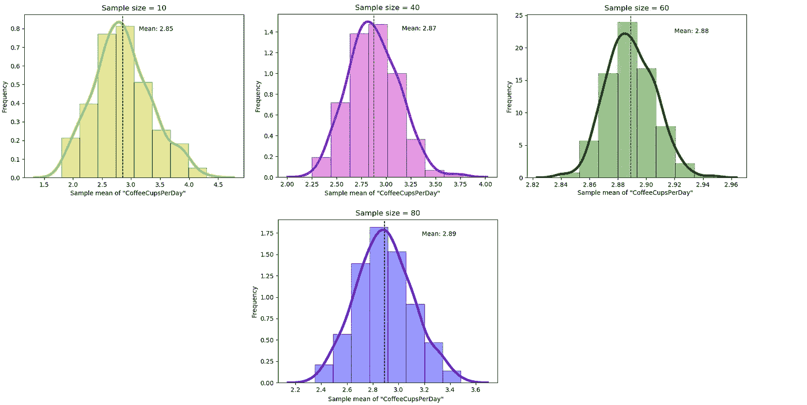
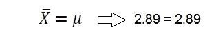
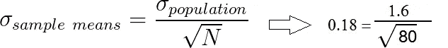
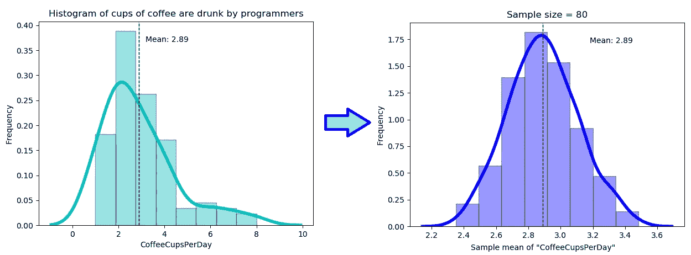

# 用 Python 模拟中心极限定理

> 原文：<https://towardsdatascience.com/central-limit-theorem-simulation-with-python-c80f8d3a6755?source=collection_archive---------16----------------------->

## 中心极限定理的 Python 仿真实验验证

[来源](https://unsplash.com/photos/d5LSyfDoE9M)

*统计领域最重要的概念之一是什么，但它经常让有抱负的数据科学家感到困惑？没错，就是中心极限定理。*

> 让我们深入研究数据科学中最重要的定理！

收集全部人口的数据是非常不可能的。相反，我们可以从总体中收集数据的子集，并使用该样本的统计数据来推断总体。

# 什么是大数定律？

**大数定律** ( **LLN** )是一种理论，该理论指出，随着样本均值的大小增加，样本分布的均值将接近总体分布的均值。因此，大数定律可以直观地理解为收集更多的数据会产生更具代表性的样本。

# 什么是中心极限定理？

**中心极限定理(CLT)** 是一种理论，声称从重新抽样计算出的样本均值的分布将趋于正态，随着样本规模的增大，而不考虑总体分布的形状。

*(* [*来源*](https://medium.com/@birajparikh/what-is-central-limit-theorem-clt-db3679433dcb) *)*

*这两种理论的区别在于，大数定律描述的是单个样本均值，而中心极限定理描述的是样本均值的分布。*

# 样本分布中的数据必须遵循什么规则？

1.  分布中的数据应该是随机选择的。
2.  样本应该相互独立。
3.  样本量应该足够大。如果总体分布很正态，30 的样本量就足够了。

# 为什么样本量至少要有 30 人？

有大量的书籍引用了这个值，例如，霍格和坦尼斯的[概率和统计推断(7e)](https://www.amazon.com/Probability-Statistical-Inference-Robert-Hogg/dp/0131464132) 说:

> 也就是说，当 N“足够大”时，X 约为 N(μ，σ2/n)，Y 约为 N(nμ，nσ2)，其中μ和σ2 分别是样本来源的基础分布的均值和方差。一般来说，如果 n 大于 **25 或 30** ，这些近似值就不错了。

自然界中许多变量的分布非常接近正态曲线。查看 t 表，您会发现具有 30 个自由度的 t 的值接近 z 的值。其中一个原因是 t 分布(如正态分布)是对称和单峰的。因此，我们可以得出结论，样本量为 30 的均值样本的分布也将是正态分布。

t 表([来源](https://www.dummies.com/education/math/statistics/how-to-use-the-t-table-to-solve-statistics-problems/))

如果总体的分布不是正态的，你可能需要尝试比 30 大得多的样本量。人口数据离对称和单峰越远，你就需要越多的数据进入 CLT。

因此，分布越接近正态分布，调用 CLT 所需的样本就越少。实际上，我从不依赖于 *n* = 30，并建议你尝试不同的抽样规模。

# 从这两个定理得出什么结论？

1.  均值的抽样分布将是正态或接近正态的。
2.  抽样分布的均值将等于总体的均值分布。数学上，

3.抽样分布的标准误差与原始总体的标准偏差直接相关。数学上，

4.如果我们增加从总体中抽取的样本，样本均值的标准差就会减小。

[来源](https://www.whatissixsigma.net/central-limit-theorem/)

# CLT 的统计意义是什么？

我们有一些分布，其中的数据不是正态分布，但我们不使用这个分布，而是使用样本均值的分布。这让我们可以作弊，说我们可以在统计推断中无处不在地使用正态分布，尽管潜在的分布不是正态的。

1.  **假设检验中使用的中心极限定理。**
2.  样本平均值可用于创建一个称为**的数值范围，即置信区间**。这些方法假设总体是正态分布的。
3.  CLT 在一个类似**的算法中使用了随机梯度下降。**算法表现如何？我们从我们的训练集中抽取一批样本，并计算各批损失的平均值或总和。感谢 CLT，现在我们知道了损失估计的最终分布将是高斯分布。

# 让我们通过用 Python 模拟来提供中心极限定理的经验证据吧！

我们将使用一个 [**Kaggle**](https://www.kaggle.com/devready/coffee-and-code) 数据集和 **Python 统计库**，如 **Numpy、**、 **Matplotlib 和 Pandas** 。

1.  首先，我们导入所需的库，然后使用`.read_csv()`读取数据集，并将其作为`DataFrame`对象存储在变量`df`中。
2.  我们使用了`.head(10)`属性来浏览前 10 行数据。
3.  我们用`.info()`显示了所有列及其数据类型:
4.  `.shape`属性需要看到它的**维度**。结果是一个包含行数和列数的元组。
5.  Pandas `**describe()**`用于查看一些基本的统计细节，如百分位数、平均值、标准差等。一个数据帧。

为了说明抽样的中心极限定理，我们将采用“CoffeeCupsPerDay”列。我们来画一个程序员喝咖啡的杯数直方图。

正如我们看到的，程序员每天喝的咖啡杯数据的分布是正偏态的，数据分布的平均值= 2.89。但是我们想要分析近似正态分布的数据。

理论上，随着每个样本大小的增加，样本均值越接近高斯分布。让我们抽取足够的不同大小的样本，并计算它们的样本均值。我们将从 300 个样本中抽取 10、40、60 和 80 个样本。计算算术平均值，并绘制 300 次样本的平均值。

所以，我们通过采取不同的样本量并逐步增加来进行试验。然后我们将不同样本量的样本均值分布可视化，比较它们的分布形态和均值。现在，我们知道随着样本量的增加，我们会得到一个非常好的钟形曲线。

从样本大小为 80 的分布形状可以看出，该分布是高斯分布。抽样分布的均值等于总体的均值分布，等于 2.89。

数学上，

我们可以观察到，随着样本大小 N →无穷大，均值的标准差趋于零。这意味着数据集的尺寸**越大**标准误差越小**。**

因此，我们可以认为采样分布是正态的，所以我们可以使用这些分布进行进一步的分析。

*感谢您的阅读！我希望这篇文章让你对中心极限定理有了基本的了解。如果您有任何问题，欢迎在 Gmail*[*Nataliia Rastoropova*](http://rastoropova.nataliia@gmail.com)*上评论或给我写信。*

 [## 提交您的文章—清单

### 准备你的文章发表。(下载我们的 PDF 版本)

towardsdatascience.com](/post-for-writers-2-ebd32d1fac21)  [## 数据科学统计学:中心极限定理介绍

### 什么是统计学中最重要和最核心的概念之一，使我们能够进行预测建模，但它…

www.analyticsvidhya.com](https://www.analyticsvidhya.com/blog/2019/05/statistics-101-introduction-central-limit-theorem/)  [## 机器学习的统计方法

### 机器学习的统计方法探索如何用 Python 将数据转化为知识我们为什么需要…

机器学习桅杆](https://machinelearningmastery.com/statistics_for_machine_learning/)