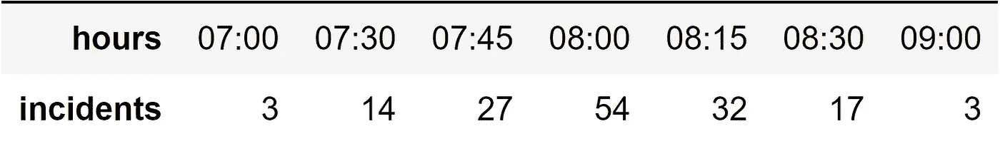
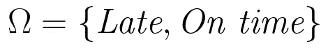
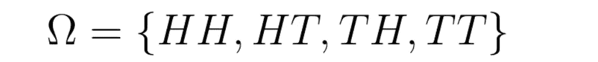
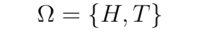
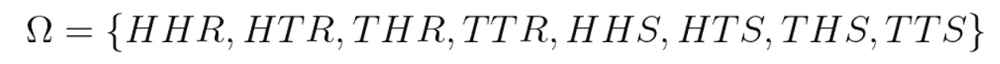
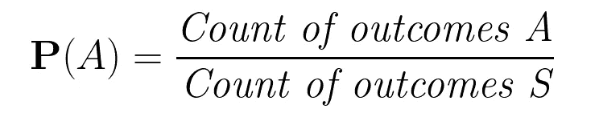
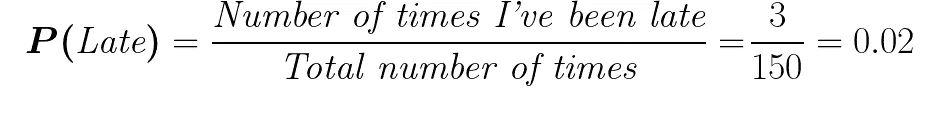
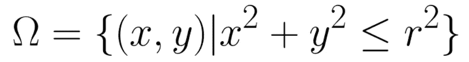
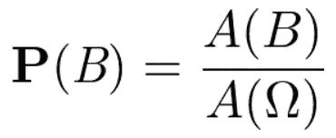

# 确定性大师:概率模型第 1 部分:理解模型

> 原文：<https://towardsdatascience.com/certainty-wizards-probability-models-part-1-understanding-models-d70511603c4c?source=collection_archive---------48----------------------->

## 概率如何在日常生活中帮助我们？

Gabriel Manlake 在 [Unsplash](https://unsplash.com?utm_source=medium&utm_medium=referral) 上拍摄的照片

> 哔哔声:07:30…哔哔声:07:45…哔哔声:08:00…
> 
> ZZZzzz……！！！09:25?！只是推迟了几分钟！现在我又要迟到了…

有些事情我们无法知道。事实上，由于生活的不可预测性，我们只知道一些事情。不幸的是，不确定性是天生的，我们对此无能为力。

但是即使我们不能预测未来，我们仍然可以推测，如果我们有办法**测量一个事件所有可能的结果**和**它们发生的可能性**，那么我们就可以为那个特定的事件做更好的准备。这些主题将是第一部分的主题。

所以现在重要的问题是，我今天要不要睡午觉？

好吧，原来我问自己这个问题已经有一段时间了，所以我花了一些时间记下了我每天醒来的时间:

我过去 150 天的起床时间表

在这个表中我们可以看到我在某个时间醒来的次数，除了 *07:00* (指 07:30 之前的*)和 *09:00* (在 *08:30 之后的*)如果**这个**发生**我就要迟到**。我们可以看到，在 150 天里，我已经迟到了 3 天！*

但是，明天我迟到的可能性有多大？

如果我们的目标是预测未来，我们就需要用我们能与之共事的方式来表达现实，用一种量化的方式。随机事件(其结果不确定)的数学化被称为**概率模型。**

# 概率模型要求:

为了能够正确地模拟一种情况，我们将需要**描述可能的结果**(*-*)按时*，所有的可能性组成所谓的**样本空间**，并指定一个**概率法则。**一个**概率定律**(或**概率函数** ) 定义了在所有可能的结果中，某个结果出现的可能性有多大。*

*这是通过将一个**概率**关联到每一个可能的事件(在这种情况下是*迟到*或*准时*)来实现的。**概率**在这种情况下可以解释为分配给某个事件*的数值，它描述了我们的**信念，我们认为这个事件**能够发生的可能性有多大，但是要小心！我们称之为信仰并不意味着它是主观的。******

*****通常这种信念是基于以前的知识，由于这一事实，我们也可以将一个事件的概率定义为**其** **长期相对频率**(当它非常大时，预期获得该事件*的次数与实验次数成比例)。******

*****虽然这种解释在理论上是正确的，但这个定义的问题是，在某些情况下，如*选举*，它没有太大的意义。在这种情况下，我们不能假设候选人将永远参加竞选，因此我们*不能*说它的长期相对频率是多少。*****

# ******样本空间******

****创建我们自己的模型的第一步是定义一个**样本空间，**明天早上我去办公室时会有什么不同的可能结果？嗯，我可以迟到*或者准时*或者准时*所以我们可以定义一个包含那些可能结果的集合，这就是所谓的**样本空间**，通常用大写希腊字母 **omega:** 表示*****

********

## ****样本空间属性****

****在这种情况下，样本空间是微不足道的，但有时它可能很难定义。想想扔硬币两次，我们可以猜测我们可以有三个输出，两个头，头和尾或者两个尾。这是正确的，但如果我们谈论概率，我们必须跳出框框，一步一步地思考，考虑到每个小细节和我们实验的性质，在这种情况下，投掷硬币**两次**将有**四种**可能的结果:****

********

****样本空间**必须始终**为:****

*   ****互斥的:只有一种结果会发生****
*   ******统称穷举:**它必须覆盖所有的概率空间****
*   ******正确粒化**:不能包含无关信息****

****让我们看一些例子:****

********

****在这种情况下，如果我们假设 ***H*** 表示“至少有一个头”，而 ***T*** 表示“至少有一个尾巴”，那么我们的样本空间就不正确，我们可能有一些 ***HT*** 或 ***TH*** 并且它不满足第一个必须条件，这个样本空间就不是**互斥的。******

********

****这个新的样本空间不会崩溃，但这还不够。有了它我们可以得到***HH******HT***和 ***TH*** ，但是我们没有覆盖*的情况。该样本空间并非**全部。*******

**********

*****现在想象一下,*表示“雨天”, ***S*** 表示“晴天”,利用这个样本空间，我们确实涵盖了实验的所有可能结果，而且没有任何冲突，但是我们添加的信息是不相关和不必要的(除非我们想知道天气是否会改变硬币的行为)。这个样本空间没有**正确地粒化。********

# ******概率定律******

****正如我们之前已经提到的，我们可以使用我们的数据创建一个**概率定律。**在这种情况下，我们将从事件*发生的次数除以我们做实验的次数(定义样本空间的所有元素*的所有数据)来推断，假设我未来的行为(在这种情况下)不会有太大的不同。******

**********

*****我们知道迟到的概率是我迟到的次数除以总次数:*****

**********

*****现在我们明白了！假设我的行为不会有太大的改变，我会迟到大约 2%的时间，50 天中的 1 天。我真的不知道我的老板是否真的会欣赏这一点…*****

## *******连续空间中的概率定律*******

*****我们不会总是有相同的概率定律，在*延迟/准时*的情况下，该公式工作良好，我们可以推断一些未来的行为，但在其他情况下可能不是这样。*****

********

****毛罗·吉利在 [Unsplash](https://unsplash.com?utm_source=medium&utm_medium=referral) 上拍摄的照片****

****想象一下，你和一些朋友在酒吧里扔飞镖。你的飞镖第一次击中中心的概率是多少？我们没有以前的数据来预测你是否会错过，即使我们有，我们也只能预测你是否能击中中心(或其他定义的区域)(因为我们会记下它是在的*还是在*的*。*****

****相反，更准确的假设是你击中*任何*定义的地方 ***B*** (假设中心)的概率等于它的面积除以目标面积，在这种情况下将是**样本空间。******

****如果没有以前的代数知识，这种情况可能有点难以理解，但不要担心，因为这只是一个例子，说明定义**概率定律**不仅仅是我们的*长期预期*。****

********

****这个问题的样本空间将由在从目标中心的半径内的目标的任何点来定义。我们可以将飞镖击中定义空间 ***B*** 的概率表示为其面积( ***A*** )除以**样本空间**的面积:****

********

# ****总结:****

****在第一部分中，我们已经看到了一些例子，比如什么是概率模型，它们是如何工作的，以及它们是由什么定义的。我们还看到了帮助我们以数学方式处理实验中事件发生的可能性的工具，**概率**，以及适当的**样本空间的属性。******

****在下一部分，我们将讨论概率论建立的基础，即**概率公理。**我们还将与*维恩图*一起深入**集合论**以更好地理解这个不确定的世界。****