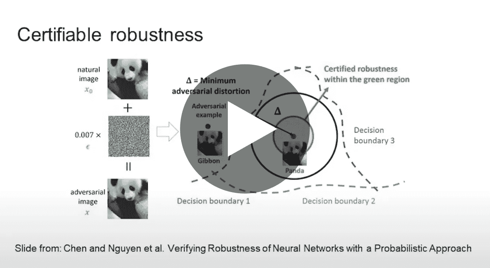

# 可证明的对抗攻击的鲁棒性；有什么意义？

> 原文：<https://towardsdatascience.com/certifiable-robustness-to-adversarial-attacks-what-is-the-point-9152490f9c1?source=collection_archive---------60----------------------->

## [活动讲座](https://towardsdatascience.com/event-talks/home)

## 尼克·弗罗斯特| TMLS2019

[在多伦多机器学习峰会上的演讲](https://torontomachinelearning.com/)

## 关于演讲者

尼克·弗罗斯特是杰弗里·辛顿实验室谷歌大脑的研究工程师。他在多伦多大学获得了计算机和认知科学的学士学位。他专注于胶囊网络，对立的例子和理解表示空间。

可证明的对抗攻击的鲁棒性；有什么意义？