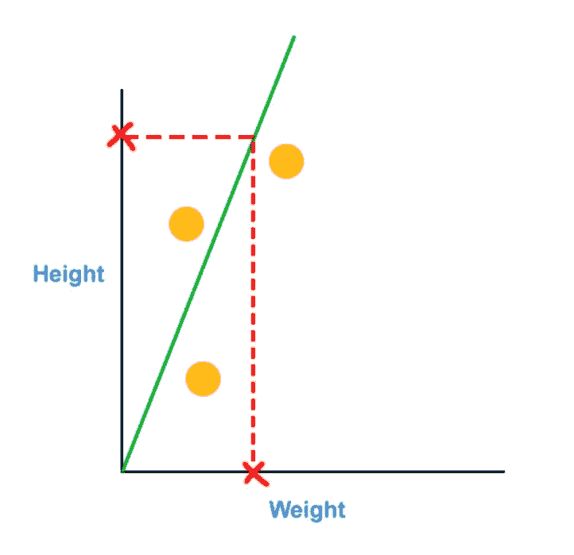

# 数据科学家直观地解释了链式规则

> 原文：<https://towardsdatascience.com/chain-rule-explained-visually-by-the-data-scientist-67e45af61742?source=collection_archive---------37----------------------->

## 只需 5 分钟就能掌握链式法则的直觉，为你未来的求职面试做准备！

## **简介**

今天我们将讨论链式法则，我希望我对这个概念的直观解释能对你有所帮助！注意，本文假设你已经熟悉了导数的基本概念，只是想更深入地理解链式法则本身。

## **快速衍生工具概述**

也就是说，让我们先快速回顾一下导数。

想象一下，我们从一群人那里收集了这些测量数据。在 x 轴上，我们测量了他们作为数据科学家的工作量，在 y 轴上，我们测量了他们的工资。

我们现在可以用这条绿色抛物线来拟合数据。

数据点的抛物线

抛物线的方程式是

`salary = (years as Data Scientist)**2`

这个方程的导数告诉我们沿曲线任一点切线的斜率。然而，切线的斜率告诉我们`salary`相对于作为数据科学家的`years`变化有多快。我们可以用幂法则计算出`salary` 对`years`的导数！

具体数据点的切线

幂法则告诉我们将`years`乘以 2 的幂，然后将`years`乘以 2–1 的幂，得到下面的等式。

`dSalary/dyears = 2 * years`

嗯，这是一个快速回顾的衍生物:)

## 链式法则解释

现在让我们用一个超级简单的例子来深入研究链式法则！想象一下，我们收集了三个人的体重和身高测量值，然后对数据进行拟合。

这 3 个数据点的最佳拟合线

如果有人告诉我们他们有这么重，我们可以用绿线来预测他们有这么高。

根据体重确定身高

现在想象一下，我们收集了身高和鞋码的测量数据，并对这些数据进行了拟合。

这 3 个数据点的最佳拟合线

如果有人告诉我们他们有这么高，我们可以用橙色线来预测这是他们的鞋码！

现在，如果有人告诉我们他们有这么重，那么我们可以预测他们的身高，我们可以用预测的身高来预测鞋码，如果我们改变体重值，我们就会看到鞋码的变化！

根据重量确定鞋号

现在让我们来关注这条代表体重和身高关系的绿线。假设体重每增加一个单位，身高就会增加两个单位。

换句话说，直线的斜率是 2 除以 1，等于 2。由于斜率为 2，导数为

`dHeight/dWeight = 2`

因为绿线的斜率和它的导数 2 相同，所以高度的等式是

`height = dHeight / DWeight * weight`

注意，高度方程没有截距，因为绿线穿过原点。

现在让我们把注意力放在代表身高和鞋码关系的绿线上。

在这种情况下，假设身高每增加一个单位，鞋码就增加四分之一。按照与上述相同的逻辑，绿线的等式为

`Shoe size = dSize / dHeight * height`

在哪里

`dSize /dHeight = 1/4`

再次注意，因为绿线穿过原点，所以鞋码的等式没有截距。

因为体重可以预测身高，身高可以预测鞋码，所以我们可以把身高方程代入鞋码方程。如果我们想准确地确定鞋号如何随着体重的变化而变化，我们可以对鞋号相对于体重求导。

鞋码相对于体重的方程的导数就是这两个导数的乘积！换句话说，因为身高把体重和鞋号联系起来，所以鞋号对体重的导数是

`Shoe size = dSize / dHeight * dHeigt/dWeight * weight`

这种关系是链式法则的精髓。输入数字给我们一半，这意味着重量每增加一个单位，鞋码就增加一半！

## 结论

你可以看到链式法则里面没有什么复杂的东西，我们只是在计算一个参数如何改变其他参数！我希望这个链式法则的快速直观解释对你和你未来的职业生涯有所帮助！别忘了看看关于数学和机器学习主题的推荐书籍。

## **推荐书籍**

[使用 Scikit-Learn 进行机器实践学习](https://amzn.to/3jF13md)

[Python 机器学习简介:数据科学家指南](https://amzn.to/32NjgqR)

[数据科学家实用统计:使用 R 和 Python 的 50 多个基本概念](https://amzn.to/3brzObS)

[工程师和科学家的应用数值方法](https://amzn.to/3gVusGZ)