# 用 Hadoop/ Java 链接多个 MapReduce 作业

> 原文：<https://towardsdatascience.com/chaining-multiple-mapreduce-jobs-with-hadoop-java-832a326cbfa7?source=collection_archive---------5----------------------->

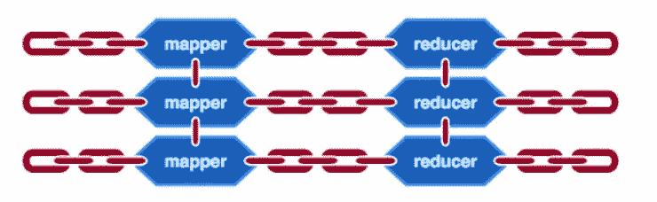

来源:https://mapr.com/blog/how-to-launching-mapreduce-jobs/

大约一年前，当我的工作需要一点 Hadoop 时，我简要地了解了 MapReduce。那时我还没有接触过 MapReduce，更不用说用 Java 了。因此，当一项任务要求我在一个脚本下实现多个 MapReduce 作业时，在 Stack Overflow 和 Youtube 上搜索简直是一团糟。

那么，为什么不写点什么呢？是的，我是。

# **概要:MapReduce**

MapReduce 是一个计算抽象，可以很好地与 Hadoop 分布式文件系统(HDFS)一起工作。它包括“映射”步骤和“减少”步骤。Map 执行过滤并分类到另一组数据中，而 Reduce 执行汇总操作。在这两个步骤中，单个元素被分解成键和值对的元组。

MapReduce 因能够在后台的多个计算节点上轻松扩展数据处理而广受欢迎。因此，它可以很好地与

非常大的数据集。

# 多个 MapReduce 作业

为了说明如何在一个脚本中链接多个 MapReduce 作业，我将使用大约 760 万行的**NYC Taxi&Limousine Commission**数据集来计算位置度数差异的分布。的。我使用的 tsv 文件具有以下结构:

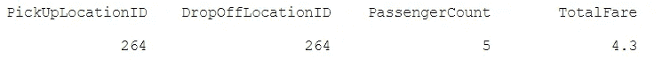

假设我们想使用 MapReduce 获得以下两列的输出:


其中“diff”是位置 ID 的出度减去其入度。位置的出度是该位置用于拾取的次数，入度是该位置用于放下的次数。那么，“计数”就是特定“差异”的频率。

因此，实现这一点的一种方法是拥有两个 MapReduce 作业。一个是计算每个位置的“diff ”,另一个是将第一个作业的输出转换为“count ”,就像我们上面想要的那样。

**映射-减少作业#1**

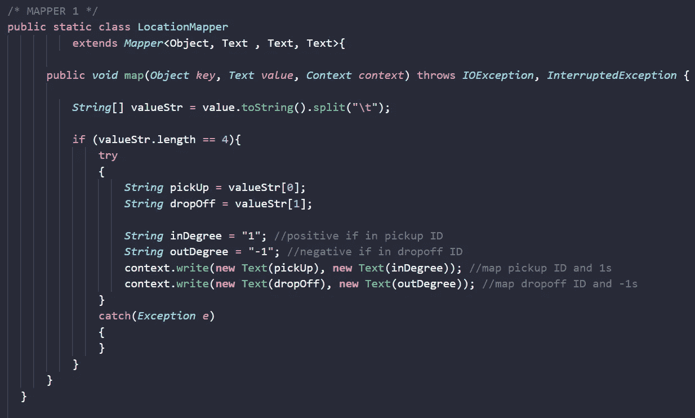

映射程序#1

Job #1 的 Map 过程简单地循环并中断。tsv 为每行输入 4 个不同的值:PickUpLocation ID、DropOffLocation ID、PassengerCount 和 TotalFare。但是，这里只有 PickUpLocation ID 和 DropOffLocation ID 与我们的任务相关。然后，对于每个元素，该类还创建一个为 1 的 inDegree 变量和一个为-1 的 outDegree 变量。

然后，它将每个(PickUpLocation，inDegree)和(DropOffLocation，outDegree)写入一个键值元组，该元组将由 Reduce 过程进一步处理，该过程采用如下形式，其中第一列是位置 ID，第二列指示它是从每个位置 ID 拾取还是放下。

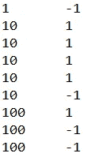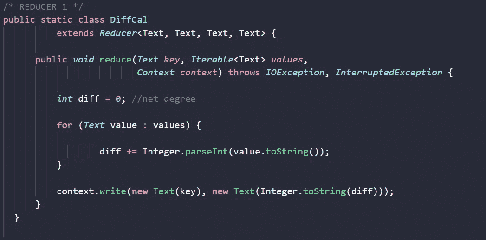

简化程序#1

然后，Reduce 过程所做的只是按位置 ID 进行分组，并通过对第二列求和来实现“diff”。然后，它将(Location ID，diff)作为键值元组写入。

输出采用以下形式:

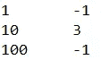

**MAP-REDUCE 作业#2**

然后，作业#1 的输出作为作业#2 的输入传入。

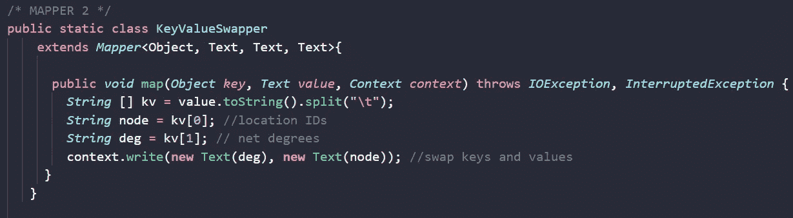

映射程序#2

为了按“diff”分组以获得最终输出，Job 2 的 Map 过程需要将输入键值对(Location ID，diff)交换到(diff，Location ID)中，因为 Reduce 过程按键分组。

实际上，这次 Map 过程的输出如下所示:

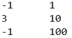

最后，将它传递给第二个 Reduce 过程来完成任务:

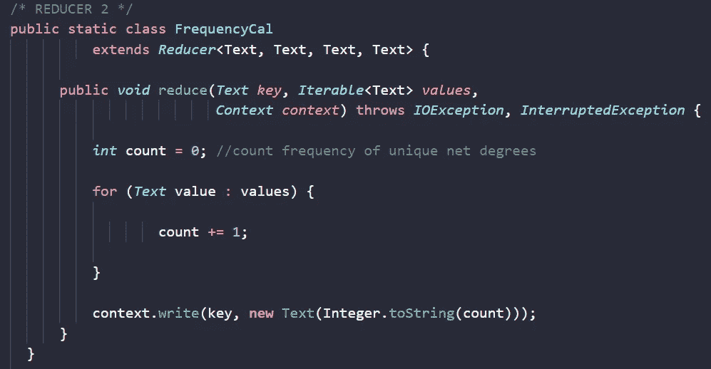

简化程序#2

这里发生的事情是，Reduce 过程简单地遍历输入，并且对于唯一的“diff”的每一次出现，它的计数增加 1。在循环结束时，它将(diff，count)作为键值对写入最终输出文件:

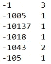

**连锁作业#1 &作业#2**

我发现的具有挑战性的步骤是连接上述两个 MapReduce 作业，这样作业#2 可以将作业#1 的输出作为输入，而不需要作业#1 实际写出一个文件。

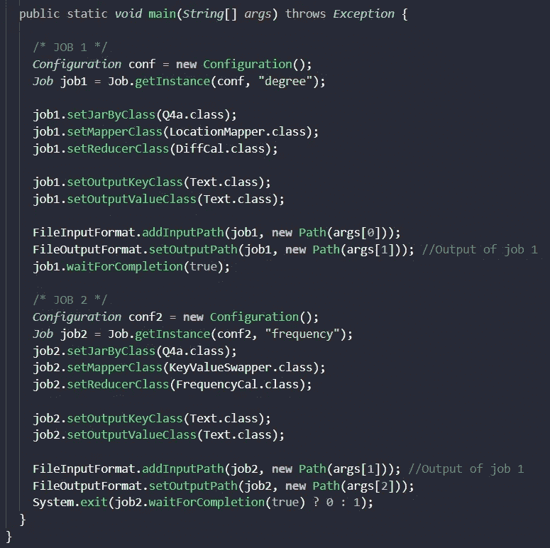

链接步骤

我不得不在网上寻找和尝试多种建议，直到我找到最容易理解的组合。

基本上，关键是为这两个作业创建两个不同的配置，即“conf”和“conf2 ”,它们也获得两个不同的实例。

```
*Configuration* conf = **new** Configuration();
*Job* job1 = Job.getInstance(conf, "degree");*Configuration* conf2 = **new** Configuration();
*Job* job2 = Job.getInstance(conf2, "frequency");
```

然后，作业#2 只能在作业#1 完成时执行

```
job1.waitForCompletion(true);
```

但是请注意，系统并没有在这里终止。然后，作业#1 的输出与作业#2 的输入相同:

```
FileOutputFormat.setOutputPath(job1, **new** Path(args[1]));FileInputFormat.addInputPath(job2, **new** Path(args[1]));
```

仅此而已。使用这种技术，您不仅仅局限于两个 MapReduce 作业，还可以增加到三个、五个甚至十个来适应您的任务。

我希望这篇简短的笔记可以帮助那些正在努力寻找一个关于链接 MapReduce 作业的全面且易于理解的指南的人。