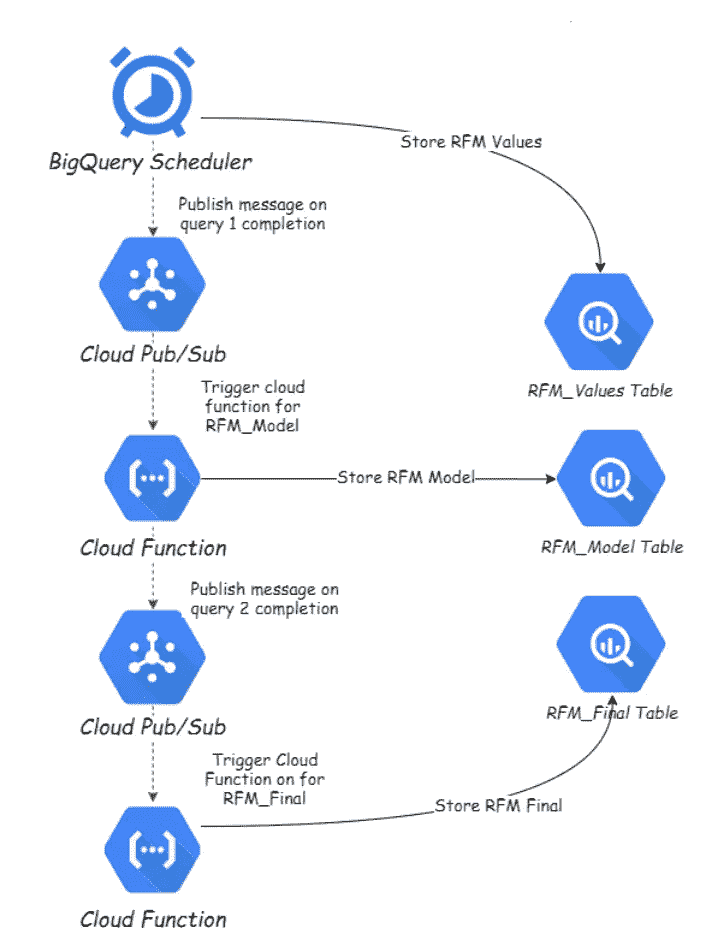
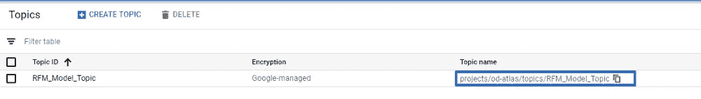
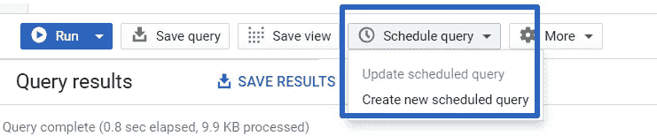
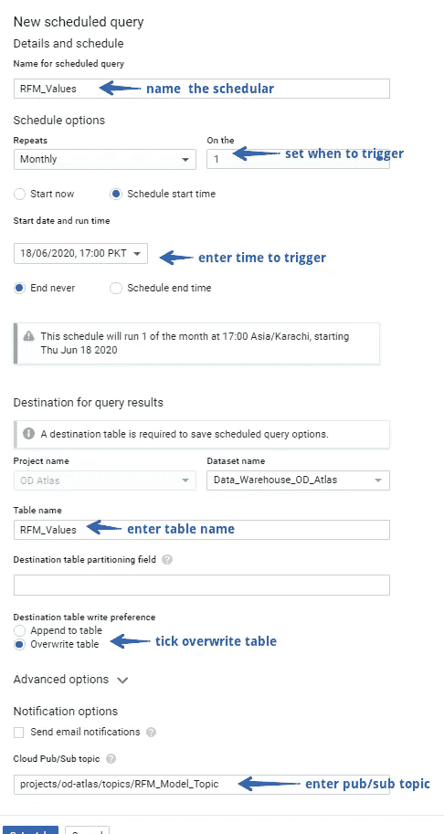
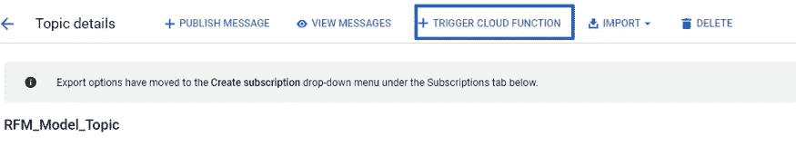
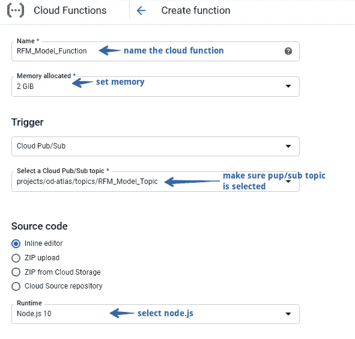
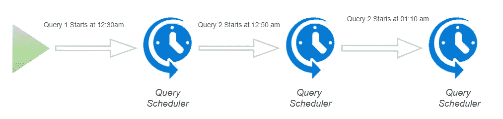

# 在 BigQuery 中链接多个 SQL 查询

> 原文：<https://towardsdatascience.com/chaining-multiple-sql-queries-in-bigquery-8498d8885da5?source=collection_archive---------15----------------------->

## 在 BigQuery 中依次执行多个查询

由 [Dakub](https://pixabay.com/users/dakub-8222964/) ，Souce [Pixabay](https://pixabay.com/photos/duck-goose-march-series-queue-3217049/)

Bigquery 是一个非常棒的工具！它可以让你使用类似 SQL 的语法进行非常强大的分析工作。

但是它缺少对 SQL 查询的链接。我们不能在一个 SQL 完成后立即运行另一个。在许多实际应用中，一个查询的输出依赖于另一个查询的执行。我们希望运行多个查询来获得结果。

这里有一个场景，假设您正在使用 BigQuery ML 进行 [RFM 分析。首先，您必须计算所有用户的 RFM 值，然后将 k-means 聚类应用于第一个查询的结果，然后合并第一个查询和第二个查询的输出，以生成最终的数据表。](/rfm-analysis-using-bigquery-ml-bfaa51b83086)

在上面的场景中，每个下一个查询都依赖于前一个查询的输出，并且每个查询的输出也需要存储在数据中以供其他用途。

在本指南中，我将展示如何在 BigQuery 中一个接一个地执行尽可能多的 SQL 查询，创建一个链接效果来获得想要的结果。

# **方法**

我将演示链接查询的两种方法

1.  **第一种使用云发布/订阅和云函数:**这是一种更复杂的方法，因为它确保在执行下一个查询之前完成当前查询的执行。这种方法也需要一点编程经验，所以最好联系公司里有技术背景的人。
2.  **第二种使用 BigQuery 自己的调度器:**然而，查询调度器不能确保一个查询的执行在下一个查询被触发之前完成，所以我们必须使用查询执行时间来破解它。稍后将详细介绍。

*如果你想弄脏自己的手，那么* [*这里有一个极好的课程*](https://bit.ly/2X4kefM) *可以开始。*

**注意**:我们将继续上面讨论的 RFM 的例子，让你了解这个过程。但是这同样适用于任何需要触发多个 SQL 查询的场景。

## 方法 1

方法 1 使用云功能和发布/订阅的组合来链接整个流程。该过程由查询调度器开始，该查询调度器在执行第一个查询之后向发布/订阅主题发送消息，该消息触发负责触发第二个查询的云功能，并且一旦完成，就向另一个发布/订阅主题发送消息，以启动另一个云功能。这个过程一直持续到云函数执行最后一个查询。

让我们通过 RFM 分析用例来理解这个过程。

假设我们有三个需要依次运行的查询来执行 RFM 分析。
***首先是*** *，这样计算出的 RFM 值，我们就称之为* `*RFM Values*` *。* ***第二个*** *，这就产生了模型，我们就称之为* `*RFM Model*` *。* ***第三个*** *，即将模型输出与用户 RFM 值合并，我们称之为* `*RFM Final*`。

下面是数据管道的样子:

通过 Muffaddal 在 BigQuery 数据管道中链接查询

**注意** : *我假设已经为所有三个查询创建了表。*

1-我们首先创建一个发布/订阅主题，因为在创建`*RFM Values*`查询调度器时会用到它。我将它命名为`RFM_Model_Topic`，因为它将触发负责执行我们的模型查询的云函数(即`*RFM Model*`)。

RFM _ 模型`_Topic`发布/订阅主题，作者 Muffaddal

*复制创建* `*RFM Values*` *schedular 时需要的主题名称。*

2-接下来，转到 BigQuery，在查询编辑器中粘贴为我们的用户计算 RFM 值的`*RFM Values*`查询，然后单击“Schedule query”按钮创建一个新的查询调度器。

通过 Muffaddal 创建计划查询

3-在调度程序创建菜单中输入所需的值，以创建调度程序

查询日程创建菜单，按 Muffaddal

这个调度程序将在指定的时间执行，计算用户的最近次数、频率和货币值，并将其存储在上述 BigQuery 表中。一旦调度完成执行查询，它将向我们的`RFM_Model_Topic`发送一条消息，这将触发一个云函数来触发我们的模型查询。接下来让我们创建一个云函数。

4-进入`RFM_Model_Topic`发布/订阅主题，点击屏幕顶部的“触发云功能”按钮。

由 Muffaddal 从发布/订阅主题创建云函数

5-进入如下所示的设置，并将云功能命名为`RFM_Model_Function`

云功能设置，由 Muffaddal

6-并将下面的代码粘贴到`index.js` 文件中

由 Muffaddal 触发 RFM 模型查询的云函数

一旦查询被执行，云函数向名为`RFM_Final`的新发布/订阅主题发送发布消息，这触发了负责将 RFM 值和模型结果组合在一个数据集中的最后查询的云函数。

7-因此，接下来，在发布/订阅中创建`RFM_Model`主题和一个云函数，就像我们在上一步中做的那样。将下面的代码复制粘贴到云函数中，这样它就可以运行最后一个查询。

触发 RFM 最终查询的云函数

就是这样！

我们可以使用任意多的发布/订阅和云函数来链接任意多的 SQL 查询。

## 方法 2

现在第一种方法是健壮的，但是需要一点编程背景，并且说这不是你的强项。您可以使用方法 2 来链接 BigQuery 查询。

BigQuery 的查询调度器可以用来一个接一个地运行查询。

想法是我们像方法 1 一样开始这个过程，即使用调度程序触发第一个查询，并估计它的完成时间。假设第一个查询需要 5 分钟来完成。我们要做的是在第一个查询开始时间后 10 分钟触发第二个查询。这样，我们可以确保第二个查询在第一个查询完全执行后被触发。

让我们通过例子来理解这一点

使用查询调度器的链式查询，由 Muffaddal

假设我们将第一次查询安排在凌晨 12:30。需要 10 分钟才能完成。因此我们知道在凌晨 12:40 第一个查询应该完成。我们将第二个查询调度器设置为在 12:50 am 执行(为了以防万一，在两个调度器之间保持 10 分钟的间隔)。我们将在凌晨 1:10 触发第三次查询，依此类推。

*方法 2 也可以与方法 1 结合使用。这意味着我们使用云函数来触发查询调度程序。这样做还有一个额外的好处，那就是您不必遇到云函数的执行时间限制，并且您的查询可以执行所需的时间。
PS:由* [*西蒙汤姆森*](https://medium.com/u/5ecbb8c195df?source=post_page-----8498d8885da5--------------------------------) *建议用云功能触发按需查询调度器。*

**注意**:由于查询调度器不能与 BigQuery ML 一起工作，因此，方法 2 不能用于我们的 RFM 分析案例，但是它应该让您了解如何使用调度器来链接查询。

**其他方法**

如果你能处理更复杂的管道[塞巴斯蒂安·莫兰](https://medium.com/u/c81ac22e20c7?source=post_page-----8498d8885da5--------------------------------)提出了[另外两种方法](https://medium.com/@seb.morand/i-propose-two-other-methods-with-no-time-limitation-615c6e10c0a4)供你使用。

# **总结**

一个接一个地执行查询有助于获得非常好的结果，特别是当一个查询的结果依赖于另一个查询的输出，并且所有的查询结果都需要表格格式时。开箱即用的 BigQuery 不支持这一功能，但使用 GCP 的组件，我们可以简化流程以获得结果。

在本文中，我们通过两种方法做到了这一点。首先使用 cloud pub/sub 和 cloud 函数，另一个使用 BigQuery 自己的查询调度器。

通过这篇文章，我希望我能够向您传达这个过程的想法，以便您能够根据您的特定业务案例来选择和定制它。

# 阅读关于 BigQuery 的更多信息:

 [## 使用 BigQuery ML 进行 RFM 分析

### 使用 BigQuery ML 中的 RFM 分析和 Data Studio 中的可视化进行用户细分。

towardsdatascience.com](/rfm-analysis-using-bigquery-ml-bfaa51b83086)  [## 向 BigQuery 发送标准的 Google Analytics 点击量数据

### 如何发送标准的谷歌分析点击量数据到 BigQuery？

towardsdatascience.com](/send-google-analytics-hit-level-data-to-bigquery-5093e2db481b)  [## 自动将数据导入 Google Analytics。

### 建立一个数据管道，使用 Google Cloud Platfrom 将数据导入 google analytics。

towardsdatascience.com](/automate-data-import-to-google-analytics-471de2c3fc76)