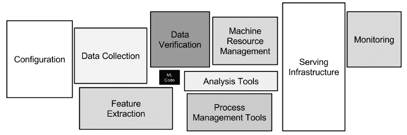
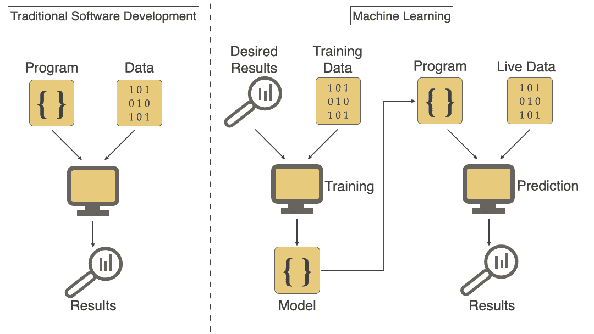
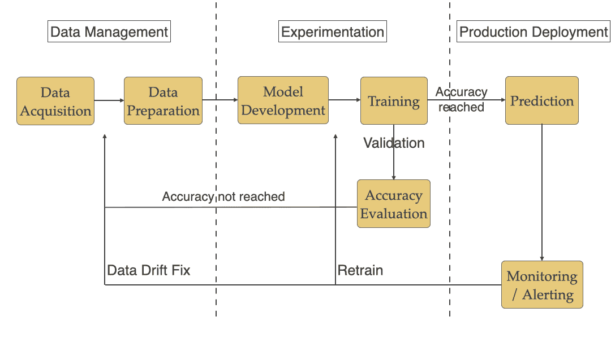

# 将机器学习模型部署到生产中的挑战

> 原文：<https://towardsdatascience.com/challenges-deploying-machine-learning-models-to-production-ded3f9009cb3?source=collection_archive---------18----------------------->

## MLOps:用于机器学习的 DevOps

# 目录

> [传统软件开发 vs 机器学习](#6e2c)
> [机器学习工作流程](#d906)
> [阶段#1:数据管理](#2987)- [大数据量](#c5cf)
> - [高质量](#fad7)
> - [数据版本化](#309d)-
> -[位置](#cdc6)-[安全性&合规性](#5858)
> [阶段#2:实验
> -](#6687) [训练时间&故障排除](#ba72)
> - [模型精度评估](#d0df)
> - [再训练](#3289)
> - [基础设施要求](#7858)
> [阶段#3:生产部署](#7d48)
> - [离线/在线预测](#a392)-[模型退化](#1ed4)
> [结论](#8156)

**机器学习(ML)** 世界的一个众所周知的事实是，将 ML 模型部署到生产中比开发它需要更长的时间。根据著名论文“[机器学习系统中隐藏的技术债务](https://papers.nips.cc/paper/5656-hidden-technical-debt-in-machine-learning-systems.pdf)”:

> “只有一小部分真实世界的 ML 系统由 ML 代码组成，如中间的小黑框所示(见下图)。所需的周边基础设施庞大而复杂。”

图表#1: **摘自论文** [**机器学习系统中隐藏的技术债务**](https://papers.nips.cc/paper/5656-hidden-technical-debt-in-machine-learning-systems.pdf)

# 传统软件开发与机器学习

如果你把传统的软件开发和机器学习放在一起考虑，你可以在下面的图 2 中清楚地看到后者的分歧。即使是这样，传统软件开发的大多数原则和实践都可以应用于机器学习，但是有一些独特的 ML 特定挑战需要以不同的方式处理。在本文中，我们将讨论那些使 ML 模型难以部署到生产中的独特挑战。

图表#2: **传统软件开发** vs **机器学习**

# 机器学习工作流

典型的 ML 工作流程包括数据管理、实验和生产部署，如下图所示。

图 3: **机器学习工作流程**

我们将了解下面的每个阶段，以及团队在每个阶段面临的特定挑战。

# 阶段#1:数据管理

训练数据是决定模型性能的基本因素之一。这一阶段通常包括数据采集和准备。使用 ML 数据时，您需要注意以下挑战:

**大数据量:**模型在训练过程中通常需要大数据集，以提高其对实时数据进行预测的准确性。数据集可能高达数百千兆字节，甚至更大。这带来了一些独特的挑战，如移动数据不容易，数据传输通常成本高昂且耗时。

**高质量数据:**如果数据质量不好，拥有一个大的数据集是没有用的。找到高质量的正确数据对于模型的准确性非常重要。从正确的来源获取数据并进行足够的验证以确保高质量有助于解决问题。确保你的模型没有基于种族、性别、年龄、收入群体等方面的偏见。也很关键。为此，你需要确保你的数据有**模型偏差和**公平性验证。

**数据集跟踪:**复制模型的训练方式对数据科学家很有帮助。为此，需要对每次训练运行中使用的数据集进行版本控制和跟踪。这也让数据科学家能够灵活地回到数据集的先前版本并对其进行分析。

**位置:**根据使用情况，这些数据集位于不同的位置，如上所述，它们可能会更大。由于这些原因，在更接近数据位置的地方运行训练和某些情况下的预测可能是有意义的，而不是跨位置传输大型数据集。

注意:*确保这是值得努力的。如果你能在不增加复杂性的情况下进行管理，并集中运行，我会推荐你这样做。*

**安全性&合规性:**在某些情况下，所使用的数据可能是敏感的，或者需要满足某些合规性标准(如 HIPAA、PCI 或 GDPR)。当你支持 ML 系统时，你需要记住这一点。

# 第二阶段:实验

这一阶段包括模型开发，数据科学家将大量时间用于研究各种架构，以了解哪些架构符合他们的需求。例如，对于语义分割，这里有各种可用的[架构](/semantic-segmentation-popular-architectures-dff0a75f39d0)。数据科学家编写代码来使用前一阶段的数据，并使用这些数据来训练模型，然后进行评估，以查看它是否符合他们所寻求的准确性标准。请参见下面您将在此阶段面临的一些挑战。

**持续的研究和实验工作流程:**他们花时间收集/生成数据，进行实验，尝试各种架构，看看什么适合他们的用例。他们还尝试[超参数优化](https://en.wikipedia.org/wiki/Hyperparameter_optimization)和用各种数据集进行训练，看看什么能给出更准确的结果。

由于其研究和实验性质，需要支持的工作流不同于传统的软件开发。

**跟踪实验:**该工作流程的一个关键方面是允许数据科学家跟踪实验，并了解各次运行之间发生了什么变化。他们应该能够轻松地跟踪不同实验之间的数据集、架构、代码和超参数变化。

**代码质量:**由于研究和实验阶段的原因，许多编写的代码通常质量不高，不能用于生产。数据科学家花费大量时间使用像 Jupyter Notebook 这样的工具，并在那里直接进行修改以进行测试。您需要记住这一点，并在将 ML 模型部署到生产之前处理它。

**训练时间&故障排除:**训练一个模型通常需要几个小时甚至几天的运行时间，并且需要特殊的基础设施(参见下面的挑战 4)。例如，根据他们的[网站](https://www.tesla.com/autopilotAI)，一个完整的特斯拉自动驾驶神经网络需要 70，000 个 GPU 小时来训练。由于培训通常需要大量时间，您需要能够在培训过程中使用**监控、日志记录、警报和验证**等方面来支持简单的故障排除。如果培训过程出错，提供简单的方法来解决问题，并继续/重新开始培训非常重要。

**模型精度评估:**训练完成后，需要对模型精度进行评估，看是否满足生产中预测所需的标准。如上面的图 3 所示，您通过训练/数据管理步骤不断提高准确度，直到达到可接受的数字。

**再培训:**当您遇到[数据漂移](https://docs.microsoft.com/en-us/azure/machine-learning/how-to-monitor-data-drift#what-is-data-drift)，生产中的错误，或者需求变更时，您可能需要对模型进行再培训。需要有一种方法来支持再培训模型。

**基础架构需求:** ML 工作负载有某些特殊的基础架构需求，如[**GPU**](https://en.wikipedia.org/wiki/Graphics_processing_unit)**&高密度内核**。数千个处理核心在一个 GPU 中同时运行，这使得训练和预测的运行速度比仅使用 CPU 要快得多。由于这些基础设施需求(尤其是 GPU)成本**高昂**，并且大多是周期性突发培训所需，因此支持弹性和自动化扩展以及供应/取消供应基础设施(尤其是在使用云时)是一个好主意。

如今，像 [Nvidia Jetson 系列](https://en.wikipedia.org/wiki/Nvidia_Jetson)这样的边缘设备(物联网、移动设备等)越来越多地被使用，部署到这些设备是另一个挑战，因为这些设备大多使用 [ARM 架构，而不是资源有限的 x86](https://stackoverflow.com/questions/14794460/how-does-the-arm-architecture-differ-from-x86) 。需要在这些设备上测试模型的准确性和性能。

由于缺乏对 ARM 架构的某些依赖项及其最新版本的支持，围绕构建包/模型的良好实践会有所帮助。

# 阶段#3:生产部署

在模型经过训练并达到一定的准确性后，它将被部署到生产中，开始根据实时数据进行预测。以下是此阶段需要注意的一些挑战。

**离线/在线预测:**根据模型及其在生产中使用实时数据的方式，您可能需要支持离线(批量)预测或在线(实时)预测。您需要一个合适的框架来为基于类型(批处理或实时)的模型提供服务。如果是批处理预测，请确保您可以适当地实时调度批处理作业，您需要担心处理时间，因为结果通常需要同步返回。

**模型退化:**由于数据漂移、环境变化等各种因素，模型在生产中退化(即预测变得不准确)。久而久之。让团队能够随时获得解决问题所需的信息是很重要的，这样他们才能采取行动。

# 结论

DevOps 原则和实践包括所有三个方面(人员、流程和技术),已被有效地用于缓解传统软件的挑战。这些相同的 DevOps 原则和实践以及一些机器学习特定实践可以用于成功部署和操作 ML 系统。这些人工智能原则和实践也被称为机器学习的 **MLOps** 或**devo PS**。我将撰写后续文章，探讨那些有助于克服本文中提到的挑战的原则和实践。

***鸣谢:*** *Priyanka Rao 和 Bobby Wagner 阅读了本文的草稿版本，并提供了反馈来改进它。*

*同时发布在* [*我的网站*](https://shahadarsh.com/2020/06/19/challenges-deploying-machine-learning-models-to-production/) *。*