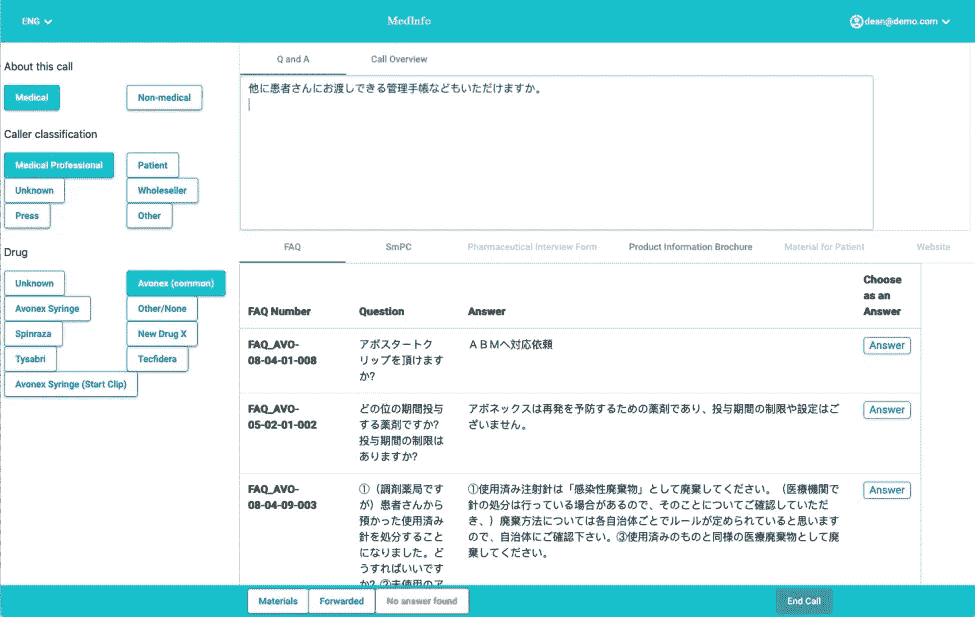

# 自然语言处理(NLP)中开发多语言语言模型的挑战

> 原文：<https://towardsdatascience.com/challenges-in-developing-multilingual-language-models-in-natural-language-processing-nlp-f3b2bed64739?source=collection_archive---------32----------------------->

## 意见

图片来自 [Lexalytics](https://www.lexalytics.com/)

为企业客户和品牌开发 NLP 解决方案的一个标志是，这些客户通常服务于语言不同的消费者。虽然我们的大多数客户都在运营以英语为主要消费群的 VoC(客户之声)、社交倾听和市场研究项目，但我们确实有一些客户服务于 20 多种语言的消费者，而且许多客户在北欧国家、拉丁美洲和亚太地区有大量业务，更不用说欧洲的其他地区了。

其他语言的 NLP 面临的挑战是[英语是互联网的语言](https://www.internetworldstats.com/stats7.htm)，说英语的用户比下一个最流行的语言普通话多近 3 亿。现代的 NLP 需要大量的文本— 16GB 到 160GB，具体取决于所讨论的算法(800 万到 8000 万页的打印文本)—由许多不同的作者在许多不同的领域编写。然后需要收集、清理这些不同的文本，并将其放入数据科学家可以访问的广泛可用的、适当注释的语料库中。最后，至少有一个由深度学习专业人士或爱好者组成的小型社区必须执行这项工作，并提供这些工具。拥有更大、更干净、更容易获得的资源的语言将会看到更高质量的人工智能系统，这将在未来产生真正的经济影响。

结果是一个语言支持的分层系统，如下所示:

1.  尖端型号通常首先支持英语，有时支持普通话。
2.  这些数据发布一段时间后，拥有许多数据科学家和语言学家的大国在本土复制了这些工作。这些国家包括德国、法国和俄罗斯。
3.  对于接下来的大约 100 种最流行的语言，通常会生成单一的多语言模型，以便一次为整个集合生成 ok 结果
4.  对于世界上的其他人来说:人工智能不理解它，这阻止了扬声器从这些新技术中受益。

**NER 的准确性和情绪分析**

业界解决多语言建模挑战的一种方法是将目标语言翻译成英语，然后执行各种 NLP 任务。如果你辛辛苦苦地用英语制作了一个情感语料库，很容易把所有东西都翻译成英语，而不是用其他语言重复这个任务。

然而，确定情感是翻译创造性过程的一部分。理解“五十步笑百步”是在表达否定，然后想出用另一种语言表达这一想法的相应方式，需要理解两种语言中的情感。我们也使用在其他语言中没有直接对应的文化速记和惯例。翻译一个单词通常有多种选择。西班牙语中的“pequeñ”是“little”吗？还是“微不足道”？还是“矮小”？或者甚至是“可爱”？

如果你的模型足够好，能够在翻译时捕捉到细微差别，那么它们也足够好，能够执行最初的任务。但更有可能的是，他们不能捕捉细微差别，你的翻译将不会反映原始文件的情绪。事实性的任务，比如回答问题，更适合翻译。需要更多细微差别的主题(预测模型、情感、情绪检测、总结)在外语中更容易失败。

**多语言自然语言处理的未来**

为了追求最高的准确性，非英语语言很少被训练。开源世界中一个有希望的解决方案是 Google 的 BERT，它提供了一种英语和一个适用于大约 100 种其他语言的“多语言模型”。人们现在为其他语言提供了经过训练的 BERT 模型，并看到了有意义的改进(例如，NER 的 F1 为 0.928 比 0.906)。然而，在我们自己的工作中，例如，我们已经看到通过 BERT 处理英文医学文本的效果明显好于日文。很可能在日文版的 BERT 中没有足够的关于特殊领域的内容，但是我们希望随着时间的推移会有所改善。

创建和维护自然语言特性是一项繁重的工作，而且必须在新的母语人士的帮助下一遍又一遍地重复这项工作，这是一项令人生畏的任务。专注于几门特别重要的语言，让它们为世界说话，这很有诱惑力。然而，世界并不是同质的。一家公司在各个国家可能会有特定的问题和机会，讲不太通用语言的人不太可能通过任何渠道听到他们的声音，而不仅仅是数字渠道。

因此，尽可能仔细地倾听他们所服务的每一种语言符合企业的利益，也符合大学、政府和公民科学家的利益，有助于创建文本语料库和模型，以促进他们的语言同胞在现在和未来获得尖端技术。