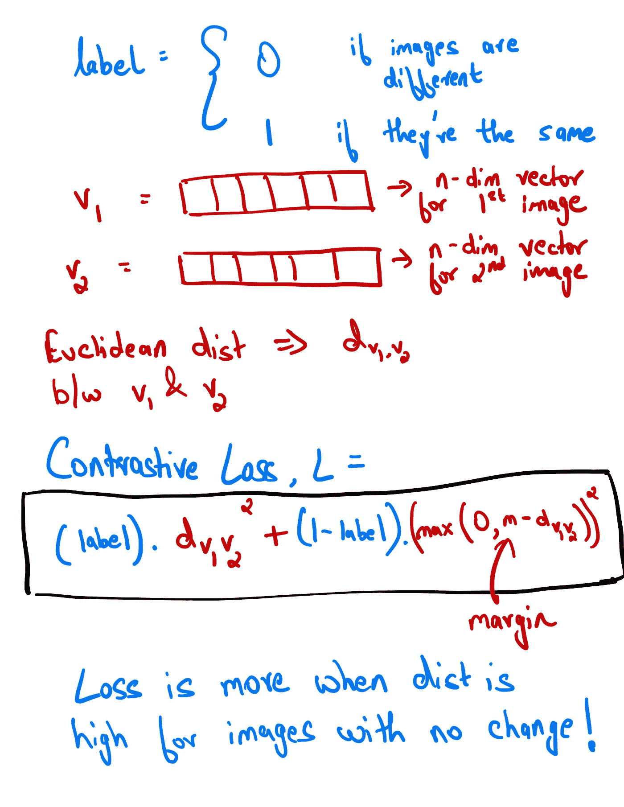
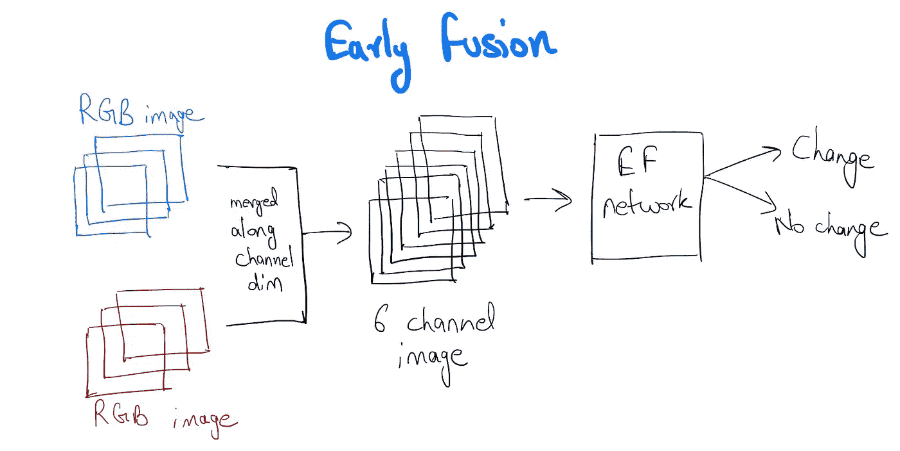

# 使用暹罗网络的变化检测

> 原文：<https://towardsdatascience.com/change-detection-using-siamese-networks-fc2935fff82?source=collection_archive---------29----------------------->

## 在 CNN 的帮助下，你如何衡量变化

所有的事情都会随着时间而变化，能够理解和量化这种变化会非常有用。例如，观察一个城市或城镇多年来的基础设施变化可以帮助衡量它的经济繁荣程度，面部变化可以揭示你是否变老得太快，签名变化可以检测欺诈活动，皮肤纹理和颜色的变化也可以告诉你是否开始患上像痤疮这样的轻度皮肤病，捕捉历史遗迹的时间戳图像可以揭示它们随着时间推移而产生的裂缝。很明显，测量这种变化的方法很有价值，这将是这篇文章的内容。

资料来源:联合国人类住区规划署

在深入技术细节之前，让我们试着更好地理解和阐述这个问题(这将有助于我们以后以更可量化的形式评估我们的模型)。你认为为观察变化而建立的系统的理想特性是什么？

## 1.检测相关变化，忽略其他变化

重要的是，任何模型都善于忽略与我们的用例不相关的变化，并且只检测我们感兴趣的变化。对于检测建筑物随时间的变化，它可能涉及忽略道路、树木和水体的变化，对于检测衰老，其他面部变化如晒黑或新的无关斑点/痣并不重要。

## 2.足够健壮以考虑稍微不同的方向/照明条件

这更多的是一个数据标准化问题，因为随着时间的推移捕获的图像会有差异，这将很难一直得到关注。如果面部图像是用智能手机拍摄的，那么光线和方向条件将会完全不同。同样，使用卫星拍摄的图像可能容易受到云层变化、阳光反射以及卫星自身方位角和仰角变化的影响。

## 3.模块化

这个标准基本上将建模技术分为两类，一类是您可以从模型中分离出组件，另一类是您不能。允许您在某种程度上隔离模型管道的不同部分的技术是非常优越的，因为您可以使用其他人已经构建的预构建部分并将其合并在一起(为什么要像他们所说的那样重新发明轮子)。当我们谈到早期的融合网络以及它们与暹罗网络的比较时，这一点会变得更加清楚。

基于这些标准，测量变化的最简单和最容易的方法，即使用逐元素的像素差异，就不存在了。也有更智能的方法来做这件事，但是结果仍然很差，也不是很健壮。暹罗网络来救援！

# 暹罗网络

一个连体神经网络将两幅图像作为输入(在两个不同的时间戳捕获)，使其通过一系列卷积层，以获得两幅图像的高阶特征向量，然后使用欧几里德范数比较这些向量，以测量变化。这个想法是，没有相关变化的两幅图像将在特征向量的维度空间中产生相似的向量。

值得注意的是，两幅图像在特征提取阶段都经过完全相同的网络。

检测基础设施变化的暹罗网络(来源:[https://www.mdpi.com/2072-4292/11/11/1292](https://www.mdpi.com/2072-4292/11/11/1292)

让我们看看这种类型的模型如何在训练阶段调整权重。

# 对比损失

对比损失函数用于训练暹罗网络。如果没有变化，它试图最小化两个特征向量之间的距离，反之亦然。下面的图像试图在两类分类的情况下解释它。

对比损失(作者图片)

让我们快速直观地看一下这个。如果两幅图像都没有包含我们正在训练的变化，那么实际的**标签**将会是 1。如果模型权重不正确，向量 *v1* 和 *v2* 之间的**距离**会很大。将这两个因素代入公式，我们得到损耗 **L** 的**高**值。反向传播开始起作用，为了减少损失，它调整权重，使得向量之间的距离小于之前的距离(对于这组特定的图像)。引入余量 m 是为了推动网络为变化的图像产生更多独立的特征。

# 早期融合网络

还有一类非常相似的架构，它们在变化检测方面很流行，被称为**早期融合** (EF)网络。它包括首先沿通道轴组合两个输入。因此，如果我们处理 RGB 图像，输入将是一个 6 维矩阵。这一次它将通过一个单一的前馈网络，而不是暹罗网络中的两个平行网络。

早期融合网络(尽可能简单)(图片由作者提供)

早期融合网络的最大问题是缺乏模块化。对于暹罗网络，您可以根据领域将预训练的网络用作用例的特征提取器，这在您没有大量数据时非常有用。

比方说，你想观察某个地区的建筑在 5 年前当地政府决定投入巨资建设企业园区和购物中心后的变化。因此，在投资之前，您有包含建筑物的注释数据，一旦它们完全建成。如果我们要使用的模型也可以使用来自其他广义的和各种各样的建筑物足迹数据集的知识，这将会好得多，这些数据集由来自世界各地城市的图像的瓦片和瓦片组成。

> 暹罗网络支持迁移学习的能力是迄今为止它优于其他方法的最大原因。

正如他们所说，变化是唯一不变的。正是这种变化，当具体评估时，可以产生非常重要的见解。

# 参考

1.  [杨展](https://www.semanticscholar.org/author/Yang-Zhan/32290344)，[付昆](https://www.semanticscholar.org/author/Kun-Fu/2266415)，基于深暹卷积网络的光学航空影像变化检测(2017):[https://www . semantic scholar . org/paper/Change-Detection-Based-on-Deep-Siamese-Network-for-Zhan-Fu/b 702 cf 22 AFB 725 B1 BF 9d 633 ffdd 96 CFB 00 a 87253](https://www.semanticscholar.org/paper/Change-Detection-Based-on-Deep-Siamese-Network-for-Zhan-Fu/b702cf22afb725b1bf9d633ffdd96cfb00a87253)
2.  天宇宋、Pytorch 执行:暹罗网(2017):[https://Tianyu Song . com/2017/11/16/py torch-Implementation-Siamese-Network/](https://tianyusong.com/projects/pytorch-implementation%e2%80%8b-siamese-network/)
3.  Mathew D. Li，，等，用于医学影像中连续疾病严重度评估和变化检测的连体神经网络(2020):
4.  罗德里戈·卡耶·道特，贝特朗·勒·索克斯，利用卷积神经网络进行多光谱地球观测的城市变化检测(2018 年):[https://www . ground ai . com/project/Urban-Change-Detection-for-multiple-multiple-Earth-Observation-Using-convolutionary-Neural-Networks](https://www.groundai.com/project/urban-change-detection-for-multispectral-earth-observation-using-convolutional-neural-networks)
5.  李攀方博，使用双时 VHR 光学遥感图像进行变化检测的基于双重学习的连体框架(2019):[https://www.mdpi.com/2072-4292/11/11/1292](https://www.mdpi.com/2072-4292/11/11/1292)