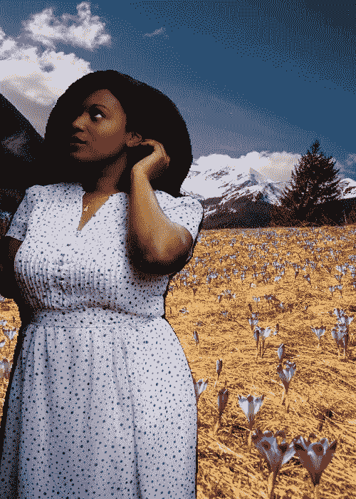

# 用 5 行代码改变任何图像的背景

> 原文：<https://towardsdatascience.com/change-the-background-of-any-image-with-5-lines-of-code-23a0ef10ce9a?source=collection_archive---------8----------------------->

## 使用 PixelLib 对任何带有图片的图像进行模糊、着色、灰度处理和背景更改


作者照片拼贴

图像分割有很多惊人的应用，可以解决不同的计算机视觉问题。PixelLib 是一个库，旨在确保在实际应用中轻松集成图像分割。PixelLib 现在支持一种称为*图像调谐的功能。*

**图像调优**:通过图像分割改变图像的背景。图像分割的关键作用是从图像中去除分割出的对象，并将它们放置在新创建的背景中。这是通过为图像生成一个遮罩并将其与修改后的背景相结合来实现的。我们使用在 pascalvoc 数据集上训练的 deeplabv3+模型。该模型支持 20 种常见的对象类别，这意味着您可以更改图像中这些对象的背景。

该模型支持下列对象:

```
person,bus,car,aeroplane, bicycle, ,motorbike,bird, boat, bottle,  cat, chair, cow, dinningtable, dog, horse pottedplant, sheep, sofa, train, tv
```

*支持的背景效果有:*

**1** 用图片改变图像的背景

**2** 给图像的背景赋予不同的颜色。

**3** 模糊图像的背景

**4** 对图像背景进行灰度处理

安装 PixelLib 及其依赖项:

安装 Tensorflow 与:(PixelLib 支持 tensorflow 2.0 及以上版本)

*   *pip3 安装 tensorflow*

安装 PixelLib 与

*   pip3 安装 pixellib

如果已安装，请使用以下工具升级至最新版本:

*   pip3 安装 pixellib —升级

## **用图片改变图像的背景**

PixelLib 只需 5 行代码就可以改变任何图片的背景。

***sample.jpg***


来源:[Unsplash.com，作者雷根·布莱克伍](https://unsplash.com/photos/nRVMVZvy6mo)

我们想用下面提供的图片来改变上面图片的背景。

***background.jpg***


来源:[Unsplash.com，作者:达维德·扎维拉](https://unsplash.com/photos/9P2-bzjvIHk)

*用图片改变图片背景的代码*

```
import pixellibfrom pixellib.tune_bg import alter_bgchange_bg = alter_bg()
```

我们导入了 pixellib，并从 pixellib 导入了类 *alter_bg* 。我们创建了该类的一个实例。

```
change_bg.load_pascalvoc_model("deeplabv3_xception_tf_dim_ordering_tf_kernels.h5")
```

我们加载了 deeplabv3+模型。从[这里](https://github.com/ayoolaolafenwa/PixelLib/releases/download/1.1/deeplabv3_xception_tf_dim_ordering_tf_kernels.h5)下载 deeplabv3+ pascalvoc 模型。

```
change_bg.change_bg_img(f_image_path = "sample.jpg",b_image_path = "background.jpg", output_image_name="new_img.jpg")
```

我们调用了函数 *change_bg_img* 来改变图片的背景。

该函数采用以下参数:

*f_image_path* :这是前景图像，背景将被改变的图像。

*b_image_path* :这是将用于改变前景图像背景的图像。

*output_image_name* :背景改变后的新图像。

***输出图像***



> 哇！这是美丽的，我们已经成功地取代了我们的图像背景。

我们能够使用 PixelLib 通过图像分割执行出色的前景和背景减法。

*获得改变后的图像数组的输出数组的代码*

对于特殊用途，您可以通过修改下面的代码轻松获得更改图像的数组。

## **给图像的背景分配不同的颜色**

您可以为图像的背景指定不同的颜色，就像您可以用图片更改图像的背景一样。这也可以通过五行代码来实现。

*为图像背景分配不同颜色的代码*

它非常类似于上面使用的用图片改变图像背景的代码。唯一不同的是，我们把函数 *change_bg_img* 换成了处理颜色变化的函数 *color_bg* 。

```
change_bg.color_bg("sample.jpg", colors = (0, 128, 0), output_image_name="colored_bg.jpg")
```

函数 *color_bg* 采用参数 *colors* ，我们提供想要使用的颜色的 RGB 值。我们希望图像有一个绿色的背景，颜色的 RGB 值设置为绿色，即 *(0，128，0)* 。

***绿色背景***


**注意:**通过提供颜色**的 RGB 值，您可以将任何颜色分配给图像的背景。**

```
change_bg.color_bg("sample.jpg", colors = (255, 255, 255), output_image_name="colored_bg.jpg")
```

我们希望将图像的背景更改为白色，并将颜色的 RGB 值设置为白色，即 255，255，255。

***白色背景***


白色背景的相同图像。

*获取彩色图像输出数组的代码*

对于特殊用途，您可以通过修改下面的代码轻松获得更改图像的数组。

## **灰度图像的背景**

使用与 PixelLib 相同的代码行对任何图像的背景进行灰度化。

*对图像背景进行灰度编码*

```
change_bg.gray_bg(“sample.jpg”,output_image_name=”gray_img.jpg”)
```

这仍然是相同的代码，除了我们调用函数 *gray_bg* 来灰度化图像的背景。

***输出图像***


**注意:**图像的背景会被改变，出现的物体会保持它们原来的质量。

*获取灰显图像输出数组的代码*

## **模糊图像背景**

您可以应用模糊图像背景的效果，并且可以控制背景的模糊程度。

***sample2.jpg***

**

*来源:【Unsplash.com·作者:艾蕾拉·霍瓦特*

```
*change_bg.blur_bg("sample2.jpg", low = True, output_image_name="blur_img.jpg")*
```

*我们调用了函数 *blur_bg* 来模糊图像的背景，并将模糊效果设置为低。有三个参数决定背景模糊的程度。*

**低:*设置为 true 时，背景略有模糊。*

**中度:*设置为 true 时，背景中度模糊。*

**极端:*设置为 true 时，背景深度模糊。*

**

*图像模糊，效果不佳。*

```
*change_bg.blur_bg("sample2.jpg", moderate = True, output_image_name="blur_img.jpg")*
```

*我们希望适度模糊图像的背景，我们将*适度*设置为*真实*。*

**

*图像的背景模糊，效果中等。*

```
*change_bg.blur_bg("sample2.jpg", extreme = True, output_image_name="blur_img.jpg")*
```

*我们想要对图像的背景进行深度模糊处理，我们将*极端*设置为*真实*。*

**

*图像的背景非常模糊。*

**模糊图像背景的完整代码**

**获得模糊图像输出数组的代码**

***注意:**在 [PixelLib 的 github 的存储库](https://github.com/ayoolaolafenwa/PixelLib)和 [PixelLib 的文档中学习如何将这些背景效果应用到视频和摄像机的馈送中。我将很快发表一篇关于如何将这些背景效果应用到视频和相机馈送的说明性文章。](https://pixellib.readthedocs.io/en/latest/)*

*通过以下方式联系我:*

*电子邮件:[olafenwaayoola@gmail.com](https://mail.google.com/mail/u/0/#inbox)*

*Linkedin: [阿尤拉·奥拉芬娃](https://www.linkedin.com/in/ayoola-olafenwa-003b901a9/)*

*推特: [@AyoolaOlafenwa](https://twitter.com/AyoolaOlafenwa)*

*脸书:[阿尤拉·奥拉芬娃](https://web.facebook.com/ayofen)*

*查看这些关于如何利用 PixelLib 对图像和视频中的对象进行语义和实例分割的文章。*

*[](/image-segmentation-with-six-lines-0f-code-acb870a462e8) [## 用 5 行代码实现图像分割

### 用 PixelLib 进行语义和实例分割。

towardsdatascience.com](/image-segmentation-with-six-lines-0f-code-acb870a462e8) [](/video-segmentation-with-5-lines-of-code-87f798afb93) [## 用 5 行代码实现视频分割

### 视频的语义和实例分割。

towardsdatascience.com](/video-segmentation-with-5-lines-of-code-87f798afb93) [](/semantic-segmentation-of-150-classes-of-objects-with-5-lines-of-code-7f244fa96b6c) [## 用 5 行代码对 150 类对象进行语义分割

### 用 PixelLib 对 150 类对象进行语义分割

towardsdatascience.com](/semantic-segmentation-of-150-classes-of-objects-with-5-lines-of-code-7f244fa96b6c) [](/custom-instance-segmentation-training-with-7-lines-of-code-ff340851e99b) [## 用 7 行代码进行自定义实例分段训练。

### 用 7 行代码训练您的数据集，以实现实例分割和对象检测。

towardsdatascience.com](/custom-instance-segmentation-training-with-7-lines-of-code-ff340851e99b)*