# 疫情前 6 个月的静息生理学、睡眠、训练和感知压力的变化

> 原文：<https://towardsdatascience.com/changes-in-resting-physiology-sleep-training-and-perceived-stress-during-the-first-6-months-of-a1682f75349c?source=collection_archive---------20----------------------->

## [实践教程](https://towardsdatascience.com/tagged/hands-on-tutorials)

## HRV 4 培训用户分析

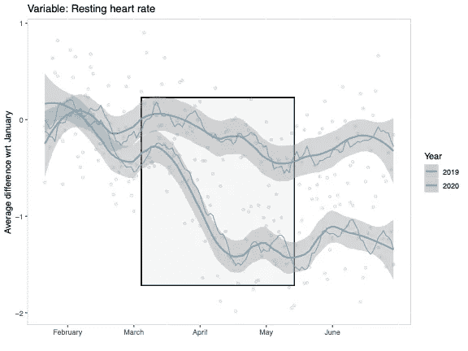

一年前 6 个月的静息心率变化。2020 年的数据显示，随着许多欧洲国家开始封锁，静息心率将下降。静息心率一直被抑制到 7 月。灰色部分，可以看到与 2019 年数据的对比。作者图片

上周我在 Twitter 上做了一个[调查，是看到上面的数据引发的:**在分析 HRV 4 训练数据时，在疫情**的前 6 个月降低了静息心率。数据显示的趋势与我们大多数人的预期相反:](https://twitter.com/altini_marco/status/1325439726845833216)

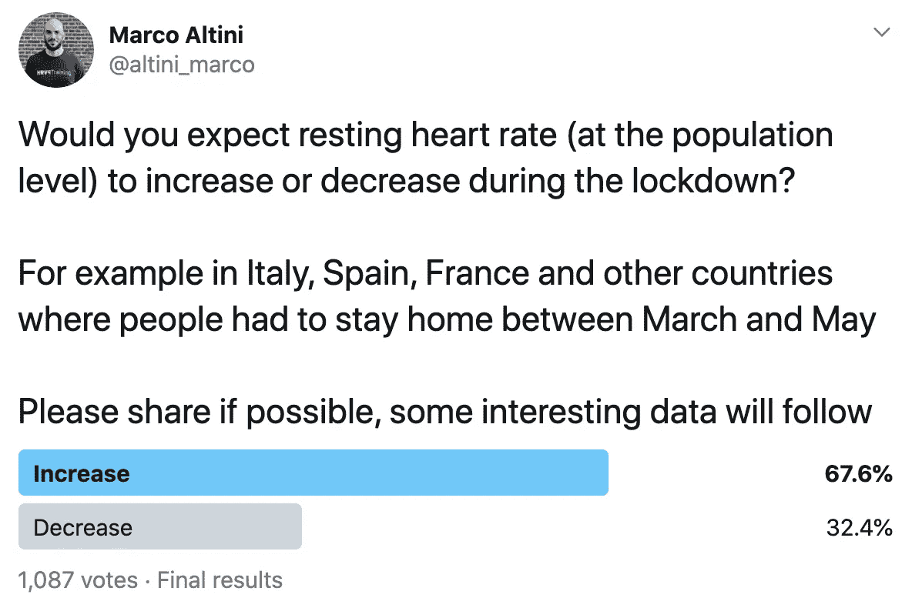

[没那么快](https://twitter.com/altini_marco/status/1325439726845833216)。作者图片

在这篇文章中，我将更详细地回顾这些数据，包括在疫情的前 6 个月中休息生理、睡眠、训练和感知压力的变化。

# 数据集

在此分析中，我将选择加入研究的 [HRV4Training](https://www.hrv4training.com/) 用户和以下国家/地区(我们的大多数用户在这些国家/地区):澳大利亚、比利时、巴西、加拿大、法国、德国、意大利、西班牙、南非、荷兰、英国和美国。总的来说，我可以包括大约 5500 人，平均每人每天测量 3 个月，总共将近 50 万次测量。利用[HRV 4 训练](https://www.hrv4training.com/)收集早晨的静息生理测量值，使用相机版本或外部传感器，通过将应用程序链接到 Strava 或 TrainingPeaks 来收集训练数据，同时使用应用程序中的问卷来收集主观数据。

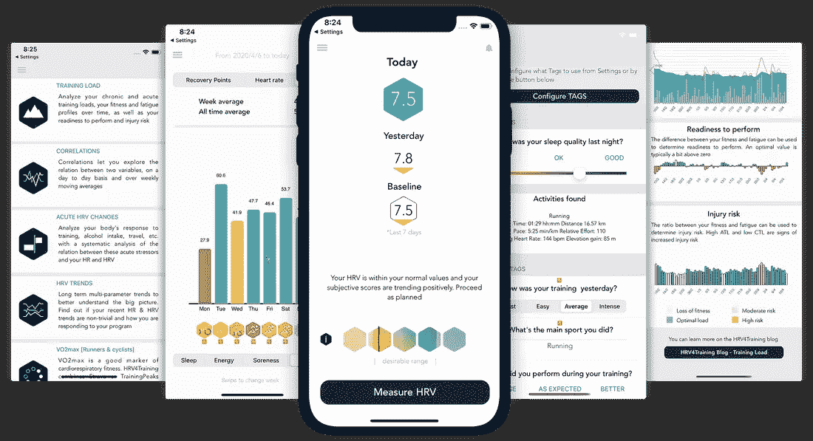

[HRV4Training](https://www.hrv4training.com/) 是唯一一款经过[验证的](https://www.researchgate.net/publication/315059917_Comparison_of_Heart_Rate_Variability_Recording_With_Smart_Phone_Photoplethysmographic_Polar_H7_Chest_Strap_and_Electrocardiogram_Methods)应用，支持基于摄像头的心率变异性(HRV)测量。作者图片

不用说，**这是人口**的一个特殊样本:活跃的、有健康意识的个人，他们有足够的动力每天早上测量他们的生理状况。因此，这篇文章中显示的内容仅代表该示例，可能不适用于其他示例。

> 然而，上面的调查以及使用我们平台的大多数人(包括我在内)预期相反的情况(例如在锁定期间心率加快)的事实，使其成为一个有趣的分析

# 静息心率的变化

让我们从最初的图表开始。在下图中，我展示了在欧洲第一次停搏开始后静息心率是如何降低的。我还增加了 2019 年的心率，这种比较更容易排除季节变化等因素，并强调 3 月至 6 月期间静息心率的降低:

作者图片

# 背后会有什么呢？

在这一点上，我们可以提出各种理论。例如，许多人指出体育活动是如何发挥作用的。

> 由于封锁或一般来说较少的户外训练机会，人们可能训练得更少(我们稍后会看到事实并非如此)，或者可能花更多的时间做低强度运动(也不正确)

虽然确实没有比赛可做，但我有点怀疑静息心率的降低可能与已经训练有素的人的训练有关(而且是在这么短的时间内)。

另一方面，我们谈论的是那些**可能经常出差，并且总体上可能有点过度劳累的个人**(这也可能促使我们寻找一款帮助量化和管理压力的应用)。让我们更深入地研究一下。

# 旅行和睡眠

正如我们在这里看到的，旅游受到疫情的严重影响并不奇怪:

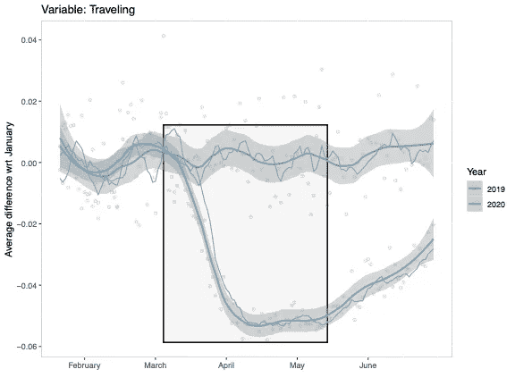

任意单位，旅行在应用程序中被记录为是/否，在这里我们看到报告旅行的个人百分比，我们可以看到直线下降，然后在波浪之间再次开始攀升，正如预期的那样。作者图片

同样，**随着许多人开始远程工作，睡眠时间变长了，这显然与疫情**有关，与前一年的比较显示:

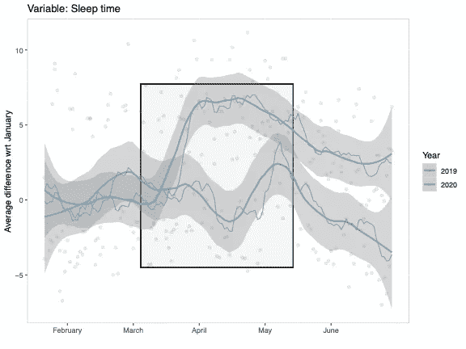

睡眠时间的变化。我们可以看到 5 月和 7 月之间的季节性下降，但也可以看到大流行前和大流行后值之间的明显差异。作者图片

当我们包括许多国家时，情况会变得有些混乱(这里我绘制了每个国家一月份随时间变化的差异，以便它们或多或少处于同一水平)。我们可以看到 3 月中旬以及 2019 年和 2020 年的“周末”左右的跳跃，睡眠时间明显增加:

作者图片

> 旅行和睡眠时间似乎是静息心率变化背后的两个主要因素，特别是因为这些变化都是长期的(静息心率在 6 月份仍然受到抑制，类似地，仍然很少旅行和更长的睡眠时间)

我们将在下面看到其他变量，特别是主观变量，有一个更短暂的过程，并很快重新规范化。

# 培训呢？

正如我前面提到的，训练和/或体能的变化也可能是静息心率变化的原因。然而，从数据来看，这一理论似乎并不成立。例如，训练时间并没有真正减少(我自己也买了一台跑步机，我记得我的很多朋友也买了一台跑步机，或者找了一位室内自行车教练，有趣的是，这似乎证实了“积极性高的人无论如何都会训练”)。

下面是一些数据，**三月初训练时间降低一点，然后再归一化**。一旦封锁解除，我们可以发现的是明显的增长(例如在意大利、法国和西班牙):

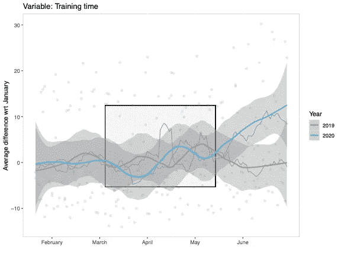

作者图片

就训练强度而言，似乎强度的降低或在较低强度下花费更多时间并不是心率降低的真正原因，因为训练 RPE 比前一年高了很多。然而，**我们再一次看到先是一个小幅度的减少**，接着是一个大幅度的增加:

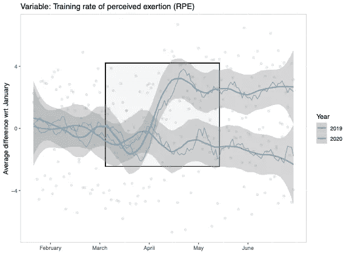

作者图片

当查看骑自行车者的平均锻炼瓦特时，也可以看到类似的模式(此处未显示)。

让我们看看一些额外的参数，例如，自我报告的疲劳和压力。

# 我们感觉如何？

让我们从与训练相关的事情开始:疲劳。在应用程序中，我们将疲劳报告为“身体”疲劳，而不是“精神”疲劳。我们可以在下面的数据**中看到一个类似于我们刚刚看到的三月底左右的训练数据的模式，有一个最初的下降**(可能是由于训练时间和强度的短暂减少)。然而，**自我报告的疲劳似乎不会随着负荷的增加而增加**，并且很快恢复正常:

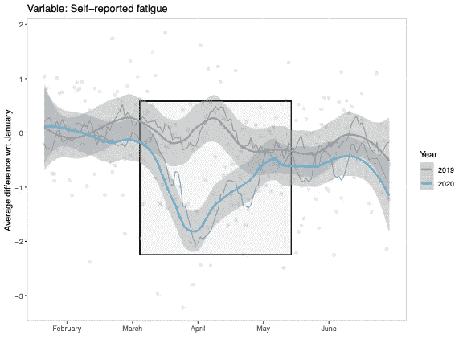

作者图片

# **自我报告的压力呢？**

以下是应用程序中报告的内容:

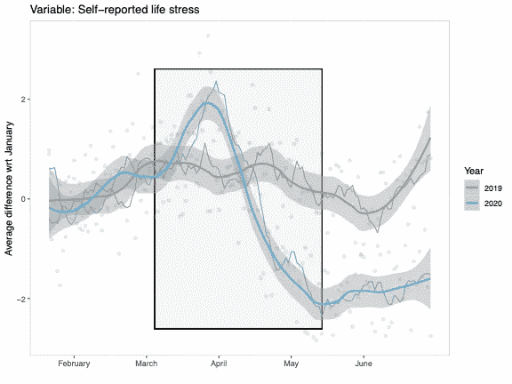

作者图片

> 在我看来，这是最有趣的图表。我们可以看到在压力下有一个初始峰值，疫情显然是一个值得严重关注的原因。然而，过了一段时间后，其他因素可能会发挥作用:睡眠时间增加的影响，减少旅行等。—这导致自我报告的压力水平比 2019 年低得多

请注意，相对于 2019 年，2020 年 1 月和 3 月之间没有变化，突出显示了此处显示的变化如何最有可能与疫情相关联。

# 心率变异性(HRV)

最后，由于[我的工作](https://www.marcoaltini.com/blog)通常专注于生理压力和心率变异性(HRV)，让我们也来看看这些数据。

总的来说，我总是建议不要做我将要做的事情:在人、群体或不同时期之间比较 HRV。我坚信 **HRV 是捕捉个人压力变化的有效工具，这样我们就可以收集客观反馈并实施日常调整，以更好地管理压力**，而不仅仅是比较群体。

这与静息心率不同(在我看来)，这种差异可以以最简单的形式看到，静息 [HR 是最大摄氧量的良好预测指标，而 HRV 不是](https://www.hrv4training.com/blog/vo2max-estimation-non-exercise-data-resting-heart-rate-hrv-sub-maximal-heart-rate-whats-the-difference)。HRV 是关于持续反馈和压力管理的。题外话说够了，如果你刚到 HRV，并且对这个话题感兴趣，请查看[这个案例研究列表](https://medium.com/@altini_marco/the-ultimate-guide-to-heart-rate-variability-hrv-part-3-5fe902f3d2b3)或这个[网络研讨会](https://www.hrv4training.com/blog/webinar-for-the-spanish-paralympic-committee)。

话虽如此，但不可否认的是**当我们观察人群的宏观差异时**在群体水平上存在着联系(例如久坐者的 HRV 较低，随着年龄的增长而下降，所有我在这里展示的)。一场影响遍及全球的重大破坏(疫情)，显然符合可能以类似方式对许多人的生理产生巨大影响的条件。让我们看看同一时间段的 HRV 数据:

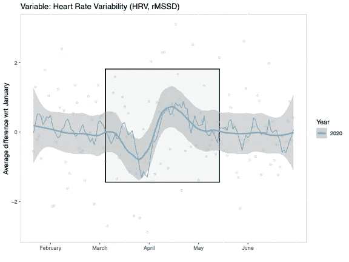

作者图片

虽然这里的变化很小，但似乎在 3 月和 5 月之间，我们可以发现以下情况:

> 首先，随着疫情的开始，我们可以看到 HRV 的下降，每个人都对正在发生的事情和我们周围的许多未知感到非常紧张
> 
> 然后，随着其他一些变化的出现(睡眠增加，旅行减少，压力减轻)，我们也可以看到 HRV 的增加

在这两个事件之外，这条线相当平坦，正如我们所预期的那样，这是一个压力的标志(许多因素在起作用，这里我们对数千人进行了平均，所以再次强调，除非发生了非常大的事情，否则数据中应该没有亮点，类似于 2019 年我们自我报告的疲劳或压力)。

# 包裹

在上面的 9 张图中，我展示了在疫情的前 6 个月中，休息生理、睡眠、训练和感知压力的**变化。**

虽然**巨大、严重的压力毫无疑问是今年大部分时间的特点**(可以在上面的一些图表中以 HRV 下降或自我报告的指标看到)**但从客观数据**(旅行、睡眠、生理)**和自我报告的压力水平也可以清楚地看出，我们生活方式的一些变化已经导致了可能意想不到的积极结果**(睡眠时间增加，静息心率降低)。

同样，虽然我们在这里分析了一个相当大的样本(5500 人)，但这些关系是特定于这个人群的，不一定适用于其他人。

我希望你已经发现写起来信息量大，保重！

[Marco](https://www.marcoaltini.com/?source=post_page---------------------------) 拥有应用机器学习的优等博士学位、计算机科学工程的优等硕士学位以及人类运动科学和高性能教练的优等硕士学位。

他[已经发表了](https://www.researchgate.net/profile/Marco_Altini?source=post_page---------------------------)50 多篇论文和专利，涉及生理学、健康、技术和人类表现的交叉领域。

他是 [HRV4Training](https://www.hrv4training.com/) 和[爱跑步](https://www.strava.com/athletes/12073735?source=post_page---------------------------)的联合创始人。

推特: [@altini_marco](https://twitter.com/altini_marco)

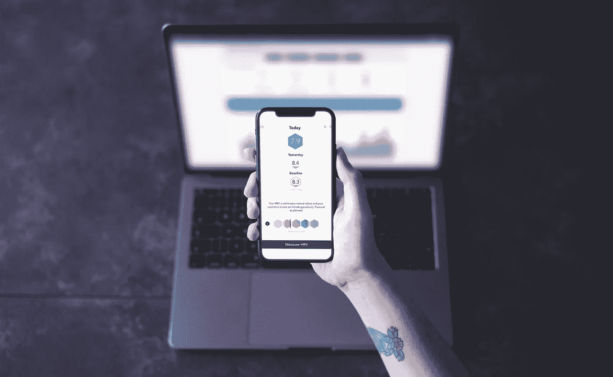

[HRV 4 训练新手？](https://www.hrv4training.com/)