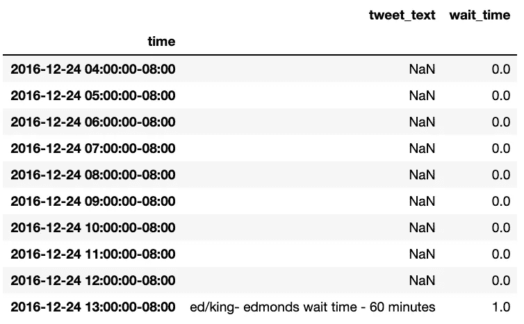

# 更改 Pandas 中时间数据的频率(精度)

> 原文：<https://towardsdatascience.com/changing-the-frequency-precision-of-time-data-in-pandas-5f5882671c7f?source=collection_archive---------24----------------------->

## 使用 Pandas 的 resample()方法调整时间特征


华盛顿州渡口。布莱恩·汉森在 [Unsplash](https://unsplash.com?utm_source=medium&utm_medium=referral) 上的照片

今天，我们将获取华盛顿州渡轮等待公告(带有精确时间戳的推文)，并将它们转换为完整的逐小时数据集。我看到了堆栈溢出周围浮动的一些其他建议，但`pandas` `resample()`似乎是我的任务的一个优雅的工具。

# 数据

到目前为止，我有描述等待时间的推文、这些公告的时间戳以及提取的等待时间:


带有 index、tweet_text、time 和 wait_time 的数据表头。

# 目标

我想扩展这个信息，这样就有一个每小时渡轮运行的记录，以及当时等待的小时数。在这种情况下，等待时间警报会一直存在，直到更新不再有延长等待。


带有每小时数据的扩展数据框。

# 熊猫。重新取样()

在调整了时区并添加了一天的开始等待重置之后，我需要得到上面的结果

```
df = df.resample('1H').ffill()
```

让我们来看看这些部分:

首先，`*DataFrame.*resample()`改变时间序列数据的频率。参见完整文档[此处](https://pandas.pydata.org/pandas-docs/stable/reference/api/pandas.DataFrame.resample.html)。因此，您可以将与时间段相关的数据转换为您想要的任何级别。它使用参数`on='col_name'`处理 DatetimeIndex 字段或任何类似 datetime 的列。

其次，我们指出我们想要对非时间数据使用什么策略。在这种情况下，`ffill()`是完美的——它从最后一个已知值向前填充所有数据点。或者，您可以使用各种策略，包括 sum、min、max、mean、median、first、last、std、bfill(反向填充)等。

# 结果呢

在几行代码中，我能够得到我需要的东西:



最终数据表头。

你可以在这个 [GitHub repo](https://github.com/allisonhonold/datetime_resample_blog) 上找到完整的代码。更多关于熊猫的日期时间数据，请查看他们的[时间序列/日期用户指南](https://pandas.pydata.org/pandas-docs/stable/user_guide/timeseries.html)。编码快乐！


马特·弗洛雷斯在 [Unsplash](https://unsplash.com?utm_source=medium&utm_medium=referral) 上拍摄的照片