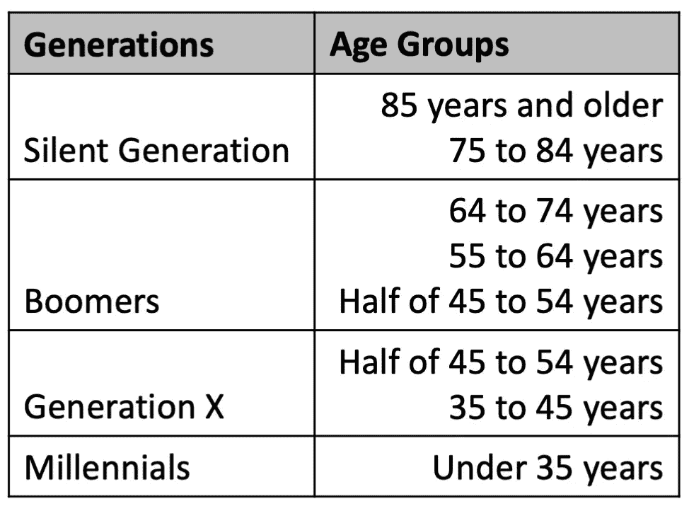

# 可视化美国住房市场人口统计

> 原文：<https://towardsdatascience.com/changing-us-housing-markets-demographics-34d9b0c71cb4?source=collection_archive---------55----------------------->

## 使用 Seaborn 和赛璐珞的人口金字塔动画


斯科特·韦伯在 [Unsplash](https://unsplash.com?utm_source=medium&utm_medium=referral) 上拍摄的照片

2008 年美国房地产市场崩盘的影响仍在实体经济中蔓延。许多 X 一代和千禧一代看到他们积累的资产消失了。那些即将退休或已经退休的人目睹了他们最信任的资产之一——他们的财产——从悬崖上掉了下来。在所有年龄组中，人们都遭遇了经济困难。那些有能力购买新房产或保留自有资产的人，在过去 10 年里看到了巨大的收益，不仅恢复到了危机前的高位，而且在一些地区价值翻了一倍甚至两倍。与此同时，一场完美的债务风暴、收入尚可的早期职业工作越来越少，以及生活成本的上升，改变了许多人拥有住房的前景。[最近的一项分析发现，52%的 18-29 岁年轻人与父母住在一起](https://www.pewresearch.org/fact-tank/2020/09/04/a-majority-of-young-adults-in-the-u-s-live-with-their-parents-for-the-first-time-since-the-great-depression/)，这可能部分归因于高等教育的偏远、远程工作的持续增加以及不同行业的大规模裁员。在这篇文章中，我将展示 2010 年至 2018 年期间，不同年龄组和不同年龄段的业主入住率和租房率的变化。这些数据可以从美国社区调查中公开获得。所有使用的脚本和数据都可以在项目 [GitHub](https://github.com/Datadolittle/Housing) 上获得。这个项目是对我之前关于就地老化的推测的跟进。

[](https://medium.com/swlh/age-in-place-a-major-disruption-to-the-housing-market-flow-a3fe7a75d14f) [## 年龄到位:对住房市场流动的重大干扰

### 在冠状病毒疫情的影响下，就地养老的决定对那些准备退休或…

medium.com](https://medium.com/swlh/age-in-place-a-major-disruption-to-the-housing-market-flow-a3fe7a75d14f) 

## **数据**

原始数据是业主入住和租赁时间的百分比值的汇编，按年龄人口统计分开。在这项研究中，我们探讨了百分比随时间的变化以及按世代类别的变化。这四个世代类别是沉默的一代、婴儿潮一代、X 一代和千禧一代。



将年龄组分成几代。图片作者。

## **动画**

为了制作动画，赛璐珞被用来记录多个[海波恩](https://seaborn.pydata.org/)的情节。赛璐珞可以使用 pip 安装在 Python 中。

```
pip install celluloid
```

简单地说，我们拍下一个 for 循环中生成的每个图。在循环之后，我们将这些图像拼接成视频或 gif。

```
## Open the camera lens
fig = plt.figure()
camera = Camera(fig)## Start the photoshoot
for i in range(9): 
   ## Build graphs here
   ... ## Take the shot
   camera.snap()## Make the movie
animation = camera.animate(interval=500)
animation.save('animation_housing.gif', writer = 'pillow')
```

## **结果**

动画程序的输出。作者制作的动画。

这幅图中有很多东西需要解读。首先，从 2010 年到 2018 年，变化最大的群体是**64-74 岁的业主居住者**，总体增长了 4.4%。**45 至 54 岁的车主居住者**同期降幅最大，为-4.0%。**54 至 64 岁的业主住户**的收益为 1.1%，这可能是业主住户进入新类别的结果。包括 45 岁至 54 岁在内的所有年龄段，租房和自住的比例都在下降。2017 年和 2018 年，年轻人(35 岁以下& 34 岁至 44 岁)的拥有率略有上升(分别上升 0.3%和+0.2%)。

## ***世代变迁***

这些数字是如何按世代分类的呢？

作者制作的动画。

沉默的一代和婴儿潮一代的成员看到他们的业主入住率在这段时间内有所增加，而 X 一代和千禧一代的业主入住率则有所下降。代码和额外的 gif(按年份的增量)可以在 [GitHub](https://github.com/Datadolittle/Housing) 上找到。

## **讨论**

在我之前的文章中，我推测考虑到当前的疫情和经济不确定性，许多临近退休或已经退休的人选择就地养老。甚至在疫情之前，老一代人自有住房类别的扩大就证明了这一点。该数据中令人惊讶的是，X 一代在租赁和自有住房比例方面都有所下降。虽然千禧一代正以创纪录的速度搬到父母身边，但尚不清楚 X 一代成员的自有/租赁比例将会如何。我叫[科迪·格利克曼](https://codyglickman.com/)，可以在 [LinkedIn](https://www.linkedin.com/in/codyglickman/) 上找到我。请务必查看下面的一些其他文章。

[](https://medium.com/swlh/age-in-place-a-major-disruption-to-the-housing-market-flow-a3fe7a75d14f) [## 年龄到位:对住房市场流动的重大干扰

### 在冠状病毒疫情的影响下，就地养老的决定对那些准备退休或…

medium.com](https://medium.com/swlh/age-in-place-a-major-disruption-to-the-housing-market-flow-a3fe7a75d14f) [](/creating-photo-mosaics-using-python-49100e87efc) [## 使用 Python 创建照片镶嵌

### 一步一步的教程，让你自己的美丽的图像

towardsdatascience.com](/creating-photo-mosaics-using-python-49100e87efc) [](/building-a-beautiful-static-webpage-using-github-f0f92c6e1f02) [## 使用 GitHub 创建漂亮的静态网页

### 查找模板和为静态网页创建表单的位置

towardsdatascience.com](/building-a-beautiful-static-webpage-using-github-f0f92c6e1f02)