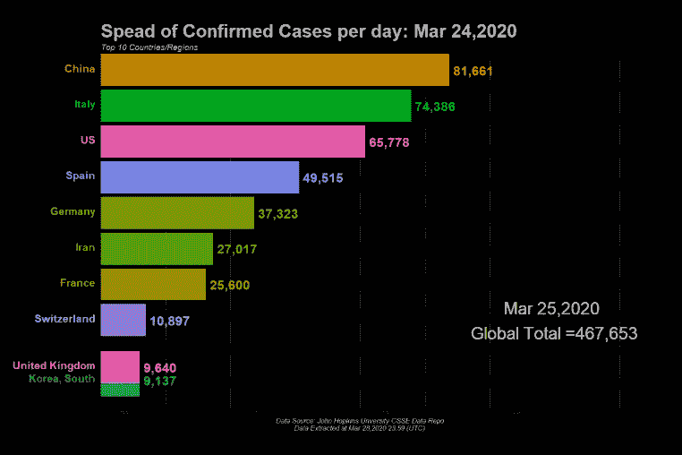
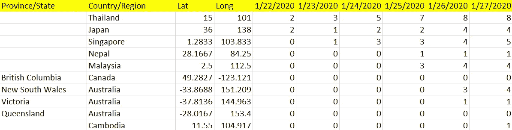
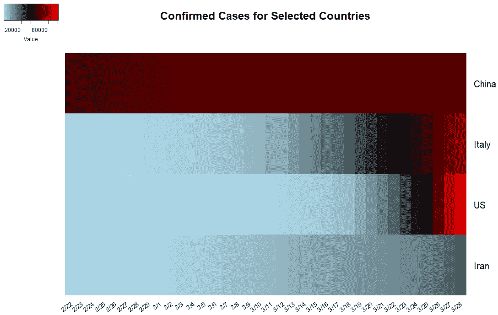
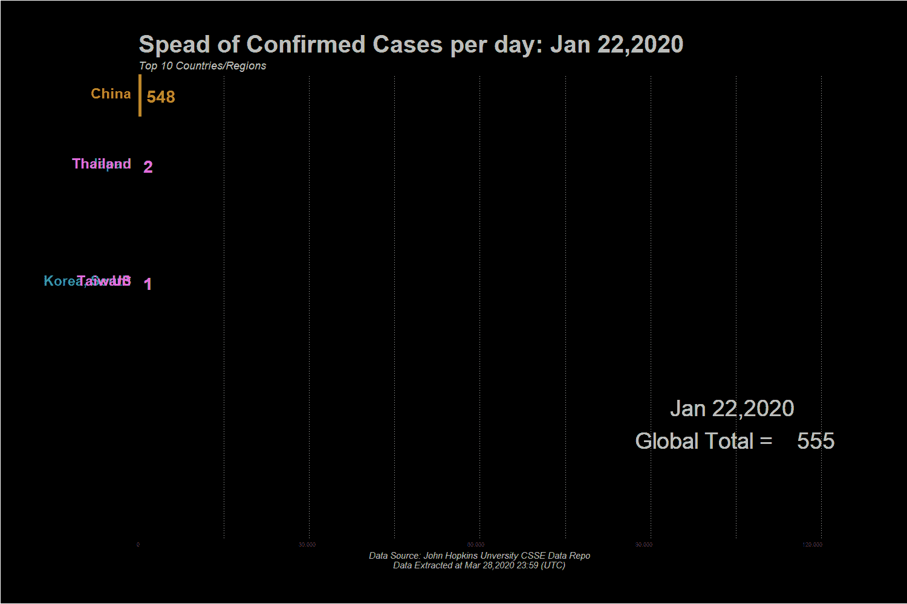

# 用 R 在 5 分钟内创建您的交互式动画图形

> 原文：<https://towardsdatascience.com/channel-your-creativity-interactive-and-animated-graphics-in-r-with-covid-19-data-5f7bede4b29f?source=collection_archive---------33----------------------->

## D3.js 中没有编码的动画可视化

冠状病毒，或称新冠肺炎病毒，在不到两个月的时间里已经在几个大洲传播，并且肯定已经引起了公众的恐慌和疫情的恐惧！这个星球上的每条新闻都在报道冠状病毒，股票市场正在崩溃，人们正在让焦虑支配他们的行为。当然，我对病毒遗传学和流行病学没有任何专长，但就我而言，理性的做法是采取必要的预防措施，呆在家里，保持社交距离，直到我们一起度过难关！

与其呆在家里做最坏的打算，我们为什么不积极地用一些有创造性的东西来占据我们的大脑呢？在这篇博客中，我将使用 COVID–19 数据来讨论 R 中使用较少代码行生成图形的几种技术，以及如何在 R 中创建交互式动画图形，而无需在 [D3.js](https://d3js.org/) 中编写一行代码。现在，让我们加入到 r 中新冠肺炎可视化的潮流中来

我们将使用由约翰霍普金斯大学 CSSE 2019-nCoV Github 存储库维护并每日更新的新冠肺炎数据集([这里是链接](https://github.com/CSSEGISandData/COVID-19/tree/master/csse_covid_19_data/csse_covid_19_time_series))。有 3 个单独的数据集，分别用于确诊、死亡和恢复的病例，这 3 个数据集都是宽格式的，从 1 月 22 日持续到 3 月 28 日(当我开始这篇博客时)。

新冠肺炎确诊病例数据集

**同时读入数据集(并创建绘图变量)**

首先，让我们把 3 个数据集读入 R，

注意，我们在每个数据集中创建了一个额外的变量，标记为**‘Status’**。我稍后会解释原因，但是现在，让我们做一个快速的完整性检查，以确保 3 个数据集包含相同的绑定列。这种健全性检查总是有用的，尤其是在原始数据源发生变化的情况下，并且(复活节彩蛋)下面的代码显示了如何做 [DRY](https://en.wikipedia.org/wiki/Don%27t_repeat_yourself) 。

现在，我们需要将数据集列表追加到一个数据框中，

现在，让我们回到我们在读取每个数据集时创建的**‘Status’**变量。在已确认、已死亡和已恢复数据集中，此堆叠变量的值将分别为“已确认”、“已死亡”和“已恢复”。将此'**状态**'变量作为单独的一列，可将其指定为{ggplot2}中的计算和绘图参数。

因此，下面展示了按“国家”和“状态”分组的数据准备步骤(这里，我选择了 4 个国家进行比较——中国、意大利、美国和伊朗)。

(复活节彩蛋)注意到了 *colnames(。)*？这可能是{ magrittr }管道中我最喜欢的功能。)这里接收上一次操作返回的所有内容。超级得心应手！

**静态热图显示确诊病例**

可视化纵向数据或任何二维数据的一种方法是热图，因此，让我们继续看第一个图表——上述 4 个国家确诊病例的热图。

出于演示的目的，我只绘制了从 2 月 22 日到 3 月 28 日的数据，但是如果您愿意的话，可以随意扩展时间线，

这是我们的热图，显示与其他国家相比，中国的确诊病例数一直是最高的，直到美国和意大利在 3 月底超过了这些数字。

热图的一个缺点是它不能处理第三维度，这意味着如果我们要观察确诊、死亡和康复病例的模式，我们必须做 3 个单独的热图。

**交互式纵向意大利面条图**

纵向折线图适用于添加第三层(即确诊、死亡和痊愈)的任务。在这里，对于每个国家，情节的开始日期被设置为第一个病例被报告确认的日期，我们需要将格式从宽转换为长，

为了一次创建多个图，{ggplot2}有一个很棒的函数**‘facet _ wrap’**(查看[此链接](http://www.cookbook-r.com/Graphs/Facets_(ggplot2)/)了解详情)，这里我们允许不同国家的比例有所不同。为了让剧情互动，{plotly}是我们的打包产品，

这是我们的互动折线图，

现在，我们可以直观地说出 4 个选定国家的轨迹，那么其他国家呢？

**R 中的动画条形图**

我们可以创建一个赛车条形图，显示确诊病例最多的前 N 个国家，我们可以使用{gganimate}软件包在 R 中完成！

完整的代码可以在 [my Github](https://github.com/YiLi225/COVID-19_analysis) 中找到，但是基本上，我们首先定义一个静态图，就像我们定义{ggplot2}一样，

然后定义动画部分，(复活节彩蛋)函数 **ease_aes()** 可以用来调整你的酒吧过渡的平滑度，

瞧，在这里。

我希望这篇博客让你从冠状病毒恐慌中分散了一点注意力，更好的是，你学到了一些新东西。同样，你可以在 my Github 中找到完整的代码，包括如何将你的动画情节保存为 GIF 或 MP4 [。](https://github.com/YiLi225/COVID-19_analysis)

保持积极，保持健康！

***编者注:*** [*走向数据科学*](http://towardsdatascience.com/) *是一份以研究数据科学和机器学习为主的中型刊物。我们不是健康专家或流行病学家，本文的观点不应被解释为专业建议。想了解更多关于疫情冠状病毒的信息，可以点击* [*这里*](https://www.who.int/emergencies/diseases/novel-coronavirus-2019/situation-reports) *。*