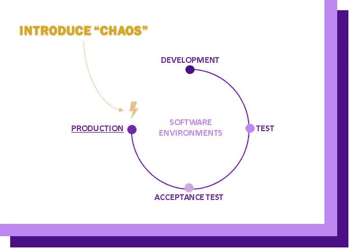
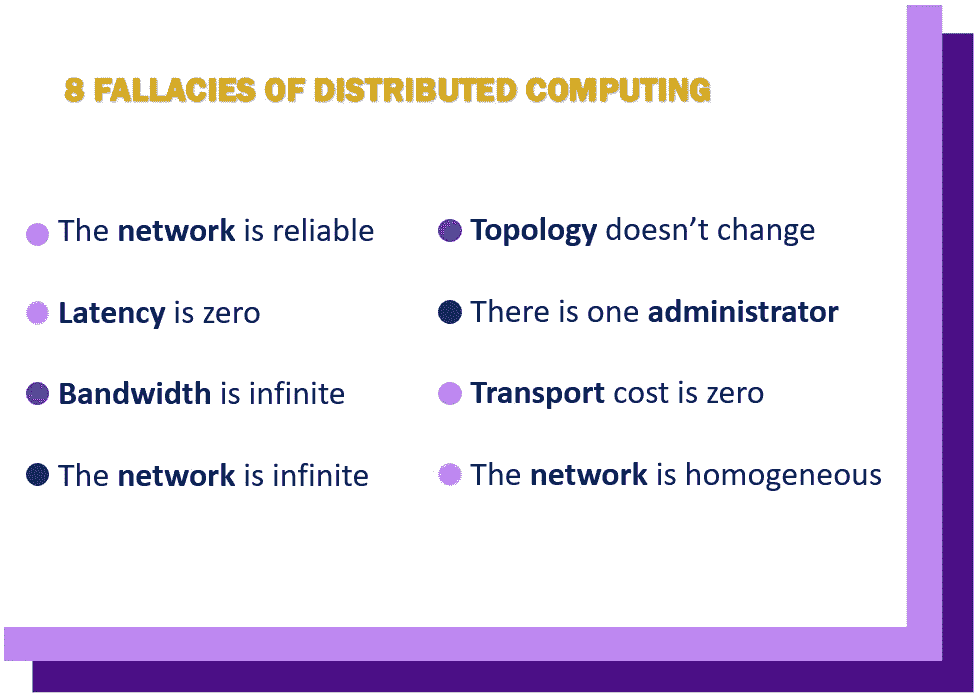

# 平静中的混沌:什么是混沌工程？

> 原文：<https://towardsdatascience.com/chaos-in-the-calm-what-is-chaos-engineering-5311c27b2c7e?source=collection_archive---------55----------------------->

凯文·霍尔瓦特在 [Unsplash](https://unsplash.com/s/photos/server?utm_source=unsplash&utm_medium=referral&utm_content=creditCopyText) 上的照片

## 时间是**主动**而不是 **被动**

**混沌工程不仅仅是机器人尼克博士做的事情；这是开发生命周期中一个严肃且日益普遍的部分。**

在不断变化的全球环境中，将*持续测试*引入 DevOps 工具链以确保安全性和弹性的压力越来越大。随着云成为越来越多公司的主导领域，情况更是如此，因为哪里有**新兴技术**，哪里就有**新兴威胁**。

在实践中，一个没有经过常规和有效测试的系统更容易停机，这会导致失望甚至失去客户。在 [ITIC 的第 11 次年度*停机时间每小时成本调查*](https://itic-corp.com/blog/2020/06/forty-percent-of-enterprises-say-hourly-downtime-costs-top-1million/) 中，发现 87%的组织现在被要求在 99.99%的时间内可用(他们注意到，在过去的 2.5 年中，这一数字上升了 81%)。令人难以置信的是，40%的企业组织表示，一个小时的停机时间会给他们带来 100 万到 500 多万美元的损失。

那么，你如何先发制人，为那种可能让你的公司损失数百万的灾难做准备呢？嗯，一个越来越流行的方法是在别人打破你自己的东西之前，有成效地打破它。

## 揭露，改进

对于我们这些不是 DevOps 世界巫师的人来说，仅仅是故意给你的辛苦工作带来混乱的想法就令人不寒而栗。不过，理解这个概念并不困难，一旦你理解了需要做的工作，我相信你会同意结果是值得投入资源的。

这方面一个相当传统的例子是*渗透测试*或*道德黑客*，即一家公司(通常)付钱给第三方，试图找到他们基础设施中的安全弱点。混沌工程将这种测试安全性的想法提升了一个档次。

为了在高层次上进行解释，您将**中断**(例如重大服务器崩溃、黑客攻击企图、停电)引入系统的正常**生产** **状态**，以便*主动*(而不是*被动*)测试其弹性。

开发生命周期的简单视图(图形我自己的)

它旨在复制真实的“紧急”情况，与传统的主流测试不同，它发生在生产环境中，而不是在开发生命周期的早期。

但是，如果不需要的话，你为什么要竭尽全力去破坏你自己的网络或者烧毁你自己的硬件呢？

嗯，这有点像一句老话“没有准备就是为失败做准备”；如果你不做，那么别人可能会做。因此，为了避免陷入意外停机的灾难性局面，最好提前准备好任何缓解措施。

**通过暴露任何可能的弱点，你可以最终提高对未来任何系统的信心。**

## 像对待科学学科一样对待它

混沌大师 [Gremlin 在他们的白皮书](https://res.cloudinary.com/gremlin/image/upload/v1579028841/20200114_Chaos_Engineering_White_Paper.pdf)中明确指出:

> "混沌工程的关键在于它被视为一门科学学科."

混沌工程不只是雇佣一些人来尝试破坏你的系统，而是让你恢复到原始状态，而不会对客户或员工造成任何影响。从法规遵从性的角度来看，它允许您验证和证明假设的防御机制。Gremlin 列出了成功工程应该遵循的六个步骤:

1.  形成假设
2.  计划你的实验
3.  最小化爆炸半径
4.  进行实验
5.  庆祝结果
6.  完成任务

有许多对混沌工程的批评和怀疑，因为，当然，其中有风险。但是，遵循这些步骤并利用最佳实践(包括从试运行环境开始，始终有一个“终止开关”，并提前计划)，可以大大降低出错的可能性。记住:如果你不在一个受控的环境中测试东西，你肯定会在它们将来不可避免地出错时努力去修复它们！

**最终，通过模拟可能完全压倒一切的事件，你让它们成为非事件——如果它们在未来发生——几乎不会留下痕迹。**

## 解决假设

混沌工程的另一个好处是它挑战了软件工程世界最大的弱点:不正确的假设。无论是相信你拥有所有的权力，还是相信你永远不会失去空间，让这些谬论生根发芽会让问题悄悄进入。

分布式计算的[谬误](https://web.archive.org/web/20070811082651/http://java.sys-con.com/read/38665.htm)，作者 L. Peter Deutsch

如果您没有持续不断地进行测试，并将您的基础设施推向极限，那么您就依赖于在现实世界中发现您的系统弱点，这可能会损害您的客户群。

无论是长时间还是短时间的停机，每一分钟都很重要。**安迪·格罗夫说得好，“成功滋生自满”，这是真的。自满滋生失败”。**

## 猿人军队

混沌工程并不是一个新概念。早在 2011 年，网飞就开始开发一套被称为“猿猴军”的开源工具。这些工具旨在测试其亚马逊网络服务基础设施的安全性、可靠性和弹性，包括像**混沌猴、**和**看门猴这样的大牌。**

混沌猴是网飞的第一个工具，它通过随机重启服务器来工作。虽然难以置信的创新，但它似乎已经在网上臭名昭著，部分原因是它偏离了混沌工程的现代基础。一般来说，在繁忙时期随意破坏东西是不明智的，而是要使用控制和措施来了解弱点(除非，像网飞一样，你有一个庞大的工程师团队排队包猴子说！)

网飞随后引入了一整套猴子来合作，包括**混沌孔**(它消灭了整个 AWS 区域*颤抖*)和**潜伏猴子**(它引入了通信延迟来模拟真实世界的退化和中断)。最近，猴子已经被单独开发，许多被构建到 Spinnaker，网飞的[“开源多云连续交付平台”](https://netflixtechblog.com/global-continuous-delivery-with-spinnaker-2a6896c23ba7)

你可以在网飞科技博客[上阅读关于猿人军队和网飞令人难以置信的混沌工程项目的详细信息。](https://netflixtechblog.com/)

## 平静中的混乱

包括 Salesforce、亚马逊和优步在内的其他公司多年来一直在使用弹性测试来提高可靠性，因为如此多的项目都是开源的，所以接受混乱并不困难。

这里有很棒的论坛(包括 [*Chaos 社区*](https://groups.google.com/forum/#!forum/chaos-community) )以及丰富的产品，包括 VMware 的“[”Mangle](https://vmware.github.io/mangle/)，它被描述为一种工具，可以让你:

> “…针对应用程序和基础架构组件无缝运行混沌工程实验，以评估弹性和容错能力。它旨在引入几乎没有预先配置的故障……”

也有合法的全面服务，如超级酷的' [Gremlin](https://www.gremlin.com/) '，它提供了一个平台，允许您通过多种故障模式在您的堆栈中引入“攻击”。

作为一种实践，它还不是很标准。即使这不一定是有史以来最困难的过程，公司也希望得到经验丰富的开发人员的保证，他们可以安全地设计混乱，这可能很难 1)找到，2)投资。

尽管最终，随着新出现的威胁变得更加复杂，持续测试的需求只会变得更加必要；随着客户对功能系统依赖的增加，出错的空间缩小了。

正如比尔·盖茨 5 年前警告我们的那样:

> “没有必要恐慌……但我们需要继续前进”。