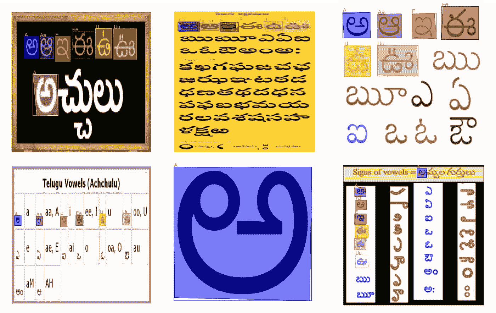

# 使用 Detectron2 对自定义数据进行字符识别和分段

> 原文：<https://towardsdatascience.com/character-recognition-and-segmentation-for-custom-data-using-detectron2-599de82b393c?source=collection_archive---------32----------------------->

## 详细说明

## 利用迁移学习的力量


照片由 [Unsplash](https://unsplash.com?utm_source=medium&utm_medium=referral) 上的[苏伦兰议员](https://unsplash.com/@sure_mp?utm_source=medium&utm_medium=referral)拍摄

# 目录

*   **什么是探测器 2？**
*   **项目设置**
*   **建立模型**
*   **培训和评估**
*   **结果**
*   **资源**

# 什么是探测器 2？

[Detectron2](https://github.com/facebookresearch/detectron2) 是一个开源的对象识别和分割软件系统，它实现了最先进的算法，是脸书人工智能研究(FAIR)的一部分。这是 PyTorch 对其先前版本 [Detectron](https://github.com/facebookresearch/Detectron/) 的彻底重写，它源自 [MaskRCNN-Benchmark](https://github.com/facebookresearch/maskrcnn-benchmark/) 。

您可以从 PyTorch DevCon19 上看到 Detectron2 的详细信息，以及基准比较、不同的应用程序、定制，以及关于其工作性质的具体细节。

Detectron 还提供了一个由 Detectron2 训练的大型基线集合，您可以从[模型动物园](https://detectron2.readthedocs.io/modules/model_zoo.html)开始访问代码。使用 FAIR 提供的笔记本来玩 Detectron2。

[](https://colab.research.google.com/drive/16jcaJoc6bCFAQ96jDe2HwtXj7BMD_-m5) [## Detectron2 入门

### 侦探 2 初学者教程

colab.research.google.com](https://colab.research.google.com/drive/16jcaJoc6bCFAQ96jDe2HwtXj7BMD_-m5) 

# 项目设置

我们将开发一个“泰卢固语字符”的字符识别和分割。为了建立这个项目，我们需要适合上述机器学习任务的数据。由于没有足够的可用数据，我们需要收集自定义数据。

## 资料组

使用文章“如何为字符识别和分段准备自定义数据集？”创建您自己的自定义数据，其中包括工具和程序来收集数据和预处理，并建立数据的注释。

[](/how-to-prepare-a-custom-dataset-for-character-recognition-and-segmentation-c39f6bf3690) [## 如何准备用于字符识别和分割的自定义数据集？

### 本文是泰卢固语字符识别研究的一部分。它侧重于为…创建自定义数据集

towardsdatascience.com](/how-to-prepare-a-custom-dataset-for-character-recognition-and-segmentation-c39f6bf3690) 

## 项目结构

在这里，您可以看到由文件和目录组成的项目结构，例如 *test_data* 和 *train_data* 由用于训练和测试模型的图像和注释组成。

```
|   Detectron2_Telugu_Characters.ipynb
|   label2coco.py
|   resize.py
|   test.json
|   train.json
|   Viewer.ipynb
|
+---results
|       res1.PNG
|       res2.PNG
|       res3.PNG
|       res4.PNG
|       res5.PNG
|       res6.PNG
|       res7.PNG
|
+---test_data
|       img1.json
|       img1.png
|       img10.json
|       img10.png
|       img11.json
|       img11.png
|       img12.json
|       img12.png
|       img13.json
|       img13.png
|       img14.json
|       img14.png
|       img15.json
|       img15.png
|       img16.json
|       img16.png
|       img17.json
|       img17.png
|       img18.json
|       img18.png
|       img19.json
|       img19.png
|       img2.json
|       img2.png
|       img20.json
|       img20.png
|       img3.json
|       img3.png
|       img4.json
|       img4.png
|       img5.json
|       img5.png
|       img6.json
|       img6.png
|       img7.json
|       img7.png
|       img8.json
|       img8.png
|       img9.json
|       img9.png
|
+---test_images
|       81XtS7O3nUL._SL1500_.jpg
|       alpha1.jpg
|       download.jfif
|       images (1).jfif
|       images (2).jfif
|       images (2).png
|       images (3).jfif
|       images (3).png
|       images (4).jfif
|       images (4).png
|       images (5).jfif
|       images (5).png
|       images (6).jfif
|       images (7).jfif
|       images.jfif
|       images.png
|       test_1.jpg
|       x1080.jfif
|
\---train_data
        img1.json
        img1.png
        img10.json
        img10.png
        img100.json
        img100.png
        img101.json
        img101.png
        img102.json
        img102.png
        img103.json
        img103.png
        img104.json
        img104.png
        img105.json
        img105.png
        img106.json
        img106.png
        img107.json
        img107.png
        img108.json
        img108.png
        img109.json
        img109.png
        img11.json
        img11.png
        img110.json
        img110.png
        img111.json
        img111.png
        img112.json
        img112.png
        img113.json
        img113.png
        img114.json
        img114.png
        img115.json
        img115.png
        img116.json
        img116.png
        img117.json
        img117.png
        img118.json
        img118.png
        img119.json
        img119.png
        img12.json
        img12.png
        img120.json
        img120.png
        img121.json
        img121.png
        img122.json
        img122.png
        img123.json
        img123.png
        img124.json
        img124.png
        img125.json
        img125.png
        img126.json
        img126.png
        img127.json
        img127.png
        img128.json
        img128.png
        img129.json
        img129.png
        img13.json
        img13.png
        img130.json
        img130.png
        img131.json
        img131.png
        img132.json
        img132.png
        img133.json
        img133.png
        img134.json
        img134.png
        img135.json
        img135.png
        img136.json
        img136.png
        img137.json
        img137.png
        img138.json
        img138.png
        img139.json
        img139.png
        img14.json
        img14.png
        img140.json
        img140.png
        img141.json
        img141.png
        img142.json
        img142.png
        img143.json
        img143.png
        img144.json
        img144.png
        img145.json
        img145.png
        img146.json
        img146.png
        img147.json
        img147.png
        img148.json
        img148.png
        img149.json
        img149.png
        img15.json
        img15.png
        img150.json
        img150.png
        img151.json
        img151.png
        img152.json
        img152.png
        img153.json
        img153.png
        img154.json
        img154.png
        img155.json
        img155.png
        img156.json
        img156.png
        img157.json
        img157.png
        img158.json
        img158.png
        img159.json
        img159.png
        img16.json
        img16.png
        img160.json
        img160.png
        img161.json
        img161.png
        img162.json
        img162.png
        img163.json
        img163.png
        img164.json
        img164.png
        img165.json
        img165.png
        img166.json
        img166.png
        img167.json
        img167.png
        img168.json
        img168.png
        img169.json
        img169.png
        img17.json
        img17.png
        img170.json
        img170.png
        img171.json
        img171.png
        img172.json
        img172.png
        img173.json
        img173.png
        img174.json
        img174.png
        img175.json
        img175.png
        img176.json
        img176.png
        img177.json
        img177.png
        img178.json
        img178.png
        img179.json
        img179.png
        img18.json
        img18.png
        img180.json
        img180.png
        img181.json
        img181.png
        img182.json
        img182.png
        img183.json
        img183.png
        img184.json
        img184.png
        img185.json
        img185.png
        img186.json
        img186.png
        img187.json
        img187.png
        img188.json
        img188.png
        img189.json
        img189.png
        img19.json
        img19.png
        img190.json
        img190.png
        img191.json
        img191.png
        img192.json
        img192.png
        img193.json
        img193.png
        img194.json
        img194.png
        img195.json
        img195.png
        img196.json
        img196.png
        img197.json
        img197.png
        img198.json
        img198.png
        img199.json
        img199.png
        img2.json
        img2.png
        img20.json
        img20.png
        img200.json
        img200.png
        img21.json
        img21.png
        img22.json
        img22.png
        img23.json
        img23.png
        img24.json
        img24.png
        img25.json
        img25.png
        img26.json
        img26.png
        img27.json
        img27.png
        img28.json
        img28.png
        img29.json
        img29.png
        img3.json
        img3.png
        img30.json
        img30.png
        img31.json
        img31.png
        img32.json
        img32.png
        img33.json
        img33.png
        img34.json
        img34.png
        img35.json
        img35.png
        img36.json
        img36.png
        img37.json
        img37.png
        img38.json
        img38.png
        img39.json
        img39.png
        img4.json
        img4.png
        img40.json
        img40.png
        img41.json
        img41.png
        img42.json
        img42.png
        img43.json
        img43.png
        img44.json
        img44.png
        img45.json
        img45.png
        img46.json
        img46.png
        img47.json
        img47.png
        img48.json
        img48.png
        img49.json
        img49.png
        img5.json
        img5.png
        img50.json
        img50.png
        img51.json
        img51.png
        img52.json
        img52.png
        img53.json
        img53.png
        img54.json
        img54.png
        img55.json
        img55.png
        img56.json
        img56.png
        img57.json
        img57.png
        img58.json
        img58.png
        img59.json
        img59.png
        img6.json
        img6.png
        img60.json
        img60.png
        img61.json
        img61.png
        img62.json
        img62.png
        img63.json
        img63.png
        img64.json
        img64.png
        img65.json
        img65.png
        img66.json
        img66.png
        img67.json
        img67.png
        img68.json
        img68.png
        img69.json
        img69.png
        img7.json
        img7.png
        img70.json
        img70.png
        img71.json
        img71.png
        img72.json
        img72.png
        img73.json
        img73.png
        img74.json
        img74.png
        img75.json
        img75.png
        img76.json
        img76.png
        img77.json
        img77.png
        img78.json
        img78.png
        img79.json
        img79.png
        img8.json
        img8.png
        img80.json
        img80.png
        img81.json
        img81.png
        img82.json
        img82.png
        img83.json
        img83.png
        img84.json
        img84.png
        img85.json
        img85.png
        img86.json
        img86.png
        img87.json
        img87.png
        img88.json
        img88.png
        img89.json
        img89.png
        img9.json
        img9.png
        img90.json
        img90.png
        img91.json
        img91.png
        img92.json
        img92.png
        img93.json
        img93.png
        img94.json
        img94.png
        img95.json
        img95.png
        img96.json
        img96.png
        img97.json
        img97.png
        img98.json
        img98.png
        img99.json
        img99.png
```

# 建立模型

在本节中，我们将看到如何使用 Detectron2 构建一个模型来执行泰卢固语字符识别和分段。

## 注册 COCO 数据集

因为我们遵循上下文中的公共对象(COCO)数据集格式，所以我们需要将训练和测试数据注册为 COCO 实例。代码如下:

我们需要训练集和 dataset_dicts 的元数据，即训练图像的内部格式 os 注释。

让我们来看一些训练样本:



训练数据样本-按作者分类的图像

我们使用的是来自模型动物园的科科预训 **R50-FPN 面具 R-CNN** 模型。下一步是使用配置文件配置模型，加载权重并设置阈值(在本例中为 0.5)

# 培训和评估

## 设置参数

这里，我们使用先前 COCO 注册的数据，即训练和测试数据，工人数量为 4，每批加载模型权重和图像的路径为 2，基本学习率为 0.001，最大迭代次数为 200，类数量为 6。

在这里，您可以看到培训数据的详细信息:

在这里，总损失、分类损失和不同指标等值被描绘为图形，并使用 tensorboard.dev 显示。以下是链接:

[](https://tensorboard.dev/experiment/hjZr4HW0QFq1z4yBGBpBPg/#scalars) [## 培训详细信息—使用 Detectron2 进行泰卢固语字符识别和分段

### 使用张量板的 tring 图

tensorboard.dev](https://tensorboard.dev/experiment/hjZr4HW0QFq1z4yBGBpBPg/#scalars) 

## 估价

`COCOEvaluator`用于评估测试数据集，评估结果保存在“输出”目录中。`inference_on_dataset`函数还为给定的模型和数据集提供精确的速度基准。

以下是输出:

# 结果

即使平均精度(AP)不大于 0.81%。只考虑 200 幅图像作为训练数据，就能产生几乎准确的预测，这是一个更好的迹象，也是很有希望的。

这里是几个看不见的样本给了模型，结果是:


三分模型对看不见的图像的预测——作者提供的图像

您可以使用这种方法，通过 Detectron2 实现您自己的对象识别和分割系统。

# 资源

[](https://github.com/facebookresearch/detectron2) [## Facebook 研究/检测器 2

### Detectron2 是脸书人工智能研究所的下一代软件系统，实现了最先进的物体检测…

github.com](https://github.com/facebookresearch/detectron2) [](https://pytorch.org/) [## PyTorch

### 开源深度学习平台，提供从研究原型到生产部署的无缝路径。

pytorch.org](https://pytorch.org/) [](https://ai.facebook.com/results/?q&content_types[0]=publication&sort_by=relevance&view=list&page=1) [## 脸书艾出版公司

### 研究领域著名论文近期出版物基础和应用近期项目

ai.facebook.com](https://ai.facebook.com/results/?q&content_types[0]=publication&sort_by=relevance&view=list&page=1)  [## 教程—detector 2 0 . 1 . 3 文档

### 编辑描述

detectron2.readthedocs.io](https://detectron2.readthedocs.io/tutorials/index.html)