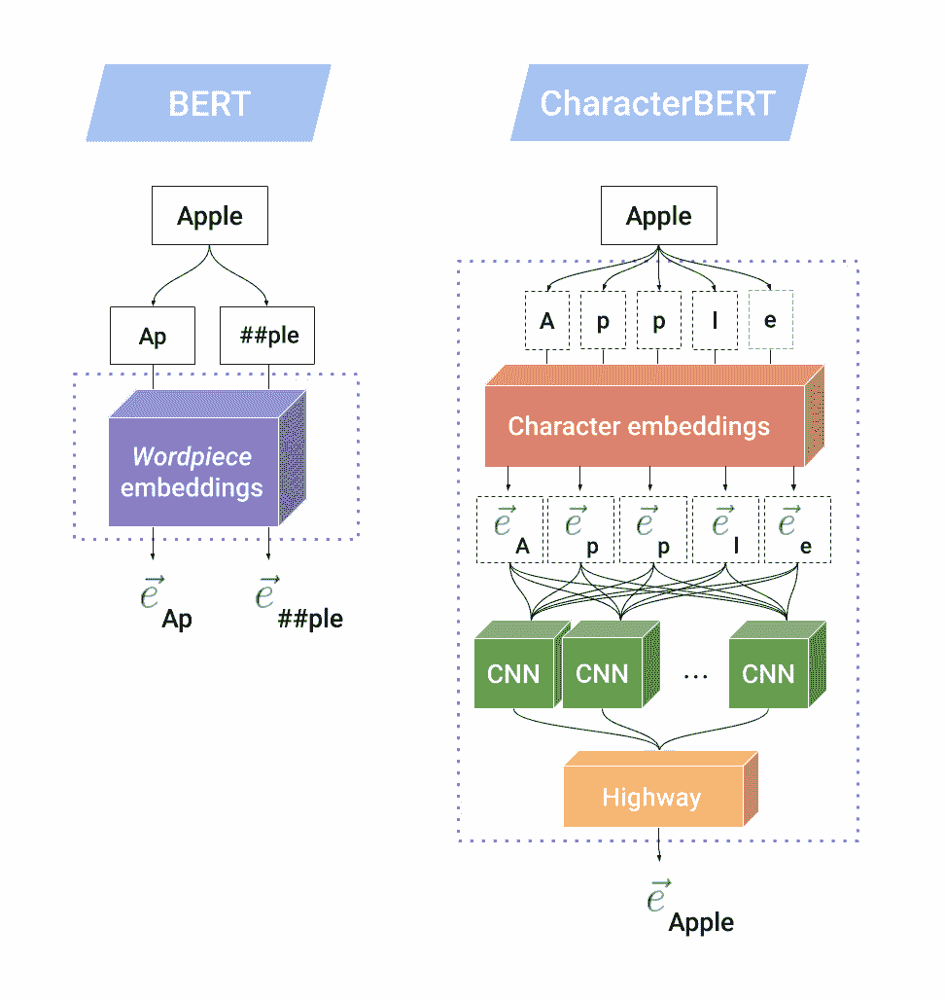
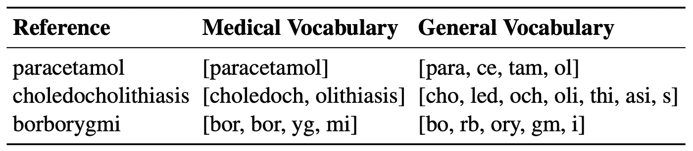
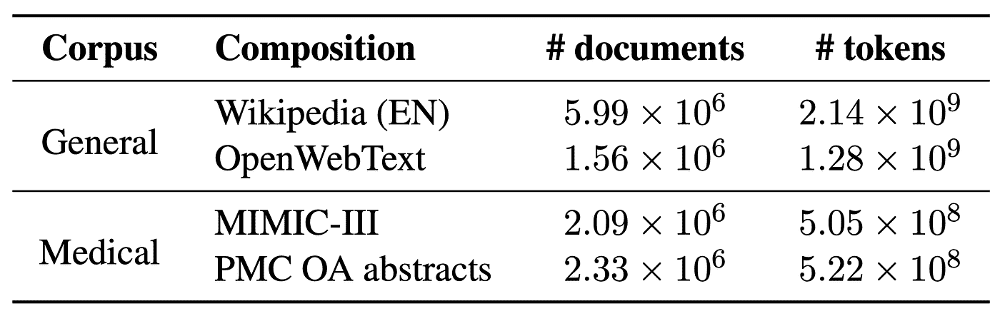
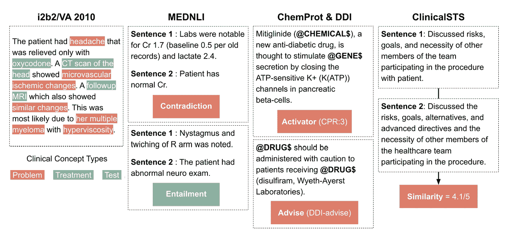
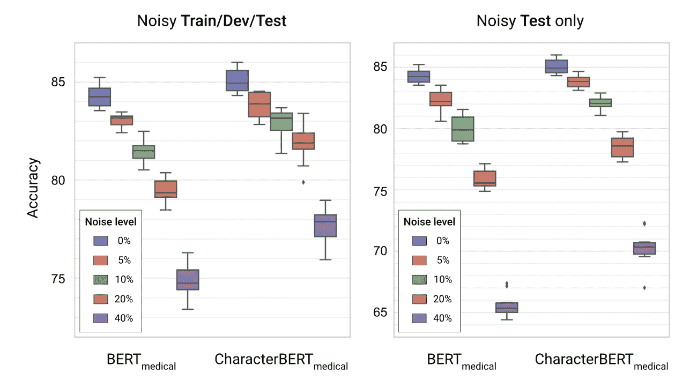

# CharacterBERT

> 原文：<https://towardsdatascience.com/characterbert-reconciling-elmo-and-bert-for-word-level-open-vocabulary-representations-from-94037fe68b21?source=collection_archive---------29----------------------->

## 来自字符的单词级开放词汇表示

## CharacterBERT 是什么，和 BERT 有什么不同？

CharacterBERT 是 BERT 的一个变体，它试图回到更简单的时代，那时模型为单个单词(或者更确切地说，令牌)生成单个嵌入。在实践中，唯一的区别是**不依赖于文字块** , **CharacterBERT 使用一个 CharacterCNN 模块** **，就像 ELMo***【1】*中使用的那个一样。

下图显示了 CharacterCNN 的内部机制，并将其与 BERT 中的原始单词块系统进行了比较。

BERT 与 CharacterBERT 中的上下文无关标记表示(来源:*【2】)*

我们假设单词“Apple”是一个**未知单词**(即它没有出现在 BERT 的词块词汇表中)，那么 BERT 将其拆分为**已知词块**:【Ap】和[##ple】，其中##用于指定不在单词开头的词块。然后，使用**字块嵌入矩阵**嵌入每个子字单元，产生**两个输出向量**。

另一方面， **CharacterBERT 没有单词表，可以处理任何*输入标记**，只要它不是不合理的长(即少于 50 个字符)。CharacterBERT 并没有拆分“Apple”，而是将它解读为一个**的字符序列**:【A】，【p】，【p】，【l】，【e】。然后使用**字符嵌入矩阵**表示每个字符，产生一系列**字符嵌入**。然后这个序列被送到多个 CNN，每个 CNN 负责一次扫描 n 个字符，n =[1..7].所有 CNN 的输出被**聚集成一个单一的矢量**，然后被**投射**到期望的维度，使用高速公路层*【3】*。这个最终投影是单词“Apple”的**上下文无关表示**，它将与位置和片段嵌入相结合，然后像在 BERT 中一样被馈送到多个变换器层。

## 为什么是 CharacterBERT 而不是 BERT？

CharacterBERT 几乎充当了 BERT 的替代品

*   为任何输入标记生成单个嵌入
*   不依赖于单词表

第一点显然是可取的，因为使用单个嵌入比每个令牌使用可变数量的单词块向量要方便得多。至于第二点，当在**专业领域**(如医疗领域、法律领域……)工作时，这一点尤为重要。事实上，在构建 BERT 的专门版本(例如 BioBERT*【4】*、blue BERT*【5】*和一些 SciBERT*【6】*模型)时，通常的做法是**在一组专门的文本上重新训练** **原始模型**。因此，大多数 SOTA 专用模型保留了原来的**通用领域**词表，这**不适合专用领域应用**。

下表显示了原始通用领域词汇与建立在医学语料库上的**医学词块词汇**之间的差异:MIMIC*【7】*和 PMC OA*【8】*。

使用不同领域的词块词汇表对特定领域术语进行标记化(来源:*【2】)*

我们可以清楚地看到，伯特的词汇是**不适合专业术语**(例如“胆总管结石”被拆分为【cho，led，och，oli，thi，asi，s】)。医学术语更适用于**，但它也有其局限性** **和**(例如，将“borygmi”转换为[bor，bor，yg，mi])。

因此，为了**避免任何可能来自使用错误单词表的偏见**，并努力回到**概念上更简单的模型**，提出了 BERT 的变体:CharacterBERT。

## CharacterBERT 如何与 BERT 进行对比测试？

BERT 和 CharacterBERT 在一个经典场景中进行比较，在该场景中，通用模型在作为专用版本的预训练的初始化之前被预训练。

> ***注*** *:* 我们在这里重点关注英语和医学领域。

培训前语料库(来源:*【2】)*

为了尽可能的公平起见，**BERT 和 CharacterBERT** **都是在** **完全相同的条件下**从头开始预训练的。然后，在多个医疗任务上评估每个预训练模型。我们举个例子。

评估任务(来源:*【2】)*

**i2b 2/VA 2010***【9】*是一项包含多项任务的竞赛，其中包括用于评估我们模型的**临床概念检测**任务。目标是检测三种类型的临床概念:**问题**、**治疗**和**测试**。上图的最左边给出了一个例子。

像往常一样，我们通过在**训练集**上进行首次训练来评估我们的模型。在每次迭代中，模型在**单独的验证集**上被测试，允许我们**保存最佳迭代**。最后，在经历所有迭代之后，使用来自最佳迭代的模型在**测试集**上计算分数(这里是严格的 F1 分数)。然后，使用不同的随机种子将整个过程**重复 9 次以上**，这允许我们考虑一些**方差**，并将最终模型性能报告为:**均值标准差**。

> ***注*** *:* 更多细节详见论文[2]。

## 结果如何？

*来源:[2]*

在大多数情况下， **CharacterBERT 的表现优于其对应的 BERT**。

> ***注*** *:* 唯一的例外是 ClinicalSTS 任务，其中医疗角色 BERT 的得分(平均)低于 BERT 版本。这可能是因为任务数据集很小(1000 个示例，而其他任务平均为 30，000 个示例)，应该进行调查。

## 好处:对噪音的鲁棒性

除了纯粹的性能，另一个有趣的方面是模型是否对噪声输入具有鲁棒性。事实上，我们在 MedNLI 任务*【10】*的**嘈杂版本上评估了 BERT 和 CharacterBERT，其中(简单地说)目标是说出两个医学句子是否相互矛盾。这里，X%的噪声水平意味着文本中的每个字符都有 X%的概率被替换或交换。结果显示在下图中。**

BERT 和 CharacterBERT 在嘈杂的(拼错的)MEDNLI 版本上进行微调(来源:*【2】)*

正如你所看到的，医学 CharacterBERT 模型似乎比医学 BERT 更健壮:当向所有分割添加噪声时，两个模型之间大约 1%精度的初始差距增长到大约 3%,当仅在测试集中用噪声给模型带来惊喜时，大约 5%。

## CharacterBERT 的缺点呢？

CharacterBERT 的**主要缺点**是其**较慢的预训速度** *。* 这是由于:

1.  训练速度较慢的 CharacterCNN 模块；
2.  但主要是因为该模型工作在**记号级** :
    它在每次预训练迭代中更新大量记号词汇表。

**/！\** :然而， **CharacterBERT 在推理过程中与 BERT 一样快**(实际上，甚至更快一点)并且[预训练模型可用](https://github.com/helboukkouri/character-bert#pre-trained-models)所以你可以完全跳过预训练步骤😊！

## 结论

总而言之，CharacterBERT 是用一个 CharacterCNN(就像 ELMo 一样)代替了 WordPiece 系统的 BERT 的简单变种。对多个医疗任务的评估结果表明，这种变化是有益的:提高了性能和对拼写错误的鲁棒性。希望这个模型能激发更多基于单词级开放词汇转换器的语言模型的研究:将同样的想法应用于**艾伯特***【11】*，**厄尼***【12】*…

> ***原文****:*
> [https://arxiv.org/abs/2010.10392](https://arxiv.org/abs/2010.10392)
> 
> ***代号&预训车型****:*
> [https://github.com/helboukkouri/character-bert](https://github.com/helboukkouri/character-bert)
> 
> ***参考文献****:*
> ***【1】***彼得斯、马修·e 等*[*深层语境化的词语表述。*](https://arxiv.org/abs/1802.05365) *arXiv 预印本 arXiv:1802.05365* (2018)。***【2】***El Boukkouri，Hicham，et al .*[*character BERT:调和 ELMo 和 BERT，用于来自字符的单词级开放词汇表示。*](https://arxiv.org/abs/2010.10392) *arXiv 预印本 arXiv:2010.10392 (2020)。* ***【3】***斯利瓦斯塔瓦、鲁佩什库马尔、克劳斯格雷夫、于尔根施密德胡伯。[公路网。](https://arxiv.org/abs/1505.00387)*arXiv 预印本 arXiv:1505.00387* (2015)。
> ***【4】***Lee，Jinhyuk，et al .[BioBERT:一种用于生物医学文本挖掘的预训练生物医学语言表示模型。](https://arxiv.org/abs/1901.08746)*生物信息学*36.4(2020):1234–1240。
> **彭、王一凡、阎、。生物医学自然语言处理中的迁移学习:在十个基准数据集上对 bert 和 elmo 的评估。*arXiv 预印本 arXiv:1906.05474* (2019)。
> ***【6】***贝尔塔吉、伊兹、凯尔·洛、阿尔曼·科汉。SciBERT:科学文本的预训练语言模型。*arXiv 预印本 arXiv:1903.10676* (2019)。
> ***【7】***Johnson，Alistair 等《MIMIC-III 临床数据库》(1.4 版)。*生理网*(2016)[https://doi.org/10.13026/C2XW26](https://doi.org/10.13026/C2XW26)。
> ***【8】***PMC OA 语料库:[https://www.ncbi.nlm.nih.gov/pmc/tools/openftlist/](https://www.ncbi.nlm.nih.gov/pmc/tools/openftlist/)
> ***【9】***uz uner，zlem 等. [2010 i2b2/VA 对临床文本中概念、断言、关系的挑战。](https://www.ncbi.nlm.nih.gov/pmc/articles/PMC3168320/)*美国医学信息学协会杂志*18.5(2011):552–556。
> ***【10】***Shiva de，柴坦尼亚。“MedNLI —临床领域的自然语言推理数据集”(版本 1.0.0)。*生理网*(2019)[https://doi.org/10.13026/C2RS98](https://doi.org/10.13026/C2RS98)。
> ***【11】***兰，等.[阿尔伯特:一个用于语言表征自我监督学习的 lite BERT。](https://arxiv.org/abs/1909.11942)*arXiv 预印本 arXiv:1909.11942* (2019)。
> ***【12】***孙，于等. [ERNIE 2.0:语言理解的持续预训练框架。](https://arxiv.org/abs/1907.12412)*AAAI*。2020.****

****完成人: [Hicham El Boukkouri](https://helboukkouri.github.io/) 、Olivier Ferret、Thomas Lavergne、Hiroshi Noji、Pierre Zweigenbaum 和 Junichi Tsujii****