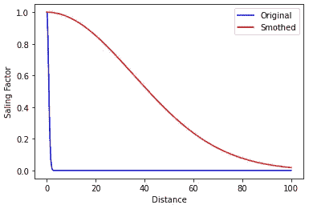
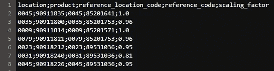

# 基于特征的新产品预测相似度

> 原文：<https://towardsdatascience.com/characteristic-based-similarity-for-new-products-forecasting-8ab919d570b3?source=collection_archive---------38----------------------->


安德烈·亨特在 [Unsplash](https://unsplash.com?utm_source=medium&utm_medium=referral) 上的照片

## 这是解决零售商在组合中加入新产品时面临的最大问题之一的方法。

“我能卖多少钱？”是每个零售商在考虑为商店和电子商务添加新材料时都会想到的问题。

我们通常有很多技术来帮助我们预测和预见，但当我们谈论新产品时，我们会面临一个大问题，即如果我们没有新产品的销售数据来用于回归或时间序列算法。

那么…我们如何预测呢？

# 方法

解决这种数据缺乏的一种方法是找到一种与新产品相似的产品，并复制其历史销售数据的一部分，有了它，您现在可以应用您喜欢的预测技术。

基本上，你可以用几种不同的方法来比较产品，除此之外，每个企业都必须定义在这种分析中使用的理想特性。

定义功能后，这是该过程中最困难也是最重要的一步，您将遵循一个简单的步骤来实现您的目标:

> 1.对分类数据应用一键编码

应用一个热编码，我们从比较类别名称/文本之间的距离，到比较产品是否与旧产品在同一类别。

> 2.将定标器技术应用于数值数据

当我们谈论距离时，它总是类似于 A-B=C，但现在我们正在讨论几个特征的距离，结果听起来像是所有的 cs 之和减去所有的 Bs。

这不会有任何问题，只要列中的值的范围都是相同的，我很确定这种情况非常非常少发生。

假设我们有 3 列，一列的值范围是从 200 到 400，另一列是从 15k 到 78k，第三列是从 1 到 10。

这将产生一个问题，因为范围之间的差异将导致不同的距离标度，在这种情况下，分别为 100 秒、10000 秒和 10 秒，如果我们尝试应用距离度量而不应用标度，则第二列的重要程度将大于其他列。

所以，别忘了涂。

> 3.计算新产品和旧产品之间的距离

我想这是你最期待的部分，对吗？

如果是的话，我希望不会让你失望，因为解决方案真的很简单。

同样，这里您必须做的第一件事是定义您想要使用哪种距离度量。请参见下面简单有用的距离列表:

*   欧几里得的
*   曼哈顿
*   闵科夫斯基

在继续之前，您必须选择最适合您的距离度量。

对于这个项目，我使用了欧几里德距离，所以我们只用两行代码就结束了整个项目:

```
idx_closest = np.argmin(
    [np.linalg.norm(new_obs_arr - np.array(x)) for x in df_old.values])
df_aux = df_old.iloc[idx_closest]\
    .to_frame()\
    .transpose()\
    .reset_index()
```

idx_closest 是旧数据帧的参考资料的索引值，用它我们得到整个对应的行并存储在 df_aux。

> 4.反向独热编码

流程如何考虑物料注册的工厂代码我们必须至少为工厂代码列恢复一个热编码的流程。

要恢复它，我们应该:

*   定义由一个热编码过程创建的列。
*   仅选择包含“1”的列。
*   将其名称转换为原来的名称。
*   在流程开始时删除由 one hot 编码创建的列。

```
def reverse_one_hot_encoder(df, col_nm):
    """
    Reverse the one hot encoding process

    Parameters
    ----------
    df : pandas.DataFrame
        data frame object with the old products that are more similar the new products
    col_nm : str
        name of the original column

    Returns
    -------
        df_result : pandas.DataFrame
        data frame object with the old products that are more similar the new products without the OHE procress
    """
    lst_stack = [x for x in df.columns if x.find(col_nm)>=0]
    df_aux = df[lst_stack]
    df[col_nm] = df_aux[df_aux==1]\
        .stack()\
        .reset_index()\
        .drop(0,1)['level_1']\
        .apply(lambda x: int(x.replace(col_nm+'_','')))\
        .to_list()
    for col in lst_stack:
        df = df.drop(col, axis=1)
    return df
```

> 5.计算比例因子

现在我们已经完成了比例因子步骤，也称为睡眠时间，因为我已经失去了思考它的时间。

好吧…好吧…我对这个家伙不公平，但我真的浪费了一些时间去思考这个问题，最终，导致了一些看起来太容易做到的事情，所以这可能只是我内心的愤怒试图在这里释放一点。

这就是为什么我在这上面浪费了这么多时间…

好了，记住距离步长的 A-B=C，我们可以猜测“好了，现在我已经定义了新行和旧行。那么，我为什么不，定义比例因子，只是除以 1，得到一个百分比结果呢？”

这种思维方式很好，但它的应用不太好，因为我们现在不是比较两个数字，而是试图从两个完整数据帧行的数组中获得百分比，而且没有简单的方法来做到这一点。

所以我们选择的解决这个问题的方法是定义一个数学函数，它随着我们已经计算过的距离的增加而减少。

我们认为对长距离比短距离进行更多的处罚应该是一件好事，所以我们尝试了“e^(-distance”，如果你是一个细心的人，你会注意到我说了“尝试”，这意味着它没有很好地工作。

问题是我们认为每一个被选择为相似的参考材料都应该和新的材料很接近，对吗？但在某些情况下，我们没有那么多的材料可以比较，我们最终只能得到最好的，而不是完美的匹配。

因此，为了避免距离增长过快，我们添加了结果组的平均距离值，以获得一个缓慢下降的比率。

```
# import Libs
import matplotlib.pyplot as plt
import statistics
import numpy as np
# simulate distance increasing
x = np.array(np.arange(0, 100, 0.001))
# get average value from distances
avg = statistics.mean(x)
# plot lines
plt.plot(x, np.exp(-(x**2)), 'b-')
plt.plot(x, np.exp(-(x**2/avg**2)), 'r-')
plt.legend(labels=['Original', 'Smothed'])
# add labels
plt.xlabel("Distance")
plt.ylabel("Saling Factor")
plt.show()
```



来源:作家

另一个要点是看产品价格，因为如果新产品的价格低于参考价格，这意味着它有机会卖出更多，但如果价格高于参考价格，就有可能卖出更少。

为了将这种或多或少的销售机会与比例因子相加，我们决定计算旧产品的价格占新产品的多少。

一旦我们有了基于数学函数和价格比的比例因子，我们就可以将两者相乘得到最终的比例因子。

# 结果

该算法导出包含五列的. csv 文件:

*   位置
*   产品
*   参考 _ 位置 _ 代码
*   参考 _ 代码
*   比例因子



来源:作家

您可以使用它来模拟新产品的历史销售数据，然后对其应用任何预测算法！

# 最终提示

*   安排一次会议，与您的主数据团队或任何在您的数据库中注册/创建新产品的团队进行交谈，因为他们可以很容易地告诉您新材料的初始特征。
*   明智地选择可以作为新产品参考的材料。那些你已经停止工作，但仍然存在于你的数据库中的产品或新产品(自第一次销售后不到两三个月)可能不是最好的决定，因为它们可能没有良好的历史销售曲线。
*   选择一个产品层次结构进行过滤，这样一旦减少比较样本，就可以加快合作时间，并且可能会比较更相似的产品，而不是在整个产品库中搜索。
*   不要忘记，一旦你的新产品开始销售，它将收到真正的销售数据，你应该开始使用它来预测，而不是你生成的数据。

# 这就是了！

嗯，有了这个，我想你现在可以通过找到一个类似的旧材料来改进你的新产品，并扩大它的销售，作为你预测工具的输入！

希望这篇文章对你有帮助！

你可以在这里看到这个项目的代码:

[](https://github.com/rfpcordeiro/python-similarity-to-characteristic-based-forecast) [## rfpcordeiro/python-基于特征相似性的预测

### 算法来计算和定义数据库中与新产品最相似的产品，这样我们就可以使用…

github.com](https://github.com/rfpcordeiro/python-similarity-to-characteristic-based-forecast) 

> *特别感谢 Pierre Palud，当我澄清了无数个关于定义比例因子的最佳方式的问题时，他一直耐心等待*