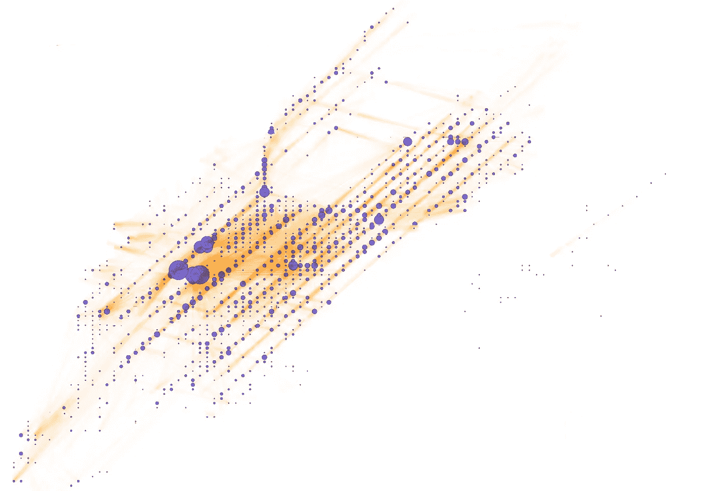
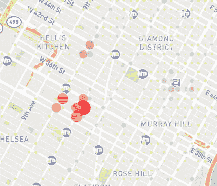
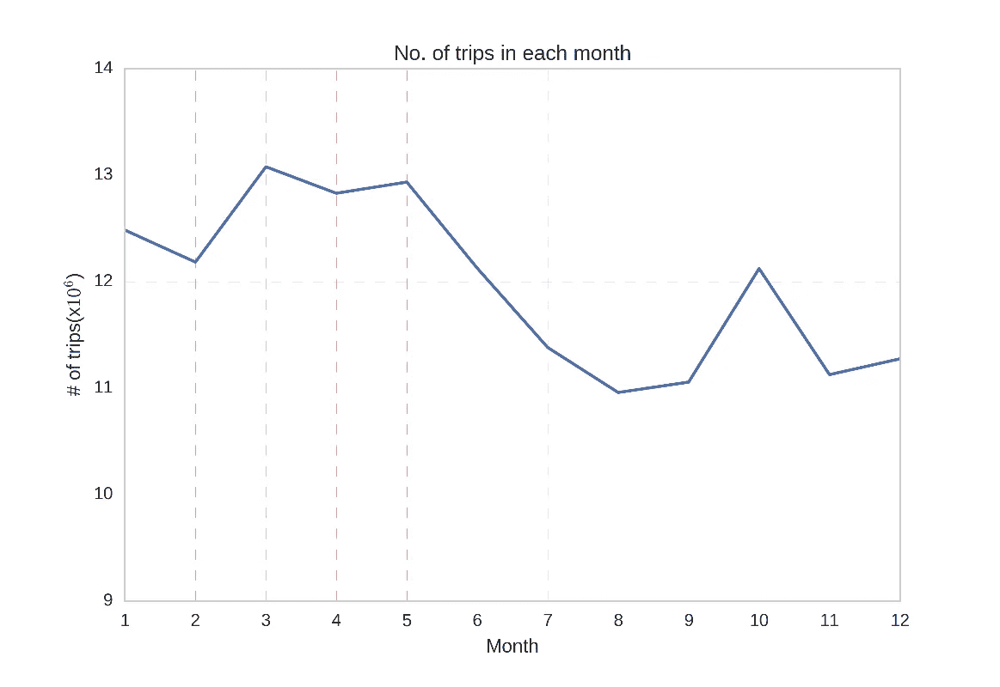
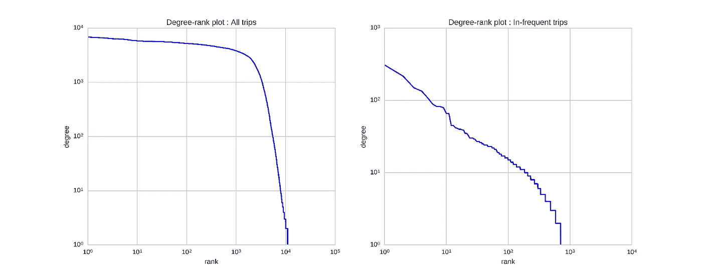
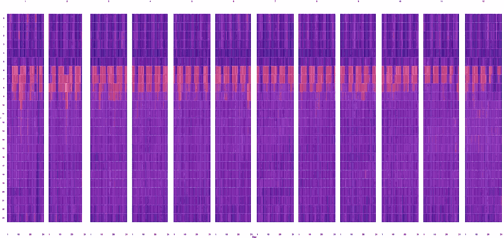
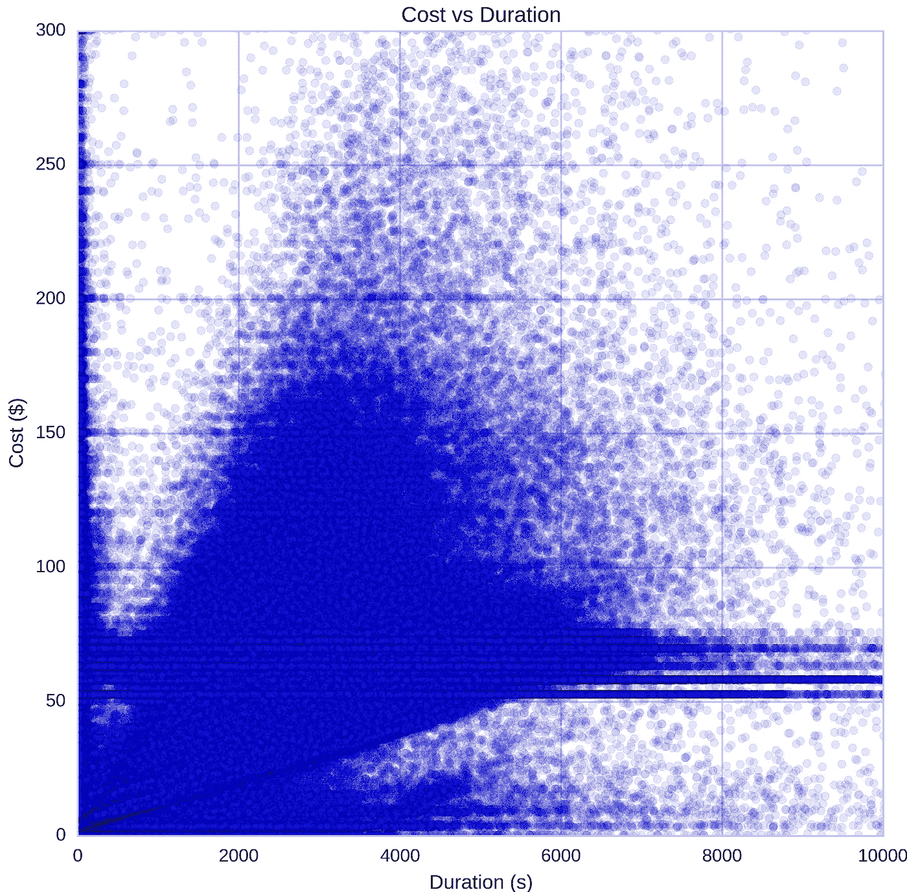
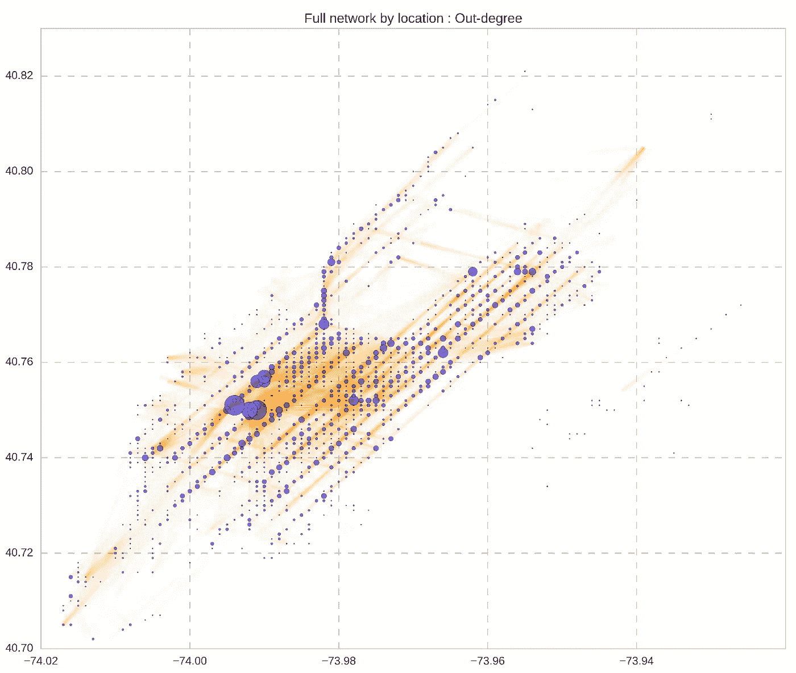
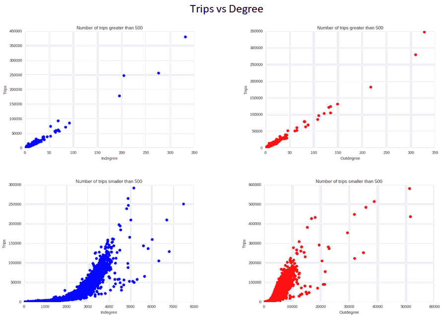
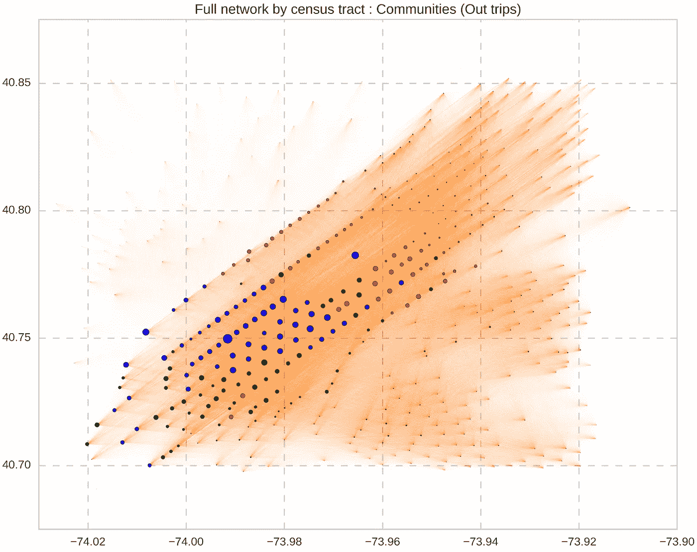
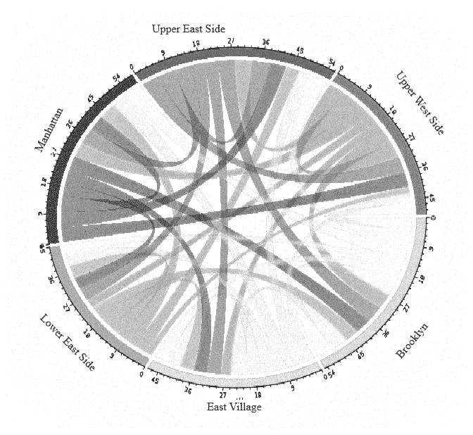

# 表征和分析网络

> 原文：<https://towardsdatascience.com/characterizing-analyzing-networks-d3a8f01eecfd?source=collection_archive---------34----------------------->

## 纽约市交通网络的初步分析

交通网络提供了一个极好的机会来确定当地人口的出行习惯、日常生活和使用数据驱动的方式来增强城市规划决策。在我们的分析中，我们专注于探索纽约市居民在 2015 年使用 1.46 亿次以上的出租车出行的出行模式。完整的代码、可视化和报告可以在 [**Github 库**](https://github.com/nilesh-patil/TransportationFlowNetwork) 中找到

**之前工作:**

基于 GPS 的交通网络已被详细研究用于交通流量分析和确定社会动态[1]。自行车共享数据集已用于根据使用概况对位置进行聚类[2]并预测自行车需求[3]基于 GPS 的出租车数据集已用于识别中国上海的移动模式[4]。

在[4]中，出行分布被描述为 3 种独立类型的组合，非负矩阵分解被用于从中国上海的 158 万次出行中识别 3 种模式。这是我们方法的核心，因为我们试图用类似的数据集来描述纽约市出租车的使用情况。之前的分析也用于从街道几何图形[5]和地铁地图[6]中生成交通网络图。

**数据描述:**

a) *原始数据:*纽约市出租车&高级轿车委员会自 2009 年起公开提供出租车出行数据集[7]。我们使用这个数据集进行分析。完整的数据集包含每年约 1 . 5 亿次出行&每行代表一次出行，具有起点和终点、行驶距离、出租车费用、耗时等特征。我们使用的是 2015 年的数据集，总共包含 146，112，990 次出行。为了将地理位置数据与人口普查区域结合起来，我们使用了非常有用的纽约市土地使用数据集[8]。

b) *数据转换:*我们对每次行程使用以下变量:

*   行程起始时间戳
*   起点(横向/纵向)
*   行程停止时间戳
*   停止点(横向/纵向)
*   费用

使用这些行程，我们以给定行程的*开始*和*停止*位置为节点构建我们的有向图。作为一个附加条件，我们只使用高出行次数的地点(对于给定的一对地点，一年中超过 500 次)。根据之前的工作，我们总结出将位置坐标四舍五入到小数点后两位也是一种选择，鉴于我们在分析包含 40，000 多个节点的数据集时遇到的困难，我们现在正在通过两种不同的方法来简化我们的网络:

*   5 个曼哈顿街区一个节点
*   使用 600 万次最频繁旅行获得 1275 条最频繁旅行的边
*   在我们当前的网络中，每个节点代表其周围 200 米 x200 米的区域，每条边代表给定年份中两个节点之间的总出行次数

我们从时间戳中创建月、日、工作日、一天中的时间段等特征。我们在最初的分析中面临的一个问题是，由于网络本身的地理位置，我们有一个网络，其中多个节点代表具有多个入口的同一个位置(例如，Penn Station 有多个入口和出口&我们的网络有多个节点代表同一个真实世界的位置)

*相同位置:多个接近的节点*

我们决定将我们的数据集与美国人口普查局的人口普查区合并，这样就解决了上述问题。我们在最终网络中有 580+个节点，并分析了作为节点的人口普查区域和作为边的两个人口普查区域之间的行程数。

# **探索性分析:**

1.每个月的出行量(图 1)在 3 月至 5 月间达到高峰，6 月以后大幅下降。这可以直接归因于天气模式，因为通勤者应该避免在低温或雨天长途步行。

2.对于我们的完整数据集，第一个图显示了度分布，而第二个图显示了 2015 年使用至少 500 次出行的边生成的图的度分布。

3.热图(图三)显示了 2015 年每小时的相对出行密度。根据这些信息，我们总结出最繁忙的时间是早上 6 点到 9 点。我们将大部分流量归因于日常工作通勤的用户，而在周末上午 12 点至凌晨 4 点之间，流量密度显著增加。我们正在寻找一种方法，对从我们的子集生成的网络结构进行类似的分析，以创建时间流量密度可视化。

4.我们分析了旅行的费用与持续时间的关系，发现了有趣的异常数量的恒定费用旅行。我们将这些旅行归因于:

*   尖端四舍五入到最接近的 5/10
*   导致延误的相同行程内的交通延误

旅行持续时间与旅行成本

# 全网络分析

整个网络近似表示为其实际地理位置，我们将节点大小和行程的外度绘制为边厚。我们观察到:

*   郊区的服务少于曼哈顿、上东区/西区和市中心
*   交通枢纽也是网络枢纽，办公区是下一个最接近的中心节点
*   令人惊讶的是，东村和下东区也是整个网络中连接最少的，尽管这些地区在地理上不像郊区那样分开

当我们根据大于或等于 500 和小于 500 的旅行次数将节点分成两个子类别，并根据旅行总次数绘制入度/出度图时，出现了两个鲜明的对比。

图 5 中最上面的两个图形表示行程数大于或等于 500 的节点，蓝色图形表示入度与行程的比率，红色图形表示出度。瓶二图是针对行程数少于 500 的节点。

对于旅行次数> =500 的情况，图表最右侧的大部分异常值的物理位置在麦迪逊广场花园、佩恩车站等市内景点。这意味着大量的人从相对较少的地方来到这些景点，并且这些进来的地方中的大多数位于曼哈顿(例如，来自大约 200 个地方的 250，000 次旅行。平均 1250 次旅行)。

对于出行次数> =500 的情况，图表最右侧的大多数异常值的物理位置都在机场(拉瓜迪亚机场和 JFK 机场)，它们的出行与学位比率要小得多，这意味着有少量的人来自各种地方。我们可以通过观察图的“尾部”来轻松识别连通性低的地方，我们发现这个比例越小，节点离曼哈顿越远。

跨纬度和经度的网络节点分布

我们将网络分为 3 个社区，使用 ***igraph*** 库中的多级社区检测。上面的图将这些社区按大小映射到全年离开每个节点的旅行次数。这三个社区可以描述如下:

*   蓝色标签代表**社区** **A** ，节点整齐地落在曼哈顿和邻近的新泽西地区，它们被证明是连接最好的节点。他们与曼哈顿(曼哈顿和新泽西地点)和其他两个社区(仅曼哈顿地点)联系紧密
*   绿色标签代表**社区 B** ，它代表与城市北部的出租车连接性最高的位置，这反过来是因为城市交通连接性(公交车/地铁等)最差——通常是向北
*   红色标签代表**社区 C，**代表北纽约市，皇后区&布朗克斯区，我们知道它们在同一个社区中，因为总体上向南的连通性最低。
*   我们想证明 Dash & Rae[11]使用国家数据集确定的郊区结构在地方层面是否成立，这就是为什么这个结果很有趣——基于我们的初步探索，我们的推断是，在一个城市内，它不成立。

我们绘制了离开纽约主要地区的旅行快照，这表明，曼哈顿是所有人中联系最紧密的，而大多数从下东区、东村和布鲁克林出发的旅行最终都前往纽约的北部。一小部分最终进入了社区本身。

*   城市与其他网络的不同之处在于，较小的重新路由通常非常简单，即绕过一个街区很容易，通常不会导致成本、时间或路由长度的显著变化。
*   像纽约这样的城市除了结构枢纽(地铁枢纽、机场和公交枢纽)之外，不会有单一的关键位置，这一点从程度中心性分析中非常明显。最接近纽约市中心位置的是它的街道，特别是百老汇和第六大道。百老汇从北向南延伸，而第六大道从南向北延伸(单行道)。
*   从分析中得出的另一个有趣的观察结果是，东村& below 在出租车使用方面与郊区相似。这令人惊讶，因为正如托布勒所说，地理第一定律是“一切都与其他一切相关，但近的东西比远的东西更相关。”[12]&第一个定律是空间相关性和空间自相关的基础，专门用于空间插值的反距离加权方法[13]。

*参考文献:*

1.  页（page 的缩写）卡斯特罗、张、陈、李、潘。从出租车 gps 追踪到社会和社区动态:一项调查。ACM 计算机。Surv，2013 年 12 月。
2.  C.艾蒂安和欧·拉蒂法。基于模型的计数序列聚类在自行车共享系统使用挖掘中的应用。ACM Trans 智能。系统。技术。，2014 年 7 月
3.  D.Singhvi，S. Singhvi，P. Frazier，S. Henderson，E. Mahony，D. Shmoys 和 D. Woodard。预测纽约市自行车共享系统的自行车使用量。2015 年在 AAAI 举行的研讨会。
4.  彭春、金霞、黄家昌、史敏、P (2012)城市出租车出行中的集体人员流动模式。《公共科学图书馆·综合》7(4):e 34487 . doi:10.1371/journal . pone . 20048363637
5.  页（page 的缩写）克鲁西蒂、v .拉托拉和 s .波塔。城市街道空间网络的中心性度量。物理评论 E，73(3):036125，2006。
6.  derble S(2012)地铁系统的网络中心性。PLoS ONE 7(7): e40575。doi:10.1371
7.  纽约市出租车数据:[http://www . NYC . gov/html/TLC/html/about/trip _ record _ data . shtml](http://www.nyc.gov/html/tlc/html/about/trip_record_data.shtml)
8.  纽约市土地使用:【https://www1.nyc.gov/site/planning/index.page 
9.  W.崔，周海辉，瞿海辉，黄炳春，李，“基于几何的边聚类在图形可视化中的应用”，IEEE 可视化与计算机图形学学报，第 14 卷，第 6 期，第 1277-1284 页，2008 年 11-12 月 doi: 10.1109/TVCG.2008.135
10.  Holten，D . & Wijk，J，2009，“图形可视化的力定向边缘捆绑”，*计算机图形论坛*，28，3，第 983-990 页，Business Source Premier，EBSCO *主持人*，2016 年 11 月 12 日查看。
11.  Dash Nelson G，Rae A (2016)美国的经济地理:从通勤到大区域。PLoS on 11(11):e 0166083 . doi:10.1371/journal . pone . 0166083
12.  一部模拟底特律地区城市发展的电脑电影。经济地理 1970 年；46: 234–240.
13.  https://en . Wikipedia . org/wiki/to bler ' s _ first _ law _ of _ geography

*原载于*[*nilesh-Patil . github . io*](https://nilesh-patil.github.io/blog/transportation-graph-nyc-taxi-data/)*。*