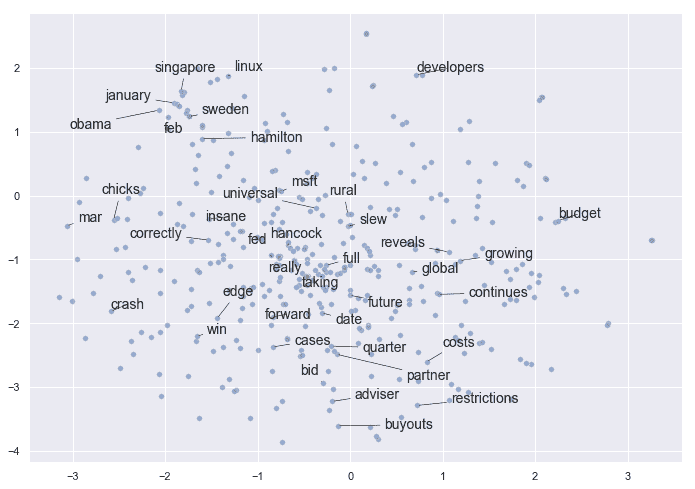
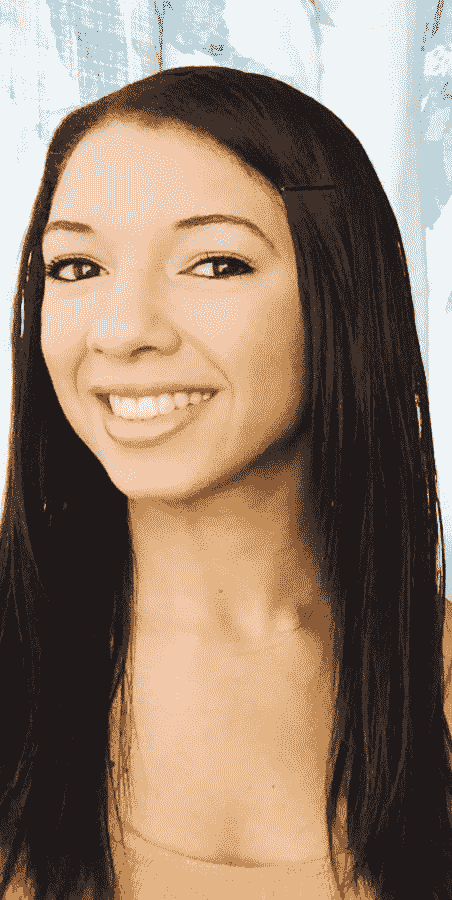
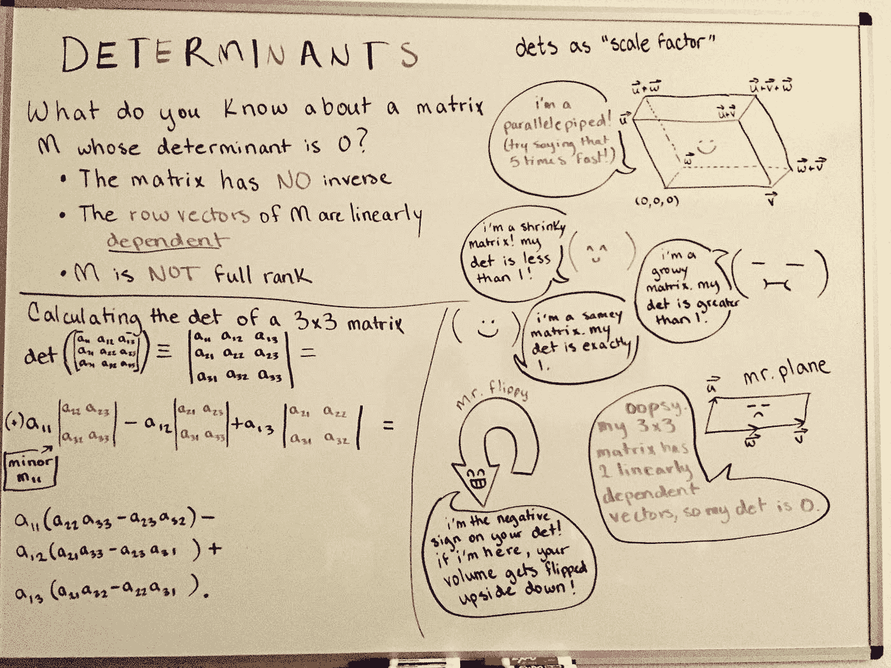
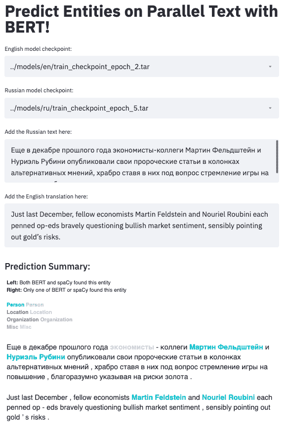

# 夏琳·钱布利斯:从心理学到自然语言处理和应用研究

> 原文：<https://towardsdatascience.com/charlene-chambliss-from-psychology-to-natural-language-processing-and-applied-research-3845b1c83ac0?source=collection_archive---------20----------------------->

## 技术领域的女性系列

## *Primer 公司一位机器学习工程师的采访。艾*

图片经 Charlene 许可后重新使用，原文来源:[https://towards data science . com/using-word 2 vec-to-analyze-news-headlines-and-predict-article-success-CDE da 5 f 14751](/using-word2vec-to-analyze-news-headlines-and-predict-article-success-cdeda5f14751)

在过去的十年中，人们对数据科学的兴趣呈指数级增长，越来越多的人开始转向该领域。2020 年，关于转入数据科学职业的文章和 YouTube 视频比比皆是。然而，对于许多人来说，关于这种转变的许多关键问题仍然存在:你如何从社会科学背景进入数据科学？心理学等领域中哪些最重要的技能可以应用于数据科学？

Charlene Chambliss 拥有一条鼓舞人心的非传统职业道路。目前，她利用最先进的自然语言处理技术“构建更智能的工具来分析海量信息。”在过去的两年中，她撰写了关于 NLP 主题的文章，包括用于命名实体识别的 BERT 和用于新闻标题分析的 word2vec 等等。然而，在她目前担任机器学习工程师之前，她曾在市场营销、心理学、研究领域担任职务，并在护肤品行业担任数据科学家。

Amber:你能告诉我们一些你的背景吗？
夏琳:当然！我走了一条不同寻常的数据科学之路，所以我将从头开始，详细阐述一下这条路对我的意义。

我在一个农业小镇(加利福尼亚州的莫德斯托)长大，我父亲在那里的西夫韦公司工作(现在也是！)而我妈妈是个全职妈妈。他们真的让我意识到认真对待我的教育的重要性，这对我来说很好，因为我喜欢学习，我喜欢让他们以我为荣。

我从小就想成为一名科学家。我喜欢修补和学习事物如何运作。我妈妈满足了我的好奇心，带我去了图书馆(我会带着一摞 12 本书回家)，让我在厨房里帮她(烹饪=化学！)，偶尔给我买玩具科学包。

这种兴趣一直持续到高中和大学一年级，那时我决定学习化学工程，成为一名香料科学家，因为化学是我最喜欢的学科。我(很可爱地)认为，我应该简单地发明新的口味，让健康食品味道更好，这样人们就可以更容易地吃沙拉和蔬菜，从而整体上更健康。我讨厌吃沙拉和蔬菜，所以 17 岁的我认为我很聪明，这是一个惊人的解决方案。

> “一般来说，学习社会科学是习惯于处理模糊、难以定义的问题的一种很好的方式，这种技能是交付决策者实际上会感到舒适的数据科学工作的关键。”

整个高中时期，我都保持着对教育的专注和职业道德，并在斯坦福大学读了本科。坦白地说，这对我来说是非常意外的——我以为如果我真的幸运的话，我会去加州大学戴维斯分校和加州大学伯克利分校。大约一半从我高中毕业的人最终都没有上大学，所以即使是这些人也觉得是相当高的志向。那年，在我的 500 名毕业班学生中，我想只有大约 5 人进入了“顶尖学校”(伯克利、斯坦福、哈佛)。

当我去斯坦福的时候，我真的没有预料到的是我所面临的文化冲击。斯坦福大学的绝大多数学生来自高收入家庭，家庭收入中值为 167，500 美元。总的来说，他们是那种有受过大学教育的专业父母的孩子，上的是镇上最好的、资金最充足的高中，在他们遇到困难的任何领域，都请了家教来帮助他们。与此同时，我在 HH 收入大约是其四分之一的情况下长大，我在某些领域相对于同龄人的准备程度反映了这种差异。(我的父母和老师都很好，已经尽了最大努力，但资源有限，我们能做的也就这么多。)

突然，我发现自己对自己的能力(尤其是数学和计算机科学方面的能力)感到非常不自信，真的怀疑自己是否能达到其他学生的水平。我没有意识到我们的背景如此不同，因为没有人到处谈论这种事情，所以我把表现的差异归因于我自己能力的缺乏。我也是我高中唯一一个在那年去斯坦福的人，所以当我到那里的时候我不认识任何人，也没有人可以谈论我正在经历的事情。在斯坦福大学的日子里，冒名顶替的感觉从未真正消失过，但至少我变得更擅长伪装，直到我成功为止。

我的确在斯坦福上完了学，尽管我最终没有攻读化学工程，而且还需要在大三后休学一年，以帮助处理我父母的离婚(我妈妈是残疾人，需要帮助卖掉我们家的房子并搬出去)。2017 年，我获得了心理学学士学位——这是我直系亲属中第一个获得 4 年制学位的人——但我觉得由于缺乏指导和榜样，我在这一路上犯了很多错误。事实证明，即使只是寻找我的第一份工作也很困难，因为我真的只能向职业中心寻求建议，如何为“受过教育的专业人士”在就业市场上导航。他们提供的小册子和 30 分钟的咨询并不能真正填补所有的空白，但经过大量的研究和参加招聘会后，我找到了一份为一家小机构做社交媒体营销的工作。

作为一个只有学士学位的心理学专业学生，我没有过多地谈论一个人的财务和整体职业前景，但在我从事那份工作的过程中，我清楚地认识到，除非我做出重大改变，否则我不会获得我想要的职业发展。所以在 2017 年底，我决定进入数据科学，特别是专注于机器学习，并投身于 GRE 研究，以便我能在 2018 年秋季入学前及时提交申请。(在下一节中，我将更详细地介绍我为什么选择数据科学，尤其是 NLP。)

我按计划注册了我的硕士学位，完成了我的课程，并在课外尽可能多地学习，尤其关注统计学、线性代数、Python 和机器学习。学位课程都是 R 语言的，所以我完全靠自己学习 Python，结合了在线课程和一本 1500 多页的教科书([学习 Python](https://www.amazon.com/Learning-Python-5th-Mark-Lutz/dp/1449355730) )。在第一年快结束的时候(2019 年春天)，我在 Curology 找到了一份数据科学实习，并在那里工作了整个秋天。然后，在我第二年年初，我通过 SharpestMinds 与一位了不起的导师尼娜·洛帕蒂娜(Nina Lopatina)合作，因为我决定专注于获得一个做 NLP 的角色。在为期 10 周的指导结束时，我开始找工作，并在 2019 年 12 月获得了全职加入 Primer 的邀请。

我需要推迟我的 MS 课程的最后一个学期开始全日制学习，这是一个艰难的决定，但这种经历对我来说更重要，所以我这样做了。事实证明，这个决定非常及时，因为仅仅几个月后，新冠肺炎·疫情就摧毁了最近的毕业生就业市场。我有同学还在努力找工作，我也很容易陷入同样的境地。我意识到我非常幸运，我掷骰子的结果如此之好。

总而言之，从相对较少的数学和编程经验的背景下，从市场营销过渡到全职机器学习工程师角色花了大约 2 年时间。(2017 年之前，我只上过单变量微积分，基础/入门统计，一门 Java 编程课。)

**答:在从事数据科学行业之前，你在斯坦福大学学习心理学。你能告诉我们你在那里的经历是如何影响你进入数据科学的职业道路的吗？** C:一般来说，研究社会科学是习惯于处理模糊的、难以定义的问题的一种很好的方式，这种技能是交付决策者实际上会感到舒适的数据科学工作的关键。这是一种墨菲定律思维模式，适用于实验结果:我已经变得非常关注任何可能“混淆”或以其他方式影响我的分析结果的东西，并且我可以在适当的时候提醒注意潜在的警告。这样，涉众可以利用他们的领域知识来决定他们认为这些事情对我们的结论是否重要，我们可以相应地调整实验/分析。

除此之外，我可能已经花了整整一年半的时间在心理学实验室进行实验。虽然这类职位涉及很多“繁重的工作”，如数据输入，但你也可以坐在前排，了解科学研究实际上是如何进行的，从数据收集到最终的统计分析，你还可以参与其中的一些决策。这让我为数据科学工作流做好了充分的准备，也给了我一些实用的技能(比如处理电子表格)和一种积极进取的态度，这在以后会很有帮助。

**答:之前，你在 Curology 担任数据科学实习生。你能讨论一下数据科学在护肤品行业是什么样的吗？你和你的团队寻求回答什么类型的问题？你在 Curology 工作期间做过的最有趣的项目是什么？** C:我认为我在 Curology 的经历是一个很好的例子，说明了数据科学在 D2C(直接面向消费者)业务中的一般情况，尤其是在创业背景下。通常情况下，以消费者为中心的企业首先需要的数据(当然是在数据工程师之后)实际上只是大量的描述性统计数据，通常被称为“消费者洞察”

因为我在用户获取部门工作，所以我特别专注于回答问题，这些问题将帮助我们在许多不同的获取渠道中做出更好的营销决策。80%的时间，我都在针对我们的数据仓库编写 SQL，以更好地理解不同客户群的行为，并跟踪该行为如何随时间发展，并将这些发现转化为可解释的仪表板，供团队的其他成员使用。其余 20%的时间，我使用 Python 来分析和可视化客户的调查反馈，以更好地了解他们喜欢和需要 Curology 的什么。

所以我要问和回答的一些问题是:

*   顾客的护肤目标如何根据他们的人口统计数据(性别、年龄等)而变化？)?对每一部分客户来说，什么是最重要的，我们如何才能确保满足他们的每一项需求？
*   我们的哪些渠道拥有“最顽固”的客户，即倾向于与我们呆在一起时间最长的客户？还有其他行为或偏好与订阅时长相关吗？
*   我们能否建立一个模型，利用我们拥有的客户行为历史数据来预测注册时的客户终身价值(LTV)？(由于抽样考虑，当您的客户群增长迅速时，这实际上非常困难！)

我学到了很多。用 SQL 做数据分析不仅仅是帮助你学习 SQL；它实际上帮助你进行分析性思考，尽管这听起来很老套。您首先必须学会将某人关于客户的自然语言问题翻译成适当的指标(这些指标通常有不同的过滤条件和假设，这取决于预期的用例！)，然后还要学习如何使用 SQL 代码以数学和技术上正确的方式实际执行它。有时，您甚至必须确保使用正确的表/数据，因为表已经过时，由于管道中的错误，并非所有数据都进入了表中，或者 X 度量在 6 个月前才开始被跟踪，等等。做这种工作时，你需要牢记许多实际的考虑因素。做坚如磐石的数据分析和机器学习一样具有挑战性，尽管有时出于不同的原因。

图片由 Charlene Chambliss 提供

你一直都知道从事数据科学工作是你想做的吗？是什么激励你从事自然语言处理的职业？另外，你能告诉我们一些关于你的 [**初级读本的工作吗？Ai**](http://primer.ai/) **应用研究团队长什么样？** C:一点也不！我不认为我们今天在数据科学领域工作的许多人能够预见到这个领域的崛起。直到大学四年级，我才真正了解应用统计学在私营部门的广泛应用。

当我获得学士学位毕业并开始我的第一份市场营销工作时，我很快发现这并不适合我。我开始研究我的替代方案，看看是否有一个职业更适合我的个性和价值观(坦率地说，工资更高，因为入门级的营销工资仅够在湾区过上温饱的生活)。

经过几个月的挖掘，我发现了数据科学。这是一项具有智力挑战性的工作，将对经济和整个社会产生巨大影响。不仅如此，我还注意到从事数据科学职业的人比我在其他地方看到的更关心伦理。看到这一领域的人们真正关心他们的工作会对人们产生怎样的影响，真的让我产生了共鸣，这最终帮助我决定做出转变。

也就是说，我仍然不确定，因为我在大学时有过数学和计算机科学的负面经历，我不确定我能应付得来(哈哈)。在斯坦福大学的第一个学期，我在一门微积分课程和一门计算机科学课程中取得了有生以来最差的成绩，这让我开始认真思考自己是否适合学习这些课程。当我开始这段旅程时，我必须说服自己，我可以通过使用客观的衡量标准而不是自己的感觉来取得成功:“我在 SAT 考试中得了 X 分，而 CS 专业学生在 SAT 考试中的平均分是 Y(其中 X > Y)，所以我应该能够像这个领域的其他人一样学习数学和其他材料……”

> “我喜欢 NLP，因为我可以直接帮助人们摆脱噪音，开始了解他们需要知道的东西，以便更有效地生活和工作。”

后来，在攻读统计学硕士学位期间，我发现我本科表现不佳的主要原因是缺乏良好的学习习惯，以及对数学这门学科缺乏兴趣。在高中，我可以等到考试前一天晚上才开始学习，并且从不在课外阅读课本，但在斯坦福不再是这样了。随着时间的推移，我改进了我的学习习惯，当我在高年级选修了两门统计学课程时，我已经能够在这两门课程上都获得高分了。类似地，当我开始了解数学和统计数据通过数据科学应用于现实世界的一些令人着迷和意想不到的方式时，我的头脑真正意识到了数学的好处，突然间掌握数学的动力就在那里了。在我注册的三个学期里，我的硕士课程都是全 A。

想到就在几年前，我真的不喜欢数学和编程，但现在我每天都在使用它们，并真正享受其中，这仍然有点疯狂。我很想强调一点，不要把自己放进一个“数学人”/“不是数学人”的盒子里有多重要，编程也是一样。这两种技能都是简单的工具，这些工具具有不可思议的力量，可以让你在你关心的任何其他领域或兴趣中变得更加有效，无论是艺术、法律、社会科学，还是更传统的协同作用，如工程。如果你能克服早期的抗拒和恐惧，一旦你能够开始使用这些工具做你关心的事情，就会有能力和成就感等着你。

至于我为什么特别选择自然语言处理(NLP)，有几个原因。在职业层面上，我认为 NLP 社区更欢迎来自非传统背景的人，相对于像计算机视觉这样的领域，我只看到来自计算机科学、数学、物理和电子工程背景的人。在更个人化和基于兴趣的层面上，我认为 NLP 是最适合帮助解决信息过载问题的领域。有无穷无尽的信息要消耗，这加剧了每个人的压力，也削弱了从事知识工作的人的生产力。我喜欢 NLP，因为我可以直接帮助人们摆脱噪音，认真对待他们需要知道的事情，以便更有效地生活、做出明智的决定和工作。

我在 Primer 的工作与信息过载问题直接相关。在 Primer，我们利用强大、先进的 NLP 模型从嘈杂、非结构化的文本数据中提取结构化信息。这有助于我们的客户更快地获得他们需要的信息，而不是让个人亲自研究数据。一些分析师每天工作 12 个小时，只是因为他们没有办法快速阅读和消化他们负责更新的海量信息，我们希望改变这种情况。

我的团队 Applied Research 的任务是培训、测试深度学习模型，并将其用于 Primer 的产品，然后将这些模型集成到我们的数据管道中，或通过 API 将其公开使用。我们还创建可重复使用的脚本和资源，允许人们根据自己的数据训练自己的模型。这项工作不仅涉及模型实验和工程，还涉及与其他团队的大量协作，这些团队更直接地工作在我们的产品和基础设施上。

就周与周而言，我认为一半的时间用于编写模型训练/评估、数据预处理和其他典型的机器学习任务的代码，另一半时间用于交流工作:与产品经理讨论计划、规格和进展，与我们的数据标注团队合作为新的和现有的任务创建数据集，以及向整个公司介绍我们模型的新发展和改进。

**答:在 SharpestMinds 实习期间，您开发了一个工具包，用于培训“基于 BERT 的命名实体识别模型”,用于俄英机器翻译中的错误分析前端。你能更详细地描述你的项目并分享你最重要的三点吗？** C:TL；该项目的博士是我的导师需要一种方法来训练 BERT 模型进行俄语和英语的命名实体识别，我的任务是学习如何在 PyTorch 中用 BERT 进行 NER，然后以 git repo 的形式构建整个管道，可以在本地克隆和运行。

然后，得到的训练模型可以用于在用户界面中突出显示实体，例如人、地点和组织，其中翻译者可以识别单独的模型(俄语到英语的翻译模型)在将姓名从俄语翻译成英语时是否出现了错误。我认为这——使用这些模型来创建更强大、更人性化的软件——非常酷，这个项目真的激发了我构建 ML 驱动的工具和界面的兴趣。

在我做这件事的时候，正好有一篇关于使用 BERT 来做 NER 的博客文章，代码对我来说并不是现成的，所以不用说:在这个过程中有很多问题需要解决！(不管怎样，感谢作者托拜厄斯·斯特巴克，这是一篇非常有用的帖子；如果没有它，我可能要花更长的时间才能开始。)

对于任何想了解更多细节的人，我在即将结束时为 In-Q-Tel 实验室的博客写了一个关于该项目的 2 部分系列文章。这里是[第一部](https://gab41.lab41.org/how-to-fine-tune-bert-for-named-entity-recognition-2257b5e5ce7e)和[第二部](https://gab41.lab41.org/lessons-learned-fine-tuning-bert-for-named-entity-recognition-4022a53c0d90)，回购可以在这里找到[。](https://github.com/chambliss/Multilingual_NER)

图片由 Charlene Chambliss 提供，原文来源于此来源:[https://gab 41 . lab 41 . org/how-to-fine-tune-Bert-for-named-entity-recognition-2257 b5 e 5 ce 7 e](https://gab41.lab41.org/how-to-fine-tune-bert-for-named-entity-recognition-2257b5e5ce7e)

你对其他想进入这个领域的女性有什么建议？C:如果你还在上学(尤其是本科)，你有三个好的选择:学习计算机科学并接受广泛的计算机科学教育，学习定量学科，如应用统计学、经济学或工程学并结合计算机科学课程，或者学习定性学科，同时自学如何将 DS/ML 应用于你的领域。获得研究经验，特别是如果你想攻读硕士或博士，如果你认为你更喜欢行业，获得行业经验(每年夏天都有实习，甚至可能在学年中兼职)。无论您选择哪种方式，都要意识到对 DS/ML 背后的数学(统计估计和概率、线性代数和微积分)的一些概念性理解和良好的编程技能仍然是大多数角色成功的必要条件。

如果你已经走出校门，想改变自己的职业生涯，那就研究一下业内人士的职业道路。尽量多关注那些背景与你相似的人:例如，如果你来自一个不涉及太多数学或编程的“非技术”领域，注意其他人是如何从非技术领域过渡过来的。找出他们需要做什么来证明他们有足够的技术技能。联系这些人，看看你是否能抽出 30 分钟的时间打个电话，问他们一些具体的、有针对性的问题，比如你需要做些什么才能胜任你感兴趣的职位。

如果你是从一个不相关的背景过渡过来的，需要帮助设计和界定一个令人印象深刻的专业质量的数据科学项目并准备面试，职业转换者也应该强烈考虑参加一个导师项目，如 SharpestMinds。如果你像我一样来自一个收入较低的领域，收入分成协议是一个救星，因为在你真正被数据科学职位聘用之前，你不必支付任何费用。

另外， [Vicki Boykis 的文章《现在的数据科学不同了》](http://veekaybee.github.io/2019/02/13/data-science-is-different/)(去年写的)是任何有抱负的数据科学家的必读之作。我不同意参加 Coursera 课程甚至训练营的每个人都一定有资格进入入门级数据科学领域，但这些角色的竞争绝对是激烈的，你需要做些什么来将自己从众多有志者中区分出来。正如 Vicki 所建议的那样，首先在普通软件工程或数据分析中担任一个相邻的角色，对于培养技能和进入职场非常有用。

**答:我们的读者如何与你联系，参与你的项目？你可以在 Twitter 上关注我，在 LinkedIn 上联系我，或者给我发邮件。我现在非常专注于我在 Primer 的工作，但如果我将来开始任何副业，我一定会分享！**

除了作为机器学习工程师在 NLP 领域进行创新，Charlene 还是 SharpestMinds 社区的活跃成员。她专注于社会科学和技术的职业道路和多学科经验继续推动女性技术人员在数据科学领域进行创新。今天，Charlene 正在解决 NLG 和 NLU 最棘手的问题，从而给予人们突破噪音和理解大规模世界的力量。作为拥有非传统职业道路的数据科学家的榜样，Charlene 激励来自不同背景的女性民主化 NLP 领域。

特别感谢 Charlene Chambliss 允许我为这个系列采访她，并对 TDS 编辑团队支持这个项目表示衷心感谢。

*你认识一位鼓舞人心的科技界女性吗，你希望她出现在这个系列中？你是否正在从事任何你希望我写的很酷的数据科学和技术项目？欢迎给我发电子邮件，向 angelamarieteng@gmail.com 寻求意见和建议。感谢阅读！*

[1]从 LinkedIn 获得的其他信息，可向作者索取。

## 参考资料:

"《斯坦福大学的经济多样性和学生成果》——《纽约时报》. "n.d .于 2020 年 8 月 15 日进入。[https://www . nytimes . com/interactive/projects/college-mobility/Stanford-university。](https://www.nytimes.com/interactive/projects/college-mobility/stanford-university.)

"如何为命名实体识别微调 BERT | Charlene cham bliss | gab 41 . "n.d .于 2020 年 8 月 15 日进入。https://gab 41 . lab 41 . org/how-to-fine-tune-Bert-for-named-entity-recognition-2257 b5 E5 ce 7e。

"夏琳·钱布利斯(@blissfulchar)文章—中等."n.d .于 2020 年 8 月 15 日进入。[https://medium.com/@blissfulchar.](https://medium.com/@blissfulchar.)

“使用 Word2vec 分析新闻标题并预测文章成功| Charlene cham bliss |走向数据科学。”n.d .于 2020 年 8 月 15 日进入。[https://towards data science . com/using-word 2 vec-to-analyze-news-headlines-and-predict-article-success-CDE da 5 f 14751。](/using-word2vec-to-analyze-news-headlines-and-predict-article-success-cdeda5f14751.)

“(19)夏琳·钱布利斯|领英。”n.d .于 2020 年 8 月 15 日进入。[https://www.linkedin.com/in/charlenechambliss/.](https://www.linkedin.com/in/charlenechambliss/.)

"底漆|压机。"n.d .于 2020 年 8 月 15 日进入。[https://primer.ai/press/.](https://primer.ai/press/.)