# 在谷歌数据工作室制作美国新冠肺炎病例数据图表

> 原文：<https://towardsdatascience.com/charting-us-covid-19-cases-data-in-google-datastudio-6380aecdc5a5?source=collection_archive---------35----------------------->

谷歌数据工作室可视化美国新冠肺炎数据的逐步入门指南。

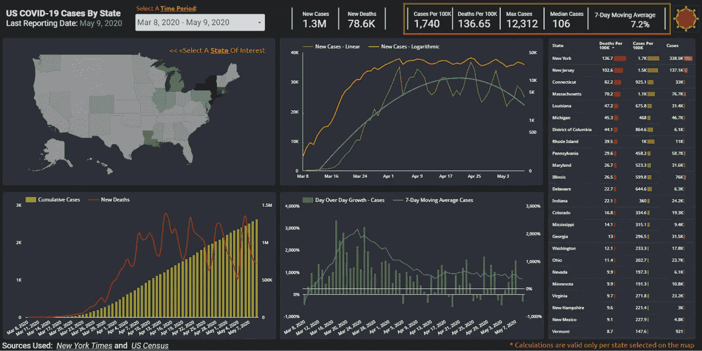

新冠肺炎数据工作室仪表板

在这个不确定的时期，你如何理解美国疫情州正在发生的数据海啸？在过去的几个月里，许多美国人发现自己每天都在查看新冠肺炎病例的传播情况。随着美国大多数州进入就地避难模式，像约翰霍普金斯大学和 91-DIVOC 这样的资源成为那些寻求保持信息的人的日常避难所。在今天的帖子中，我们将使用 Google DataStudio 创建我们自己版本的基于网络的、交互式的、视觉上吸引人的新冠肺炎仪表板。这样，我们将更好地理解所使用的数据，决定我们认为最相关的数据类型，并保持对可视化此类数据的最佳方式的控制，以帮助我们的受众最大限度地理解这些数据。在构建这些数据的过程中，我们将利用强大的 GDS 应用程序的各种对象和功能:Google Sheets connector、计算字段、记分卡、表格、地理地图、折线图和组合图、日期范围、过滤控件和最近发布的可选指标，这些是我们将介绍的一些功能，但不是全部。

*本文原载于作者的* [*博客*](https://blog.excelstrategiesllc.com/2020/05/11/plotting-us-covid-19-cases-in-google-datastudio) *。*

## **数据选择和初始准备**

任何数据可视化项目的第一步都是确定我们需要绘制的数据类型。在我们的案例中，如果适用的话，按州显示病毒的传播以及其增长率的潜在逆转将是有帮助的。对于我们的项目来说,*纽约时报*似乎是一个足够可靠的数据来源——幸运的是，他们在 GitHub [存储库](https://github.com/nytimes/covid-19-data)上提供了这些数据。事实上，我们可以选择在州或县一级使用这些数据。为了简单起见，我们将在报告中使用州级粒度。看着 NYT 的档案，他们似乎只显示*累计* COVID 病例和死亡人数。虽然累积疫情图表似乎主导了新冠肺炎的报告空间(即[约翰霍普金斯](https://coronavirus.jhu.edu/us-map))，但我认为其他也提供增长率的门户网站( [91-DIVOC](http://91-divoc.com/pages/covid-visualization) 等)更适合监测这种疾病的传播。

在累积报告的情况下，我们将始终(除了稍后确定的数据问题)让第二天的数据点等于或大于前一天的数据点；因此，从生成的图表来看，很难确定逐渐增长的水平。或者，只观察新病例，或者更好的是，绘制病例增长图可以帮助我们评估感染是否在下降。

我们还需要承认这样一个事实，即*确诊病例*数据不能提供美国各州之间的同类比较，因为不同的州在测试其居民时有不同的准备水平。与此同时，在衡量疾病的传播，特别是与 COVID 相关的死亡时，忽视州人口是不负责任的。(可以说，这是对潜在感染率的更准确的衡量，但仍然不准确，因为在按州、市等划分死因时，规则各不相同，而且常常是主观的。)为了查看基于人口的指标，我们还将把[美国人口普查](https://www.census.gov/data/tables/time-series/demo/popest/2010s-state-total.html)数据混合在一起。

使用 *NYT* 的数据，我们将按州/日期组合计算*新增*病例和死亡。为了进一步开发我们的数据，我们还可以计算*日同比增长率* h 和 *7 天移动平均增长率*。作为最后的数据准备步骤，我们需要将 COVID 数据与州人口混合，以估计每日人均*病例*和人均*死亡*指标。

自然，如果没有一些数据清理，我们的工作就不会完整。根据这一消息来源，佐治亚州*的累计新冠肺炎病例总数*在本报告从 4/11 的 12261 例增加到 4/12 的 12103 例时，发生了 **-158 例**的变化。*爱达荷州*经历了相似的命运，当它的总数因 **2** 病例从 5 月 2 日报道的 2061 例减少到 5 月 3 日的 2059 例。在这些关键时刻，当我们需要“数据、证据和科学”的时候，这些数据质量问题就显得特别麻烦。*世界卫生组织*报告我们有 **-99(！)**周日新增新冠肺炎病例。显然，他们改变了报告方法，以与 *CDC* 保持一致，但没有想到进行追溯[调整](https://twitter.com/ExcelStrategies/status/1259573719783137280?s=20)。为了说明这些不规则性，并使误导性增长率的影响最小化，我用值 1 替换了所有产生负新情况的计算。这意味着新病例的总和将与累计总数不匹配，但我认为这将是我们在这里处理的两个邪恶中较轻的一个。为了规范我们的图表比例，我对所有超过这个值的读数应用了 200%的日增长率上限。与此同时，我还从该工作表中排除了所有美国地区。

您可以访问结果 Google Sheets [工作簿](https://Bit.ly/2y4iudW) 以了解我们流程中的后续步骤。请确保将其保存到您的 Google Drive 中。

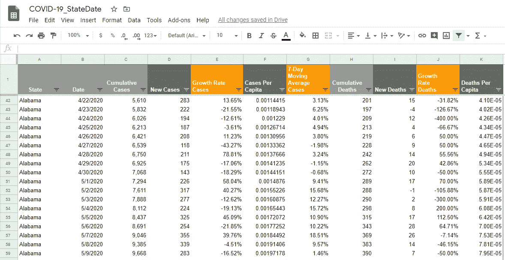

**创建新报告**

与许多其他数据可视化应用不同，DataStudio 不需要安装软件，谷歌也不收取使用该程序的任何费用。我们只需要登录我们的谷歌账户，导航到 DataStudio 的[主页](https://datastudio.google.com)(最好使用 Chrome 浏览器)就可以开始使用这个强大的工具了。单击左侧面板顶部的大加号或主菜单上的第一个选项，开始一个新报告。

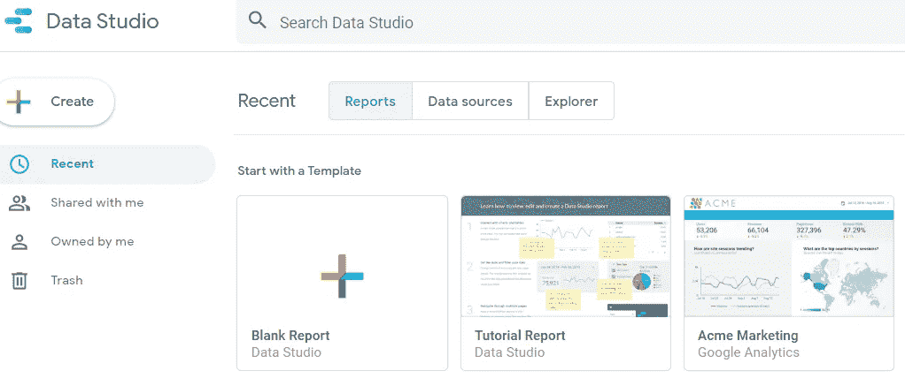

**建立与数据源的连接**

在我们有机会命名我们的报告之前，我们被要求连接到感兴趣的数据源。如果我们已经为另一个可视化使用了一个数据源，只需要再次使用它，我们可以点击 *My data sources* 选项卡，从可用的数据源中进行选择。否则，我们必须从 DataStudio 集成可用的 17 个数据连接器中选择一个来创建新的数据源。幸运的是 *Google Sheets* 是可用的连接器之一，让我们点击它。

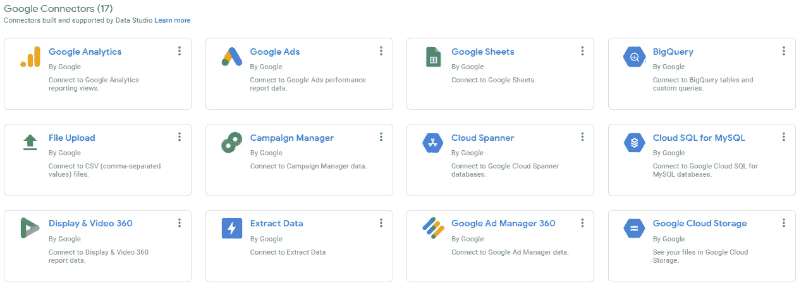

然后，我们将导航到包含我们的数据的工作簿，并选择包含它的实际工作表。您可能还记得，我们的文件名为'**新冠肺炎 _ 状态日期**，工作表名为'**状态数据**。做出选择后，保留所有其他默认设置，单击“添加”继续，然后通过单击“添加到报告”按钮确认您添加此数据的意图。

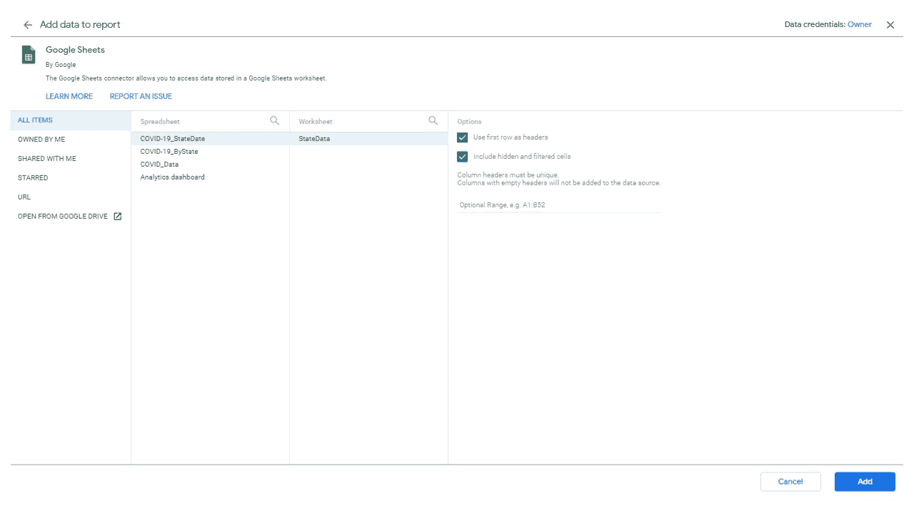

然后 Google 向我们展示了一个报告的默认视图。在继续之前，让我们确保我们的数据源为我们的数据使用正确的数据类型。选择“资源”菜单和“管理添加的数据源”子菜单，我们将进入下面的视图，在这里我们需要单击“编辑”来开始我们的探索。

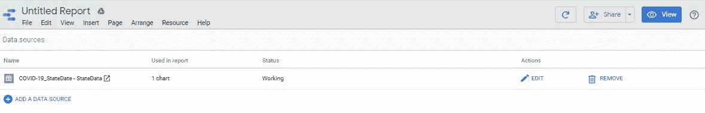

虽然所有其他数据字段似乎都符合我们的标准(稍后将详细介绍)，但需要将“State”字段从使用 *Text* 数据类型调整为使用 *Geo* 数据，更准确地说是使用 *Region* 数据。选择后，按“完成”、“继续”和“关闭”按钮顺序操作。

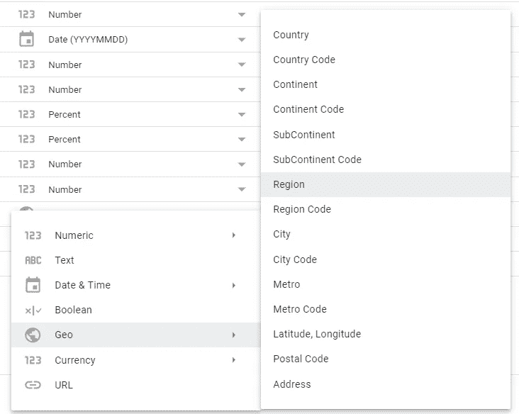

**报告格式和布局选项**

我们现在已经完成了工作中最繁琐的部分——处理数据，并准备开始进行更有创造性和趣味性的部分——实际的数据可视化。

现在，我们已经准备好命名我们的报告，为我们的仪表板选择合适的样式和大小。要重命名当前标题，只需用您喜欢的名称覆盖页面左上角的文件名即可——我将把这个破折号称为“各州新冠肺炎案例”。然后，让我们通过选择该对象并按下 *Delete* 键来删除默认情况下为我们创建的不需要的数据表 DataStudio。

谈到报告主题，DataStudio 提供了十几个选项；让我们导航到窗口右侧面板上名为' **Edge** '的那个，并选择它作为我们的主题。最后，让我们通过将选项卡选择从“主题”更改为“布局”来调整画布的大小—选择适用于此报告上的所有页面，或者右键单击报告并遵循“当前页面设置”来仅对所选页面进行调整。选择“页面”菜单—“当前页面设置”也可以做到这一点。我将设置一个自定义的画布大小**1600**像素宽和 **800** 像素高。我们的报告开始成形了:

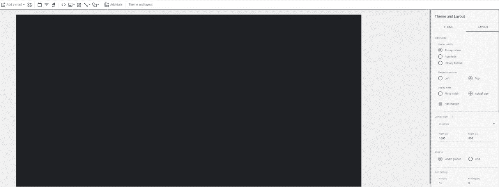

任何使用 Google Sheets 产品的人都会发现 DataStudio 的界面和功能非常熟悉。

* *File* 菜单允许我们使用不同的选项来共享我们的报告(很像同名的 Sheets 功能)、复制现有报告、创建新报告等等。

* *编辑*菜单将让我们执行与该菜单相关的典型功能:复制、粘贴、删除、撤销等。

* *视图*菜单选项乍一看可能相当出乎意料，但随着时间的推移，肯定会变得更有意义。如果您的主题没有删除默认的网格选项，您可以使用此处的命令来控制报告的网格。如果您希望根据数据源中的最新更新来刷新报表，您也可以“刷新数据”(？！)从这个菜单。

*我们可以使用*页面*菜单向报告添加新页面、重命名、复制/复制现有页面以及浏览报告。

*当您的文件中有多个页面时，您可以通过*排列*菜单来控制它们(包括它们的过滤器选项)。

*我们已经利用了*资源*菜单下的“管理添加的数据源”功能，您还可以管理和控制其他报告功能:过滤器、混合数据、参数等。

* *Help* 会做你期望从这个菜单中看到的事情，有趣的是，它还可以让你通过请求一个你希望添加到程序中的功能来引起谷歌工程师的注意。

*我们跳过了最有趣的菜单— *Insert* ，它使我们能够实际添加各种元素:图表、图像、文本、日期和过滤控件，以及报表的形状。

许多这些常用的对象也可以通过点击程序工具栏上的相应图标来调用。单击“添加图表”按钮，我们会看到各种图表对象，可以在报告中使用:数据和数据透视表、记分卡、折线图/条形图/饼图/面积图/散点图/子弹图、地理图和树形图:

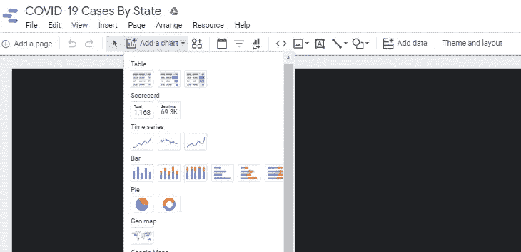

**使用非图表对象**

我们现在准备创建我们的仪表板。我最喜欢的 DataStudio 功能之一是完全控制画布——我们可以将对象放在任何我们喜欢的地方，并且我们可以轻松地调整它们的大小以适应我们的需要。

首先，我们将通过点击*文本框*对象(也位于*插入—文本*菜单下)为我们的报告添加一个标题标签。

让我们将这个对象放在页面的左上角，我将它命名为“*美国新冠肺炎州案例*”。然后让我们调整字体设置——将字体设置为*粗体*，将默认字体切换为*机器人字体*，并将字体大小更改为 *20* 。作为最后一步，谷歌似乎不能识别单词“COVID ”,让我们使用右键菜单选项将它添加到程序的字典中。

如果我们还指定了上次报告日期，这可能会对我们的读者有所帮助，上次报告日期恰好是在撰写本文时于 5/10/20 检索到的 *5/9/20* 。为了引用我们的来源，我们将使用另一个文本框，并将其放在我们页面的底部。在文本属性面板中的*左对齐*按钮的正下方，我们可以找到*插入链接*

按钮，让我们添加一个超链接到我们的文本。通过超链接向导，我们可以提供要显示的文本，共享链接的实际 URL，并确保链接将在新的浏览器选项卡中打开:

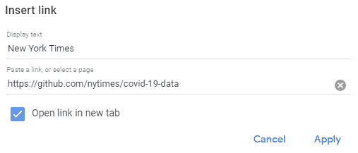

GDS 使添加图像到我们的仪表板变得很容易，在工作中你可能会在你的页面上加入公司的标志。出于我们的目的，让我们通过点击*图像*按钮来添加一个稍微修改的描绘冠状病毒的无属性[图像](https://pixabay.com/illustrations/coronavirus-symbol-corona-virus-5081896)

紧靠*文本框*的左侧(也可在*插入-图像*菜单中找到。)我们现在有两个选择:从本地驱动器上传或者提供图片 URL。我们将把这个控件放在我们的画布的右上角。

列表中的下一个是*日期范围*控件/过滤器

这给我们的报告增加了一层互动性。为了将观众的注意力吸引到这个控件上，让我们继续更改这个日期筛选控件的背景颜色，同时保持一致的字体。我们需要利用位于画布右侧的上下文*日期范围属性*面板:

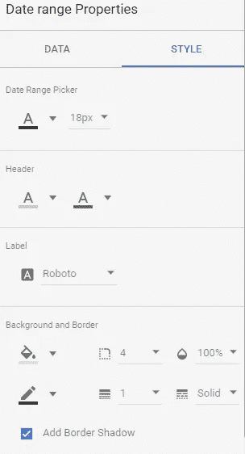

我们也有几个选项来管理实际日期*范围*，考虑到我们的数据集，让我们满足于从 3/8/20 开始的固定日历(大多数州在此之前没有开始报告确认的 COVID 病例，那些开始报告的州:华盛顿州、加利福尼亚州、纽约州各有不到 200 例病例)到 5/9/20(可获得的最后报告日期):

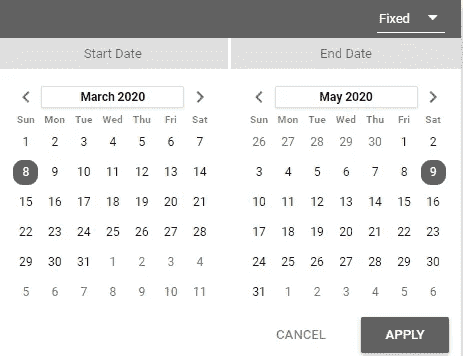

Next control 在技术上被认为是一种图表，但在我的书中，它是一种指标读数，DataStudio 称之为*记分卡*:

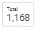

可以通过选择*插入*菜单并转到记分卡，或者通过工具栏上的*添加图表*按钮找到该控件。通过记分卡面板使用*数据*选项卡，我们可以将其指标设置为*新案例*汇总为总和。这将使我们能够在指定的时间段内对**所有确诊病例进行累计。注意*日期范围*维度设置为我们的日期【日历】控件。我们一次只能对该控件*使用不超过一个指标*(此处也提供可选指标选择)，并且不允许非日期维度:**

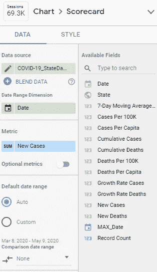

当谈到*样式*标签时，让我们确保我们的指标使用的是紧凑的数字(百万、千等)，将我们的字体改为 *Roboto* ，大小为 *24* 。最后去掉所有边框，让这个控件完全透明。请注意，作为持续改进和推出增强功能的一部分，GDS 最近在其列表中添加了*条件格式*功能:

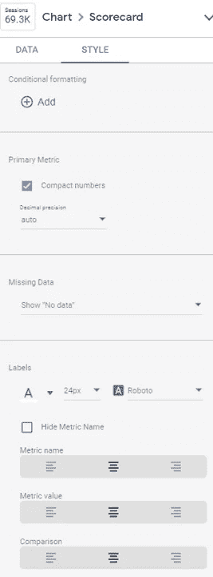

为了直观地将该记分卡与其他控件分开，让我们将它包含在两个 *lin* e 形状(*Insert-Line*)中。)

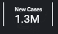

我们将重复这些步骤来描述新的*死亡人数。*

许多与 COVID 相关的可视化中的一个共同主题是，除了一些更好的可视化(已经提到的 *91-DIVOC* 等)之外，它们通常不会基于群体大小来归一化它们的数据集。加利福尼亚人比怀俄明人多 70 倍。)，在了解潜在感染率时考虑这一事实可能是有意义的[是的，我确实知道大多数 COVID 携带者可能没有经过检测，但这些确诊病例数是我们在使用更病态的指标(死亡人数)之外衡量疾病传播的最佳信号。]

虽然我们的数据集已经包括人均病例数和死亡数*，但为了更好的可读性，人口统计学家经常使用每 10 万人中的**。将我们的人均价值乘以 100，00 就能得出这一预期结果。这可以通过使用*计算字段*功能来完成。让我们导航到*资源*选项卡，并选择*管理添加的数据源*选项来编辑我们的数据源。然后，我们将单击*“添加字段”*按钮打开计算字段向导。***

**

*对于每 100K 个字段的*种情况，我们可以通过结合使用舍入函数和乘法来删除可能不必要的小数点:**

*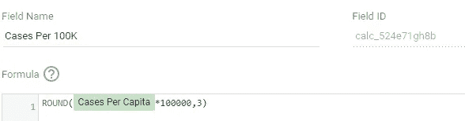*

*点击*保存*，然后*完成*保存您的更改。重复*每 100K 死亡人数*的计算。然后，让我们使用 MAX aggregation 为这些度量创建相应的记分卡—有效地对应于我们的日期范围中使用的最后一个日期。请注意，这将限制我们的计算仅在州一级有效，并阻止我们使用全国范围的指标。要显示的其他值得注意的指标可能是每天新病例的最大数量(确保根据需要重命名此指标)、我们范围内的病例中值数量以及最后一天的 *7 天移动平均增长率*。在本练习的前面，我们选择不更改源数据中的任何数据类型，幸运的是，我们可以仅为特定控件重新格式化数据类型——让我们确保将数字格式更改为 *Percent:**

*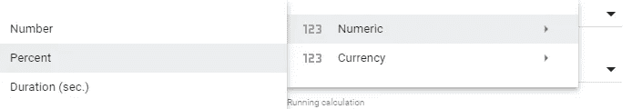*

*完成后，我们可以选择类似于下面的指标:*

*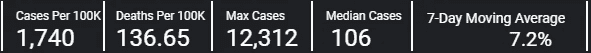*

***使用地理地图***

*由于我们将*州*作为数据源中的字段之一，并且我们能够将其重新格式化为地理数据类型，因此我们现在可以构建美国各州的交互式地图。让我们计划将此图表放在计划布局的左上象限。谈到条件格式，我们可以根据任何可用的指标来给这张地图着色，在我们的例子中，我们将使用“*每 100K 死亡人数*”。进入*插入*菜单，选择*地理地图*选项*

**

*会让我们从这里开始。*

*GDS 会自动将*日期*放入“日期范围维度”部分，识别*状态*为“地理维度”，我们的工作就是简单地将*每 100K 死亡人数*指定为“度量”。在“缩放区域”扩展到美国边境之外的可能性不大的情况下，做出适当的改变将是有帮助的。“数据”选项卡中的最后一步是选中“交互”部分下的*应用过滤器*框。这个强大的鼠标点击将神奇地为我们的地图控件添加交互功能，让我们可以根据状态选择过滤报告的其余部分:*

*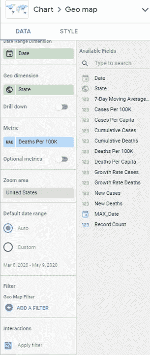*

*转到面板的“样式”选项卡，我们将使用“地理图”颜色选项来有条件地格式化最大/中间/最小颜色值:*

*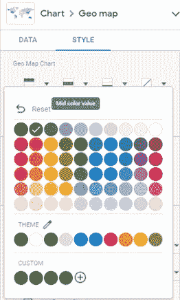*

*生成的地图快速显示人口调整的 COVID 死亡数据，并允许我们选择感兴趣的州来集中我们的分析工作。它现在看起来也相当像样:*

*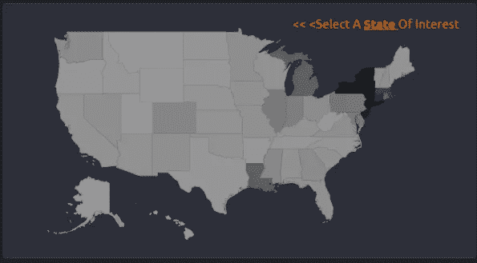*

***在时间序列图上绘制线性对数值***

*我从 91-DIVOC 网站上获得的一个很棒的想法是用对数标度绘制数值。这可能是有帮助的，因为在指数增长期间(即 COVID 的初始扩散)，使用对数标度更容易发现趋势。利用时间序列图的双轴特性，我们可以两全其美:在线性和对数标度上绘制新的案例值。与此同时，我们将在图表中添加一条趋势线。*

**指标*部分允许我们在图表上放置多个指标。在本例中，我们将使用“新案例”两次。“样式”选项卡让我们在*线条*与*条形图*之间选择图表类型，对于我们的时间序列可视化，我们可以通过在*左*与*右*轴之间切换来指定偏好的*颜色*、线条*权重*和双轴 Ys。*趋势线*功能允许对趋势进行线性指数和多项式描述。你可能要考虑在这张图表中做出以下选择。*

*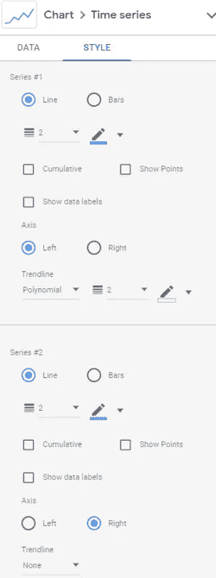*

*检查适当轴上的*对数刻度*框后*

**

*我们的时间序列图包含所有相关图表，有助于我们更好地评估与 COVID 传播相关的趋势:*

*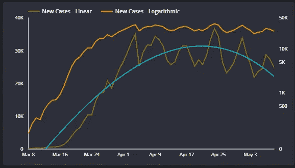*

***在双轴时间序列图上显示折线图和条形图***

*双轴图的一种更传统的用法是使用不同的刻度，并可能选择不同的图表类型。这正是我们下一步要做的。其中一个坐标轴将在条形图上显示*累计病例数*，而另一个坐标轴将通过折线图绘制一段时间内*新增死亡人数*。GDS 的一个受欢迎的新增功能是引入了*可选*指标。为了帮助我们的用户更好地与我们的仪表板交互，我们现在可以让他们指定感兴趣的指标。例如，我们可以将*累积死亡数*添加到图表的*数据*选项卡的适当部分:*

*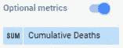*

*假设我们启用了图表标题“悬停时显示”[样式选项卡]，用户将能够从指标中挑选并在他们的自定义图表中使用:*

*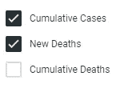*

*这一易于使用的特性可以使我们的受众成为真正的分析师。查看没有可选指标的结果图*，我们可以比较两种不同的趋势:**

*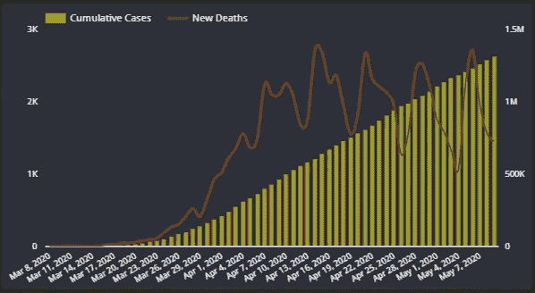*

***追踪新病例*增长率*增长率***

*下一张图表无疑是我们仪表板上最重要的图表之一。事实上，它试图帮助我们理解手头的数据——在哪个时间段，我们会经历新案件的增长或相对下降？幸运的是，正如数据准备部分所描述的，我们正好有适合这项任务的指标。我相信你有能力找到正确的方法来绘制新案件日复一日的增长率，以及新案件增长的 7 天移动平均线 T21。看看受灾最严重的州，纽约人的情况似乎有所好转，他们远离了 4 月 4 日 12，312 例新病例的高点，增长率接近或处于负值区域:*

*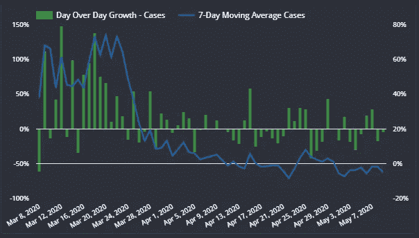*

***使用带横条的数据表***

**提供原始数据供用户使用是一种常见的做法，可以帮助用户获得信息，这些信息不容易在图表上汇总，因为存在大量的记录和使用不同的测量单位。幸运的是，我们可以合并 DataStudio 的*表*对象，或者更好的是，合并带有条的表*[实际数据和所述数据点的可视化表示的组合]来完成这项任务。我们这些从 Google Sheet 或者我敢说 MS Excel 来到 DataStudio 的人会发现这个功能非常熟悉。“样式”选项卡允许您自定义数据的外观。下表显示了在指定时间段内*状态*级别汇总的*每 100K 死亡数*、每 100K 病例数*和*新增病例数*指标:****

*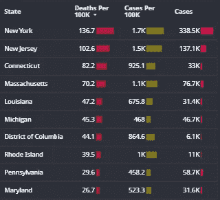*

***分享我们的工作***

*恭喜你，我们的工作现在已经完成，最后一步是与我们报告的消费者分享我们的数据。在我们希望向谁提供访问权限以及授予访问权限的类型方面，谷歌提供了很大的控制权。与其他谷歌产品类似，DataStudio 允许我们让网络上的每个人访问我们的工作，限制访问那些有链接的人(我们在这里采取的路线)，我们组织内的任何人，我们组织内的任何人*有*链接，或者更确切地说，限制访问我们通过共享他们的电子邮件地址信息呼叫的特定少数人。要找到这些选项，请跟随*文件*菜单，选择*共享*，然后点击*获取可共享链接*:*

*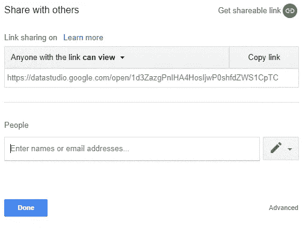*

*要查看我们刚刚创建的可视化效果，请随时点击此[链接](https://bit.ly/2SWwQ7r)。*

****您会考虑将哪些其他指标添加到该控制面板中？您还想在这个仪表板中加入其他数据可视化吗？****

****编者注:*** [*走向数据科学*](http://towardsdatascience.com/) *是一份以数据科学和机器学习研究为主的中型刊物。我们不是健康专家或流行病学家，本文的观点不应被解释为专业建议。想了解更多关于疫情冠状病毒的信息，可以点击* [*这里*](https://www.who.int/emergencies/diseases/novel-coronavirus-2019/situation-reports) *。**