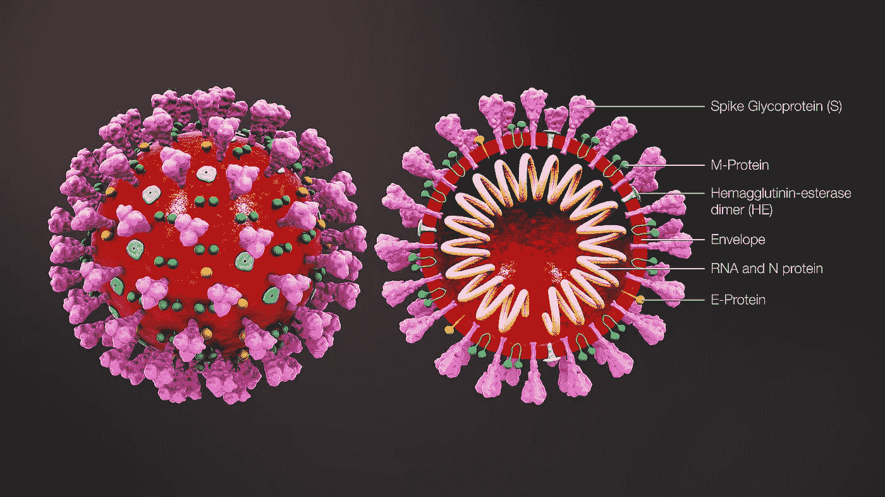
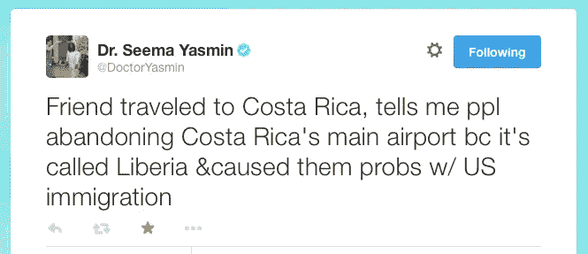
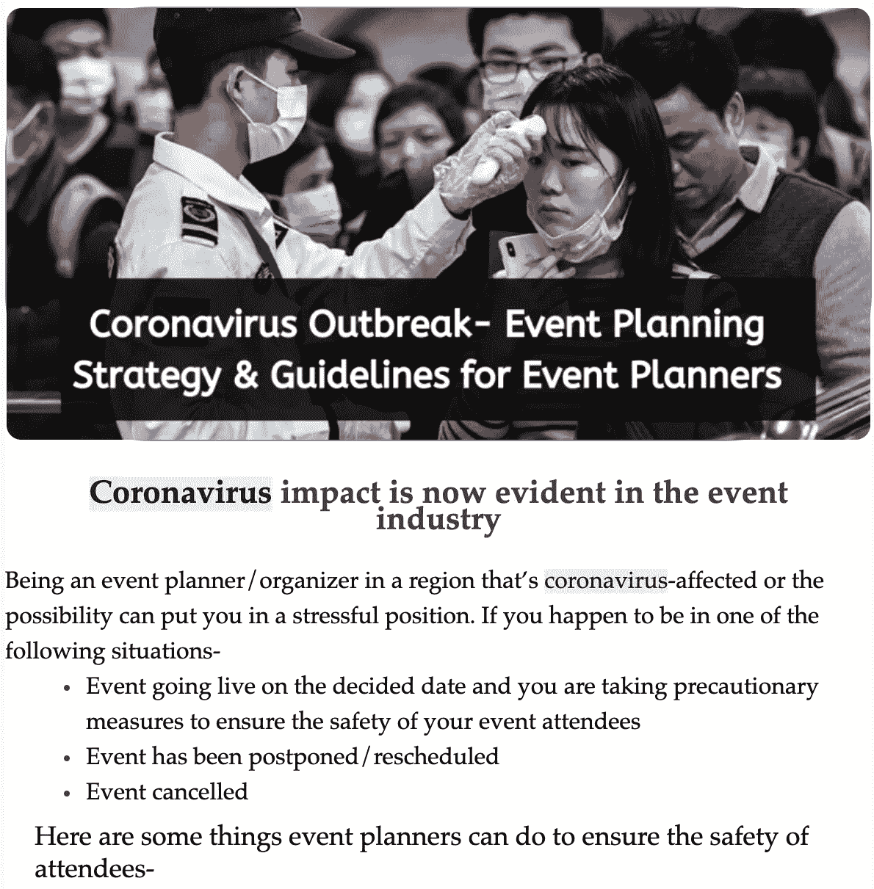
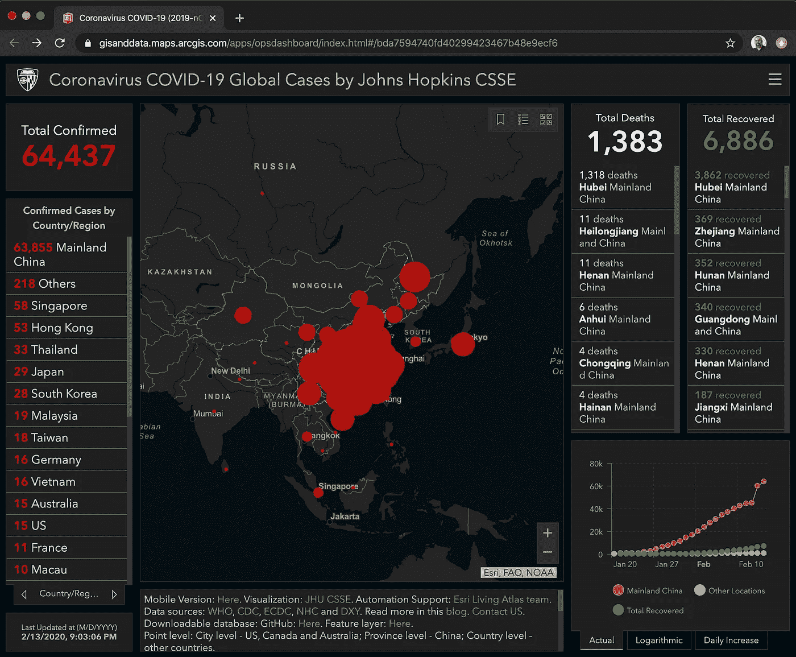
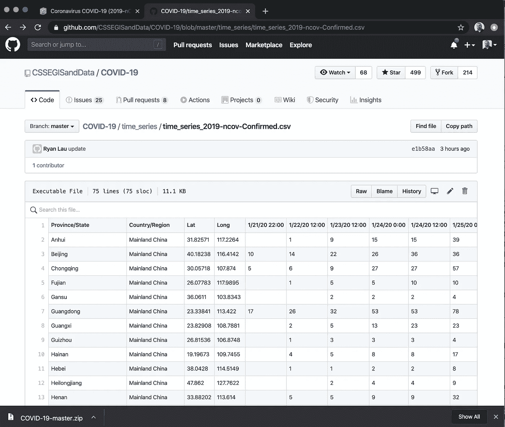

# 追逐数据:冠状病毒

> 原文：<https://towardsdatascience.com/chasing-the-data-coronavirus-802d8a1c4e9a?source=collection_archive---------12----------------------->



冠状病毒，里里外外。来源:疾控中心；在维基百科上引用([http://ow.ly/H1aD50ym8XB](http://ow.ly/H1aD50ym8XB))

## *关于冠状病毒大数据分析的效用(或无用性)(迄今为止)*

# 序言:埃博拉

当我在社交媒体应急管理(SMEM)项目[埃博拉病毒信息](https://www.facebook.com/ebolavirusinfo/)和[埃博拉社交媒体联盟](https://www.facebook.com/groups/ebolasocialmediacoalition/)(特别是我保存的[文件](https://www.facebook.com/groups/ebolasocialmediacoalition/files/))上投入大量时间时，我经常被留下来追踪数据。报道，甚至来自官方的政府来源，经常是相互矛盾的，姗姗来迟的，或者完全错误的。当我于 2015 年 3 月 28 日[提交上一份报告时，已有 24，907 例确诊病例和 10，326 例死亡归因于埃博拉——这听起来约为 40%的死亡率。](https://www.facebook.com/notes/ebola-social-media-coalition/ebola-situation-report-analysis-march-2015/1551493668457938/)

尽管我转向了其他项目，但这种疾病仍在非洲肆虐。根据世界卫生组织(世卫组织)一年后于 2016 年 6 月 10 日公布的最终分析，共有 28616 例埃博拉病例，11310 例死亡，死亡率为 39.5%。我离得不远。

在漫长的考验中，世卫组织有时不得不收回数字。有关于这种疾病的虚假报道，后来证明是拉萨热、疟疾或其他疾病。

这导致了各种阴谋论和非理性的恐惧。特别是在非洲，埃博拉是对公共卫生的真正威胁，然而即使在世界各地，病例很少或根本不存在，人们也普遍感觉到了埃博拉。


埃博拉病毒触动了很多人的神经。感谢《连线》杂志激起了人们最大的恐惧。

连线撰稿人[玛丽恩·麦肯纳](https://marynmckenna.com/) 的 [***细菌女孩***](https://germgirl.tumblr.com/) 的进一步冒险，回想起来特别有启发性(目前是前五页的结果)。它记录了人们把自己逼入的非理性的疯狂状态。例如，美国海关对那些从哥斯达黎加丹尼尔·奥杜伯·基罗斯国际机场出发的人来说是个问题，仅仅因为它位于哥斯达黎加利比里亚*镇。*



*(CBP 提示:利比里亚，哥斯达黎加≠利比里亚蒙罗维亚)*

在全球范围内，2014 年至 2016 年期间，全球总人口为 74 亿，其中发现了 28，616 例埃博拉病例。这是一个只有 0.00038%的发病率(感染埃博拉病毒的几率)，即每 10 万人中约有 0.38 人。与日常癌症相比，发病率为十万分之[439.2](https://www.cancer.gov/about-cancer/understanding/statistics)，你比埃博拉 *多了 ***x1，135 个患癌几率。****

这并不是要低估疫情的严重性，也不是要低估任何实际接触或感染这种疾病的人，或任何认识受感染者的人的困境，无论是经济损失、情感创伤、痛苦还是死亡。

然而，对世界其他地区来说，这是一个我称之为“显微镜/望远镜”的非理性放大问题:那些远离疾病中心的人将它视为直接临近并威胁着他们的生命。就好像，通过望远镜观察，你认为木星在你的膝盖上。(提示:如果是的话，你可能已经因为 2.5 克的重力而喘不过气来，并被可怕的低温瞬间冻结了。)

# 新型冠状病毒(又名 2019-nCov 又名 COVID19)

目前 2019 年中国爆发的冠状病毒也出现了同样的模式。起初很难掌握这些数字。由于方法的改变，最近的病例在一夜之间从大约 45，000 例增加到 60，000 例。他们一直使用实验室确认的病例来计算疾病。这是“准确的”数据，但不是“及时的”实验室处理的滞后使得计数少得可怜。因此，对于每日更新来说，这最终是不准确的。当他们最终揭示了这种滞后，并转而转向基于临床症状的诊断时，这就是导致人数激增的原因。根据症状，一天内报告了 13，332 例额外病例，另有 1，820 例实验室确认病例。这是 15，152 次跳跃，其中只有 12%是实验室确认的。

其中一些病例最终会被认为是误诊而不予考虑。但他们宁愿在谨慎和数据的即时性方面出错，也不愿在计算潜在病例时多花几天或几周时间。

本质上——请原谅这种类比——中国和世界卫生组织不得不将公共卫生突发事件从高度一致但无法跟上病例吞吐量的数据集转变为高度可用、最终一致的数据集(最终将排除误报)。这是我现在的雇主 ScyllaDB 恰好是理解的专家。

就公共数据集而言，公众必须意识到你无法看到原始信息。想象一下，在美国，HIPAA 合规性会带来怎样的隐私权问题。公共卫生官员不会分享受影响者的确切姓名和身份，更不用说他们数周内的所有可疑接触。公众所能期望的最好结果是分析汇总的、轶事的或偶然的数据和元数据——比如社交媒体帖子或全球航班信息。一些公司如 T2 蓝点 T3 和 T4 meta biota T5 已经有了提供这类数据分析的服务。但是，这些都不是公开的数据集。

你也不会看到任何一种像魔法间谍电影一样的电脑特效，直接放大到谁被确诊的记录，过去几天或几周内他们所有接触者的霓虹色图表，然后快进到他们在那段时间可能在哪里的所有监控录像。(“看！那里！厨子没洗手！”)虽然关于中国政府监控的算法监控已经讨论了多年，但很明显，这种系统无法像某种超级科学一样阻止疾病爆发。

# 科罗纳诺亚已经来了

没过多久。科罗纳诺亚已经来了。灾难奸商已经在试图让你购买他们的产品或服务作为灵丹妙药或灾难预防。例如，今天在我公司的收件箱里出现了这个:



不，这是真的。我希望不是。[由于冠状病毒，今年在巴塞罗纳举行的世界移动通信大会](https://www.npr.org/2020/02/12/805389763/major-smartphone-trade-show-canceled-amid-coronavirus-concerns)刚刚收起了帐篷。

*   西班牙人口:4666 万
*   西班牙迄今冠状病毒病例总数:2
*   西班牙冠状病毒发病率:4.28632662e-8，即十万分之 0.00428
*   2019 年世界移动通信大会与会者总数:109，500 人
*   MWC 感染冠状病毒的估计人数:0.0046

那么，为什么要取消一项几乎没有人会感染冠状病毒的活动呢？请注意，参加会议或在飞机上生病仍然有更大的统计概率感染基本的[流感](https://www.cdc.gov/nonpharmaceutical-interventions/gathering/event-attendees.html)——流感波动很大，美国每年有 3%-20%的人感染流感。然而，很少有人因为害怕流感而放弃某项活动。

那么，为什么取消冠状病毒？好吧，科罗纳诺亚。西班牙的那两起案件，再加上游客从中国来西班牙的可能性，导致整个节目崩盘。一个接一个的多米诺骨牌倒下了。诺基亚、沃达丰、德国电信退出了。爱立信、索尼、英特尔、LG、亚马逊……

具有讽刺意味的是，中国巨头华为想要坚持到底。地区卫生官员 Alba Verges 说“[没有公共卫生理由取消任何活动](https://www.reuters.com/article/us-china-health-mobileworld-minister/spanish-health-authorities-say-no-reason-to-cancel-mobile-world-congress-idUSKBN20627W?il=0)”并且该地区“冠状病毒的风险非常低”，这并不重要

主要的主播赞助商已经放弃了。嘣。表演结束了。

这场演出预计将为当地经济带来大约 5 亿美元的收入(确切地说是 5 . 13 亿美元，以及 13，900 个临时工作岗位)。但是波及范围将远远超出加泰罗尼亚。联合航空公司专门为 WMC 增加了航班，将观众带到西班牙，并向 T4 提出接受取消航班并免除他们的费用。更不用说全球业务因重大产品发布中断而搁置，无法捕捉的线索和密室谈判现在被扼杀，这通常发生在这样一个重大的贸易活动中。

由于担心中国游客，这不是唯一取消的活动。耶鲁大学的模拟联合国活动最近也被取消了。在他们的活动取消五天后，结果是学生得了…你猜对了，流行性感冒。

更新[2020 年 2 月 14 日]: [IBM 刚刚退出 RSA 会议](https://www.lightreading.com/security/ibm-pulls-out-of-rsa-conference-citing-virus-outbreak-concerns/d/d-id/757535)。正如他们在《双峰》中所说，“又发生了。”


虽然科罗纳诺亚将对许多人的生命和死亡产生实际影响，但它对中国经济的负面影响超出了其实际比例，对整个全球经济的影响较小。由于其影响，中国自身在一个季度内的 GDP 增长将减少 1.5%(全年 0.6%，因为经济学家预计会出现反弹)。

# 最佳信息来源

因此，尽管冠状病毒*是*的一个重大健康风险，并且如果你生活在受影响的地区或与来自那里的人接触过，有*的理由担心，但重要的是每个人都不要因为无知和过于频繁的种族主义冠状病毒而陷入膝跳反应。*

那么，从哪里获得你的事实呢？

鉴于我在 SMEM 的背景，在 Twitter 上，像 [@COVID19Info](https://twitter.com/COVID19Info/) 和 [@DataCoronavirus](https://twitter.com/DataCoronavirus) 这样的弹出柄让我深受鼓舞。干得好，伙计们！

然而，我自己的最新和最权威的统计数据网站是基于 Esri GIS 系统的[约翰霍普金斯 CSSE](https://systems.jhu.edu/) [**冠状病毒新冠肺炎全球病例**](https://gisanddata.maps.arcgis.com/apps/opsdashboard/index.html#/bda7594740fd40299423467b48e9ecf6) 仪表盘。



截至 2020 年 2 月 13 日 09:14 太平洋时间的冠状病毒数据

在一家大数据公司工作时，我想知道是什么样的系统在驱动这一切。一定很大，对吧？

没有。

对我来说，值得注意的是用于构建它的数据集的大小是如此之小(你可以在 Github [这里](https://github.com/CSSEGISandData/COVID-19)找到它)。下载整个回购文件会产生一个巨大的 *158kb* 的未压缩文件夹。每天的案例更新大约为 1-2kb。确诊病例、死亡病例、康复人员的时间序列文件分别为 11kb、8kb、9kb。总共有 58 份文件。

这不是大数据。这是非常小的数据。它能装在 1976 年的 5 英寸 360 千字节软盘上。

非常抱歉。

是啊。很明显，这不是原始数据，而是汇总的数据。比如说。time _ series _ 2019-ncov-confirmed . CSV 文件的前几行如下所示:

```
Province/State,Country/Region,Lat,Long,1/21/20 22:00,1/22/20 12:00,1/23/20 12:00,1/24/20 0:00,1/24/20 12:00,1/25/20 0:00,1/25/20 12:00,1/25/20 22:00,1/26/20 11:00,1/26/20 23:00,1/27/20 9:00,1/27/20 19:00,1/27/20 20:30,1/28/20 13:00,1/28/20 18:00,1/28/20 23:00,1/29/20 13:30,1/29/20 14:30,1/29/20 21:00,1/30/20 11:00,1/31/20 14:00,2/1/20 10:00,2/2/20 21:00,2/3/20 21:00,2/4/20 9:40,2/4/20 22:00,2/5/20 9:00,2/5/20 23:00,2/6/20 9:00,2/6/20 14:20,2/7/20 20:13,2/7/20 22:50,2/8/20 10:24,2/8/20 23:04,2/9/20 10:30,2/9/20 23:20,2/10/20 10:30,2/10/20 19:30,2/11/20 10:50,2/11/20 20:44,2/12/20 10:20,2/12/20 22:00,2/13/20 10:00,2/13/20 21:15
Anhui,Mainland China,31.82571,117.2264,,1,9,15,15,39,39,60,60,70,70,70,106,106,106,152,152,152,200,200,237,297,408,480,480,530,530,591,591,591,665,733,733,779,779,830,830,830,860,889,889,910,910,934
Beijing,Mainland China,40.18238,116.4142,10,14,22,26,36,36,41,51,68,68,72,80,80,91,91,91,111,111,111,114,139,168,191,212,212,228,253,274,274,274,297,315,315,326,326,337,337,337,342,342,352,366,366,366
Chongqing,Mainland China,30.05718,107.874,5,6,9,27,27,57,57,75,75,110,110,110,132,132,132,147,147,147,165,182,211,247,300,337,337,366,376,389,400,400,415,426,428,446,450,468,473,486,489,505,509,518,525,529
```

实际上，在 Github 中查看它更容易，看它告诉你什么:



它基本上是一个简单的电子表格格式的 CSV 文件，包含每个城市的每个报告期。1 月 21 日 22:00 更新。1 月 22 日和 1 月 23 日，中午 12:00 收到报告。然而，1 月 24 日有两份报告；一个从 0 点(午夜)开始，一个从中午 12 点开始。有些日子有三天(1 月 25 日有 0:00、12:00、22:00)。其他人有字面上(数字上)的奇数偏移(1 月 26 日有 11:00，23:00)。不幸的是，没有元数据指示使用什么时区偏移(GMT？中国标准时间？).

在像 Scylla 或 Cassandra 这样的现代数据库上，这些数据库可以扩展到 TB 和 Pb，这个数据集很容易作为一个 blob 放入一个小记录中。尽管这可能不是最好的数据模型。你肯定想把它分成几列，这样才有用。但是，如果这就是您要向其提供的所有数据，那么甚至不值得启动集群。

然而，这一小块微小的数据是约翰霍普金斯仪表板需要告知世界传染病的传播。

公平地说，你仍然可以用它做一些分析，即使是对这一点点数据。普华永道的数据科学家 Kamran Ahmad 前几天写了一篇很棒的博客，用 [NumPy](https://numpy.org/) 分析了这一小部分数据，并通过 [Matplotlib](https://matplotlib.org/) 和 [Seaborn](https://seaborn.pydata.org/) 将其可视化。编辑:[2020 年 2 月 14 日 Lewis Chou 的另一篇博客[刚刚发表在](/what-can-data-visualization-help-in-the-battle-against-the-novel-coronavirus-bad9b2c7fb2b)[走向数据科学](https://towardsdatascience.com/)上，其中他用各种数据来源整理了一些非常方便的图表，其中一些可能会让那些分析行为模式的人感兴趣。迁移和旅行数据分析、远程办公模式和一些医院仪表板。虽然没有直接使用新的冠状病毒数据集，但这种分析是 BlueDot 和 Metabiota 为他们的客户做的事情。

但是……人们仍然需要寻找关于新型冠状病毒本身的真正大数据。千兆字节在哪里？兆字节在哪里？

当你搜索“冠状病毒”时，HDX 只有约翰·霍普金斯大学的数据(在 COVID19 或 2019-nCov 上搜索，结果除了大量的误报之外什么都没有。)

Data.gov[搜索结果](https://catalog.data.gov/dataset?q=coronavirus&sort=score+desc%2C+name+asc&as_sfid=AAAAAAWRiOq3bYc3iN2FqgNeWONiWhmsNanpaGnWZLwrg3kYGV4d3VGdgQZ5f9x8Rd_e_FYk9ia4gpBlt0E3GU7fc1CAYpDeHRSjOVdhkSNpNlYbs0KUMKTePhXUK0JeeuhHSsM%3D&as_fid=43a01e871cc0ea97f90b63f20696669a64cba4b3)出现 6 个“冠状病毒”数据集不幸的是，这些结果都是针对我们已知的另一种主要冠状病毒——SARS。不适合新的、独立的 2019 菌株。

再说一次，我确信像世卫组织这样的政府间机构，各种政府和公共卫生组织，医院，实验室和非政府组织有更多的数据，他们不能，也永远不会公开分享。但是希望，随着时间的推移，可以有一些更丰富的数据集可以与世界共享。或者，至少，与数据科学家和数据工程师专业人士在一些分析公私合作伙伴关系。

对于联系人追踪，我个人倾向于像 [JanusGraph](https://janusgraph.org/) 这样的图形数据库。如果你有成千上万个案例，每个案例可能有数百个联系人要跟踪数周，这很容易导致数千万条边。您可以构建许多 Gremlin/Tinkerpop 查询。

对于各种时间序列分析，你可以看看锡拉。但是，同样，只有当你当前或预期的数据集是*巨大的*时。坦率地说，即使 Scylla 中有 100，000 条记录，考虑到我们一秒钟可以扫描 10 亿行，还是有点令人失望。

目前，那些拥有大数据背景、希望进行分析并从数字方面贡献自己的技能来解决这一问题的人需要有一点耐心。原始数据集对公众来说并不存在。但我确信，在适当的时候，你的技能和才能会对疫情前线的当权者有用。