# 聊天图像到文本对话

> 原文：<https://towardsdatascience.com/chat-images-to-textual-conversation-c44aadef59fe?source=collection_archive---------41----------------------->

## 使用基于深度学习的光学字符识别(Tesseract 4)从聊天图像中提取 JSON 格式的消息

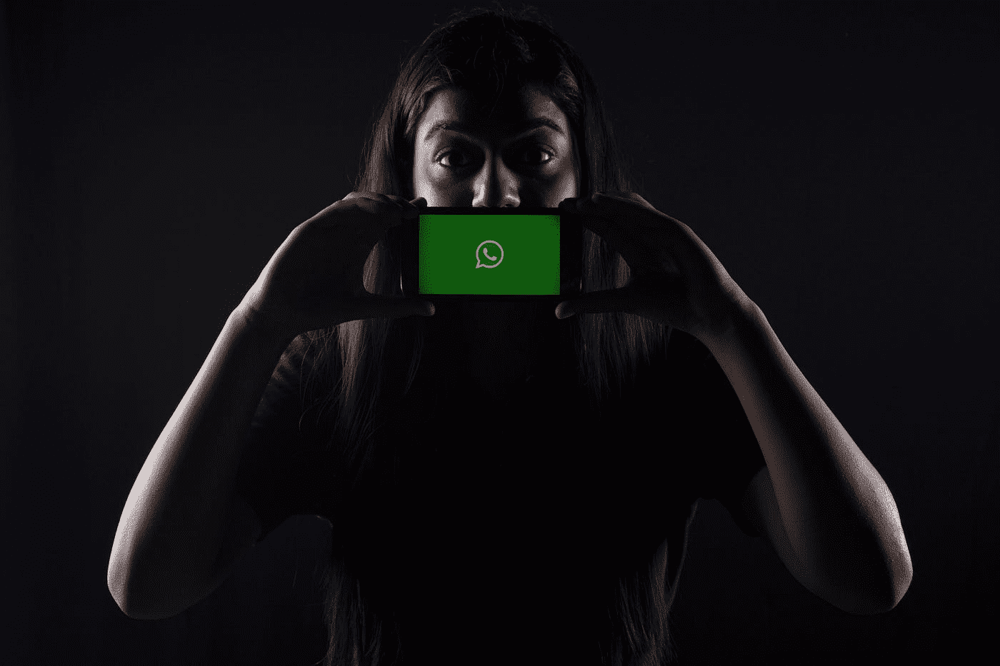

[Unsplash](https://unsplash.com?utm_source=medium&utm_medium=referral) 上 [Rachit 坦克](https://unsplash.com/@rachitank?utm_source=medium&utm_medium=referral)拍摄

最近，社交媒体上流传着许多聊天图像，可能是与客户服务的聊天图像，或者只是来自 WhatsApp 或脸书的有趣聊天图像，也可能是任何重要的群体对话。这些数据在互联网上随处可见，却没有得到很好的利用。

Messagink 向我介绍了这个问题的一个有趣的用例。任务是将聊天图像中的信息提取成 JSON 格式。所以，我想为什么不探索这个领域，看看是否能在这个特定的领域有所成就。

我开始的任务是接收聊天图像并从中提取 JSON 对象。这个看似简单的任务包含了许多错综复杂的问题。每一个都要求我迭代我的方法，并使用机器学习概念来解决它们。让我们详细研究一下这些问题。

首先，我必须找到一个好的库，能够以非常高的精度检测图像中的文本。我搜索了很多，通读了很多库的利弊，最终敲定了谷歌的 tesseract 库(从 2006 年开始由谷歌赞助，在此之前由惠普实验室开发)。传统宇宙魔方是一个多阶段的过程。首先使用阈值对图像进行二值化，随后确定连接的部分和它们之间的连接，字符分类和聚集字符以形成单词、行、段落。更多细节可以在这篇[论文](https://static.googleusercontent.com/media/research.google.com/en//pubs/archive/33418.pdf)中读到。

2018 年 10 月，他们推出了 tesseract 4，该产品在底层使用双向 LSTMs 来完成 OCR 任务。此后，他们进行了多次改进，最新版本于 2019 年 12 月 26 日发布。要了解更多关于宇宙魔方 4 如何使用深度神经网络的信息，请阅读这里的。我们将在所有任务中使用宇宙魔方 4。

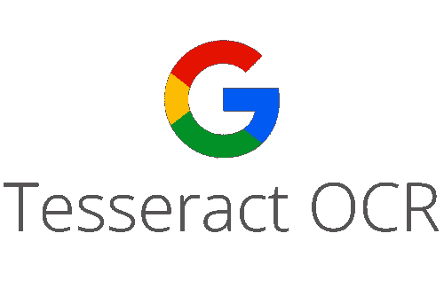

宇宙魔方(谷歌照片)

最初，我只是输入一些聊天图像来吐槽文字。我用“宇宙魔方”包装宇宙魔方，因为使用它的结果是精确和准确的。我从图像中获取文本，但最难的部分是从这些文本中获取一些意义。例如，如果是两个人之间的聊天，我们如何分离文本信息，我们如何从图像中删除不想要的文本，我们如何检测信息的时间。所以这是接下来需要关注的几个挑战。

为了能够解决所有这些问题，主要问题是检测文本行周围的边界框。下图显示了文本周围的红色边框

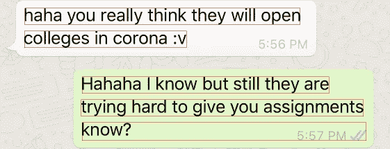

红色边框(作者照片)

理想情况下，我想检测每个消息周围的边界框，但很难找到这样的工具。而“pytesseract”正在检测字符周围的单个边界框，这不符合我的目的。我在 tesseract 周围找到了另一个包装器“tesserocr ”,它展示了检测每行文本周围的边界框的功能，但是“tesserocr”的文本识别不如 pytesseract 准确，因此我决定使用 tesserocr 进行边界框检测，并使用 pytesseract 的 image_to_string 函数来识别该边界框中的文本。下面的代码片段显示了 tesserocr 和 pytesseract 的基本功能

```
final = cv2.imread(img, cv2.IMREAD_UNCHANGED)
# since tesserocr accepts PIL images, converting opencv image to pil
pil_img = Image.fromarray(cv2.cvtColor(final, cv2.COLOR_BGR2RGB))
#initialize api
api = tesserocr.PyTessBaseAPI()try: # set pil image for ocr
 api.SetImage(pil_img) boxes = api.GetComponentImages(tesserocr.RIL.TEXTLINE,True) height, width, c = final.shape
 print(height, width)
 inc = int(0.01*width) for i, (im,box,_,_) in enumerate(boxes): x,y,w,h = box['x'],box['y'],box['w'],box['h']

   crop_img = final[max(0, y-inc):min(y+h+inc,height), max(0, x-inc):min(x+w+inc, width)]

   cv2_imshow(crop_img)
   cv2.waitKey(0)
   extractedInformation = pytesseract.image_to_string(crop_img)
  print(extractedInformation)
```

最后，我们有了边界框和文本。现在必须好好利用这些边界框。考虑两个人聊天，第一个主要任务是准确分离他们之间的消息。我只是使用了每个边界框的起始边缘的 X 坐标，并将其与阈值进行了比较。阈值根据图像的宽度决定，以处理不同分辨率的图像。所以我希望 threshold 是这样一个值，即左边消息的边界框起始边缘的 X 坐标小于 threshold，而右边消息的边界框起始边缘的 X 坐标大于 threshold。在对 whatsapp 图像进行大量实验后，发现将阈值保持为图像宽度的 10%比较合适。这有助于隔离两个人之间的信息。下图显示了阈值如何映射到图像上。**蓝点表示阈值，而红框是文本上的边界框。**

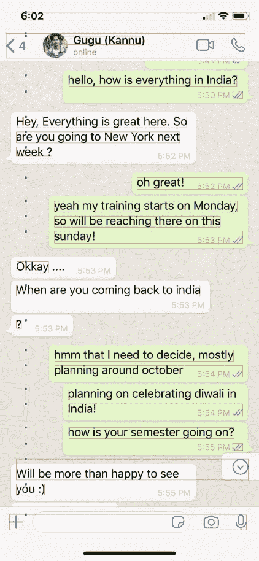

隔离邮件的阈值(蓝色)(作者提供图片)

因为“tesserocr”每行检测一个边界框，所以长于一行的消息被分成多行。我不得不把属于同一信息的所有行整理在一起。文本周围的边框在这里也扮演了重要的角色。所以我注意到，同一封邮件中的边框的 Y 坐标之间的差异小于不同邮件中的边框。因此，我们可以再次使用一个阈值来决定是否对文本行进行排序。对不同分辨率的 whatsapp 图像进行实验，结果表明使用阈值作为图像宽度的 1%是最佳选择。在下图中，你可以看到同一封邮件中的行是如何足够近，而不同邮件中的行又是如何的远。**绿色注释显示两个不同消息边界框之间的 Y 坐标差异，蓝色注释显示同一消息各行之间的 Y 坐标差异。**

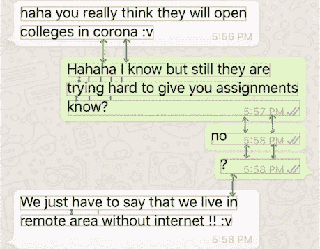

将文本行整理成消息的逻辑(作者提供照片)

不错！所以现在我们把文本行整理成信息，并在两个人之间分开。输出的下一个问题是在图像的页眉或页脚检测到了不必要的噪声。例如，在 whatsapp 聊天图像中，如果全屏拍摄，会在图像的顶部或底部检测到一些东西，如下所示。现在困难的部分是我们如何知道图像是裁剪过的还是完整的图像。我试着从字体大小中找出标题，或者试着把名字映射到头像图片附近，但是都没有给出有希望的结果。然后，我突然想到，来自同一来源的图像会有完全相同的模板。也就是说，如果截图来自特定人的 IOS 设备，它们将具有相同的标题和底部模板。我肯定可以使用图像减法来检测差异，并只取包含所有差异的最大边界框。但是实现比这个想法更难，我使用 opencv 的功能来提取这样一个边界框。我将使用来自同一来源的 2 个聊天截图来解释以下过程:

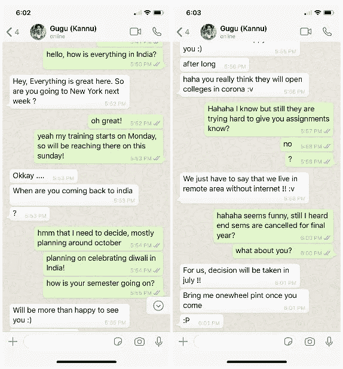

左:图片 1，右:图片 2(作者照片)

*   首先，我们逐像素地减去两幅图像。这有助于突出两幅图像的差异。然后，我们将这些图像的大小调整为 1/4，以加快处理速度。

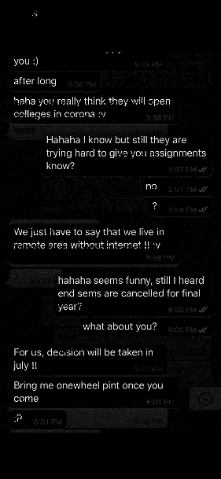

两幅图像的差异(作者提供照片)

*   然后我们执行形态学闭运算。它在关闭前景对象内的小孔或对象上的小黑点时很有用。从而允许将附近的差异聚集在一起。我们执行 20 次闭合操作迭代两次，以完全聚集差异。

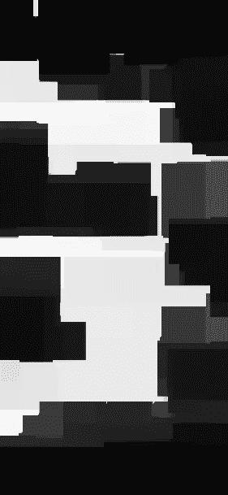

形态学封闭操作:先扩张后侵蚀(作者摄影)

*   然后，我们对从步骤 2 获得的结果应用阈值来加强差异。

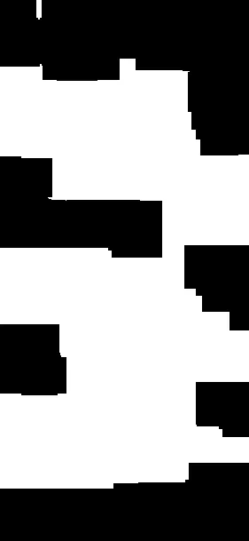

使用阈值像素值 20 进行阈值处理(图片由作者提供)

*   之后，我们从结果图像中提取连接的组件，并在每个连接的组件周围绘制实体边界框。这会使图像中被主要差异包围的整个区域变亮。

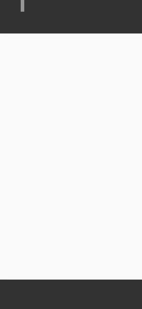

连接组件分析后的输出(作者提供照片)

*   在此之后，我们运行最终的连接组件分析，以提取每个区域的边界框，在我们的情况下，我们希望提取中间的白色大框，因为这将有实际的聊天内容。
*   我们裁剪从图像中获得的第一个区域，因为它将包含人们之间的实际聊天，消除图像顶部或底部的任何噪声。在我们的例子中，结果如下:

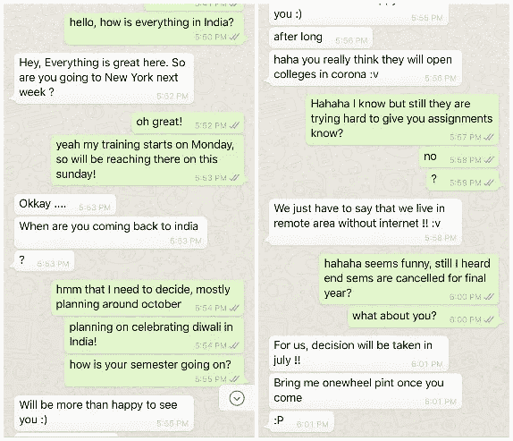

左:裁剪后的图像 1，右:裁剪后的图像 2(作者提供的照片)

因此，最后我们能够裁剪图像，如果任何页眉或页脚存在。下一步是消除从边框中识别文本时遇到的一些噪声。在某些行中,“pytesseract”也探测到了时间，它被附加在文本的末尾。我们不得不把这段时间从文本中删除。 ***我们使用 12 小时和 24 小时格式的时间正则表达式来检测文本中的时间，并相应地将其去除。***

在执行了所有这些步骤之后，算法就准备好了，并且对测试图像给出了良好的结果。我们在 messagink.com 部署了它，你可以在下面的网站上看到它正在工作。(您必须创建一个故事并选择导入选项。)

[](https://messagink.com/) [## Messagink -讲述你的故事

### 发现有趣的故事。使用我们的编辑器创建您自己的文本故事。免费发布。

messagink.com](https://messagink.com/) 

然而，当我们开始在这上面扔随机图像时，出现了几个问题。我们的目标是尽快解决下面列出的所有这些问题:

1.  脸书/电报图像—除了消息之外，他们还有头像，所以我们必须相应地改变我们的 X 轴阈值。
2.  启用黑暗模式的截图效果不佳。
3.  表情符号检测是一个巨大的挑战，这是我们接下来要做的。
4.  需要处理来自连续图片的消息之间的重叠。
5.  WhatsApp 图片需要去除蓝色勾号。

我将在下一篇博客中公布我找到的解决这些问题的方法。让我开始黑这些，回头见…

感谢 [Akshat Sharma](https://medium.com/u/bd8d094402aa?source=post_page-----c44aadef59fe--------------------------------) 在这项工作中的合作:)！

更新:我也发表了博客的第二部分，请在这里阅读:

[](/chat-images-to-textual-conversation-part-2-8260c09a032e) [## 聊天图像到文本对话:第 2 部分

### 所以我又来了，第二部分是从聊天图像到文本对话。如果您还没有阅读第 1 部分，我…

towardsdatascience.com](/chat-images-to-textual-conversation-part-2-8260c09a032e)