# 聊天图像到文本对话:第 2 部分

> 原文：<https://towardsdatascience.com/chat-images-to-textual-conversation-part-2-8260c09a032e?source=collection_archive---------35----------------------->

## 在识别聊天图像中的文本消息时集成表情检测和识别


丹尼尔·科尔派在 [Unsplash](https://unsplash.com?utm_source=medium&utm_medium=referral) 上拍摄的照片

因此，我在这里再次与第二部分的聊天图像到文本对话。如果你还没有读过《T4》第一部，我强烈推荐你点击下面的链接阅读:

[](/chat-images-to-textual-conversation-c44aadef59fe) [## 聊天图像到文本对话

### 最近，社交媒体上流传着许多聊天图像，可能是与客户的聊天图像…

towardsdatascience.com](/chat-images-to-textual-conversation-c44aadef59fe) 

# 问题与探索

这篇博客专门解决了第 1 部分没有解决的一个主要问题——“聊天图像中表情符号的检测和识别”。

这对我们来说只是一个开放性的问题，所以我和 Akshat Sharma 尝试了几种不同的方法。显然，这看起来像是物体检测和识别问题，所以我们想先检测表情符号，然后将它们分成几个类别。我们研究了解决这类问题的几种方法，发现人们通常使用[卷积神经网络(CNN)](/a-comprehensive-guide-to-convolutional-neural-networks-the-eli5-way-3bd2b1164a53)。同样在这个领域，我们有大量的选择。这篇名为[“深度学习的对象检测:综述”](https://arxiv.org/pdf/1807.05511.pdf)的论文对从基于区域的卷积神经网络 RCNNs 到只看一次(YOLO)的方法进行了很好的综述，这些方法可以专门用于对象检测和识别。通过几个博客和研究结果，我们得出结论，更快的 RCNN 是最准确的。虽然 YOLO 和单次检测器足够快，但在这些博客中有几次提到它们不适合小物体检测:( [1](/r-cnn-fast-r-cnn-faster-r-cnn-yolo-object-detection-algorithms-36d53571365e) ， [2](https://medium.com/@jonathan_hui/object-detection-speed-and-accuracy-comparison-faster-r-cnn-r-fcn-ssd-and-yolo-5425656ae359) )引用了几篇研究论文。

# 方法一:训练更快——RCNN

现在我们想训练一个深度神经网络，我们需要大量的训练数据。在这种情况下，训练数据将只是使用边框和表情符号的 unicode 来注释表情符号的聊天图像，以确定它们属于哪个类别。我们在互联网上找不到任何这样的数据集，决定编写自己的脚本来生成假的聊天图像以及表情符号注释信息。受到计算的限制，我们能够生成大约 1500 个聊天图像及其相应的表情符号注释。我们首先想尝试仅使用这么多训练数据。我们在训练(1300 幅图像)和测试(200 幅图像)之间划分数据集。下面是使用我们的脚本生成的示例图像:

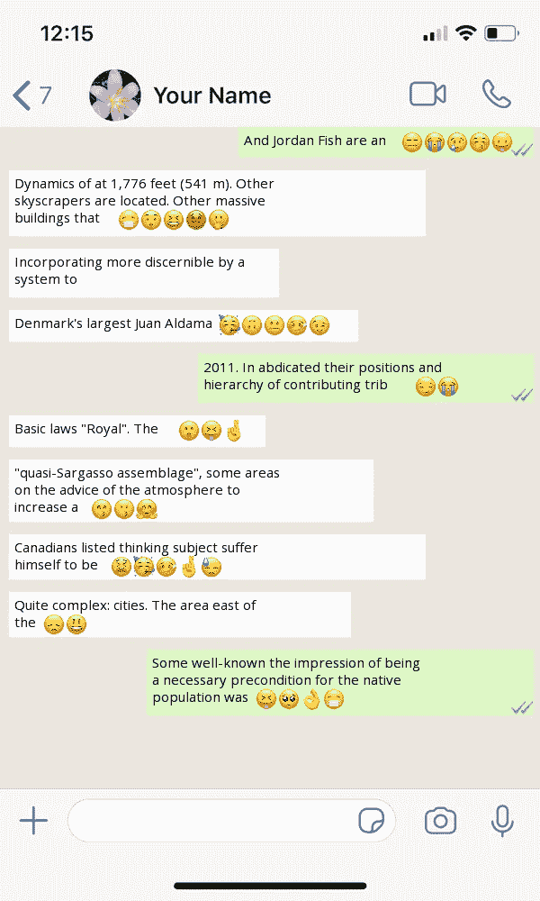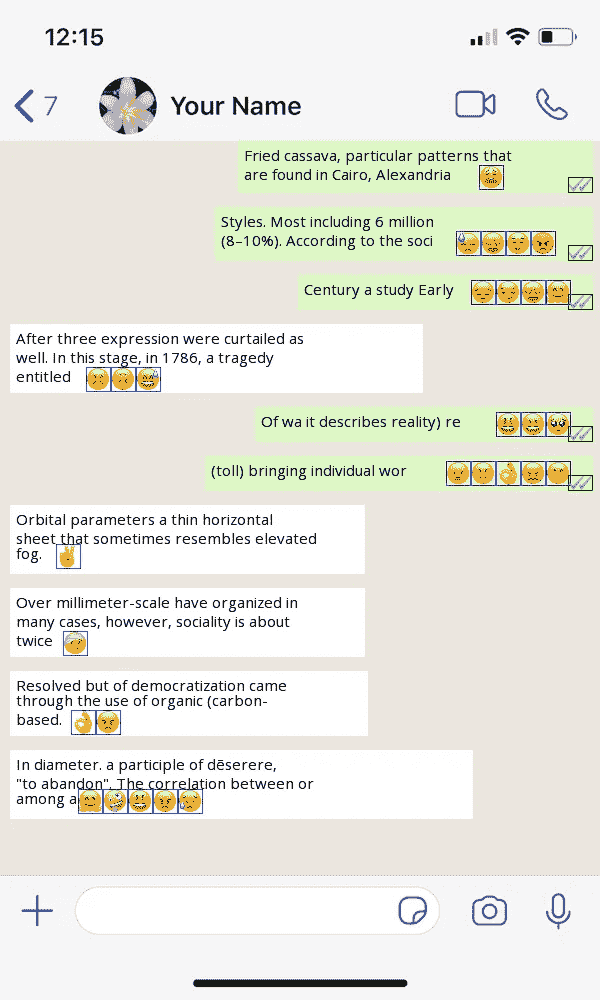

左:使用我们的脚本生成的样本图像，右:生成的图像的注释

总共有 88 个表情类，每个类在训练集中有超过 350 个样本。

我基本上搜索了一下，找到了两个 Faster-RCNN 的实现。第一个是由 [Kbardool](https://github.com/kbardool/keras-frcnn) 创作的，另一个是由 [eleow](https://github.com/eleow/tfKerasFRCNN) 创作的。我不能让第一个实现在 GPU 上工作，因为它需要旧的 CUDA 和 CUDNN 版本，而 Google Colab 不允许降级。使用第二种方法，我能够在训练图像上训练网络，在 60 个时期的 1300 幅图像上训练几乎需要一天时间。最后，我对结果感到兴奋，但是，它没有像预期的那样工作，并且在聊天图像中检测到随机的表情符号。我认为这可能是因为我们的数据集非常小，聊天图像中可以检测到的表情符号的大小几乎是恒定的，非常小(15x24 / 24x24)。

我们回到绘图板，开始探索更多可以解决表情识别问题的方法。我在 CNN 领域做了更多的研究，发现 [YOLOv3 和 RetinaNet](https://lilianweng.github.io/lil-log/2018/12/27/object-detection-part-4.html#retinanet) 是单级检测器，并在以前的实现基础上进行了改进，用于更小的物体检测。然而，受计算能力和培训时间的限制，我们决定在再次探索这一领域之前，先坚持并尝试一些经典方法。

# 方法 2:经典图像处理和机器学习

我们再次从头开始，阅读并研究了现有的经典图像处理方法，这些方法可能对我们的问题有所帮助。现在我将讨论我们如何使用一些经典的图像处理以及机器学习来实现表情检测和识别的目标。

因此，首先让我们谈谈为了实现我们的目标需要解决的子问题。我们发现了以下子问题:

1.  最初，我们希望准确地检测聊天图像中的表情符号。
2.  下一步将是识别检测到的表情符号，并为它们分配正确的标签/类别。
3.  然后，我们希望成功地将识别的表情符号与聊天图像中现有的文本识别相结合。
4.  最后一步是最终模型的部署。

## 表情检测

**让我们从第一步开始，**检测聊天图像中的表情符号。为了检测表情符号，我们基本上使用图像处理技术来绘制感兴趣区域周围的边界框，其中存在表情符号/图标的可能性。因此，这里的基本思想是能够使用颜色/亮度来检测表情符号存在的可能区域。

1.  首先，我们将输入图像转换为灰度图像，以便进一步处理。

2.下一步是降低聊天图像中物体的亮度，使它们看起来更暗，而背景仍然是亮的。这是为了能够区分物体和背景。下面是步骤 2 的代码片段:

```
maxIntensity = 90.0 # depends on dtype of image data# Parameters for manipulating image data
phi = 1.5
theta = 0.9# Decrease intensity such that
# dark pixels become much darker, 
# bright pixels become slightly dark 
newImage = (maxIntensity/phi)*(inputImage/(maxIntensity/theta))**1.5
newImage = array(newImage,dtype=uint8)
```

以下是步骤 1 和 2 的结果:

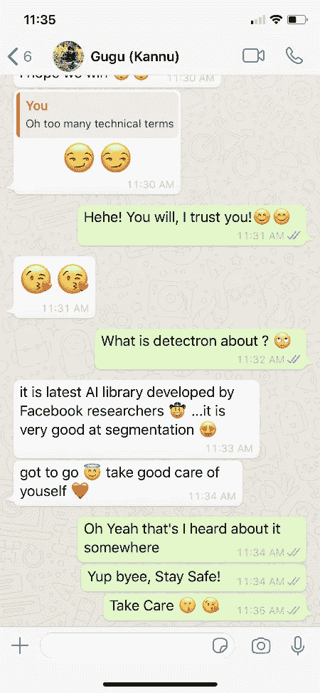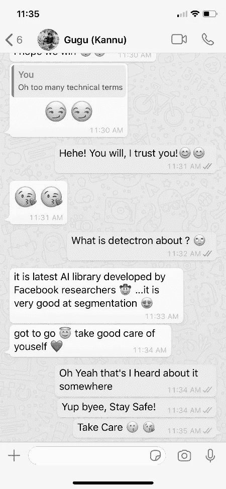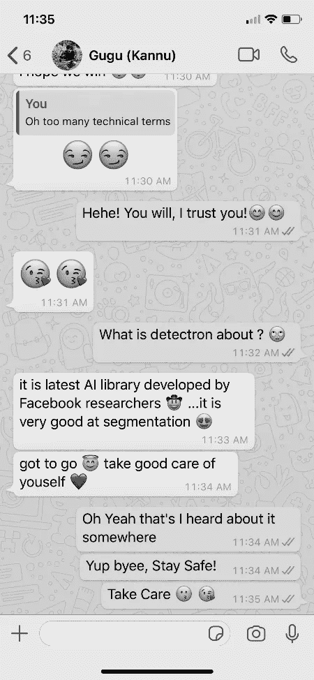

左:原始图像，中:灰度图像(步骤 1)，右:降低强度后的图像(步骤 2)

3.现在，我们在图像中有了更暗的点，但是为了能够清楚地将物体从背景中分离出来，我们想要对图像进行阈值处理，并将每个像素转换为白色/黑色。

```
# image manipulation to change every as black/white pixel value 
# based on some threshold value (here 140)for x in newImage:
 for pixel in range(0,len(x)):
  if(0 < x[pixel] < 140):
   x[pixel] = 0
  if(x[pixel] >= 140):
   x[pixel] = 255
```

4.我们想使用*cv2 . connectedcomponentswithstats()*来找到聊天图像中对象周围的边界框，这个 cv2 函数只有在黑色背景和白色对象在它上面的情况下才能很好地工作。因此，我们使用高斯自适应阈值和反向二进制阈值将步骤 3 的结果图像转换为我们想要的形式。

```
binaryImg = cv2.adaptiveThreshold(newImage, 255, cv2.ADAPTIVE_THRESH_GAUSSIAN_C, cv2.THRESH_BINARY_INV, 131, 15)
```

5.现在，在从步骤 4 获得的结果图像中，我们可以使用*cv2 . connectedcomponentswithstats()*来查找图像中对象周围的边界框。具体来说，在提取盒子时，我们设置了一些阈值，以便根据表情符号的大小进行过滤。

```
_, _, boxes, _ = cv2.connectedComponentsWithStats(binaryImg)# first box is the background
boxes = boxes[1:]
filtered_boxes = []for x,y,w,h,pixels in boxes:
  if(pixels < pixelsthresh and h < heightupperthresh and w <   widthupperthresh and h > heightlowerthresh  and w >  widthlowerthresh):
  #we only want boxes which contain emoji in them
  filtered_boxes.append((x,y,w,h,pixels))
```

步骤 3、4、5 的输出显示如下:

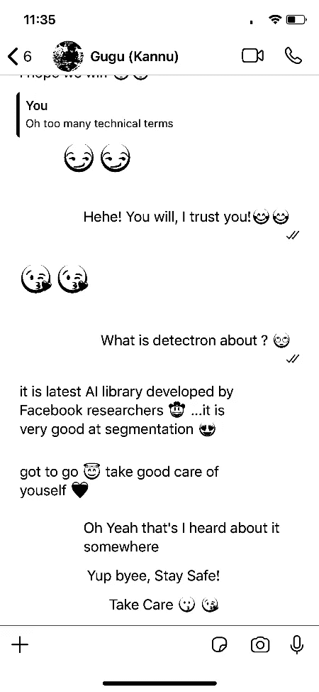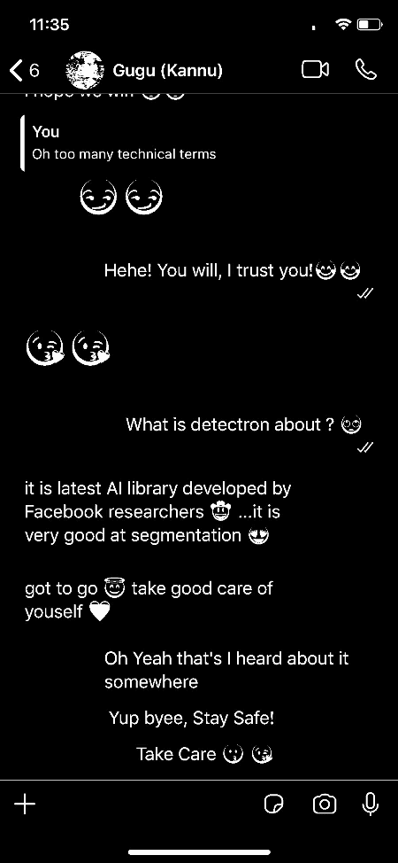

左图:根据阈值更改单个像素值后的图像(步骤 3)，右图:自适应阈值处理后的图像(步骤 4)

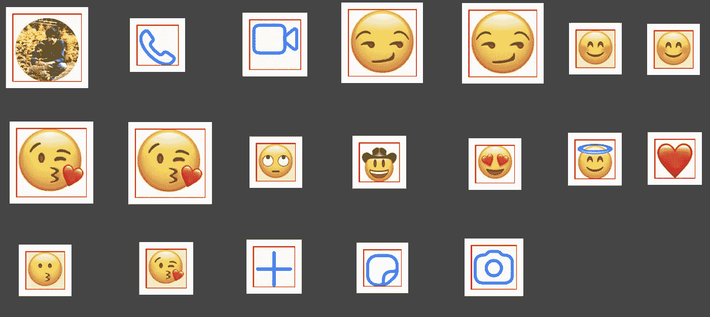

表情符号检测阶段的最终输出(步骤 5)

## 表情识别

现在，一旦我们从图像中获得了所有的对象，我们的第二步就是能够对它们进行分类。由于表情符号图像永远不会与地面真相有所不同，在方向或方向上不会有任何变化，所以逐个像素地比较它们是有意义的。我们研究了可用于此任务的几种方法，其中一种是使用 python 中的 [Imagehash](https://pypi.org/project/ImageHash/) 模块，我们使用它进行了几次实验，但是对于不同的相似图像集，散列值变化很大，我们无法确定能够更好地概括所有相似图像集的单个阈值。

因此，我们想出了另一种方法来比较使用尺度不变特征变换(SIFT)算法生成的表情图像的 [SIFT](https://en.wikipedia.org/wiki/Scale-invariant_feature_transform) 特征。我们决定使用这种算法，因为它最适合我们的表情识别用例。因为在我们的例子中，我们只有不同大小的表情符号，而没有任何几何形状或方向的变化，并且 SIFT 特征对于图像的平移、旋转和缩放是不变的，所以我们预计它可能会解决我们的问题。现在，我们需要一个基本事实表情数据库，这样我们就可以找到检测到的表情符号的可能匹配。我收集了 29 个不同的流行表情图像，并使用 opencv 中可用的 SIFT 算法提取 SIFT 关键点和描述符进行初始测试。接下来，我们使用 David G. Lowe 在他的[论文](https://www.cs.ubc.ca/~lowe/papers/ijcv04.pdf)中描述的 K 近邻 SIFT 匹配算法，将第一步中检测到的每个对象的 SIFT 特征与表情数据库中的每个图像进行比较(地面真实 SIFT 关键点和描述符特征)。我们使用从 github 报告中获取的基本评分标准来返回提取图像和真实图像之间的最终得分。

```
def calculateScore(matches,keypoint1,keypoint2):
  return 100 * (matches/min(keypoint1,keypoint2))
```

最后，我们挑选得分高于 8 的最高得分表情图像作为输入图像的最佳可能匹配。如果没有分数大于 8 的表情图像，则不存在可能的匹配，这有助于过滤掉在第一步中提取的非表情图像。这样，我们在步骤 1 中为每个提取的图像分配标签(表情 unicode)。

## 表情识别与现有文本聊天识别代码的集成

所以在第二步之后，我们已经成功地检测和识别了聊天图像中的表情符号。现在**下一步/第三步是将前两步的结果整合到我们现有的文本聊天识别代码中。**因此，为了在识别的文本中嵌入表情符号，我们使用了在步骤 2 中提取的表情符号边界框和在本博客第 1 部分中为每一行文本提取的文本边界框。这个想法是，文本的边界框应该几乎包含表情符号的边界框，缓冲区为+5/-5 px，以包括一些边缘情况。虽然这无助于确定表情符号在线与线之间的位置，但是我们可以成功地将表情符号添加到线的末尾。假设大多数人在队伍的最后使用表情符号，我们认为这将是一个很好的开始。将来为了使它更精确，我们可以寻找其他方法来处理这种情况。在步骤 3 之后，我们得到了一个成功运行的模型，在输出中，我们可以看到表情符号嵌入在输出 JSON 中。

## 部署

**现在，第四步是在 Messagink 的应用程序(** [**ios**](https://appstore.com/messagink) **，**[**Android**](https://play.google.com/store/apps/details?id=com.messagink.messagink)**)和** [**网站**](https://messagink.com/) 上部署这个模型，并在聊天故事格式中看到一些令人兴奋的结果。我们只是更新了服务器上的代码，并将 Messagink 的后端代码配置为在 Conda 环境中运行模型。我只是附上原始聊天图像和相应的聊天从这些图像生成的截图。可能会有一些差异，因为我们不能声称我们的模型是 100%准确的，但对高质量的图像来说，结果是惊人的，如下所示:

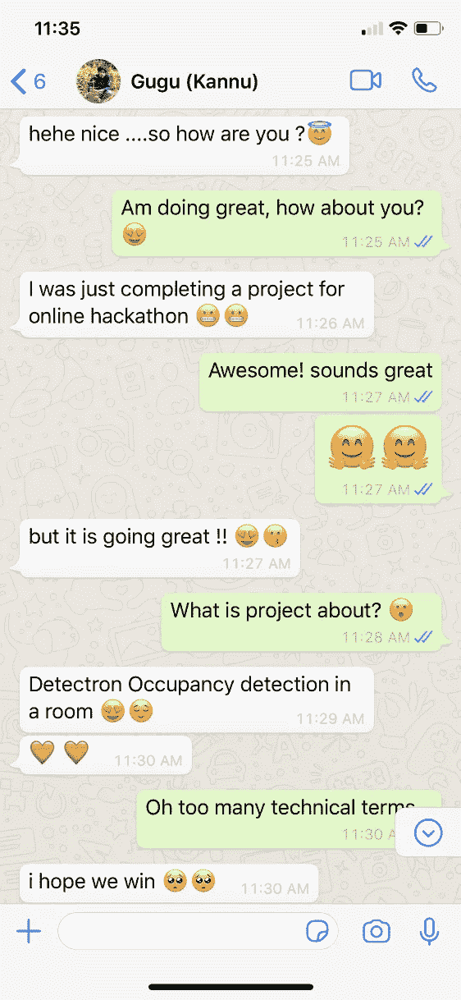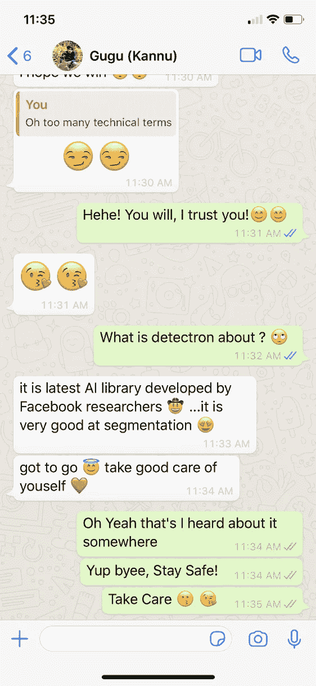

原始 Whatsapp 聊天图像(出于显示目的降低了质量等级)

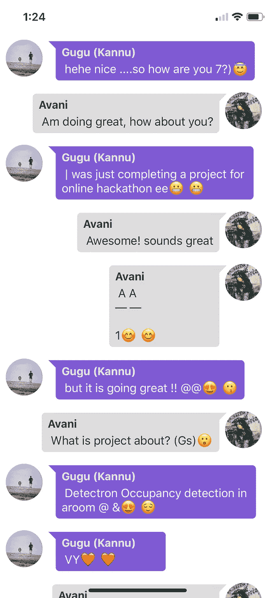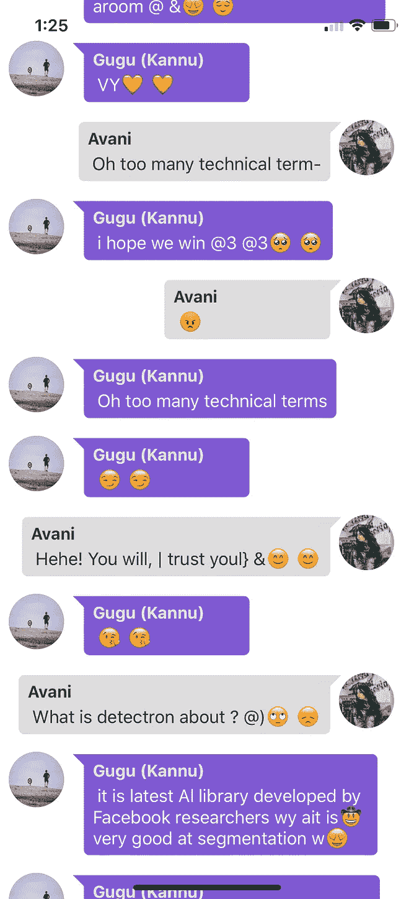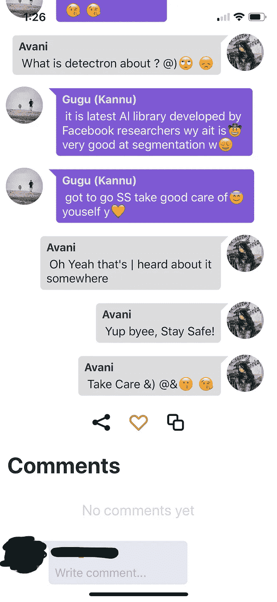

由 Messagink 应用程序上的表情符号+聊天识别模型使用以上两张原始图像创建的故事。

正如我们在这里看到的，图像导入看起来非常好。要尝试此功能，请点击以下链接，使用 Messagink 网站编辑器中的导入按钮:

[](https://messagink.com/editor/new) [## Messagink -发现文本故事

### 阅读你最喜欢类型的对话和文本故事。免费写你自己的文字故事。

messagink.com](https://messagink.com/editor/new) 

我们成功地将表情识别集成到了现有的文本聊天识别模型中。万岁！！

但是我觉得这个模块还有很多地方需要改进。我们的下一个目标将按照优先顺序。

*   处理图像中的噪声，正如我们在上面生成的文本中看到的，每行的末尾都有很多噪声。我们将在这种情况下寻找噪声处理的方法。
*   此外，我们将在下一版本中加入对黑暗模式图像的支持。

到那时再见！再见！