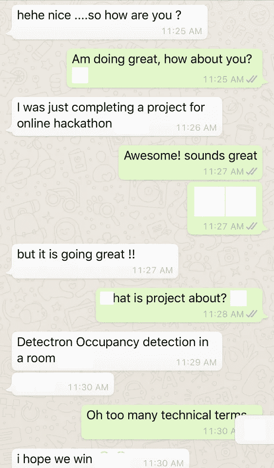
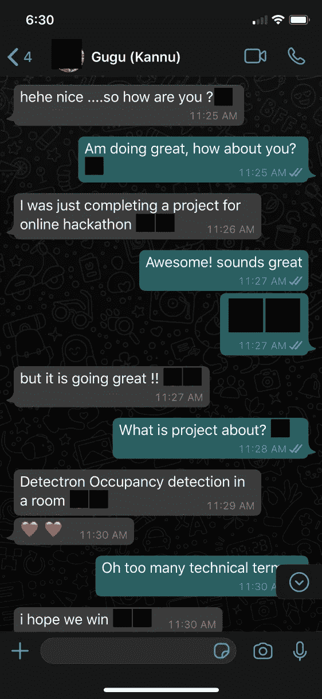
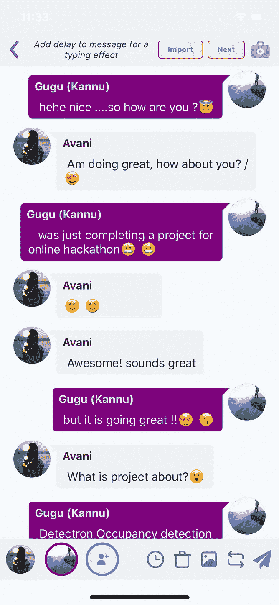
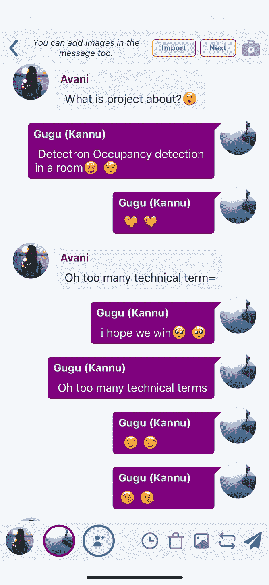
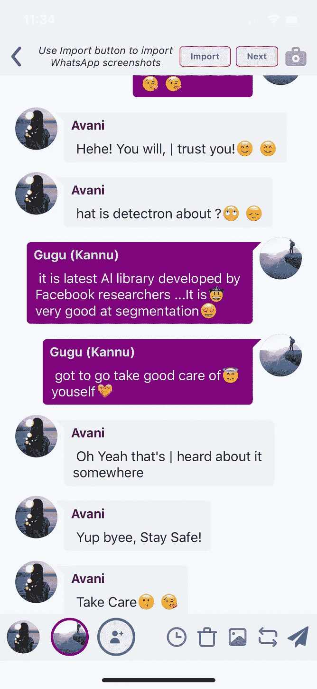

# 聊天图像到文本对话:第 3 部分

> 原文：<https://towardsdatascience.com/chat-images-to-textual-conversation-part-3-49cdee0f2c72?source=collection_archive---------50----------------------->

## 处理聊天图像中的噪声，并为黑暗模式图像添加功能


照片由[在](https://unsplash.com/@walling?utm_source=medium&utm_medium=referral) [Unsplash](https://unsplash.com?utm_source=medium&utm_medium=referral) 上砌墙

感觉很好，回到这个项目的最后一部分:“聊天图像到文本对话”。但是在深入研究这篇文章之前，我建议先阅读前两部分:分别是[聊天识别](/chat-images-to-textual-conversation-c44aadef59fe)(第一部分)和[表情检测](/chat-images-to-textual-conversation-part-2-8260c09a032e)(第二部分)。

我要感谢 Akshat Sharma 为这个项目做出的所有贡献。

现在让我们来看看我们的目标，然后我们来看看我用来实现这些目标的方法:

## 1.处理黑暗模式图像

第一步是识别图像是暗模式还是亮模式。为此，我们使用一个非常简单的技术来寻找聊天图像的平均像素值，如果图像大于阈值，那么我们将其标记为“亮”，否则为“暗”。对于我们的用例，我们使用阈值 127。

```
numpyImg = cv2.imread(img)  
if(np.mean(numpyImg) > 127):      
   mode = 'Light'    
else:      
   mode = 'Dark'
```

现在，对于第二步，我们知道 tesseract 检测白色背景上的黑色文本具有 100%的准确性，但是它在检测黑色背景上的白色文本时无情地失败了。我们在我们的管道中使用了一个简单的技巧，如果图像是“暗的”，在第二个博客中进行强度处理后(表情检测中的[步骤 2)屏蔽当前图像。](/chat-images-to-textual-conversation-part-2-8260c09a032e)

```
#Masking
#newImage1 is obtained from step 2 in [Emoji Detection Blog](/chat-images-to-textual-conversation-part-2-8260c09a032e)
mask = cv2.bitwise_not(newImage1)
```

## 2.从输出中消除噪声

输出中出现的大部分噪声是因为 tesseract 将表情符号、蓝色记号、时间戳识别为一些特殊字符，如@、#、W、Y、(、$。时间戳已经在聊天识别(第 1 部分)中进行了处理，使用正则表达式去除行尾的匹配部分。

当 tesseract 检测到聊天图像中的文本时，它也会检测到蓝色勾号，并在其周围绘制一个边界框，但是与其他边界框的面积相比，该边界框的面积非常小。因此，我们只计算每个边界框的面积，如果它小于阈值，就忽略它。我们用于聊天图像的阈值根据图像大小进行缩放，我们将其设置为

```
blueTickArea = 0.00128 * width * height
```

下一步是消除表情符号引起的噪声，我们已经有了另一种方法来检测第二部分中的表情符号，所以这里我们不希望 tesseract 检测表情符号。基本上，我们可以让表情符号在图像中不可见，然后输入宇宙魔方。我们使用一个非常简单的技术来实现这个想法。

在第 2 部分中进行表情符号检测时，我们已经发现了表情符号周围的边界框。对于浅色模式的图像，我们只是用白色填充这些表情符号边框，而深色模式的图像则使用黑色。这项技术阻止了 tesseract 检测图像中表情符号的任何特殊字符。

下面是实现上述想法后的输出。黑暗模式不是很准确，因为它错过了 2 心，但仍然表现很好。



表情符号的去噪——左:用白色填充的表情符号(浅色模式)，右:用黑色填充的表情符号(深色模式)

因此，我们最终消除了聊天图像中的噪声，最终输出非常流畅。下面是在结束时[第二部分中图像的输出。现在，您可以在下面的输出中看到改进，没有不必要的字符，这些字符以前大多出现在文本行的末尾。](/chat-images-to-textual-conversation-part-2-8260c09a032e)



故事由最终聊天+表情符号识别模型创建，Messagink 应用程序使用来自[第二部](/chat-images-to-textual-conversation-part-2-8260c09a032e)的两幅输入图像去除了噪声。

这就是聊天图像到文本对话的全部内容。希望你喜欢看我的博客。

您可以通过点击以下链接，使用 Messagink 网站编辑器中的导入按钮，尝试将聊天图像导入文本故事的最新功能:

[](https://messagink.com/editor/new) [## Messagink -发现文本故事

### 阅读你最喜欢类型的对话和文本故事。免费写你自己的文字故事。

messagink.com](https://messagink.com/editor/new) 

也可以尝试一下 **Messagink 的 app 中可用的编辑器中的功能(** [**ios**](https://appstore.com/messagink) **，**[**Android**](https://play.google.com/store/apps/details?id=com.messagink.messagink)**)**

再见