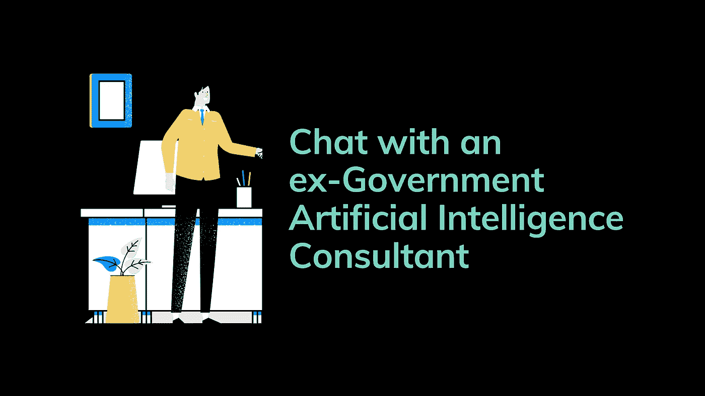

# 与前政府人工智能顾问聊天

> 原文：<https://towardsdatascience.com/chat-with-an-ex-government-artificial-intelligence-consultant-e4c2b93ac749?source=collection_archive---------42----------------------->

## **转行的主要收获**

*付费墙后面的股票？点击这里和我的* [*好友链接*](https://www.google.com/url?q=https://medium.com/p/chat-with-an-ex-government-artificial-intelligence-consultant-e4c2b93ac749?source%3Demail-2d4f80038b03--writer.postDistributed%26sk%3D5e708072e55c3397517b79ec5eb240b1&source=gmail&ust=1578071194890000&usg=AFQjCNE2X8nTVspxY0rX-tboS48CqxUyXw) *一起看故事。*

> 注意:这篇文章没有任何美国政府的秘密，工具，或者任何类似的东西。这是一个关于真正的摇滚明星“幕后”数据科学家的故事。

华盛顿到处都是在政府部门工作的人，他们的工作需要高度保密。当你问一个经典的*“你是做什么的？”时，不要问更多关于工作的事情，这是一个无声的社会规则*而他们的回答是*“我在政府机关工作”*，仅仅是因为他们不能说，如果说了，那很可能就是表面文章或者谎言。

几天前，我们邀请了一些朋友和家人来吃早午餐。赶上这一年，我的丈夫提到今年我过渡到了[数据科学](https://code.likeagirl.io/from-marketer-to-data-scientist-c67470c1c333)，由于这一点，我最终与约翰(化名)进行了一次关于人工智能的惊人的职业导向的对话。

我发现他的故事引人入胜，鼓舞人心。我请他给我这样的人工智能新从业者提建议。我将与你分享我们谈话的一部分，但首先，让我告诉你一些关于他的事情。

约翰正处于职业生涯的最后十年，他计划在 7 年左右退休。在美国国防部和中情局的一些项目中工作了几年后。他获得了侧重于人工智能的计算机科学硕士学位和计算机科学博士学位。他的博士研究重点是使用 C 和 C++进行图像识别。

他认识到，与我们现在拥有的工具相比，20 年前他不能充分发挥他以前知识的潜力，因为计算机能力如此之小，如此之贵。每个项目都是一个挑战。现在，他对计算能力如何改变人工智能的方式感到惊讶，特别是在过去的 3 年里，它彻底改变了这个行业。

在接近退休时进行职业变动并不常见，也不被视为明智之举，但他觉得他工作的政府部门在采用这些新的强大工具方面行动太慢，他不想在朝九晚五的时间里呆在那里，等待批准做他的工作。

他转到了私营部门，现在他很高兴拥有一个部门，但在他职业转变的开始，他遇到了一个问题:人工智能工具在过去 3 年中进步如此之大，即使他对行业和数学的整体理解很强，他也需要赶上新的工具和趋势。

# 他对继续保持行业相关性的建议总结为三点

## **永不停止学习**

*太明显了？*

过去的 5 年改变了数据科学的研究方式，新的工具、新的编程语言、新的预训练算法以及更多的数据。该行业的所有这些进步都将继续推进，尽管他预测在未来 8 年内我们的处理能力将达到一个上限，但他几次提到了永不停止学习的重要性。

*“在科技行业，你能做的最糟糕的事情就是相信自己什么都懂，并且只对一种编程语言感到舒服。我们这些技术人员往往对自己的知识有很强的自我意识，这种自我意识让我们处于权力的位置，也可能把我们踢出这个行业。”*

我问他是否有一个他喜欢学习东西的地方，他提到他不是只和一个学习风格的平台“结婚”。博士后，在这个家校上过课，在 Coursera 上刷新过 SQL 技能，在 DataCamp 上刷新过 Python 3 和面向对象编程，在 MIT 上用 Python 深度学习，在华盛顿大学上在线课，在 YouTube 上，在 StackOverflow 上，在 Quora 上解决具体问题。

对于项目管理，他参加了 PMP，重点是敏捷和其他工作所需的培训和认证。

尽管他没有特别推荐，但他喜欢以演讲者或与会者的身份参加与行业相关的会议。他发现这是一个惊人的工具，可以有条理地了解“那里有什么”,并与新老行业参与者交谈。

## **与人交谈**

*“抱歉，如果我对技术人员有成见，但我们不倾向于与人交谈！”*他说。*“你不知道工具进步的速度有多快，等到做了一些教程，写了一篇论文，或者组织了一个研讨会，新的“东西”已经过时了。与人交谈是了解如何改进工作的最快方式”。*

“我仍然一个月至少去两次聚会。这很奇怪，因为大部分时间都是年轻人，而我是白人少数群体中的一员

我想补充一个额外的好处:建立专业社区是无价的。除了拥有第一手的知识，你还可以从“一直在那里”的人那里得到支持和指导。如果你在华盛顿特区，想成为 [***女性 in Data***](https://widusa.com) 或/和 [***拉丁裔 in Tech***](https://www.latinasintech.org/) 的一员，请给我发邮件至 *hola[at]brendahali.com*

## **学会有效沟通**

有效的沟通技巧被低估了。新【人工智能】*从业者需要学会，没有人在乎你的过程，没有人在乎你是怎么得到那个 p 分的。人们和管理者希望看到什么结果。尽可能高效地传达这些结果是你的责任。试图理解你不是他们的责任。”*

“但是你如何提高你的沟通技巧呢？你是如何提高自己的能力的，有什么具体的方法吗？”——我问。

*“读书，批判性地大量阅读。不仅仅是关于这个行业，而是阅读小说、传记、文章和明显有效的沟通书籍。* *记录下你自己的谈话或陈述，然后分析你需要改进的地方。有效的沟通是需要练习的，也是可以学习的。”*

## **总结**

约翰几次提到他有多高兴，因为我决定现在开始这个职业运动，以及一个年轻的拉丁人在构建算法和收集数据方面有多重要。用他的话说，“我们生活在人工智能的黄金时代，我们需要更多的人进入这个领域”。

人工智能正在快速发展，无论你的资历、你应用技能的领域，还是你开发项目的预算，都无关紧要。为了确保你的工作和技能是相关的，你应该永不停止学习，建立一个网络，学习如何有效地沟通。