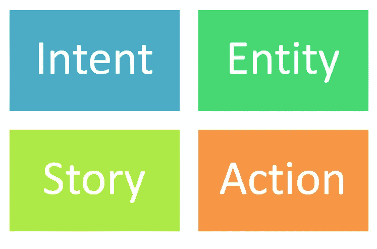
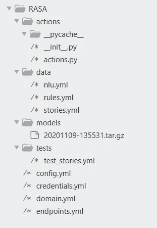
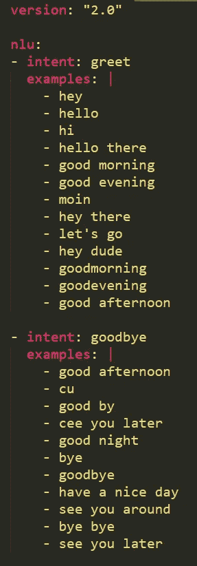
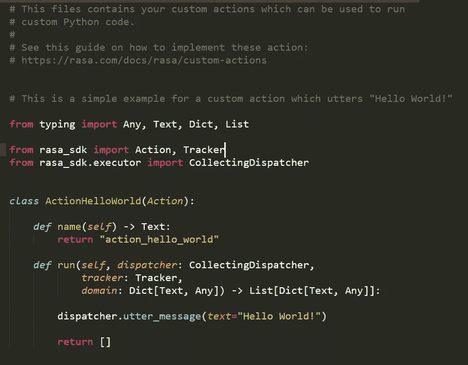
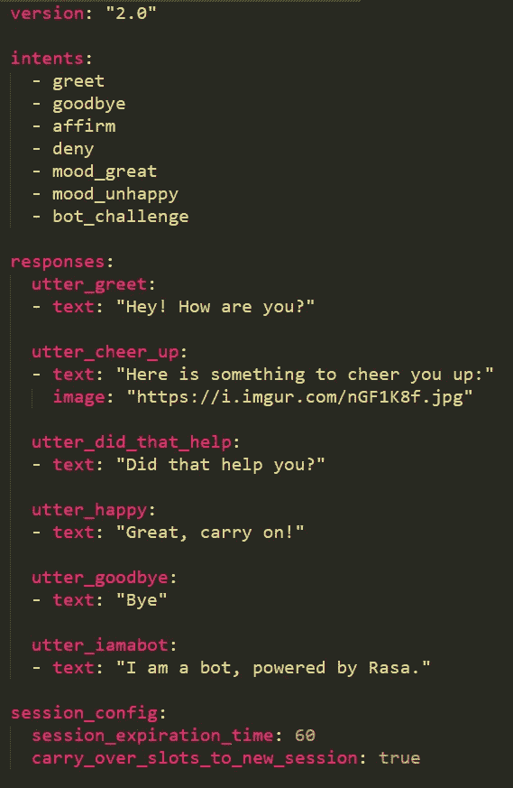
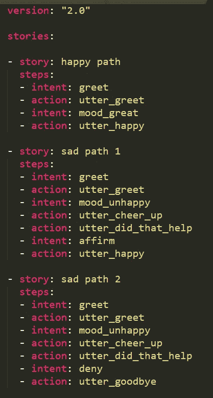
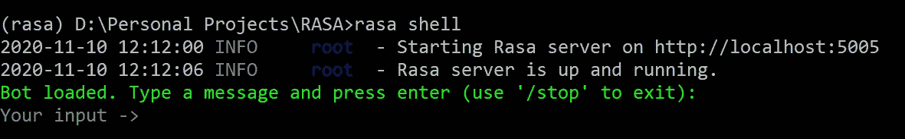
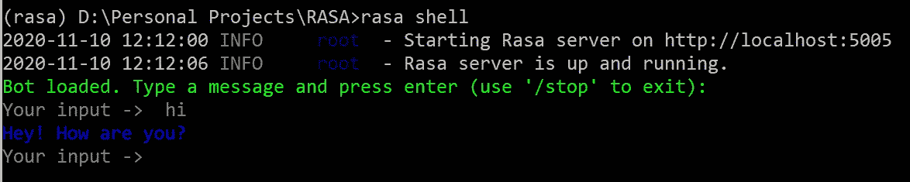
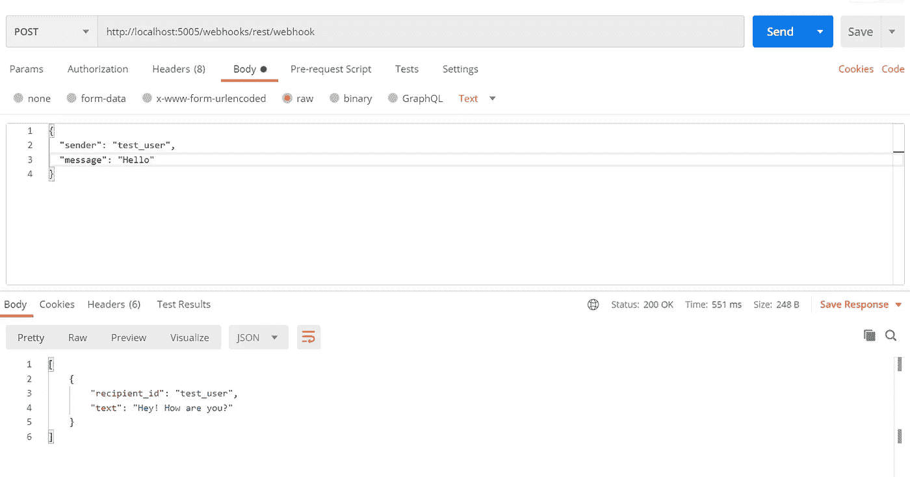

# 使用 Rasa 2.0 轻松构建聊天机器人:一步一步的教程

> 原文：<https://towardsdatascience.com/chatbots-made-easier-with-rasa-2-0-b999323cdde?source=collection_archive---------5----------------------->

## 实践教程

## 从安装到与之聊天


照片由[来自](https://www.pexels.com/@ngqah83?utm_content=attributionCopyText&utm_medium=referral&utm_source=pexels)[佩克斯](https://www.pexels.com/photo/jumpshot-photography-of-woman-in-white-and-yellow-dress-near-body-of-water-884977/?utm_content=attributionCopyText&utm_medium=referral&utm_source=pexels)的广安哈阮拍摄

# 什么是 Rasa？

> Rasa 是一个开源的机器学习框架，用于自动化的文本和基于语音的对话。理解消息，进行对话，并连接到消息传递通道和 API。

# Rasa 2.0 有什么新功能？

> 易于初学者使用，用 YAML 替代 markdown。

# Rasa 的安装

这里的基本先决条件是 [Anaconda](https://www.anaconda.com/) 。它有助于处理包并防止不同的代码依赖相互干扰。

无论您使用的是 Windows 还是 Linux 系统，这些命令都应该有效:

```
conda create -n rasa python=3.6
conda activate rasa# pip install rasa[full] # adds all dependencies of rasa
pip install rasa
```

就是这个！

如果你使用`pip install rasa[full]`,它将为每个配置安装 Rasa 的所有依赖项(spaCy 和 MITIE ),让你的生活更轻松。

## 注意:

在安装过程中，Tensorflow 和 Rasa(即 NumPy)的依赖关系存在冲突。Tensorflow 需要 Numpy <0.19, while Rasa requires 0.19.4.

If you try running Rasa, you will run into a runtime error.

To solve that, just downgrade your Numpy:

```
pip install numpy==0.19
```

# Before We Start

Let’s understand some basic concepts in Rasa.



Source: Author

## Intent

What is the user intending to ask about?

## Entity

What are the important pieces of information in the user’s query?

## Story

What is the possible way the conversation can go?

## Action

What action should the bot take upon a specific request?

# Let’s Start

The first thing to do is:

```
rasa init
```

You will then be prompted to create a sample Rasa project in the current folder.



Source: Author

This is what the sample project will look like. **模型文件是在我们训练模型后创建的。**

## 第一站:nlu.yml



nlu.yml(来源:作者)

这是文件的样子。一开始是很直观的。

为了创建你自己的定制聊天机器人，你必须把一些意图编码进去。如果你正在为一个城市制作聊天机器人，目标应该是旅游目的地、餐馆等。

确保意图名称不重复。

为了放置一个新的意图，我们只需要跟随上面的任何一个意图。**意图**告诉我们意图的名称。**例子**告诉我们关于这个意图的语言是什么样的。确保至少给出 2 个例子。

## 第二站:actions.py



actions/actions.py(来源:作者)

为了创建您自己的自定义操作，可以遵循此示例。

你必须创建一个**动作**的子类，它将有两个功能，**名字**和**运行**。函数 **name** 将返回聊天机器人将使用的动作名称。函数 **run** 将保存您的动作所执行的功能，例如计算一些数字、从互联网上获取数据等。使用 **dispatcher.utter_message，**您可以通过聊天机器人发送回复，例如计算的答案。

确保任何两个动作的名称不冲突。

## 第三站:domain.yml



domain.yml(来源:作者)

**domain.yml** 包含聊天机器人的领域知识，即它需要操作的信息(人们会问什么，它必须回复或做什么？).

如果您想在您的聊天机器人中使用动作，那么您还需要将**动作**部分添加到该文件中。如果没有，跳过这一部分。

```
actions:
  - action_1
  - action_2
```

在**动作**部分下，输入您在上一步中创建的动作的名称。

在**意图**部分，你必须输入你的定制意图。

下一步将是在**响应**部分下创建话语，即当用户提出关于意图的问题时，你的聊天机器人将给出的答案。

确保响应名称不重复。

给出独特的回答名称，并在它们下面给出当被问及某个特定意图的问题时你想给出的答案。

## **第四站:stories.yml**



stories.yml(来源:作者)

这是我们把所有东西缝合在一起的地方。

在**故事**部分下面是用户和聊天机器人之间对话的各种方式。对于你的聊天机器人，你把你的故事放在这里。

按照上面的例子，你将首先把一个故事名称和步骤放在里面。你可以在故事的*动作部分输入话语和动作的名称。*

因此，你的意图进入故事的**意图**部分，而你的行动和话语进入故事的**行动**部分。

# 训练聊天机器人

现在，您已经将关于您的自定义聊天机器人的所有信息放在了不同的文件中。让我们来训练你的聊天机器人。

```
rasa train
```

简单地说，输入上面的命令，让奇迹发生吧！

# 运行聊天机器人

现在，你可以将这个聊天机器人集成到你自己的网站中，Facebook Messenger，Slack，Telegram，Twilio，Microsoft Bot Framework，Cisco Webex Teams，RocketChat，Mattermost 和 Google Hangouts Chat。你也可以将聊天机器人连接到任何其他平台，但你必须创建自己的[定制连接器](https://rasa.com/docs/rasa/connectors/custom-connectors)。

现在，让我们在 localhost 上测试它。

**注意:**如果你已经在你的聊天机器人中使用了 **actions** ，那么，你需要取消注释 **endpoints.yml** 中的 **action_endpoint** 部分。然后，打开一个单独的终端。确保您在 Rasa 文件夹中。然后，你必须运行`rasa run actions`

现在，关键时刻到了。

有两种方式运行 Rasa:在 shell 中和在本地主机上。

## 在酝酿中

要在 shell 中运行 Rasa，只需在 Rasa 文件夹中打开的终端中键入命令:

`rasa shell`

这个命令将启动 Rasa 服务器，您将可以在终端中与聊天机器人对话。



Rasa Shell(来源:作者)

## 在本地主机上

另一种方法是在本地主机服务器上运行 Rasa。为此，只需从 Rasa 文件夹中打开的终端运行以下命令:

`rasa run`

这将在您的本地系统上运行 Rasa，并在本地主机的 5000 端口上公开一个 REST 端点。

# 与聊天机器人交谈

## 在酝酿中

如果你正在运行`rasa shell`命令，那么你可以直接在终端中与聊天机器人进行交互。像这样:



Rasa Shell(来源:作者)

机器人回答“嘿！“你好吗，”向我问好。

## 在本地主机上

为了与 Rasa 服务器公开的 REST 端点通信，您可以使用 cURL 命令(针对 Linux 爱好者)或 Postman。我更喜欢[邮差](https://www.postman.com/downloads/)，因为它好用。



来源:作者

您必须向 URL 发出一个 **POST** 请求:

[http://localhost:5005/web hooks/rest/web hook](http://localhost:5005/webhooks/rest/webhook)

在请求的**正文**中，选择 Postman 中的 **raw** 选项。

在 JSON 格式中，你要指定两个键:**发送方**和**消息**。

在发送者中输入一个虚拟值，这个消息将成为你对聊天机器人的查询。

您将返回一个 JSON，包含关键字: **recipient_id** 和**文本**。**文本**将有聊天机器人对您的查询的回复，并且**收件人 id** 将与您在请求中发送的**发件人**密钥相同。

# 摘要

我们知道使用 Rasa 创建聊天机器人是多么容易。我们理解了 Rasa 框架中的基本概念，即意图、实体、行动和故事。我们知道如何创建一个适合我们自己需求的定制聊天机器人。我们知道如何在 shell 和本地主机上运行 Rasa(并与之交互)。我们也了解了安装和运行 Rasa 时可能出现的各种陷阱。