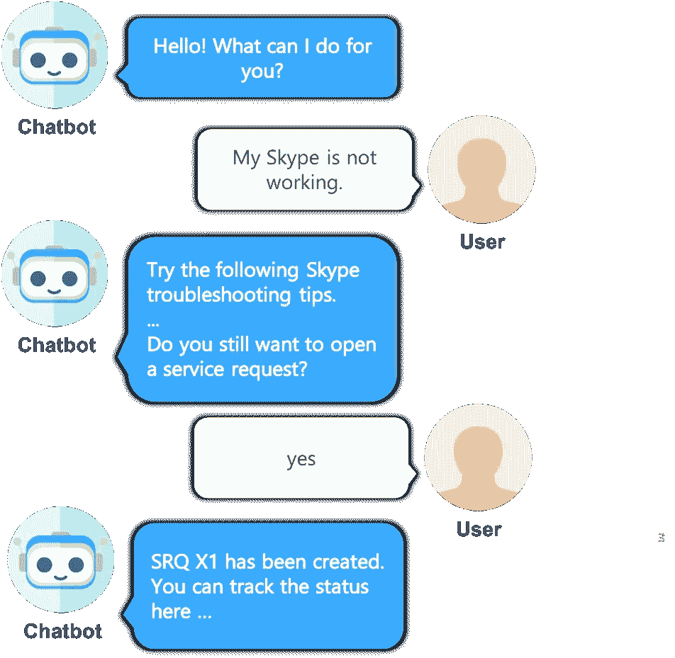
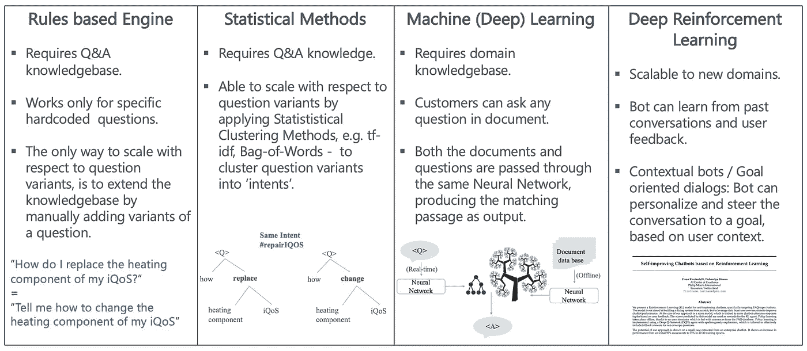
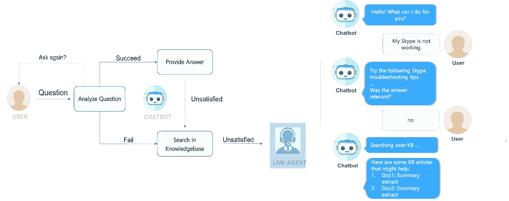
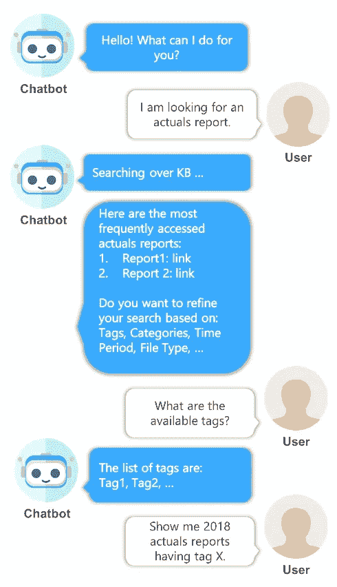

# 聊天机器人和自然语言搜索

> 原文：<https://towardsdatascience.com/chatbots-natural-language-search-cc097f671b2b?source=collection_archive---------33----------------------->

## [入门](https://towardsdatascience.com/tagged/getting-started)

## 集成搜索的三层聊天机器人架构

这是对我们在设计聊天机器人时经常面临的技术选择的一种非正式看法，即我们应该构建聊天机器人还是自然语言搜索(NLS)，或者两者兼而有之？两者的主要动机都是让企业数据和应用程序(更)易于被每个公司员工访问，以促进知识共享和协作。为此，我们探索了两种集成架构:

*   支持搜索的聊天机器人
*   对话式搜索

# 介绍

关于聊天机器人已经说了很多，也写了很多。然而，大多数讨论都集中在面向消费者的机器人上——这种价值数百万美元的机器人将从根本上改变你公司的形象，并让你在场外节省几百万美元。不用说，建造这样一个独特的机器人也需要几十万美元的投资。尽管如此，如果数学加起来；收获就是收获，不要问任何问题！

> 在本帖中，我们将关注另一种慢慢抬头的机器人——企业内部面对机器人的“内部”员工。

如果你在任何一家拥有 10000 多名员工的公司工作，你会看到一些机器人在你的公司里到处涌现，让你(或至少承诺让你)可以轻松访问财务、人力资源、IT 服务台等。系统。我们将这些机器人称为面向员工的机器人。Gartner 在其研究报告中也强调了这一趋势:“聊天机器人的部署不再只是面向客户，而是越来越多地面向企业内部的员工”

这些面向员工的机器人不同于上述面向消费者的机器人，至少有以下 4 个特征:

1.  这种机器人的主要动机是让公司的每个员工都可以(更)访问企业数据和应用程序，促进协作，等等。问一问一家相当大的公司的任何员工，他们都会一致同意所有的企业数据都会进入“黑洞”。您会听到这样的说法，“企业搜索不起作用，不可用”，“数据分布在各个小仓库中”，等等。
2.  一个组织内的多名员工面对机器人，而“一个”消费者面对机器人，这是公司的形象。
3.  这种机器人的投资回报率通常很低，这意味着他们的预算有限。因此，我们基本上需要以更低的价格提供相同或相似质量的机器人。当然，有人可能会说，很难量化这种员工面对机器人的“创新”方面，这通常是员工的满意度和/或通过使用新的创新技术获得的知识。
4.  每个面向 bot 的员工所使用的技术是不同的。因为它们很可能是由组织内的不同团队开发的，所以它们偏向于单个团队的技术偏好。这导致了一个由 IBM Watson Assistant、Google DialogFlow、Amazon Lex 组成的分散世界——再加上一些更专业的初创公司——你就明白了。

这种分散景观的问题是，虽然它在实验水平上工作，但操作和维护它是相当不可能的。多样化的技术堆栈进一步暗示，作为一个组织，您将不会从商业产品的任何批量折扣中受益。因此，这种方法根本不可伸缩；机器人死亡率将很快开始与您组织中新出现的机器人数量竞争。

现在，让我们把重点放在一个有趣的技术选择上，这是我们在研究/设计这类机器人时经常面临的，也就是说，

> 我们应该建立一个聊天机器人还是一个自然语言搜索(NLS)工具，或者两者兼而有之？

# **定义**

让我们尝试定位这两种技术:

IT 服务台聊天机器人(图片由作者提供)

***聊天机器人*** :对话型。

在其非常基本的形式中，给定一个由人类用自然语言提出的问题(我们离机器人对机器人的交流有点远)，机器人用其相应的答案来回答，最好也是用自然语言。

(还有其他类型的机器人，它们更加面向操作，例如提出服务请求或采购订单。在本文中，我们主要关注以信息检索为主要目标的机器人和搜索工具。

***自然语言搜索(NLS)*** :介绍搜索最好的方式当然是想到 Google。我们每天都用谷歌搜索，但是今天我们基本上是利用“基于关键词的搜索”。稍微思考一下，你就会想起我们是如何在谷歌中输入关键词之前将我们的查询分成关键短语/关键词的。

有了 NLS，我们谈论的世界将不再需要使用它，而是以句子的形式直接在谷歌中输入查询，就像你今天和朋友聊天一样。如果你没有尝试过，谷歌今天确实支持 NLS。它基本上使用了被称为“知识图”的东西，这是一个巨大的人工管理的知识库，捕捉真实工作实体和事件之间的关系；因此很快就达到了极限。例如，尝试以下查询序列:

自然语言搜索的局限性(作者截图)

从截图中可以注意到，第二个后续查询回复到通常的基于网页的列表响应，尽管后续问题的答案“烟雾和有毒空气”清楚地存在于其知识库(KB)中。(免责声明:谷歌的内部工作每天都在变化，但我希望基于关键词的搜索和 NLS 的区别从叙述中清晰可见。)到目前为止，我们只探索了 NLS 的查询部分。

对于答题部分，答案也应该是自然语言的句子，而不是谷歌目前显示的段落摘录。生成这样的答案/句子包含在自然语言处理的一个子领域中，称为自然语言生成(NLG)。

# **最先进的**

在一个理想的世界里，没有技术限制，就没有必要进行这种讨论；即需要区分聊天机器人和 NLS。给定自然语言的用户查询，机器人能够做以下 4 件事:

1.  理解用户意图；
2.  从知识库中检索相关内容(实时)；
3.  合成答案并回复用户(用自然语言)；
4.  保留对话内容，以回答用户的任何后续问题。

问题是，目前在实现上述工作流程时存在多种技术限制。下图试图对不同的技术进行定位。

聊天机器人的智商(图片来自作者)

> 当前的聊天机器人引擎在第二列，我们需要提供一组问题、问题变体和它们相应的答案来构建一个机器人。

这些问题可以分为“意图”几类。问题变体，在机器人术语中称为“话语”，指的是最终用户可以提出相同问题的样本变体。这个想法是提供 5-10 个这样的话语(每个问题)作为输入，基于此，机器人将有希望能够理解问题的 50 种不同的变化。大多数 bot 引擎使用统计 NLP 技术，例如 tf-idf、n-grams、词袋、文本分类(SVM)，来将最终用户的查询映射到意图。

这在合理的程度上是可行的；然而，主要的挑战是关于硬编码的答案，需要提前提供，这反过来限制了机器人可以回答的问题的范围。

> 更具伸缩性的方法是在这里使用 NLS。有了这样的集成，只需将机器人指向一个 KB(文档存储库)就足够了，机器人将能够在运行时通过搜索 KB 文档(第 3 列)来检索用户查询的答案。

这里的技术限制是，搜索文档可能比将用户查询映射到意图的准确度低得多。此外，大多数当前的搜索技术致力于相关性度量(相似性分数)。因此，搜索输出是相关段落的列表，而不是自然语言中的“精确”答案——NLG 还没有出现。

总而言之，聊天机器人和 NLS 目前都还没有成熟到可以互相替代的程度。这两者是互补的，在续集中，我们将重点介绍一些有趣的方法来集成它们。

# 聊天机器人-NLS 集成架构

## 支持搜索的聊天机器人

一个独立的聊天机器人通常是不够的。扩展了搜索功能的聊天机器人在大多数情况下是有意义的。

> 计划一个三层聊天机器人架构，如下图所示:
> 
> 1.带有预定义问答集的聊天机器人仍然是切入点，可以把它看作是第一道防线。
> 
> 2.如果机器人遇到无法映射到其预先配置的意图之一的用户查询，它会对其知识库执行 NLS。这是第二道防线。
> 
> 3.如果用户甚至对搜索结果都不满意，请计划最终移交给现场代理。

三层聊天机器人架构(图片由作者提供)

三层策略非常强大，我们发现它在客户服务、帮助台等方面非常有用。用户查询的范围可能非常一般的场景类型。保留聊天机器人作为入口点是有意义的，至少对于那些用户查询可以匹配现有意图的情况是如此；答案将是精确而中肯的——提高用户满意度。与此同时，我们不能无休止地向聊天机器人的问答库添加问答，因为这样会影响意图识别的准确性。因此，建议采用如上所示的分层架构。

我们将在随后的博客文章中提供我们的 NLS 堆栈的更多细节。就目前而言，足以说明我们正在使用一个整合了 ElasticSearch 和 DRQA 的定制解决方案(在 2019 年柏林 Buzzwords 上展示， [link](https://2019.berlinbuzzwords.de/19/session/building-enterprise-natural-language-search-engine-elasticsearch-and-facebooks-drqa) )，这是一个神经网络架构，可以回答脸书研究公司的开放领域问题。

## **对话搜索**

对话式搜索(图片由作者提供)

在这种情况下，聊天机器人的主要目标是“搜索”。将聊天机器人与搜索整合在一起允许用户以更对话的方式进行搜索。

用户可以与机器人交互以:

*   获取有关可用搜索过滤器的更多详细信息。当用户是该领域的新手时，这可能非常有帮助，并且机器人可以帮助用户导航搜索过滤器，例如标签、本体、文档类型。
*   逐步细化搜索结果，直到他们找到他们正在寻找的文档/报告。

对话式搜索作为一种查询 SQL 数据库的方式越来越受欢迎，例如 [Power BI — NLP 搜索](https://powerbi.microsoft.com/en-us/blog/qna-december-2018-update/)、 [Salesforce Photon](https://www.infoq.com/news/2020/09/salesforce-natural-language/) 。

# 进一步阅读

*   E.里恰尔代利·比斯瓦斯。*基于强化学习的自我改进聊天机器人*。第四届强化学习与决策多学科会议( [RLDM](http://rldm.org/) ，2019 ( [论文](/self-improving-chatbots-based-on-reinforcement-learning-75cca62debce))。
*   D.比斯瓦斯。保护隐私的聊天机器人对话。关于保护隐私的机器学习的第 34 届 NeurIPS 研讨会( [PPML](https://ppml-workshop.github.io/) )，2020 年 12 月([论文](/hidden-privacy-risks-of-chatbot-conversations-881dbeeb98a))。
*   长度比斯瓦斯·巴利甘德。*用 ElasticSearch 和脸书的 DrQA 构建企业自然语言搜索引擎*。2019 年第十届[柏林流行语](https://2019.berlinbuzzwords.de/19/session/building-enterprise-natural-language-search-engine-elasticsearch-and-facebooks-drqa)大会。