# 作弊代码，以更好地与 Plotly Express 可视化

> 原文：<https://towardsdatascience.com/cheat-codes-to-better-visualisations-with-plotly-express-21caece3db01?source=collection_archive---------40----------------------->

## 使用 Python 的 Plotly Express 库创建各种交互式数据可视化的快速指南。

Matplotlib 和 Seaborn 是数据科学中用于可视化的两个最流行的库。我想展示如何使用 Plotly 库中的 Plotly Express 模块，我们可以获得 Seaborn 和 Matplotlib 的简单性，但实现更深入和交互式的可视化。

Plotly Express 是一个简单易用的 Plotly 库的高级接口。那么，让我们看看如何开始。

## 进口

```
import plotly.express as px
```

让我们看看 Plotly Express 模块中已有的一些数据集:

```
tips = px.data.tips() 
#total_bill, tip, sex, smoker, day, time, sizegapminder = px.data.gapminder() 
#country, continent , year, lifeExp, pop, gdpPercap, iso_alpha, iso_numgapminder_canada = gapminder.query("country=='Canada'")
gapminder_oceania = gapminder.query("continent=='Oceania'")
gapminder_continent = gapminder.query("continent != 'Asia'")iris = px.data.iris() 
#sepal_length, sepal_width, petal_length, petal_width, species, species_idelection = px.data.election() 
#district, Coderre, Bergeron, Joly, total, winner, result, district_id
```

## 柱状图

让我们来看看使用直方图的 tips 数据集，因为该数据包含许多分类变量。对于第一个示例，我将使用总账单作为变量来绘制直方图。

```
fig = px.histogram(tips,             #dataframe
                   x = "total_bill", #x-values column
                   nbins = 30        #number of bins
                   )
fig.show()
```

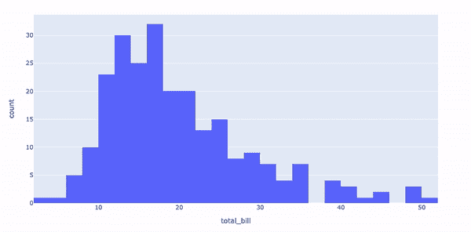

总账单价格直方图

使用 Plotly Express，我们可以创建一个交互式直方图。我们可以看到 x 轴上的 bin 范围、total_bill 值以及光标悬停时每个点的计数。

让我们通过考虑第二个变量——性别来提升直方图:

```
fig = px.histogram(tips,             #dataframe
                   x = ”total_bill”, #x-values column
                   color = ”sex”     #column shown by color
                   )
fig.show()
```

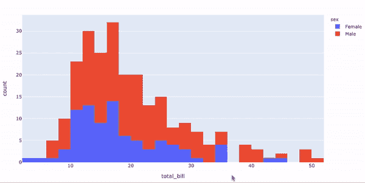

与性别相关的总账单价格直方图

现在，我们可以看到男性和女性在总账单中的数量，但是除了悬停交互之外，我们还可以隔离直方图以显示男性、女性或两者。

直方图的另一个小更新可以是添加地毯图、箱线图或小提琴图:

```
fig = px.histogram(tips,                     #dataframe
                   x = ”total_bill”,         #x-values column
                   color = ”sex”,            #column shown by color
                   marginal = ”rug”,         #plot type (eg box,rug) 
                   hover_data = tips.columns #extra info in hover
                   )
fig.show()
```

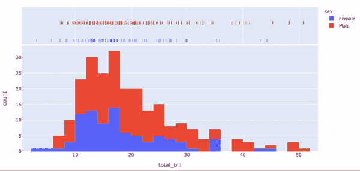

与性别相关的总账单价格直方图，包括数据点的地形图

在这里，我使用了一个地毯图，现在我们可以在直方图中看到与下面的条块相关的数据点。正如你可能想知道的，你也可以和地毯图互动。

## 散点图

散点图是另一种流行且有效的可视化形式，它不仅简化了表达，还增强了表达。这里我们看到的是虹膜数据集；不同植物种类的大小。

```
fig = px.scatter(iris,               #dataframe
                 x = "sepal_width",  #x-values column
                 y = "sepal_length"  #y-values column
                 )
fig.show()
```

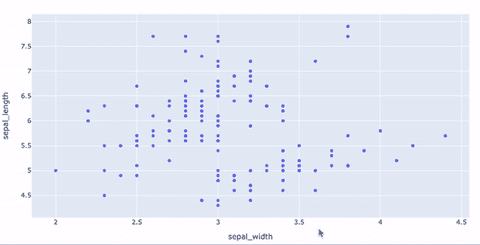

间隔宽度和间隔长度散点图

我们可以通过添加颜色、大小和更多的交互数据，使这个散点图更加动态，信息更加丰富。

```
fig = px.scatter(iris,                        #dataframe
                 x = ”sepal_width”,           #x-values column
                 y = ”sepal_length”,          #y-values column
                 color = ”species”,           #column shown by color
                 size = ’petal_length’,       #col shown by plotsize
                 hover_data = [‘petal_width’] #extra info in hover
                 )
fig.show()
```

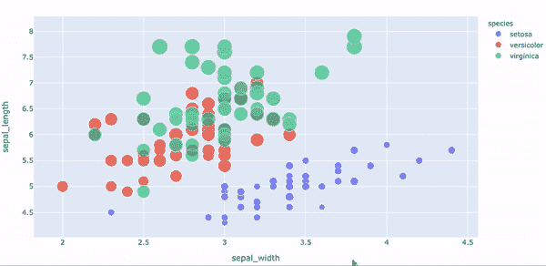

间隔宽度和间隔长度散点图(颜色=种类，大小=花瓣长度)

能够在一组轴上通过添加不同的颜色将植物隔离或分组，有助于我们不必创建三个单独的地块来进行比较。

## 线图

传统的线图也很简单，用 Plotly 表示。

```
fig = px.line(gapminder_canada, #dataframe
              x = "year",       #x-values column
              y = "lifeExp"     #y-values column
              )
fig.show()
```

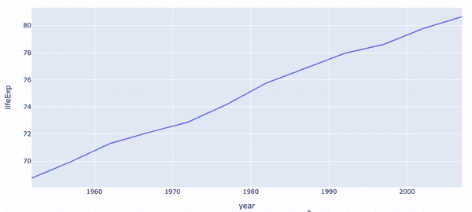

60 年间加拿大人预期寿命的线形图

折线图对于比较数据集中的两行非常有用，这可以通过向图中再添加一个属性来实现。在这种情况下，颜色代表国家。

```
fig = px.line(gapminder_oceania, #dataframe
              x = "year",        #x-values column
              y = "lifeExp",     #y-values column
              color = 'country'  #column shown by color
              )
fig.show()
```

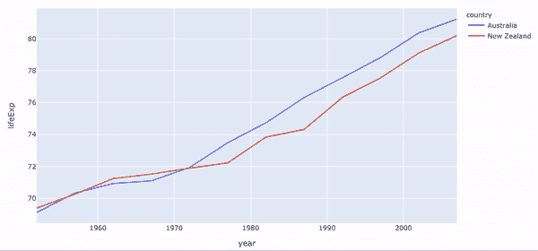

澳大利亚人和新西兰人 60 年间的预期寿命线图

这里我们有两个来自大洋洲的国家，所以它们都被分配了一种颜色，而不必提及国家的名称，只是颜色参数的列名。

除了大洋洲之外，我们还可以添加更多的洲，但是我们如何避免图表变得过于庞大呢？

将洲显示为颜色，然后将线组设置为国家，这样我们就可以直观地看到不同洲的预期寿命，而不必计算该洲内所有国家的平均预期寿命。

```
fig = px.line(gapminder_continent,    #dataframe
              x = ”year”,             #x-values column
              y = ”lifeExp”,          #y-values column
              color = ”continent”,    #column shown by color
              line_group = ”country”, #group rows of a column
              hover_name = ”country”  #hover info title
              )
fig.show()
```

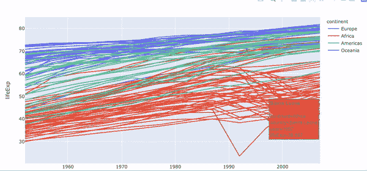

60 年间世界各国预期寿命的折线图(不包括亚洲)

如果个人观察是首选的，我们可以再次隔离大陆的线，以及检查每条线所代表的国家的悬停能力。

## 条形图

更简单的条形图代码。

```
fig = px.bar(gapminder_canada, #dataframe
             x = ’year’,       #x-values column
             y = ’pop’         #y-values column
             )
fig.show()
```

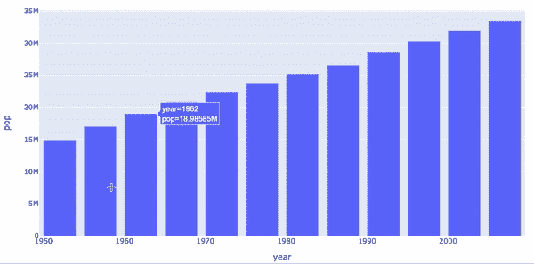

加拿大 60 年人口柱状图

我们可以添加更多关于加拿大人口随时间变化的信息，包括使用颜色的预期寿命。使用条形图的标签属性将 axis 标签 pop 升级为 population of Canada，并为悬停功能添加更多详细信息。

```
fig = px.bar(gapminder_canada,                     #dataframe
             x = ’year’,                           #x-values column
             y = ’pop’,                            #y-values column
             hover_data = [‘lifeExp’, ‘gdpPercap’],#extra hover info
             color = ’lifeExp’,                    #column by color
             labels = {‘pop’:’population of Canada’}#label change
             )
fig.show()
```

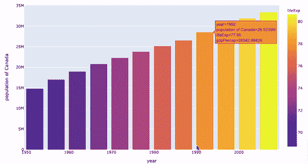

加拿大 60 年人口柱状图(带颜色=预期寿命)

上面，我们可以用一张图表有效地描绘出加拿大人口随时间变化的两种趋势。

回头看看 tips 数据集，我们可以将更多的信息叠加到一个柱状图可视化中。

```
fig = px.bar(tips,               #dataframe
             x = ”sex”,          #x-values column
             y = ”total_bill”,   #y-values column
             color = ”smoker”,   #column shown by color
             barmode = ”group”,  #separate filter (smoker)
             facet_row = ”time”, #name of grid row
             facet_col = ”day”,  #name of grid column
             category_orders= {“day”: [“Thur”, “Fri”, “Sat”, “Sun”],
                               “time”: [“Lunch”, “Dinner”]}
                                 #grid arrangement
             )
fig.show()
```

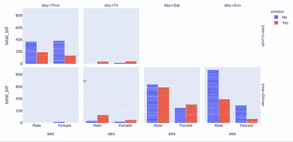

男性和女性在周四至周日午餐和晚餐期间支付的总账单的条形图(带颜色=吸烟者)

我们可以观察数据集的五列，并伴有一些交互性。通过使用行和列方面，我们有一个网格布局，用于一周中的日期和用餐时间；由较小的条形图组成，其中包含人员类型(吸烟者和性别)及其总账单的摘要。

## 三维散点图

来个 3D 吧。在这里，我们正在查看选举数据集，其中按地区比较了蒙特利尔市三名市长候选人的投票和结果。

```
fig = px.scatter_3d(            
        election,                #dataframe
        x = ”Joly”,              #x-values column
        y = ”Coderre”,           #y-values column
        z = ”Bergeron”,          #z-values column
        color = ”winner”,        #column shown by color
        size = ”total”,          #column shown by size
        hover_name = ”district”, #hover title
        symbol = ”result”,       #column shown by shape
        color_discrete_map = {“Joly”: “blue”, “Bergeron”: “green”, 
                               “Coderre”:”red”}
                                 #specific colors for x,y,z values            )fig.show()
```

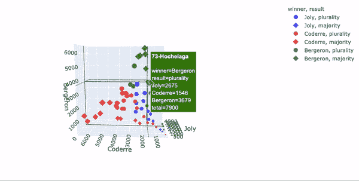

蒙特利尔不同地区市长候选人票数的三维散点图(颜色=候选人获胜，形状=获胜类型

结合 Plotly 的悬停交互性，该图可以显示选举数据集中的所有信息。

## 地理学的

地理图表用于更独特的情况，但也可以使用 Plotly Express 轻松完成。

```
fig = px.scatter_geo(gapminder,               #dataframe
                     locations = ”iso_alpha”, #location code
                     color = ”continent”,     #column shown by color
                     hover_name = ”country”,  #hover info title 
                     size = ”pop”,            #column shown by size
                     animation_frame = ”year”,#column animated
                     projection = ”orthographic”#type of map
                     )
fig.show()
```

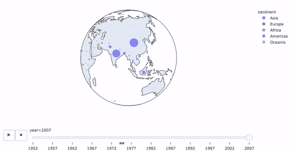

一段时间内各国人口变化的正射曲线图

我们对观想有一个非常有用的补充；也就是动画交互性。对于这个数据集，我选择了年份作为动画帧；因此，我们可以自动播放所有年份，也可以手动选择年份。

虽然上面的球形可视化看起来很有趣，但下面的地图可视化对一个人观察和分析信息会更好。

```
fig = px.choropleth(gapminder,                #dataframe
                    locations = ”iso_alpha”,  #location code
                    color = ”lifeExp”,        #column shown by color
                    hover_name = ”country”,   #hover info title
                    animation_frame = ”year”, #column animated
                    range_color = [20,80]     #color range
                    )
fig.show()
```

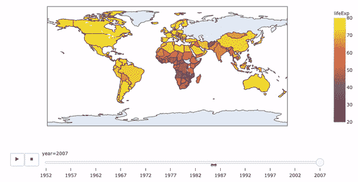

各国预期寿命随时间变化的 Choropleth 图

现在，我们有了一个非常清晰的图像，显示了随着时间的推移，世界各地的预期寿命。

## 动画散点图

动画散点图(气泡图)是我最喜欢的可视化，因为它很好地解释了信息，并且非常动态。

```
px.scatter(gapminder,                  #dataframe
          x = "gdpPercap",             #x-values column
          y = "lifeExp",               #y-values column
          animation_frame = "year",    #column animated
          animation_group = "country", #column shown as bubble
          size = "pop",                #column shown by size
          color = "continent",         #column shown by color
          hover_name = "country",      #hover info title
          log_x = True,                #use logs on x-values
          size_max = 55,               #change max size of bubbles
          range_x = [100,100000],      #axis range for x-values
          range_y = [25,90]            #axis range for y-values
          )
```

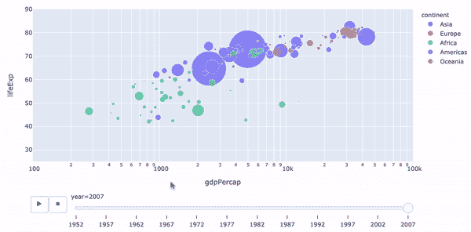

各国人均国内生产总值、预期寿命和人口随时间变化的气泡图

因此，使用 Plotly Express，我们可以实现具有交互性的可视化，只需要几行直观的代码。