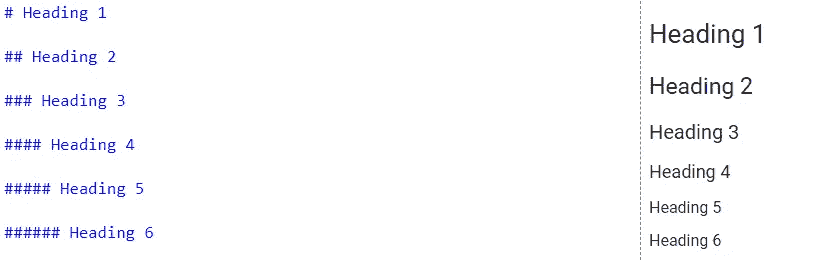
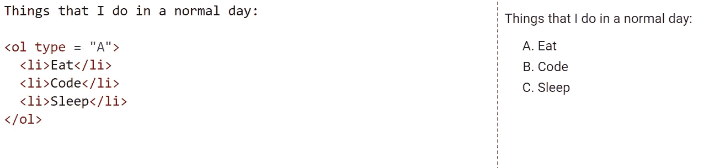
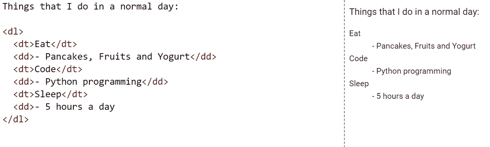
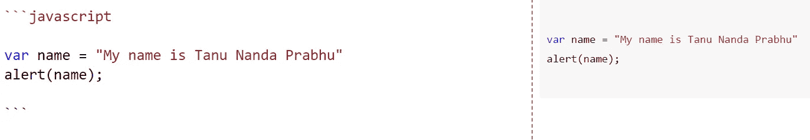

# Google Colab 的备忘单

> 原文：<https://towardsdatascience.com/cheat-sheet-for-google-colab-63853778c093?source=collection_archive---------3----------------------->

## 在本教程中，您将学习如何充分利用 Google Colab。


**形象演职员表:** [**中等**](https://www.google.com/url?sa=i&url=https%3A%2F%2Fmedium.com%2F%40nanofaroque%2Fgoogle-colab-is-a-goldmine-for-machine-learning-or-deep-learning-enthusiast-894a80b4b349&psig=AOvVaw3gsrH1iIfEi7ees3lDtRoA&ust=1587694869521000&source=images&cd=vfe&ved=0CAMQjB1qFwoTCOjp-Lm-_egCFQAAAAAdAAAAABAD)

# 介绍

[Google Colab](https://colab.research.google.com/) 是一个了不起的工具，它让我们建立并执行一个杰出的数据科学模型，并为我们提供了一个记录我们的旅程的机会。由于 Google Colab 为我们提供了**代码单元格**来键入代码，它还为我们提供了**文本单元格**来添加文本。在本教程中，我们将更多地关注文本单元格，看看我们如何通过使用一些我将在本教程中讨论的简单命令来掌握它。如果你喜欢记录(像我一样)，那么你会喜欢阅读本教程。你可以从下面的链接开始探索 Google Colab。相信我，这是一个神奇的工具。

[](https://colab.research.google.com/) [## 谷歌联合实验室

### 编辑描述

colab.research.google.com](https://colab.research.google.com/) 

# 小抄

下面我将讨论一些主要的便利技巧和快捷方式，它们可以被使用并成为文档记录的专家。如果你知道 [Markdown](https://www.markdownguide.org/) 、 [XML](https://www.w3schools.com/xml/) 和 [HTML](https://www.w3schools.com/html/) 编码，那么这可能是一件轻而易举的事情，或者如果你对其中任何一个都不熟悉，那么今天是学习它们的好时机。Google Colab 支持 **Markdown** 和 **HTML** 文档。你可以把其中的任何一个记录下来。只需注意，本教程的完整代码也可以在下面我的 [**GitHub 资源库**](https://github.com/Tanu-N-Prabhu/Python/blob/master/Cheat_sheet_for_Google_Colab.ipynb) 中找到:

[](https://github.com/Tanu-N-Prabhu/Python/blob/master/Cheat_sheet_for_Google_Colab.ipynb) [## 塔努-北帕布/Python

### permalink dissolve GitHub 是超过 5000 万开发人员的家园，他们一起工作来托管和审查代码，管理…

github.com](https://github.com/Tanu-N-Prabhu/Python/blob/master/Cheat_sheet_for_Google_Colab.ipynb) 

好了，我们开始吧。

> **使用“文本单元格”来试验所有这些命令**


**图片来源于作者(塔努·南达·帕布)**

# 标题

下面是标题的快捷命令。从标题 1 到标题 6 有不同类型的标题。

## 降价

使用`**# heading-name**`，添加的`**#**`越多，标题的尺寸越小，如下图所示:



**图片来源于作者(Tanu Nanda Prabhu)**

## 超文本标记语言

类似地，您可以使用 **HTML** 标签，如`**h1, h2, h3, h4, h5 and h6**`作为标题，如下所示:


**图片来源于作者(Tanu Nanda Prabhu)**

# 大胆的

加粗使文本加粗并增加文本的可见性。

## 降价

用`******` (两颗星)将文本包围，使其在 markdown 中加粗，例如`****Text-to-be-bold****`


**图片来源于作者(Tanu Nanda Prabhu)**

## 超文本标记语言

使用 HTML，我们可以通过使用`**b**`标签来加粗文本，如下所示:


**图片来源于作者(Tanu Nanda Prabhu)**

# 在字下划横线

与粗体相似，文本也可以是斜体

## 降价

使 markdown 中的文本变为斜体，用`*****` (一颗星)将其包围，例如`***Text-to-be-italicize***`


**图片来源于作者(Tanu Nanda Prabhu)**

## 超文本标记语言

同样，这也可以使用如下所示的`**i**` 标记在 HTML 中编写:


**图片来源于作者(Tanu Nanda Prabhu)**

# 删除线

用于删除文本。一条**水平线**画在文字中间。

## 降价

为了删除线，markdown 中的文本用两个波浪号字符`**~~**`包围，例如`**~~Text to be striked~~**`。


**图片来源于作者(塔努·南达·帕布)**

## 超文本标记语言

在 HTML 中我们可以使用`**s**` 标签来删除文本。


**图片来源于作者(塔努·南达·帕布)**

# 结合

此外，我们可以组合所有的格式命令并设置文本样式，如下所示。

## 降价和 HTML


**图片来源于作者(Tanu Nanda Prabhu)**

# 列表

众所周知，有两种类型的列表:

1.  **有序列表**
2.  **无序列表**

顾名思义，有序列表有一个顺序(1，2，3，…或其他)。但是无序列表没有顺序，如下所示。

## Markdown 中的有序和无序列表

在有序列表的 markdown 中，你可以直接输入类似于`**1, 2, 3, and so on**`的数字。但是对于无序列表，你可以从一个`*****` 开始，这个实习生创建一个项目列表。


**图片来源于作者(Tanu Nanda Prabhu)**

## 超文本标记语言

我们可以使用 HTML 标签来处理列表，如下所示:

## 有序列表

有序列表中有**普通列表，类型 1，A，A，I，I 类型**如下图所示:

**正常列表**

使用`**ol**`标签，列表内容使用`**li**` 标签，如下所示:


**图片来源于作者(Tanu Nanda Prabhu)**

**Type = "1"**

只需在`**ol**` 标签中添加`**type = "1"**`，这将创建一个由 **1、2、3 等等组成的有序列表。**列表项将用数字编号(默认)。


**图片来源于作者(Tanu Nanda Prabhu)**

**Type = "A"**

只需在`**ol**` 标签内添加`**type = "A"**`，这将创建一个由 **A、B、C 等等组成的有序列表。**列表项目将用大写字母编号。



**图片来源于作者(塔努·南达·帕布)**

**Type = "a"**

只需将`**type = "a"**`添加到`**ol**` 标签中，这将创建一个由 **a、b、c 等等组成的有序列表。**列表项目将用小写字母编号。


**图片来源于作者(塔努·南达·帕布)**

**Type = "I"**

只需将`**type = "I"**`添加到`**ol**` 标签中，这将创建一个有序的列表，包含 **I、II、III 等等。**列表项将用大写罗马数字进行编号。


**图片来源于作者(塔努·南达·帕布)**

**Type = "i"**

只需将`**type = "i"**`添加到`**ol**` 标签中，这将创建一个有序的列表，包含 **i、ii、iii 等等。**列表项将用小写罗马数字进行编号。


**图片来源于作者(Tanu Nanda Prabhu)**

## 无序列表

有序列表中有**正常列表、圆盘、正方形、圆形和无类型**，如下图所示:

**正常列表**

使用`**ul**` 标签，列表内容使用`**li**` 标签，如下所示:


**图片来源于作者(Tanu Nanda Prabhu)**

**圆盘**

只需在`**ul**` 标签内添加`**type = "disc"**`即可创建一个圆盘形列表。


**图片来源于作者(塔努·南达·帕布)**

**圈子**

只需在`**ul**` 标签内添加`**type = "circle"**`即可创建一个圆形列表。


**图片来源于作者(塔努·南达·帕布)**

**方形**

只需在`**ul**` 标签内添加`**type = "square"**`即可创建一个方形列表。


**图片来源于作者(Tanu Nanda Prabhu)**

**无**

只需在`**ul**` 标签内添加`**type = "none"**`即可创建一个无形状列表。在这种情况下，列表将没有点，如下所示


**图片来源于作者(塔努·南达·帕布)**

## 描述列表

描述列表是一个术语列表，包含每个术语的描述。`**dl**` 标签由定义列表名称的`**dt**`和描述每个列表的`**dd**` 标签组成。



**图片来源于作者(塔努·南达·帕布)**

## 嵌套列表

嵌套列表基本上是列表中的列表。


**图片来源于作者(Tanu Nanda Prabhu)**

## 控制列表计数

有序列表将从 1 开始计数。如果要从指定的数字开始计数，可以使用如下所示的`**start**` 属性:


**图片来源于作者(塔努·南达·帕布)**

要更深入地了解 HTML 中的列表，请参考下面的文章:

[](https://www.w3schools.com/html/html_lists.asp) [## HTML 列表

### 自己试试”无序列表以标签开始。每个列表项都以标签开始。

www.w3schools.com](https://www.w3schools.com/html/html_lists.asp) 

# 链接

链接或超链接允许用户从一页点击到另一页。

## 降价

在 markdown 中，将链接的标题写在方括号`**[ ]**`内，将网页地址写在圆括号或圆括号`**( )**`内。确保先写标题，再写链接。


**图片来源于作者(塔努·南达·帕布)**

## 超文本标记语言

在 HTML 中对于超链接，可以使用`**a**` 和`**href**` 标签如下所示:


**图片来源于作者(Tanu Nanda Prabhu)**

# 形象

有时候一张图片胜过千言万语。人们可以很容易地通过看到图像来更好地理解这些概念。

## 降价

与链接类似，您需要在括号内插入图像的链接。一定要在开头加上`**!**` 。如果你的链接被破坏或者无效，那么`**alt text**`将被显示。


**图片来源**[**Makeameme.org**](https://makeameme.org/)

**图像悬停**

您可以同时将鼠标悬停在文本上来查看图像的标题。为此，您可以将您选择的文本放入命令中，如下所示:

```

```

## 超文本标记语言

在 HTML 中，我们可以使用`**img**` 标签来包含图像，并且您需要向`**src**`标签提供图像的来源。

**调整高度和宽度**

您可以调整图像的**高度**和**宽度**。同样，你也可以嵌入一个 GIF 图片，如下图所示。


**图片来源于**[**Giphy.com**](https://giphy.com/explore/images)

**图片和说明文字**

这是一个很好的实践，给来自不同来源的图片(我的意思是引用图片或提供说明)以信任。在`**p**` 标签的帮助下，我们可以为图片提供标题。


【Makeameme.org】图片来源 [**图片来源**](https://makeameme.org/)

您可以尝试使用`**align**` 标签，并根据您的喜好调整标题。

# 格式化代码

这里有两件事你需要明白:

1.  **内嵌代码**
2.  **语法高亮显示**

## 内嵌代码

有时，您可能希望插入一些可以使用内联代码的代码示例。要使用内联代码，可以使用**反斜杠(`` `)。**如上图用反勾将其包围。


**图片来源于作者(Tanu Nanda Prabhu)**

## 语法突出显示

当你在 Google Colab 的文本编辑器中编写**多行代码**时，就会用到这个。有时使用内联代码包含巨大的 python 代码片段并不是一个好主意，在这种情况下使用语法高亮。您必须将代码嵌入到````**`中，如下所示

**默认语法高亮显示**

这与任何编程语言无关。


**图片来源于作者(塔努·南达·帕布)**

**Python 语法高亮显示**

这可以明确地用于 **python** 编程。你应该在开头加上`**python**`这个名字。


**图片来源于作者(塔努·南达·帕布)**

**Javascript 语法高亮显示**

这可以明确地用于 **JavaScript** 编程。你应该在开头加上`**javascript**` 这个名字。



**图片来源于作者(塔努·南达·帕布)**

**C 编程语法高亮**

这可以明确用于 **C** 编程。你应该在开头加上名字`**c**` 。


**图片来源于作者(Tanu Nanda Prabhu)**

如上所述，您可以突出显示基于不同编程语言的代码片段。

# 桌子

有些时候，您可能希望以**表格**的形式表示信息。

## 降价

您必须使用`**|**` 作为不同列的运算符。默认情况下，表格标题会以粗体显示。


**图片来源于作者(塔努·南达·帕布)**

> **冒号可以用来对齐列。**

如果您需要创建任何表格，那么使用下面的 [**工具**](https://www.tablesgenerator.com/) 为您生成表格。你所要做的就是选择表格生成器的类型，比如 Latex、HTML、Markdown 等等。输入表格中的内容，然后点击**生成。然后，您可以在文本编辑器中复制粘贴生成的代码，并毫不费力地看到一个漂亮的表格。**

 [## 在线创建 LaTeX 表格—TablesGenerator.com

### 使用表格/设置尺寸菜单选项设置所需的表格尺寸。将表格数据输入表格:复制…

www.tablesgenerator.com](https://www.tablesgenerator.com/) 

## 超文本标记语言

在 HTML 的情况下，你必须使用`**table**` 标签和`**tr**` ，后者用于表格行，而`**th**`用于表格标题(在这种情况下是**公司名称和创始人**)。`**td**` 为表格描述。


**图片来源于作者(塔努·南达·帕布)**

您也可以使用`**align**` 标签并相应地对齐内容。

# 缩进

当您需要区分一些文本，如**注释、提示**或任何额外的有用信息时，这非常有用。

## 降价

你需要使用`**>**`进行缩进。


**图片来源于作者(塔努·南达·帕布)**

## 超文本标记语言

同样，在 HTML 中，你可以使用`**blockquote**` 标签来达到同样的目的。


**图片来源于作者(Tanu Nanda Prabhu)**

# 水平标尺

在你写作的时候，在每一章或者任何一个概念后面画一个横坐标通常是一个很好的练习。这有助于区分不同的事物。

## 降价

在降价的情况下，你只需要使用 3 个`**---**`(减号)。


**图片来源于作者(Tanu Nanda Prabhu)**

## 超文本标记语言

对于 HTML，您需要使用标签`**hr**`来插入一个水平标尺。


**图片来源于作者(Tanu Nanda Prabhu)**

# 证明合法

很多时候你会在笔记本上写下大段文字，但有时你可能想调整它们，只是为了让它看起来整洁。在这里，可以使用`**align**` 标签，用`**justify**` 作为值。


**图片来源于作者(塔努·南达·帕布)**


**图片来源于作者(Tanu Nanda Prabhu)**

同样，你可以用`**right**`**`**left**`**`**center**`**的值和**的值相应地对齐**的段落。******

# ****换行符****

****有时你可能想开始一个新的段落，所以你需要在它们之间换行。这里有两个选项，要么你可以直接按下**回车**键，在中间留一行空格，要么你可以使用`**br**` 标签，也称为换行符。****

********

******图片来源于作者(Tanu Nanda Prabhu)******

# ****数学公式****

****如果你用笔记本做研究，那么你需要写很多方程式和数学符号。****

## ******符号******

****确保您在第一个`**$**`之后的`**\**` 之间书写符号名称。****

********

******图片来源于作者(塔努·南达·帕布)******

## ******方程式******

****遵循相同的规则，即围绕`**$**` 之间的等式，从第一个`**$**`后的`**/**` 开始。****

********

******图片来源于作者(Tanu Nanda Prabhu)******

****要查看更多关于数学方程式和符号的内容，请参考下面的 [**链接**](https://csrgxtu.github.io/2015/03/20/Writing-Mathematic-Fomulars-in-Markdown/) :****

 ****[## 在 Markdown 中编写数学公式

### 在这篇文章中，我将向你展示如何在 markdown 中编写数学符号。因为我在写博客，所以…

csrgxtu.github.io](https://csrgxtu.github.io/2015/03/20/Writing-Mathematic-Fomulars-in-Markdown/)**** 

****好了，各位，教程到此结束。我希望你今天学到了很多新东西。我试图保持这篇教程的简短，但是因为有很多概念，我不得不把它最大化。但是这份备忘单在大多数面试(**技术文档**)中或者当你记录你的木星笔记本时会很有用。如果我找到更多的提示和技巧，那么我会在这里提供细节。在那之前，注意安全，祝你有美好的一天。下次见。****