# NLP 备忘单:迄今为止我的 NLP 学习历程总结

> 原文：<https://towardsdatascience.com/cheat-sheet-for-nlp-a-summary-of-my-nlp-learning-journey-thus-far-6ee753943890?source=collection_archive---------23----------------------->

说实话，我一开始也没想到要学 NLP。但是由于它广泛而有趣的应用，NLP 一直吸引着我去更深入地挖掘和探索更多的乐趣。与许多机器学习算法不同，NLP 在可视化方面特别丰富，因此易于理解、解释和应用于现实生活中的问题。在本文中，我将介绍 NLP 中的几个领域，并分享它们背后的思想(以及代码和视觉效果！).以下是你应该期待的:

*   [情感分析](#d973)
*   [字云](#5be7)
*   [命名实体识别](#8347)
*   [文本摘要](#723a)
*   [主题分析(LDA)和相似性分析(LSI)](#5896)
*   [语言模型(文本生成)](#3fa5)

tweet 数据集包含 2292 条 Twitter 用户的推文。尽管这个数据集不能代表 Twitter 上的所有人，但我们的结论仍然很有见地。代码都上传在 Github 里。

# **情感分析**

我总是觉得情绪分析很有趣，因为它可以嵌入到任何地方。我们，人类，与情感相连，与观点进步。更具体地说，商业是以客户为中心的。分析公众对一种产品或一家公司的看法有助于公司定位和改进。因此，情感分析可以用作商业中的绩效指标/反馈。

*   **幼稚情绪分析**

让我们从简单的方法开始，了解情感分析背后的思想。在朴素情感分析中，我们将每个词编码为正面或负面，然后遍历整个文本，计算正面词和负面词。

这个代码片段展示了如何为肯定/否定单词生成单词列表，这些单词列表以后可以作为字典使用，我们可以在其中查找单词。Github 中包含完整版本的代码。

```
import requests
def sentiment_words(url):
    request = requests.get(url)
    print("retriving data >>> status code: ",request.status_code)
    text = request.text
    word_list = text[text.find("\n\n")+2:].split("\n")
    return word_listpos_url = '[http://ptrckprry.com/course/ssd/data/positive-words.txt'](http://ptrckprry.com/course/ssd/data/positive-words.txt')
neg_url = '[http://ptrckprry.com/course/ssd/data/negative-words.txt'](http://ptrckprry.com/course/ssd/data/negative-words.txt')
pos_list = sentiment_words(pos_url)[:-1]
neg_list = sentiment_words(neg_url)[:-1]
```

下图是 Twitter 用户的情绪分布。总的来说，Twitter 用户积极的多于消极的。有些用户甚至有接近 0 的负分的高正分。


Twitter 用户的情感分布，来源于作者

仔细观察一个用户:我们能够察觉这个用户情绪的变化。不幸的是，我们没有更准确的时间信息，否则我们甚至可能发现一些情绪变化的周/季模式。

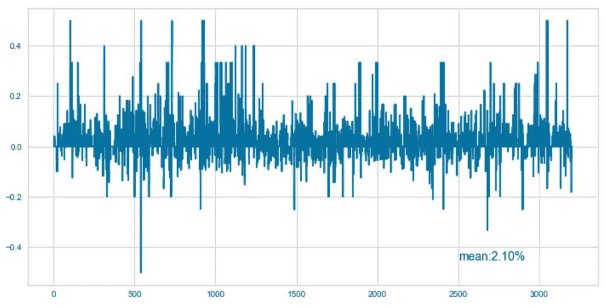

一个用户的情感分数的变化，按作者来源

*   **NRC 情感词典**

与朴素情绪分析的机制相似，NRC 提取了另外 8 种情绪，如喜悦、信任、悲伤等。有了更丰富的信息，可以添加更多的视觉效果/功能。例如，雷达图是情绪诊断的潜在视觉效果。用户 1(蓝色)似乎比用户 2(红色)更积极，在积极情绪(喜悦、信任、期待)上得分更高，在消极情绪(悲伤、愤怒、厌恶)上得分更低。

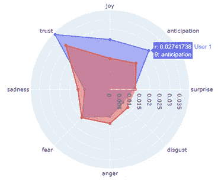

用于情绪诊断的雷达图，来源于作者

*   **VADER**

VADER(化合价感知词典和情感推理机)的功能超出了单词级别。相反，它在句子级别/内容级别上分析情感。此外，它提供了情绪的极性(积极/消极)和强度。在 Python Vader perspection 库中，它返回 4 个分数——正、负、中性和复合。

```
from vaderSentiment.vaderSentiment import SentimentIntensityAnalyzer
analyzer = SentimentIntensityAnalyzer() 
pos=neg=neu=compound=0
sentences = nltk.sent_tokenize(text.lower())
for sentence in sentences:
    vs = analyzer.polarity_scores(sentence)
    pos += vs["pos"]/len(sentences)
    neg += vs["neg"]/len(sentences)
    neu += vs["neu"]/len(sentences)
    compound += vs["compound"]/len(sentences)
```

“中性”与“积极”显著负相关，这是有道理的，因为当我们表达情绪时，很难保持中立。然而，大多数用户被检测为高度中立。是我们的分析仪不够灵敏，还是现实生活中的真实情况？

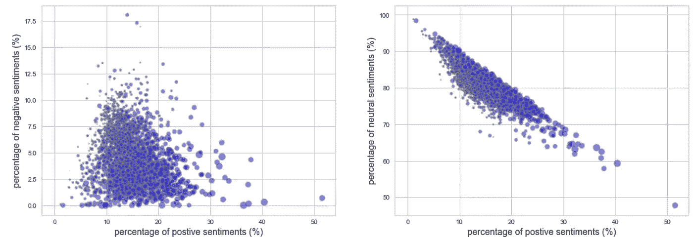

VADER 分数分布，按作者来源

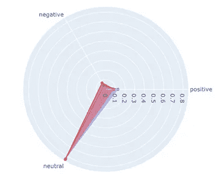

VADER 情绪得分的雷达图，来源于作者

# WordCloud

词云是很多人说起 NLP 时想到的。它计算单词的频率，并根据它们的频率调整每个单词的大小。一个词出现的频率越高，在词云中就越突出。这个想法简单而有效。

```
from wordcloud import WordCloud, STOPWORDS
wordcloud = WordCloud(stopwords=STOPWORDS,background_color='white',width=3000,height=3000).generate(text)
plt.imshow(wordcloud)          
plt.axis('off')           
plt.show()
```

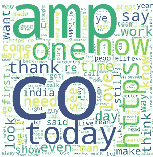

Wordcloud 覆盖整个数据集，按作者排序

# 命名实体识别

命名实体识别使我们能够理解谈论的是什么或谁，它反映了人类用语言语法处理句子的方式。该代码片段逐句扫描文本，如果单词被识别为“实体”，则标记每个单词。完成后，我们在大块中搜索树，并询问“你被贴上标签了吗？”— *hasattr(树，“标签”)*。如果树回答是，我们将在 *tree.leaves()* 中获取实体，并存储标签 *tree.label()* 。

```
def entity_identity(text):
    sentences = nltk.sent_tokenize(text)
    entity = []
    for sentence in sentences:
        words = nltk.word_tokenize(sentence)
        tagged = nltk.pos_tag(words)
        chunked = nltk.ne_chunk(tagged)
        for tree in chunked:
            if hasattr(tree,"label"):
                entity.append([tree.label()," ".join(c[0] for c in tree.leaves())])
    entity = pd.DataFrame(entity,columns=['label','entity'])
    return entity
```

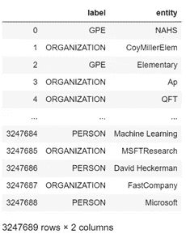

实体快照，按作者排序的来源

如果将命名实体与情感分析/词云相结合，事情会变得更有趣。我们先来看云这个词里的一个例子。该函数可以获取任何类型的实体，并抓取该类型中的所有实体以形成单词云。它可以作为一个监视器，监视人们在谈论什么/谁。

```
def wordcloud_entity(entity,label="PERSON"):
    text = " ".join(list(entity[entity["label"]==label]["entity"]))
    wordcloud =  WordCloud(stopwords=STOPWORDS,background_color='white',width=3000,height=3000).generate(text)
    fig,ax = plt.subplots(1,1,figsize=(8,8))
    plt.imshow(wordcloud)          
    plt.axis('off')
    plt.show()
```

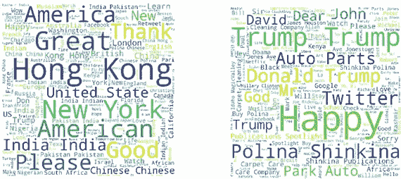

分别代表 GPE(地缘政治实体)和个人的 Wordcloud，来源于作者

好了，现在我们意识到 twitter 用户正在大量谈论香港、美国、特朗普、宝琳娜·辛基娜……进一步分析一下与这些词相关的情绪如何？接下来，我搜索包含这些单词的句子，并使用 VADER 情感分析器。

```
def sentiment_entity(text,entity="New York"):
    sentences = nltk.sent_tokenize(text)
    analyzer = SentimentIntensityAnalyzer()
    pos=neg=neu=compound=count=0
    for sentence in sentences:
        if entity.lower() in sentence.lower():
            vs = analyzer.polarity_scores(sentence)
            pos += vs["pos"]
            neg += vs["neg"]
            neu += vs["neu"]
            compound += vs["compound"]
            count += 1
    return pos/count,neg/count,neu/count,compound/count
```

这个数据集在它所代表的用户群(例如大学生)和我提取它的时间方面是有偏见的，但至少它表明了我们如何能够将情感分析纳入命名实体识别。

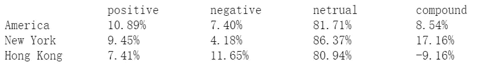

美国、纽约和香港的情感比较，按作者分类

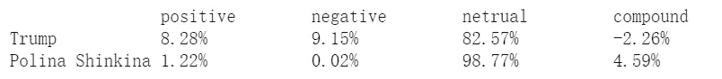

特朗普和宝琳娜·辛基娜之间的情感比较，由作者提供

# 文本摘要

在前三部分中，我们主要集中在单词级和句子级的分析。现在我们来分析段落中的文本。通常，一篇文章包括开头、正文和结尾。开头或结尾的一些句子是总结文章主题的关键句子。文本摘要对每个句子进行排名，并挑选排名靠前的句子。天真地说，我们可以计算每个单词的频率，并以此为标尺对句子进行排序。最后，我们挑选词频最高(最有代表性)的句子。还有另一种计算 TextRank 的复杂方法，它被打包在一个名为 gensim 的包中。看看这段代码！推文比文章短，因此可能不太适合摘要。我将 ratio 参数设置为小至 0.003，以挤压 tweets 的输出大小。

```
import gensim
gensim.summarization.summarize(text,ratio=0.003)
```

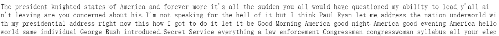

一个文本摘要的例子，作者来源

# 主题分析和相似性

现在事情越来越抽象了。主题分析是一种无监督的学习技术，我们试图从文本中提取维度。我这里介绍的技术是 LDA(潜在狄利克雷分配)。LDA 需要词典和语料库为主题抽取做准备。单词字典对文本中的每个代码进行编码。语料库是一个列表的列表，其中文本中的单词存储在一个列表中，所有文本分别存储在不同的列表中(“单词包”)。

```
words_list = []
users = []
for user,text in tweets.items():
    users.append(user)
    words = nltk.word_tokenize(text.lower())
    words = [word for word in words if word not in STOPWORDS and word.isalnum() and len(word)>=2]
    words_list.append(words)num_topics = 3 #self-defined
dictionary = corpora.Dictionary(words_list)
corpus = [dictionary.doc2bow(words) for words in words_list]
lda = LdaModel(corpus, id2word=dictionary, num_topics=num_topics)
```

现在我们得到 3 个主题及其相应的代表词。要显示特定主题的样子，请尝试以下代码:

```
# Topic is 0 indexed, 1 indicates the second topic
lda.show_topic(1)
```

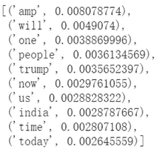

某个主题的热门词汇，来源于作者

要获得用户/文档的主题组件，请尝试以下代码:

```
# corpus[2] refers to the tweets of a user
sorted(lda.get_document_topics(corpus[2],minimum_probability=0,per_word_topics=False),key=lambda x:x[1],reverse=True)[output] [(0, 0.51107097), (1, 0.48721585), (2, 0.0017131236)]
```

比较不同用户之间的主题相似性，这是 LSI 的亮点。LSI 接受与 LDA 相同的输入—字典、语料库—并将一个新文档与现有的语料库进行比较。

```
lsi = models.LsiModel(corpus,id2word=dictionary, num_topics=3)  
words_new = nltk.word_tokenize(doc.lower())
words_new = [word for word in words if word not in STOPWORDS and word.isalnum() and len(word)>=2]
vec_bow = dictionary.doc2bow(words_new)     
vec_lsi = lsi[vec_bow]
index = similarities.MatrixSimilarity(lsi[corpus])
sims = index[vec_lsi]       
sims = sorted(enumerate(sims), key=lambda item: -item[1])
```

我没有输入新的推文。相反，我随机选择了一个用户。这就是为什么我们得到一个相似性分数 1。

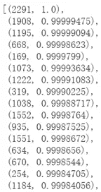

相似性表(语料库 id，相似性得分)，来源按作者

pyLDAvis 包为 LDA 提供了很好的视觉效果，通过它我们能够知道主题如何与关键词相关联，以及如何解释主题。这需要相当长的时间，因此我只为一个用户绘图。

```
lda_display = pyLDAvis.gensim.prepare(lda, corpus, dictionary, R=15, sort_topics=False)     
pyLDAvis.display(lda_display)
```

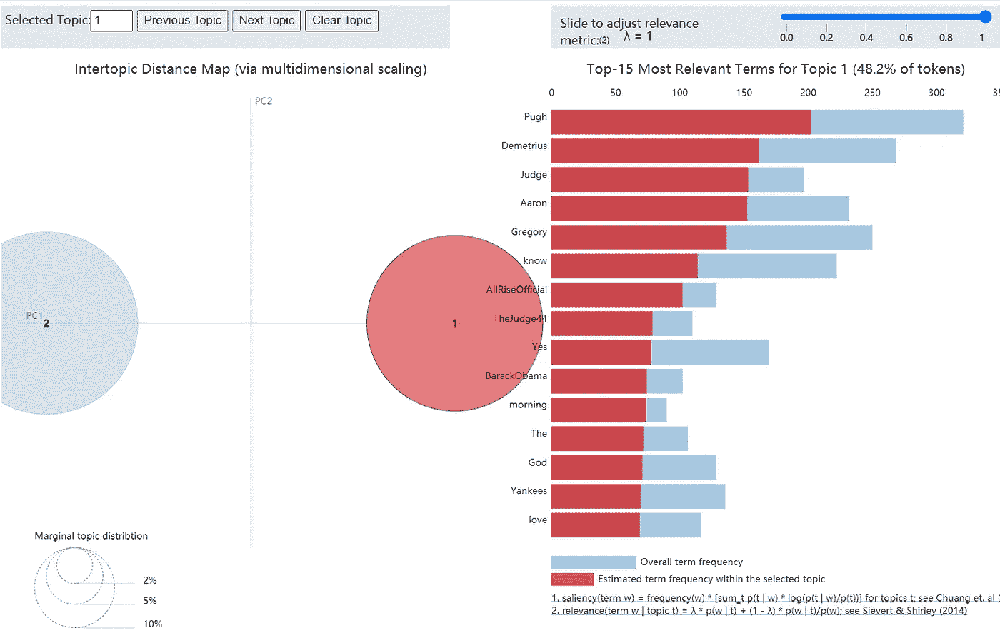

LDA 可视化示例(一个用户),按作者排序

# 语言模型(文本生成)

通过以上步骤，我们开始了解文本的情感、实体、关键词、主题。现在让我们教我们的机器如何像人一样说话。我们将为一个 twitter 用户建立一个简单的 RNN 模型，并模仿这个用户如何说话。

对系列数据应用机器学习有两个主要障碍。首先，序列的顺序不能反映在传统的 DNN 模型中。这就是 RNN 的用武之地。RNN 非常适合系列数据，就像 CNN 适合图像一样。多对一 RNN 结构将文本中的前 n-1 个单词作为输入，第 n 个单词作为输出。RNN 可以传递以前位置的信息，从而可以连续保留订单。第二，系列数据可以有不同的长度。推文可以短至 3 个字符，也可以长达几个句子。Padding 就是专门针对这个问题设计的。

首先，我们对每个单词进行标记，因为机器不能直接识别单词，然后每个句子被编码成一个整数列表。例如，“现在”在句子中被编码为 198。word_index 是解密的字典。

```
tokenizer = Tokenizer() # can set num_words to tokenize
tokenizer.fit_on_texts(sentences)
sequences = tokenizer.texts_to_sequences(sentences)
word_index = tokenizer.word_index
index_word = {index:word for word,index in word_index.items()}
```

接下来，为了统一长度，每个句子要么添加 0 来弥补空格，要么将其本身截断以适应框。前 n-1 项取 X，每句最后一项取 y。

```
max_length = 15
trunct_type = "post"
padding_type = "pre"padded = pad_sequences(sequences,padding=padding_type,truncating=trunct_type,maxlen=max_length)vocab_size = len(word_index)+1
X = padded[:,:-1]
Y = padded[:,-1]
Y = tf.keras.utils.to_categorical(Y,num_classes=vocab_size)
```

在构建 RNN 模型时，我们添加了一个嵌入层。这是一种表示单词的方法，并且比一键编码表示法有一定的优势。在一个热编码中，每个字是相互独立/正交的。单词嵌入为每个单词生成一个向量，并支持非正交关系。有些单词可以彼此更接近和相似。比如“猫”比“西边”更接近“狗”。因此，我们能够将我们的知识移植到我们以前没有见过的句子中。机器能够从原来的句子“猫在跑”中学习“狗在跑”。

LSTM 是一种解决消失梯度和加强长期串联连接的技术。

```
model = tf.keras.Sequential([
tf.keras.layers.Embedding(vocab_size,embedding_dim,input_length=max_length-1),
tf.keras.layers.Bidirectional(tf.keras.layers.LSTM(512,return_sequences=True)),
tf.keras.layers.Bidirectional(tf.keras.layers.LSTM(256)),
tf.keras.layers.Flatten(),
tf.keras.layers.Dropout(0.3),
tf.keras.layers.Dense(vocab_size,activation="softmax")
])model.compile(loss='categorical_crossentropy',optimizer="adam",metrics=["accuracy"])model.fit(X,Y,epochs=100,verbose=1)
```

让我们生成文本来看看我们会说话的机器人是如何工作的。

```
choice = random.randint(0,len(padded)) 
seed = padded[choice,1:].reshape(1,max_length-1)
tweet_robot = sentences[choice]
for i in range(5):
    predicted = model.predict_classes(seed,verbose=0)
    seed = np.append(seed,[int(predicted)])[1:].reshape(1,max_length-1)
    tweet_robot = tweet_robot + " " + str(index_word[int(predicted)])
```

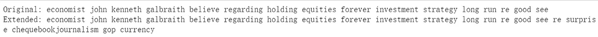

一个会说话的机器人的例子，由作者提供

原始句子是一条完整的推文，我们的说话机器人通过挑选适当的单词来帮助扩展句子。结果不如我期望的那样令人满意。我们的会说话的机器人似乎只是在扔单词，而不是产生一个组织良好的句子。但是，所选的单词显示出与主题的一些一致性。

要提高性能，还有很多工作要做。文本清理是我的首要任务。Tweets 很短，不正式，这导致了很多用词和句子组织的不优雅。数据集中有很多噪音。

> 我正站在 NLP 宏伟宫殿的门口，敲门。我前面的路还很长。我写下这篇文章来提醒我走过的路，并鼓励我继续冒险。

github:[https://github.com/JinPu-dududu/NLP](https://github.com/JinPu-dududu/NLP)