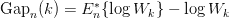
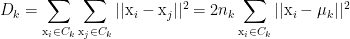
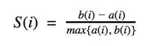
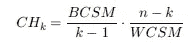
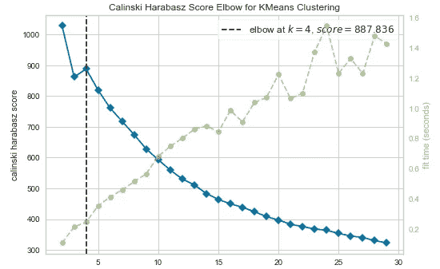
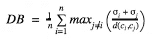
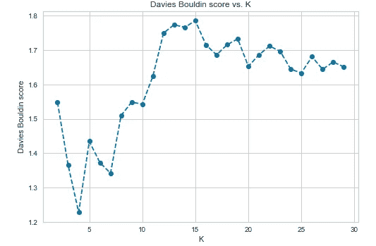
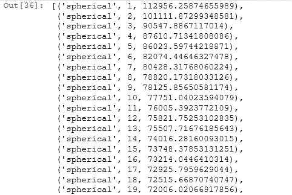

# 在 Python 中实现选择最佳集群数量的 7 种方法的备忘单

> 原文：<https://towardsdatascience.com/cheat-sheet-to-implementing-7-methods-for-selecting-optimal-number-of-clusters-in-python-898241e1d6ad?source=collection_archive---------1----------------------->

## 基于多个聚类验证指标(如间隙统计、轮廓系数、Calinski-Harabasz 指数等)选择最佳聚类数。


Mehrshad Rajabi 在 [Unsplash](https://unsplash.com/?utm_source=medium&utm_medium=referral) 上拍摄的照片

细分为检查有意义的细分提供了一个数据驱动的角度，高管可以使用它来采取有针对性的行动和改善业务成果。许多高管冒着基于过度概括做出决策的风险，因为他们利用一刀切的方法来评估他们的商业生态系统。然而，分段通过提供多个有意义的透镜来分解数据并采取行动，从而改善了决策。

我们在试图对客户或产品进行细分时面临的最令人困惑的问题之一是选择理想的细分数量。这是 K 均值、凝聚聚类和 GMM 聚类等多种聚类算法的关键参数。除非我们的数据只有 2 或 3 维，否则不可能直观地理解数据中存在的聚类。而在大多数实际应用中，我们会有 3 个以上的维度。本博客将帮助读者理解并快速实现选择最佳集群数量的最流行技术:

1.  差距统计
2.  肘法
3.  轮廓系数
4.  卡林斯基-哈拉巴斯指数
5.  戴维斯-波尔丁指数
6.  系统树图
7.  贝叶斯信息准则(BIC)

在这个练习中，我们将使用一家为孕妇提供服装的在线商店的点击流[数据](https://archive.ics.uci.edu/ml/datasets/clickstream+data+for+online+shopping)。它有从 2008 年 4 月到 2008 年 8 月的数据，包括产品类别、图片在网页上的位置、IP 地址的来源国以及产品的美元价格等变量。在选择最佳的聚类数之前，我们需要准备数据进行分割。

*我建议您在继续下一步之前，阅读下面的文章，深入了解为分段准备数据的不同步骤:*

[*One Hot 编码、标准化、PCA:python 中分割的数据准备*](/one-hot-encoding-standardization-pca-data-preparation-steps-for-segmentation-in-python-24d07671cf0b)

# **差距统计**

差距统计是由斯坦福大学的研究人员[蒂布拉尼、瓦尔特和哈斯蒂在他们 2001 年的论文](http://www.stanford.edu/~hastie/Papers/gap.pdf)中提出的。他们的方法背后的想法是找到一种方法来比较聚类紧密度与数据的零引用分布，即没有明显聚类的分布。他们对最佳聚类数的估计是原始数据上的聚类紧密度落在该参考曲线之下最远的值。此信息包含在以下差距统计公式中:



作者图片

其中，Wk 是基于类内误差平方和(WSS)的聚类紧密度的度量:



作者图片

误差平方和的类内计算由`KMeans`函数的`inertia_`属性进行，如下所示:

*   每个点到聚类中心的距离的平方(误差平方)
*   WSS 分数是所有点的这些平方误差的总和

在 python 中计算 k 均值聚类的间隙统计包括以下步骤:

*   将观察到的数据在不同数量的聚类上进行聚类，并计算我们的聚类的紧密度
*   生成参考数据集，并用不同数量的聚类对每个数据集进行聚类。参考数据集是使用`random_sample`函数根据“连续均匀”分布创建的。
*   计算参考数据集上聚类的平均紧密度
*   根据参考数据和原始数据的聚类紧密度差异计算间隙统计数据

```
# Gap Statistic for K meansdef optimalK(data, nrefs=3, maxClusters=15):
    """
    Calculates KMeans optimal K using Gap Statistic 
    Params:
        data: ndarry of shape (n_samples, n_features)
        nrefs: number of sample reference datasets to create
        maxClusters: Maximum number of clusters to test for
    Returns: (gaps, optimalK)
    """
    gaps = np.zeros((len(range(1, maxClusters)),))
    resultsdf = pd.DataFrame({'clusterCount':[], 'gap':[]})
    for gap_index, k in enumerate(range(1, maxClusters)):# Holder for reference dispersion results
        refDisps = np.zeros(nrefs)# For n references, generate random sample and perform kmeans getting resulting dispersion of each loop
        for i in range(nrefs):

            # Create new random reference set
            randomReference = np.random.random_sample(size=data.shape)

            # Fit to it
            km = KMeans(k)
            km.fit(randomReference)

            refDisp = km.inertia_
            refDisps[i] = refDisp# Fit cluster to original data and create dispersion
        km = KMeans(k)
        km.fit(data)

        origDisp = km.inertia_# Calculate gap statistic
        gap = np.log(np.mean(refDisps)) - np.log(origDisp)# Assign this loop's gap statistic to gaps
        gaps[gap_index] = gap

        resultsdf = resultsdf.append({'clusterCount':k, 'gap':gap}, ignore_index=True)return (gaps.argmax() + 1, resultsdf)score_g, df = optimalK(cluster_df, nrefs=5, maxClusters=30)plt.plot(df['clusterCount'], df['gap'], linestyle='--', marker='o', color='b');
plt.xlabel('K');
plt.ylabel('Gap Statistic');
plt.title('Gap Statistic vs. K');
```


图 1:不同聚类值的差距统计(图片由作者提供)

如图 1 所示，29 个聚类的差距统计最大，因此，我们可以选择 29 个聚类作为 K 均值。

# 肘法

这是确定最佳聚类数的最常用方法。该方法基于计算不同数量的组(k)的组内误差平方和(WSS ),并选择 WSS 变化首先开始减小的 k。

肘形法背后的思想是，对于少量的聚类，所解释的变化迅速变化，然后它变慢，导致曲线中形成肘形。拐点是我们可以用于聚类算法的聚类数。关于这种方法的更多细节可以在袁春辉和杨海涛的论文中找到。

我们将使用 [YellowBrick](https://www.scikit-yb.org/en/latest/) 库，它可以用几行代码实现 elbow 方法。它是 Scikit-Learn 的包装器，并且有一些很酷的机器学习可视化！

```
# Elbow Method for K means# Import ElbowVisualizer
from yellowbrick.cluster import KElbowVisualizer
model = KMeans()
# k is range of number of clusters.
visualizer = KElbowVisualizer(model, k=(2,30), timings= True)
visualizer.fit(cluster_df)        # Fit data to visualizer
visualizer.show()        # Finalize and render figure
```


图 2:肘法结果(图片由作者提供)

对于介于 2 到 30 之间的聚类值范围，`KElbowVisualizer`函数适合于`KMeans`模型。如图 2 所示，拐点是用 8 个集群实现的，它由函数本身突出显示。该函数还通过绿线告知我们为不同数量的聚类绘制模型需要多少时间。

# 轮廓系数

点 *i* 的轮廓系数定义如下:



作者图片

其中 *b(i)* 是点 *i* 到任何其他聚类中所有点的最小平均距离，而 *a(i)* 是 *i* 到其聚类中所有点的平均距离。例如，如果我们只有 3 个聚类 A、B 和 C，并且 I 属于聚类 C，那么通过测量 *i* 到聚类 A 中每一点的平均距离，即 I 到聚类 B 中每一点的平均距离，并取最小结果值来计算 *b(i)* 。数据集的轮廓系数是单个点的轮廓系数的平均值。

轮廓系数告诉我们各个点是否被正确地分配到它们的簇中。使用轮廓系数时，我们可以使用以下经验法则:

1.  *S(i)* 接近 0 表示该点在两个聚类之间
2.  如果它更接近-1，那么我们最好将它分配给其他集群
3.  如果 *S(i)* 接近 1，则该点属于“正确的”聚类

关于这种方法的更多细节，请参考 N. Kaoungku，K. Suksut，R. Chanklan 和 K. Kerdprasop 的这篇 2018 年[论文](https://www.researchgate.net/publication/323588077_The_silhouette_width_criterion_for_clustering_and_association_mining_to_select_image_features)。我们将使用`KElbowVisualizer`函数来实现 K 均值聚类算法的轮廓系数:

```
# Silhouette Score for K means# Import ElbowVisualizer
from yellowbrick.cluster import KElbowVisualizer
model = KMeans()
# k is range of number of clusters.
visualizer = KElbowVisualizer(model, k=(2,30),metric='silhouette', timings= True)
visualizer.fit(cluster_df)        # Fit the data to the visualizer
visualizer.show()        # Finalize and render the figure
```


图 3:剪影评分结果(作者图片)

基于轮廓得分的最佳聚类数是 4。

# 卡林斯基-哈拉巴斯指数

Calinski-Harabasz 指数是基于这样一种想法，即(1)本身非常紧凑的聚类和(2)彼此间隔良好的聚类是好的聚类。该指数是通过将单个对象到其聚类中心的距离的平方和的方差除以聚类中心之间的距离的平方和来计算的。卡林斯基-哈拉巴斯指数值越高，聚类模型越好。卡林斯基-哈拉巴斯指数的公式定义为:



作者图片

其中 k 是聚类数，n 是数据中的记录数，BCSM(聚类间散布矩阵)计算聚类间的分离度，WCSM(聚类内散布矩阵)计算聚类内的紧密度。

`KElbowVisualizer`函数还能够计算卡林斯基-哈拉巴斯指数:

```
# Calinski Harabasz Score for K means# Import ElbowVisualizer
from yellowbrick.cluster import KElbowVisualizer
model = KMeans()
# k is range of number of clusters.
visualizer = KElbowVisualizer(model, k=(2,30),metric='calinski_harabasz', timings= True)
visualizer.fit(cluster_df)        # Fit the data to the visualizer
visualizer.show()        # Finalize and render the figure
```



图 4:卡林斯基哈拉巴斯指数(图片由作者提供)

如图 4 所示，对于 K 均值聚类算法，当聚类数为 2 时，Calinski Harabasz 指数最大。要更深入地了解这个指数，请参考和徐玉生的[论文](https://iopscience.iop.org/article/10.1088/1757-899X/569/5/052024/pdf)。

# **戴维斯-波尔丁指数**

戴维斯-波尔丁(DB)指数定义为:



作者图片

其中 *n* 是聚类的计数，而 *σi* 是聚类 *i* 中所有点距聚类中心 *ci* 的平均距离。

像剪影系数和 Calinski-Harabasz 指数一样，DB 指数同时捕获了聚类的分离度和紧密度。这是因为测量的“最大值”语句重复选择平均点距离其中心最远的值和中心最接近的值。但与剪影系数和 Calinski-Harabasz 指数不同，随着 DB 指数的下降，聚类得到改善。

```
# Davies Bouldin score for K meansfrom sklearn.metrics import davies_bouldin_scoredef get_kmeans_score(data, center):
    '''
    returns the kmeans score regarding Davies Bouldin for points to centers
    INPUT:
        data - the dataset you want to fit kmeans to
        center - the number of centers you want (the k value)
    OUTPUT:
        score - the Davies Bouldin score for the kmeans model fit to the data
    '''
    #instantiate kmeans
    kmeans = KMeans(n_clusters=center)# Then fit the model to your data using the fit method
    model = kmeans.fit_predict(cluster_df)

    # Calculate Davies Bouldin scorescore = davies_bouldin_score(cluster_df, model)

    return scorescores = []
centers = list(range(2,30))for center in centers:
    scores.append(get_kmeans_score(cluster_df, center))

plt.plot(centers, scores, linestyle='--', marker='o', color='b');
plt.xlabel('K');
plt.ylabel('Davies Bouldin score');
plt.title('Davies Bouldin score vs. K');
```



图 5:戴维斯·波尔丁得分(图片由作者提供)

如图 5 所示，Davies Bouldin 分数在 4 个聚类中最小，可以考虑用于 k 均值算法。关于 DB 分数的更多细节可以在斯洛博丹·佩特罗维奇的一篇论文中找到。

# 系统树图

这种技术是特定于凝聚层次聚类方法的。聚类的凝聚层次方法首先将每个点视为一个单独的聚类，然后开始根据点和聚类的距离以层次方式将点连接到聚类。在另一篇博客中，我们将重点介绍这种方法的细节。为了获得分层聚类的最佳聚类数，我们使用了一个树形图，这是一个显示聚类合并或分裂顺序的树形图。

如果两个聚类合并，树状图会将它们连接成一个图，连接的高度就是这些聚类之间的距离。我们将使用`scipy`库中的`dendogram`函数来绘制图表。

```
# Dendogram for Heirarchical Clustering
import scipy.cluster.hierarchy as shc
from matplotlib import pyplot
pyplot.figure(figsize=(10, 7))  
pyplot.title("Dendrograms")  
dend = shc.dendrogram(shc.linkage(cluster_df, method='ward'))
```


图 6:树状图(图片由作者提供)

如图 6 所示，我们可以根据树状图的层次结构选择最佳的集群数量。正如其他聚类验证指标所强调的，4 个聚类也可以被考虑用于聚集层次结构。

# 贝叶斯信息准则

贝叶斯信息准则(BIC)评分是一种对使用最大似然估计框架的模型进行评分的方法。BIC 统计数据的计算方法如下:

*BIC = (k*ln(n)) — (2ln(L))*

*其中 L 是模型的似然函数的最大值，k 是参数的数量，n 是记录的数量*

BIC 分数越低，模型越好。我们可以将 BIC 分数用于聚类的高斯混合建模方法。我们将在单独的博客中讨论这个模型的细节，但这里需要注意的关键是，在这个模型中，我们需要选择聚类的数量以及协方差的类型。我们尝试了参数的各种组合，并选择了具有最低 BIC 分数的模型。

```
# BIC for GMMfrom sklearn.mixture import GaussianMixture
n_components = range(1, 30)
covariance_type = ['spherical', 'tied', 'diag', 'full']
score=[]
for cov in covariance_type:
    for n_comp in n_components:
        gmm=GaussianMixture(n_components=n_comp,covariance_type=cov)
        gmm.fit(cluster_df)
        score.append((cov,n_comp,gmm.bic(cluster_df)))
score
```



BIC 评分(图片由作者提供)

**结论**

在这篇文章中，我们学习了 7 种不同的方法来为不同的聚类算法选择最佳的聚类数。

具体来说，我们了解到:

*   如何计算用于选择最佳集群数量的各种指标
*   使用这些指标选择最佳集群数量的经验法则
*   如何在 python 中实现集群验证方法
*   如何解释这些方法的结果

最后，给定用于选择最佳集群数量的多个指标，我们可以将各种指标的平均值/中值/众数作为最佳集群数量。

你对这个博客有什么问题或建议吗？请随时留言。

# 感谢您的阅读！

如果你和我一样，对人工智能、数据科学或经济学充满热情，请随时添加/关注我的 [LinkedIn](http://www.linkedin.com/in/indraneel-dutta-baruah-ds) 、 [Github](https://github.com/IDB-FOR-DATASCIENCE) 和 [Medium](https://medium.com/@indraneeldb1993ds) 。

# 参考

1.  Tibshirani R，Walther G 和 Hastie T，通过间隙统计估计数据集中的聚类数，统计学家杂志。社会主义者 B (2001) 63，第二部分，第 411-423 页
2.  袁 C，杨 H，K-Means 聚类算法的 K 值选取方法研究，，2019 . 6 . 18
3.  Kaoungku 和 Suksut，k .和 Chanklan，r .和 Kerdprasop，k .和 Kerdprasop，Nittaya。(2018).用于聚类和关联挖掘选择图像特征的轮廓宽度准则。国际机器学习和计算杂志。8.69–73.10.18178/ijmlc.2018.8.1.665
4.  王 X &徐 Y，基于剪影指数和 Calinski-Harabasz 指数的聚类验证改进指数，2019 IOP Conf。爵士。:板牙。Sci。英语。569 052024
5.  佩特罗维奇 S,“剪影指数”和“戴维斯-波尔丁指数”在标记 IDS 聚类中的比较