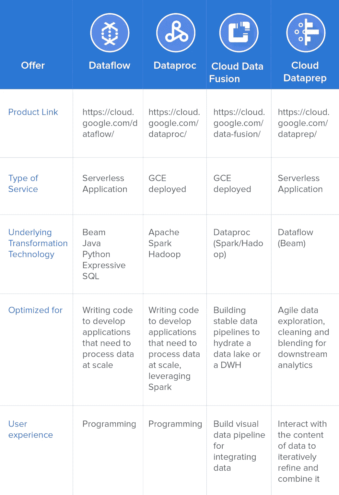

# 检查表:为 Google BigQuery 选择正确的数据转换服务

> 原文：<https://towardsdatascience.com/check-list-selecting-the-right-data-transformation-service-for-google-bigquery-bd99307da581?source=collection_archive---------26----------------------->

## 哪种 Google 云服务可以让您的数据为分析做好准备？

凯尔·格伦在 [Unsplash](https://unsplash.com/s/photos/choice?utm_source=unsplash&utm_medium=referral&utm_content=creditCopyText) 上的照片

好消息是，在移动和转换基于 BigQuery 的分析和 AI/ML 数据时，谷歌云提供了过多的原生选择。坏消息是，你必须在许多选项中做出选择，以确保该技术符合你的需求，并证明是可持续的。

本文是一份帮助您选择最适合您的技术(或技术组合)的清单。如果您计划将 BigQuery 用于您的分析和数据科学项目，这意味着您将需要批量和/或微批量地清理、转换和组合数据。为此，我已经排除了 [Google BigQuery 数据传输服务](https://cloud.google.com/bigquery/transfer/)，它只能将数据移入 BigQuery，而不能进行转换。此外，我将我的研究仅限于原生谷歌云数据转换服务，包括[云数据处理](https://cloud.google.com/dataproc/)、[云数据流](https://cloud.google.com/dataflow/)、[云数据融合](https://cloud.google.com/data-fusion/)和[云数据准备](https://www.trifacta.com/cloud-dataprep/?utm_source=medium)。当然，使用 SQL 也可以在 BigQuery 中进行转换，这是一种非常强大的语言(我花了很多年来构建利用 SQL 和存储过程的应用程序)；然而，由于多种原因，SQL 并没有为企业数据转换服务提供一个可持续的解决方案，而且也有很好的理由说明为什么有这么多技术被发明出来用于转换数据(这本身就需要一篇完整的文章)。

那么，为了选择正确的技术，你应该问自己什么问题呢？

# 问题 1:您是否希望用编程语言为您的解决方案编写代码？

如果软件工程师或开发人员必须开发和集成各种组件来创建一个包括大规模数据转换的应用程序，那么您应该考虑云数据流或云数据块。这些是基于代码的解决方案，需要 Java、Python、RestAPI 或 Apache Spark 等编程技能。这些都需要相当的技术知识。有了这些服务，您已经知道需要创建哪些转换，并且您需要一个开发工具来编码这些转换。为了弄清楚是选择云数据流还是云数据块，[阅读这篇文章](https://stackoverflow.com/questions/46436794/what-is-the-difference-between-google-cloud-dataflow-and-google-cloud-dataproc)，它提供了使用其中一个的很好的论据。

# 问题 2:你的数据已经在 Google Cloud 了吗？

如果你的数据还不在谷歌云中，那么谷歌基于开源项目 [CDAP](https://cdap.io/) 开发的云数据融合(Extract，Transform，and Load，ETL)解决方案提供了许多连接器，可以将数据导入谷歌云和 BigQuery。或者，您可以利用您内部已有的其他 ETL 解决方案，将数据引入 Google Cloud。谷歌推荐[这些 ETL 厂商，包括 Matillion、Fivetran、Informatica，以及更多](https://cloud.google.com/bigquery/?utm_source=google&utm_medium=cpc&utm_campaign=emea-gb-all-en-dr-bkws-all-solutions-trial-e-gcp-1007176&utm_content=text-ad-none-any-DEV_c-CRE_335630920200-ADGP_Hybrid+%7C+AW+SEM+%7C+BKWS+~+EXA_1:1_GB_EN_Data+Warehousing_google+bigquery-KWID_43700041731167839-kwd-63326440124-userloc_1006094&utm_term=KW_google%20bigqueryg&ds_rl=1245734&gclid=EAIaIQobChMIqLGjg-OT5AIVhkPTCh0MqwN_EAAYASAAEgL3QPD_BwE#partners)。云数据融合等 ETL 解决方案最适合开发大规模数据管道，从本地和云资源移动数据，以“水合”数据湖或数据仓库(DWH)。数据工程师、ETL 开发人员和数据架构师将从云数据融合中受益最多。他们将能够开发可靠的实时和批量数据转换管道。云数据融合和 ETL 在构建稳定的数据管道以定期将数据移动到 DWH 或数据湖方面表现出色。它们并不意味着创建经常变化的管道，也不意味着将管道交给某些业务用户。

# 问题 3:您的数据计划是否需要灵活性来经常适应业务需求？除了数据工程师之外，您的项目是否需要业务用户或不太懂技术的专业人员进行自助式数据转换？

数据准备是数据转换技术的最新发展，将这些功能交给了技术含量较低且通常位于业务线的数据驱动型专业人员(除了数据工程师等常见的技术数据专家之外)。这些专业人员比任何人都更了解数据，但是，他们可能缺乏清理、组合和丰富数据以满足其需求的技术技能。通常他们会知道 Excel、Google Sheets 和 SQL。Cloud Dataprep(与 [Trifacta](https://www.trifacta.com/cloud-dataprep/?utm_source=medium) 合作开发)提供了一个基于网格的、机器学习指导的可视化界面，以实现敏捷的数据探索和评估，从而为 BigQuery for analytics 提炼、标准化和组合数据。用户与数据内容进行交互，以反复提炼和汇集数据，用于下游业务驱动的分析。

# 云数据准备或云数据融合的附加问题:你更倾向于云数据处理还是云数据流？

云数据融合生成云 Dataproc 代码来转换数据，而云 Dataprep 生成一些数据流代码来转换数据。基于您的用例以及您以前的经验，两者都有各自的优势。这也可能是支持在 BigQuery 之上提供分析的特定技术的一个因素。

最终，您可能需要结合多种解决方案来为 BigQuery 创建端到端的分析或机器学习解决方案。我们经常看到 ETL 将数据放入云 DWH 或数据湖，然后使用数据准备技术将数据公开给消费者。

下表总结了这些技术的特征，以指导您的选择。

*原载于*【www.trifacta.com】