# 用 Pylint 检查你的代码质量

> 原文：<https://towardsdatascience.com/check-the-quality-of-your-code-with-pylint-f5d829bb441d?source=collection_archive---------8----------------------->

## PEP 8 指南的 10 条规则将使你的代码更容易阅读


罗纳河上的星夜——文森特·梵高

**Pylint** 是 **Python** 编程语言的质量检查器，遵循 **PEP 8** 推荐的风格。本文提供了用 **Python** 编写清晰代码的指南，主要目标是提高代码的可读性和一致性。代码被阅读的次数要比被编写的次数多得多，这就是为什么遵守约定是如此重要，这将帮助我们或其他人更容易地理解可用的代码。在本文中，我们解释了 **PEP 8** 的 **10 条规则**，它们可以让你的 **Python** 代码更容易被其他人阅读，以及我们如何用 **Pylint** 检查它们。我们开始吧！💪

# 安装 Pylint

**Pylint** 是第三方库，在 **Python** 中默认不可用。由于 Pylint 不是 **Python 标准库**的一部分，我们需要单独安装它。这可以通过使用 **pip** 组件轻松实现。 **Pip** 是 **Python** 的标准包管理器，允许安装和管理不包含在 Python 标准库中的包。要检查是否安装了 **pip** ，您可以在 Windows 终端中执行以下命令:

```
**pip --version**
```

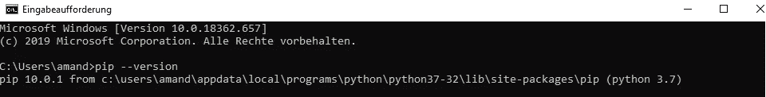

如上图所示，**版本 10.0.1** 在我们的系统中已经有了。现在，我们可以安装 **pylint** ，在命令行运行:

```
**pip install pylint**
```

还安装了 **pylint** 所需的所有依赖项。注意 **pip** 下载了最新版本的包。

# **使用 Pylint**

一旦我们安装了 **pylint** ，我们可以通过运行命令 **pylint** 和文件名**来轻松使用它，如下所示:**

```
**pylint filename.py**
```

现在！我们已经准备好看到一些代码示例💪。在本文中，我们将详细解释用 **Python** 编码时的 10 个编码约定。此外，我们将证明 **pylint** 如何检测它们。

# 编码约定(PEP 8)

PEP 8 是一个风格指南，它定义了你的 **python** 代码应该如何被格式化以最大化它的可读性。在这篇文章中，我们将只涉及一些关键点；因此，如果你想更详细地研究这个话题，我建议你看一下指南。

[](https://www.python.org/dev/peps/pep-0008/) [## PEP 8 风格的 Python 代码指南

### Python 编程语言的官方主页

www.python.org](https://www.python.org/dev/peps/pep-0008/) 

# 1.多行语句

在 Python 中，我们在排比句( **()** )、中括号( **[]** )、大括号( **{}** )内部使用**隐式延伸线**。**隐式**意味着我们不写行继续符( **\** )来表示我们将一个语句扩展到多行。

当使用隐式延续行时，被包裹的元素应该垂直对齐，或者使用**悬挂缩进**。在 Python 的上下文中，**悬挂缩进**意味着带括号的语句的左括号是该行的最后一个非空白字符，随后的行缩进直到右括号。

## 不良做法

括号内的参数没有垂直对齐，或者使用悬挂缩进。

## Pylint 输出

Pylint 检测到一个错误的缩进。

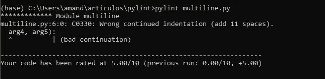

## 良好实践

括号内的参数垂直对齐。

括号内的参数使用悬挂缩进对齐。

# **2。操作员**

始终用一个空格将这些运算符括起来:

*   **赋值** (=)
*   **扩充赋值** (+=，-=，等等)
*   **比较运算符** ( <，>，< =，> =，==，！=)
*   **逻辑运算符**(与、或、非)
*   **隶属运算符**(在，不在)
*   **身份运算符**(是，非是)

## 不良做法

运算符没有被空格包围。

我们可以很容易地禁用 **pylint** 中的警告，在代码顶部添加一个注释，如上所示( **#pylint: disable=C0114** )

**C0114** 警告表示模块**文件串**丢失。docstring 是作为模块、函数、类或方法定义中的第一条语句出现的字符串。根据 **PEP 257(包含 docstring 约定的指南)**，所有模块的开头都应该有一个 docstring，描述该模块做什么。

在本文中，为了简单起见，我们不打算在每个模块的顶部添加一个 docstring。但是，强烈建议在实践中编写 doctrings。和以前一样，如果你想了解更多关于如何在 **Python** 中使用 doctrings，我推荐你仔细看看 **PEP 257** 指南。

[](https://www.python.org/dev/peps/pep-0257/) [## PEP 257 -文档字符串约定

### 这个 PEP 的目的是标准化文档字符串的高层结构:它们应该包含什么，以及如何表达…

www.python.org](https://www.python.org/dev/peps/pep-0257/) 

## Pylint 输出

如下所示，pylint 检测到比较运算符

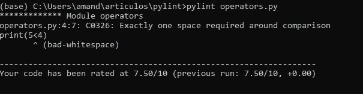

但是，pylint 没有检测到 if 语句中的成员资格操作符也应该被空格包围。Pylint 并不完美！😢

## **良好实践**

运算符两边各有一个空格。

# **3。逗号、分号或冒号后面的空格(但不是在前面！)**

在逗号、分号或冒号之后，我们必须使用空格。然而， **PEP 8** 建议在即将到来之前避开它们。

## 不良做法

在下面的代码中，我们可以观察到以下不良做法:

1.  分隔列表中每个元素的逗号后面缺少空格。
2.  字典中分隔每个键值对的冒号(:)后面缺少空格。
3.  在分隔元组中每个元素的逗号之前有一个空格。

## Pylint 输出

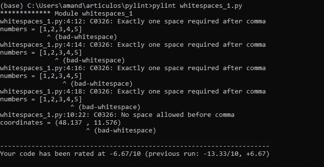

如上所示， **pylint** 检测到在分隔列表元素(数字)的每个逗号后面需要一个空格。另外， **pylint** 检测到元组(坐标)中逗号前有一个空格。但是，它无法检测到分隔每个键-值对的冒号后面缺少的空格。

我想澄清的是，PEP8 指南并没有提到逗号、冒号或分号后需要空格。然而，这是一种普遍的做法，被大多数样式检查器检测为 **pylint** 。

## 良好实践

每个逗号、冒号和分号后面有空格，但前面没有。

# 4.圆括号、方括号或大括号中的空格。

## 不良做法

在圆括号、方括号或大括号中会立即使用空格。

## Pylint 输出

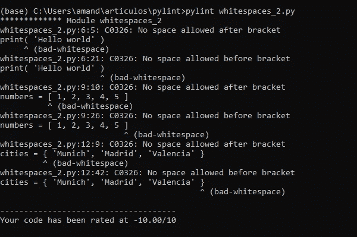

**Pylint** 检测圆括号、中括号或大括号前后不允许有空格。

## 良好实践

圆括号、中括号或大括号内没有直接使用空格。

# 5.关键字和默认参数

## 关键字参数

**参数**是在调用**函数**时传递给它的值。Python 函数接受两种类型的参数:(1) **位置参数**，以及(2) **关键字参数**。使用**位置参数**调用函数时，参数必须以正确的顺序包含。相反，**关键字参数**可以以任意顺序提供，因为这些参数前面有一个标识符(**关键字=值**)。根据 **PEP8** ，当使用**关键字参数**调用函数时，我们不必在=符号周围使用空格。

## **默认参数**

**函数参数**可以有**默认值**。如果在调用函数时没有提供参数，参数将采用默认值。和以前一样，在定义**默认参数**时，等号两边不使用空格。

## 不良做法

当使用**关键字**和**默认**参数时，在=符号周围使用空格。

## Pylint 输出

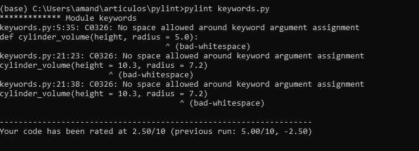

**Pylint** 检测关键字参数周围不允许有空格。

## 良好实践

等号两边不使用空格。

# 6.捕捉异常

Python 中的错误消息可以分为两种:**语法错误**和**异常**。**语法错误**Python 无法解释代码时出现，说明程序语法有问题。另一方面，**异常**发生在代码执行过程中发生意外的事情时。

在下面的代码块中，Python 提供了一条消息，表明我们在尝试将字符串转换为十六进制数时遇到了**类型错误**，因为**十六进制函数**需要一个整数作为输入。

为了在 Python 中处理异常，我们使用了 **try** 和 **except** 语句。 **try 子句**包含可以引发异常的操作， **except 子句**包含处理异常的代码。 **try 子句**逐个语句执行。但是，如果出现异常，则停止执行 **try 语句**，然后执行除语句之外的**。**

## 不良做法

这里，except 块中的代码在 try 块执行期间发生任何类型的异常时都会被执行。根据 **PEP8** 指南，不建议使用除 **子句**之外的裸**，因为它们会捕捉所有异常，包括 **SystemExit** 和 **KeyboardInterrupt** 异常，使得用 Control-C 中断程序更加困难**

## Pylint 输出

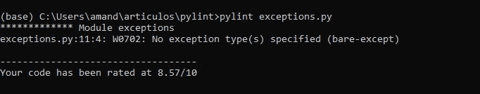

**Pylint** 检测到使用了除条款之外的空白**。**

## 良好实践

我们应该在 except 块中指定要处理的错误，如下所示:

现在，程序捕捉到了**类型错误**异常，但没有捕捉到其他异常。

# 7.布尔变量

## 不良做法

在 **if 语句**中，使用**=**或 **is** 比较**布尔**变量与**真**或**假**是不正确的。

## Pylint 输出

Pylint 检测到与 **True** 的比较应该只是表达式( **is_raining** )。

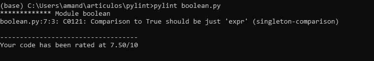

## 良好实践

我们必须在 **if 语句**中直接使用**布尔**变量，如下所示:

# 8.检查前缀和后缀

## 不良做法

使用字符串切片来检查前缀或后缀是一种不好的做法。

## Pylint 输出

然而， **pylint** 并没有检测到这个风格问题，虽然它包含在 **PEP 8 guide** 中。

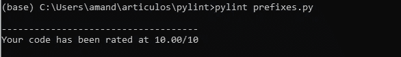

## 良好实践

根据样式指南 **PEP8** ，我们必须使用 **str.startswith()** 和 **str.endswith()** 来检查前缀或后缀。

**str.startswith(prefix，start，end)** 函数检查字符串是否以给定的前缀开头。如果字符串以指定的前缀开始，函数返回**True**；否则，返回**假**。**开始**和**结束**是可选参数，指定检查开始和结束的索引。

如果字符串( **str** )以指定后缀结尾，函数将返回 **True** 。如果不是，则返回**假**。与之前一样，该函数有两个可选参数 **start** 和 **end** 来指定测试开始和结束的索引。

# **9。进口**

一个**模块**是由 Python 代码组成的文件。如果您正在处理大型项目，将您的代码组织到多个文件中，并在必要时将它们导入到其他 Python 文件中是有意义的。要导入一个 Python 模块，我们只需输入语句 **import** ，后跟文件名。除了导入我们自己的模块，我们还可以导入 python 标准库中以及第三方库中可用的内置模块。根据 **PEP8** 准则，导入写在 Python 脚本的顶部，每一个都在一个单独的行上。此外，进口应按以下顺序分组:

1.  标准库导入
2.  第三方进口
3.  本地脚本导入

## 不良做法

导入没有写在单独的行中，也没有按正确的顺序分组。

## Pylint 输出

Pylint 检测到模块 pandas 和 matplotlib 没有写在单独的行上。此外， **Pylint** 检测到 Python 标准库模块(csv)应该放在第三方导入(pandas 和 matplotlib)之前。正如我们在下面所看到的，Pylint 也认识到所有的导入都是未使用的，因为为了简单起见，我们没有添加更多的代码。

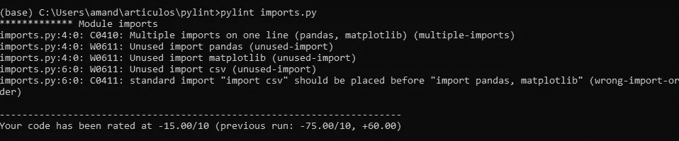

## 良好实践

导入写在单独的行中，并按正确的顺序分组。

# 10.λ表达式

Lambda 表达式是匿名短期函数，语法如下:

> ***λ自变量:表达式***

这些函数可以有多个**参数**，返回由**表达式** *提供的值。*我们不仅可以在 Python 中找到它们；其他编程语言也支持 lambda 函数。

根据 **PEP8 指南**，不建议将 **lambda 函数**直接分配给标识符。在这种情况下，建议使用**常规函数**(用 **def** 关键字定义)。

## 不良做法

lambda 表达式直接分配给标识符(乘法)。

## Pylint 输出

**Pylint** 没有检测到这个问题，尽管它包含在 **PEP 8 guide** 中。

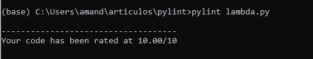

## 良好实践

我们用关键字 **def** 创建函数。

Pylint 并不完美，但它确实有助于提高代码质量！请记住，代码被阅读的次数要比被编写的次数多得多，这就是为什么坚持有助于他人理解您的代码的约定如此重要。此外，清晰的代码显示了专业性😉。这就是为什么我鼓励你使用像 Pylint 这样的质量检查器(还有很多！)来检查你的代码。看起来会更清晰，更专业👌