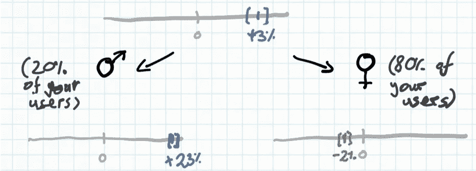
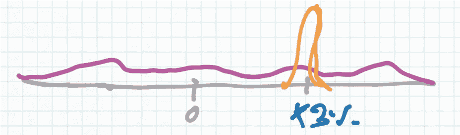
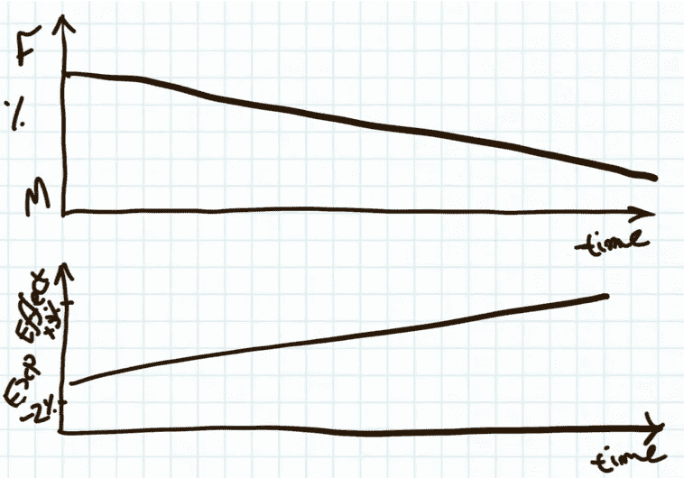
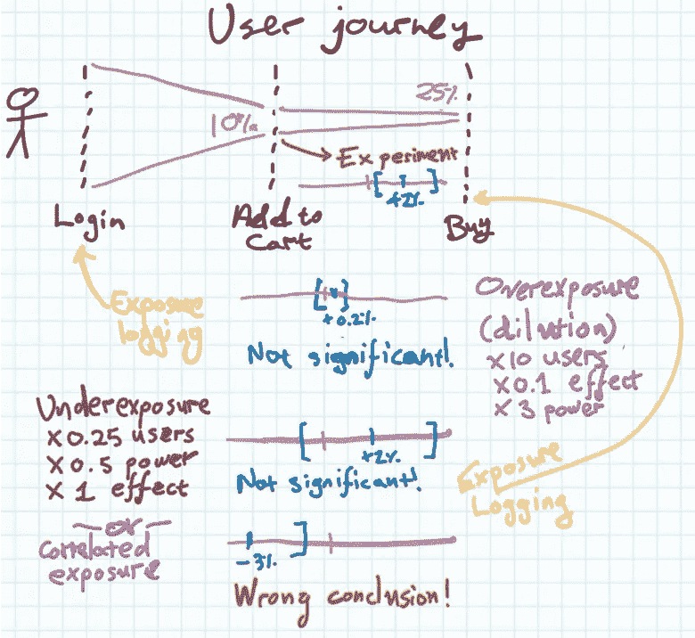
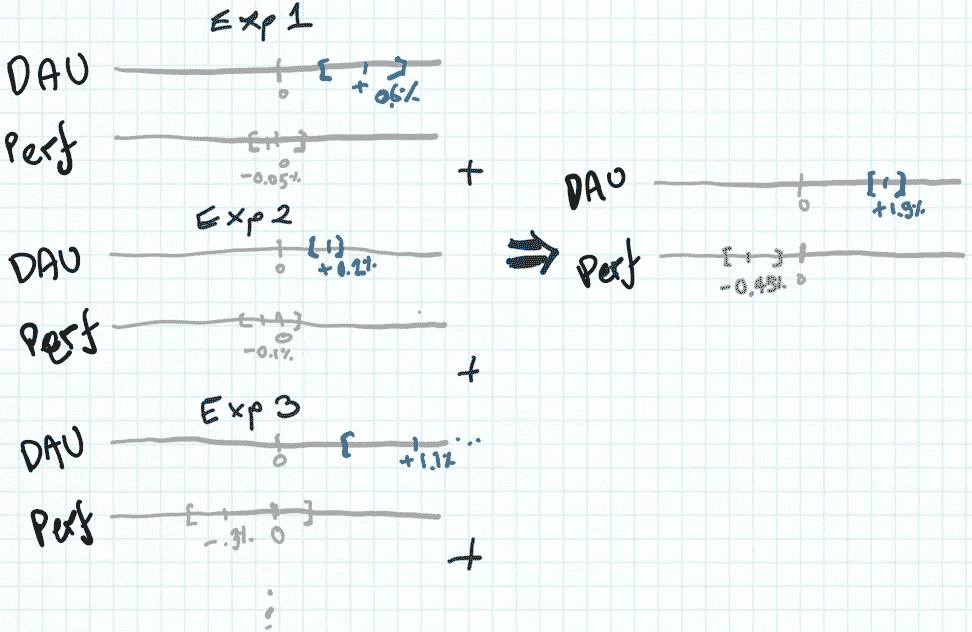

# 在你和你的团队分享你的实验结果之前，检查这 4 件事

> 原文：<https://towardsdatascience.com/check-these-4-things-before-you-share-your-experiments-results-with-your-team-16dac876f435?source=collection_archive---------35----------------------->

## 经典的实验文献默认实验将运行一次，所有参与者一起到达，并被记录和管理治疗。Web 实验(A/B 测试)在一段时间内收集用户，分别记录暴露和处理，并连续运行。这就产生了一些陷阱——下面是如何测试它们的方法。

我也犯过一些分析错误，有些花费了团队成员数周的时间来做错误的事情，或者更糟——错过了一个很好的机会。但通过这些，我收集了一份分析中一些常见陷阱的清单，无论是实验(A/B 测试)还是观察数据。

## 1.异质处理效果

这种说法仅仅意味着你看到的效果是不同用户群的不同效果的平均值。例如，也许你的网站的新版本在转化男性方面比女性好得多:男性的转化率比以前高 23%，而女性的转化率略差(-2%)。但是如果你网站的观众 80%是女性，你会认为新版本是个好主意:平均转化率上升了 3%。现实中你的大部分用户喜欢的略少，只对一小部分用户更好。

很少用户非常高兴+大多数用户略微悲伤可能看起来是一个总体良好的结果(图片由作者提供)

为了避免这种情况，通常没有其他办法，只能通过你收集的任何维度(例如，人口统计、地理、设备等)对你的用户进行细分。)并寻找组间效应大小的主要差异。然而，如果你做得太多，你需要小心多重比较(本质上，随机发现不存在的效果)。

不过在某些情况下，你可以通过绘制效果分布图来更直接地测试这一点:有多少%的用户体验到了分配给他们的治疗所带来的效果。例如，当测量类似“用户一个月访问你的服务的平均天数”这样的重复活动时，你可以检查一个实验是否将每个人向上移动了 3%(橙色线)，或者是否有+3%的平均效果，但实际效果的分布很广，一些用户受到了变化的伤害(紫色)。然后，尝试找出这些用户的不同之处。

橙色实验对每个人都有同样的效果；紫色实验有一系列的影响(图片由作者提供)

## 2.混合班次

我检查的一个相关问题是绘制随时间变化的数据时。最糟糕的错误之一是不正确的趋势:如果数据在“方向上”是正确的，但错误了一个常数(所以，当它上涨时，你认为它上涨了，只是没有你想象的那么上涨)，这对大多数商业决策来说通常是没问题的。但是当你认为某样东西在上升的时候下降了，你可能会停止一个成功的活动或者倾向于一个有害的活动！

当同时存在异质效应时(因此两个或更多组具有不同的结果，例如保留率)**和**随着时间的推移，一个组在总体中所占的比例在增长，就会出现混合变化。随着时间的推移，这造成了一个错误的趋势，它来自于人口的变化，而不是行为的变化。在上面的例子中，如果你的网站开始搅动女性用户(在我们做出改变后，她们的体验变得更差)，你会认为整体转化率在提高——但实际上只有剩下的男性转化得更好，而不是企业成功的整体改善。

从 F 到 M 的种群变化可能会使相同的实验看起来有所改善(图片由作者提供)

## 3.检查曝光

一个非常微妙的话题，但在线实验的现实是，当我们记录一个人被随机分配到一个实验组时，以及当他们的实际经历发生变化时，有时我们会分离出来。这里有一个例子:在一个电子商务网站上，我可能有一个实验，一半登录的用户在结账时会得到 10%的折扣，另一半不会。天真地说，我可能会在用户进入网站的那一刻就把他们分成两个实验组，A 组和 B 组，并把这个记录在我们的数据库中。然后，我对 A 组和 B 组中哪一组的结账率更高进行了分析，并计算了实验的功效——基本上是确保我有足够多的用户进行实验，以得出关于其效果的具有统计意义的结论。对吗？

嗯，差不多了。事情是这样的，我记录了哪些实验组的用户第一次访问这个网站的时候。但是他们中的很大一部分人(比如说 90%)甚至没有最终购买任何东西。所以他们实际上没有看到优惠券——他们有着与完全没有优惠券的对照组完全相同的**体验**。因此，他们的购买行为当然不会改变。但是计算实验效果背后的数学方法在这里是误导性的:我们在稀释实验的效果，因为很多人没有购买优惠券。结果，我们最终认为实验是无效的，或者没有达到我们期望的统计显著性水平，并放弃了它。这是“过度暴露”——你把实际上没有接受治疗的人登记到实验中。

过度曝光和曝光不足都会让实验看起来不稳定。签名。当他们是。(图片由作者提供)

在更罕见的相反情况下，我们可能会在记录之前暴露用户**在一个实验组中——这可能发生在复杂的设置中，例如，我们只在他们实际结账时记录暴露，而不是当他们第一次看到购物车中的优惠券时——结果我们暴露不足，也冲淡了我们实验的效果(或者更糟糕的是，如果暴露与某些行为相关，可能会得出错误的结论)。**

**底线是始终确保你清楚用户在哪里第一次遇到实验的任何可能效果，然后才将其纳入实验组(或控制组)**。

## 4.一千次(统计上无关紧要)削减造成的死亡

我们知道我们可能会错误地发现一种效应(XKCD 在一项实验中很好地测试了不同颜色的软糖和痤疮之间的[联系](https://xkcd.com/882/))。但我们也可能会错过一个效果，因为我们的实验动力不足(很难发现你做的事情提高了 0.1%的转化率，因为这通常需要成千上万的用户)。虽然 0.1%的改进通常对企业的成功并不重要，我们也不应该关注它，但 0.1%的下降一直在发生，很难发现，并且会增加。这里有一个例子:假设我们是一个成长团队，正在试验我们应用程序的各个部分，其中许多测试对我们的日常活跃用户产生了很好的结果。

但是，我们并不傻——我们也检查对长期记忆的影响。如果一个实验对记忆有显著的负面影响，我们会拒绝它。然而，长期保留是一个嘈杂的指标，用更少的用户和更少的能力来衡量，其影响往往更微妙。他们通常平均得出轻微的负面或轻微的正面结果，但是置信区间意味着他们在统计学上是不显著的:我们不能**确定**他们是负面的。不过，他们中的许多人可能会。我们可能会不知不觉地对记忆力产生微小的负面影响。因此，有了“千刀万剐”(脸书的一位同事创造的)。

在每个单独的实验中，对性能的影响是轻微的，但不是统计的。签名。但是综合起来看，这显然对 Perf 有害。(图片由作者提供)

防止这种情况的主要方法是长期抵制。长期抵制者是一组不接受任何新实验的用户，即使这些实验已经推广到其他用户群。然后，您可以测量所有其他实验一起对长期维持的影响，并查看其他用户的体验是否与维持有显著差异——实质上，维持是对许多实验一起的影响的控制。

我想知道为什么我在职业生涯中花了几年时间才了解这些，结果是在经典实验中不会发生这种情况，在经典实验中，所有参与者通常会被一起放在一个房间里，接受治疗，然后在测量结果后再也不会见到他们。因此，所有关于实验的文献通常都忽略了这些考虑。但是如果你在做在线 A/B 测试，那么保持一小部分用户在“永久控制组”中，观察治疗效果的分布而不仅仅是平均治疗效果，当你观察治疗效果时固定分组，并同时仔细检查你的任务和暴露记录将帮助你避免许多常见的陷阱。