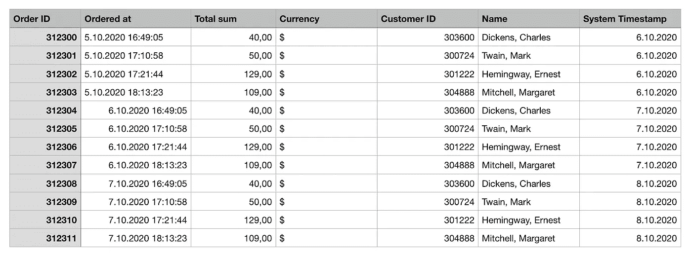
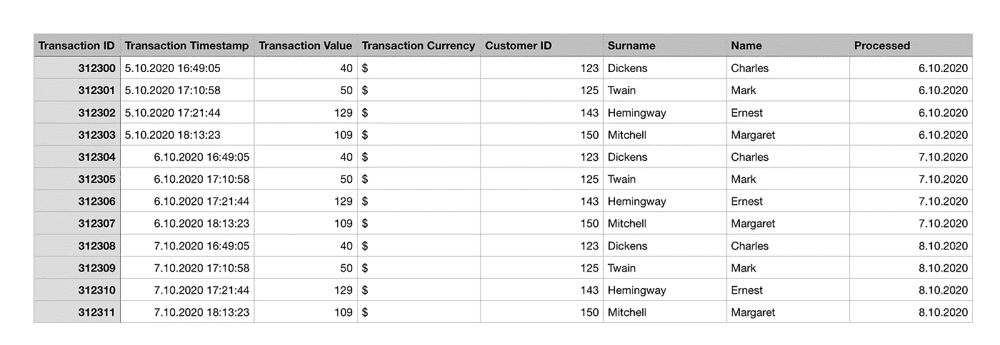
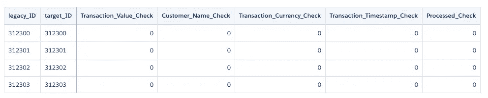
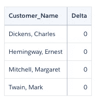
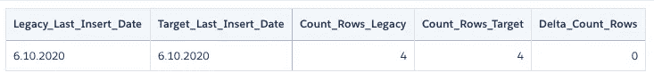
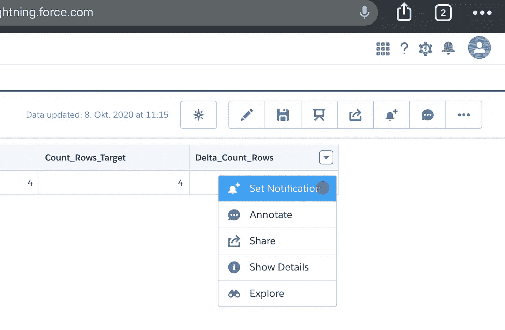
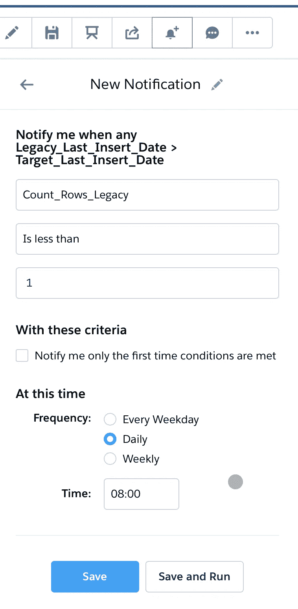

# 在平台迁移期间检查数据一致性

> 原文：<https://towardsdatascience.com/checking-data-consistency-during-platform-migrations-83eed17479c5?source=collection_archive---------33----------------------->


检查数据的一致性是一项具有挑战性的任务(图片尤利娅·卢卡申娜)

## [实践教程](https://towardsdatascience.com/tagged/hands-on-tutorials)

## 确保平稳的数据迁移:我自己在 Salesforce、SAP 和许多其他公司的经验，包括实际例子、图表和代码块

# 什么是“平台”，它与数据科学有什么关系？

对于平台，我指的是以某种方式永久存储数据的所有软件。不一定是数据分析平台，而是 CRM、ERP(企业资源规划)、活动管理平台等。

十年前，平台迁移曾经是一件独特而罕见的事情。如今，许多公司每隔几年就迁移一次工作流程。有时，他们这样做是因为更好的技术已经到来。更常见的是，一个老的甚至工作良好的人被安排退休。

该平台收集的数据通常用于业务分析报告。通常，业务平台有一个分析扩展。一个很好的例子是 Salesforce 平台及其爱因斯坦分析扩展。在某些情况下，必须定期在第三方工具中提取、处理和可视化数据。

# 什么是数据一致性，平台迁移有什么问题？

每个平台及其分析扩展都有用于计算和可视化关键性能指标的例程。这些例程因平台而异。有些提供 ETL 工具；有些没有，所以您可以直接在可视化界面中进行一些数据清理。

但是作为企业所有者或经理，您需要一个共同标准，即您日常决策中使用的所有关键 KPI 的标准表示。您还希望确保基础计算可能导致相同或几乎相同的结果，尽管结果可能不同。

迁移结束后，您打开一个新构建但不熟悉的 KPI 仪表板。这些数字对你来说一定还是有意义的。

另一个潜在的陷阱是实现新的计算程序意味着新的数据管道。新的数据存储。从原始位置弹出数据的新方法。一份闪亮的商业报告需要很多步骤才能完成。出现错误的可能性很大。

# 几个实际例子

到目前为止，这听起来可能太理论化了——这是我过去的几个例子。

## 亚马逊 S3 的传统平台

几年前，我参与了一次平台迁移，这是因为需要更大的数据存储和更快的基于云的数据管道。该公司决定用亚马逊 S3 云取代传统平台。

客户以。他们保存在 SFTP 服务器上的 CSV 文件。亚马逊 S3 数据管道将对它们进行消化、处理，并创建一个 SQL 数据库。数据库连接到多个 Tableau 仪表板。新数据每天都有。

在向客户展示新系统之前，我们同时运行了一段时间。我们很快注意到，新的管道往往无法提供与旧管道相同的结果。原因之一是。CSV 文件与亚马逊 S3 中创建的模式不匹配。粗略地说，这些文件通常有不同的列名或者数据格式错误。

## Google DoubleClick 的传统活动管理工具

还有一次，我的公司想从利基营销管理工具迁移到 Google DoubleClick。因为我们的主要客户希望他的旧报告是一对一的，所以应该从 DoubleClick 中提取数据，写入 SQL 数据库，然后消化到 Microsoft PowerBI 中。

陷阱很快就暴露出来了。与前一种情况一样。CSV 文件包含错误的列名。在谷歌分析中，它们有时会在没有警告的情况下被更改。自从下载了。CSV 文件自动运行，不一致的数据被插入到数据库中，随后破坏了 KPI 仪表板。此外，没有遵循分类维度的命名约定。

新数据也是每天都有。这些差距被自动传输到 PowerBI 可视化中，它们的错误让很多人感到非常沮丧。

## SAP 至 Salesforce

我的下一次迁移有一个巨大的范围:该公司希望从 SAP 迁移一个 ERP、一个 CRM 和一个分析工具，SAP 宣布其一些模块退休，转到其竞争对手 Salesforce。Salesforce 并不专注于 ERP 市场。它提供单个软件包，可以帮助您组装预订和发票的工作流程。不过，这需要大量的定制。

因此，来自新 ERP 的数据与来自 SAP 环境的数据非常不同。此外，Salesforce 分析扩展有相当多的细节。在迁移过程中，SAP 数据被直接插入到 Salesforce Einstein Analytics 中。作为两个系统之间的桥梁，SQL 数据库存储两者之间的数据。

的。从 SAP 弹出的 CSV 文件未能添加到数据库中。最重要的是，Einstein Analytics 数据管道交付的结果与我们在 SAP 分析工具中看到的结果有所不同。KPI 就像高度聚合的总收入一样，完全不一样！

# 即席检查数据一致性

每一个差异都让我去钻研数据。我开发了一些可靠的方法。

## 向下的方法

您从 KPI 开始，这些 KPI 通常是较小单位值的高度聚合。例如，您会发现不同平台的总收入是不同的。您可以进一步比较每个客户或给定时间段的收入。

可能只有特定客户的金额会有偏差。你继续深入，选择下一层，例如，一个合同。然后是账单。迟早，你会发现差异，现在可以寻找原因。您应该找到一个错误的数据条目。然后你去找出数据条目是什么时候被添加到你的系统中的。查看一堆数据，比如. CSV 文件。可能，它已损坏，与数据结构不匹配，或者有数据格式问题。

## 向上的方法

根据报告的类型，有时您可以直接分配错误数据条目到达的时间段。或涵盖显示不正确总收入的合同期限的时间段。然后，您可以跳到最低的汇总级别，或者跳到根本没有汇总的级别。例如，您获取每个合同或账单，从每个系统中导出它们，并通过匹配它们的 id 来比较它们。

## 元数据级别

我不喜欢比较 KPI。这意味着理解他们的业务逻辑。这种逻辑经常会在我不知道的情况下改变。比较元数据似乎是一种更安全的方式，但并不总是足够的。

众所周知，元数据是关于数据的数据。我之前所说的模式。您检查传入的数据是否具有相同的结构。这包括但不限于:

*   列名
*   对于某些工具:列顺序！
*   数据格式，尤其是日期
*   分类维度的名称

如果您有关于三个营销活动的数据，突然，一个. CSV 有了第四个活动，而您没有处理规则，那么您的数据管道可能会混乱。

# 数据不一致的其他原因

如果最小的数据单元——合同、账单、预订——在不同的平台上具有不同的值，这意味着您将错误的数据加载到一个或两个数据管道中。

从这个水平开始，偏差只会越来越大，总的结果会越来越大。

在许多情况下，这些最小的单元与管道内的一些附加数据相匹配，如客户、行业等。这允许在流程的后期对数据进行分组和聚合。这些匹配经常失败:客户更改了公司名称，CRM 的名称不正确，名称和 ID 不匹配，等等。

匹配规则中的异常也令人头疼。如果你忘记把旧系统的所有异常都复制到新系统中，你就会有偏差。只有当您开始比较聚合数据时，它们才变得可见。

# 持续检查数据的一致性

基本上，所有方法都适用于持续监控。你只需要将它们自动化。

您可以监控一个平台，可能是新平台，或者两个都监控。这取决于您对遗留平台的信任或您使用的方法。

从技术角度来看，这是通过以下方式实现的。我提取了两个平台的数据，并把它们进行了对比。我花了有限的一段时间，主要是最近的一段时间。一些计算也需要以前时期的数据。在一些特殊情况下，用户可以调整过去期间的数据条目，比如为当前达到折扣启用值的合同添加折扣。这就是为什么我定期对去年的数据进行一致性检查。

## 那么，这实际上意味着什么呢？

您可以在其中一个分析扩展中运行检查。或者，您可以从两个系统中导出数据，并在第三个工具中比较元数据。两种方法我都尝试过，但最终都是基于 Python 的管道。

这两个报告的提取也可以自动化。不过，这取决于工具。

## 比较数据

我下载了两个 CSV。旧平台和新平台上的文件。它们有不同的结构，但是应该有一个键，比如事务 ID。我有一个 R 或 Python 脚本，它处理来自两个系统的数据，获取键，并将其他数据作为键的属性进行比较。

下面是两个(当然是虚构的)导出的截图:



遗留平台样本原始数据:电子商务交易



目标平台样本原始数据:电子商务交易

该脚本将来自两个系统的数据标准化，重命名列或维度，或者使用附加数据将不同的命名放在一起。

例如，交易 313200 在旧系统中的价值为 40，00 美元，在新系统中的价值为 40 美元。它是匹配的。Python 脚本找到了两种格式的共同点，并对实际值进行了比较。

我比较了交易的每一个属性，不仅包括总和，还包括字符串列:



检查单个事务的属性

作为最后一个例子，我附上了总收入比较。

您可能已经注意到，相同的交易在不同的平台上有不同的客户 ID。我转换包含它们的名称的列，并将它们用作键。然后，我对交易值求和，得到每个客户的收入，并计算增量。



比较每个客户的总收入(不同平台之间的差异)

## 比较元数据

您可以用日期-时间来标记数据的时间戳，以指示它被弹出或被消化的时间。然后，检查最近一段时间(如昨天)添加到数据库的新数据量，以排除此阶段的异常和错误。

您计算在某一天(比如昨天)打上时间戳的行数。



检查元数据:过去 24 小时内添加到两个系统的行数

检查分类变量也是如此。您可以创建一个数据可视化来显示您的维度值，甚至检查是否添加了任何新值。

## 得到通知

另一个好的做法是创建一个警报，在出现问题时向您发出警告。例如，如果新行的数量小于零。



在小部件上设置通知



定义通知触发器:如果最近没有添加新行

# 一会儿之后

对于这篇文章，我以稍微简化的形式重新创建了我以前的工作程序。我不能发布完全相同的数据和方法，因为我既没有访问它们的权利，也没有为自己的利益使用它们的权利。我创建了我的真实方法的抽象，使它们匿名和通用。所有特定于公司的信息都被小心翼翼地删除了。除了日常工作之外，我还主动要求定期进行数据一致性检查，并制定方法。

我使用了 sales force Einstein Analytics trail head 操场来构建上面的数据可视化。不涉及数据管道。数据处理直接发生在数据可视化界面中。

下面是我用来构建表的 SAQL 查询:

## 属性比较:

```
legacy = load "System_1_Legacy";
legacy = filter legacy by date(Processed_Year, Processed_Month, Processed_Day) in ["1 day ago" .. "1 day ago"]; 
legacy = foreach legacy generate Processed, count() as Count_Rows;
legacy = group legacy by Processed;
legacy = foreach legacy generate Processed as Last_Insert_Date, sum(Count_Rows) as Count_Rows_Legacy;target = load "System_2_Target";
target = filter target by date(System_Timestamp_Year, System_Timestamp_Month, System_Timestamp_Day) in ["1 day ago" .. "1 day ago"]; 
target = foreach target generate System_Timestamp, count() as Count_Rows;
target = group target by System_Timestamp;
target = foreach target generate System_Timestamp as Last_Insert_Date, sum(Count_Rows) as Count_Rows_Target;result = cogroup legacy by Last_Insert_Date full, target by Last_Insert_Date;
result = foreach result generate legacy.Last_Insert_Date as Legacy_Last_Insert_Date, target.Last_Insert_Date as Target_Last_Insert_Date, 
    coalesce(sum(legacy.Count_Rows_Legacy), 0) as Count_Rows_Legacy,
    coalesce(sum(target.Count_Rows_Target), 0) as Count_Rows_Target,
    coalesce(sum(legacy.Count_Rows_Legacy), 0) - coalesce(sum(target.Count_Rows_Target), 0) as Delta_Count_Rows;
```

## 总收入比较:

```
legacy = load "System_1_Legacy";
target = load "System_2_Target";
legacy = filter legacy by date(Processed_Year, Processed_Month, Processed_Day) in ["1 day ago" .. "1 day ago"]; 
target = filter target by date(System_Timestamp_Year, System_Timestamp_Month, System_Timestamp_Day) in ["1 day ago" .. "1 day ago"];legacy = foreach legacy generate Surname + ", " + Name as Customer_Name, Transaction_Value;
result = cogroup legacy by Customer_Name full, target by Name;
result = foreach result generate legacy.Customer_Name as Customer_Name, 
coalesce(sum(legacy.Transaction_Value), 0) - coalesce(sum(target.Total_sum), 0) as Delta;
```

## 行数/元数据比较:

```
legacy = load "System_1_Legacy";
target = load "System_2_Target";
legacy = filter legacy by date(Processed_Year, Processed_Month, Processed_Day) in ["1 day ago" .. "1 day ago"]; 
target = filter target by date(System_Timestamp_Year, System_Timestamp_Month, System_Timestamp_Day) in ["1 day ago" .. "1 day ago"]; 
legacy = foreach legacy generate Transaction_ID, 
                                Surname + ", " + Name as Customer_Name, 
                                Transaction_Currency,
                                Transaction_Timestamp,
                                Processed,
                                Transaction_Value;
result = cogroup legacy by (Transaction_ID, 
                            Customer_Name, 
                            Transaction_Currency,
                            Transaction_Timestamp,
                            Processed) full, 
                target by (Order_ID, 
                            Name, Currency,
                            Ordered_at,
                            System_Timestamp);
result = foreach result generate legacy.Transaction_ID as legacy_ID, target.Order_ID as target_ID,
(case when coalesce(sum(legacy.Transaction_Value), 0) == coalesce(sum(target.Total_sum), 0) then 0 else 1 end) as Transaction_Value_Check,
(case when legacy.Customer_Name == target.Name then 0 else 1 end) as Customer_Name_Check,
(case when legacy.Transaction_Currency == target.Currency then 0 else 1 end) as Transaction_Currency_Check,
(case when legacy.Transaction_Timestamp == target.Ordered_at then 0 else 1 end) as Transaction_Timestamp_Check,
(case when legacy.Processed == target.System_Timestamp then 0 else 1 end) as Processed_Check;
```

测试愉快！