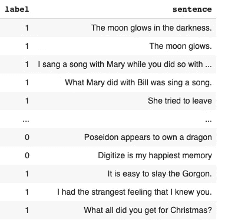
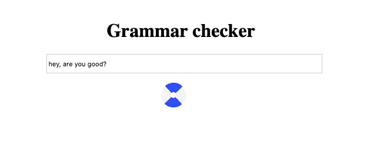
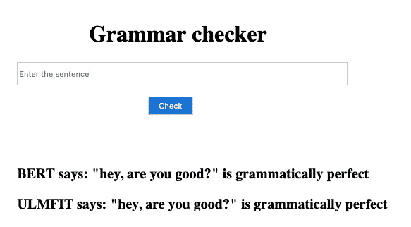
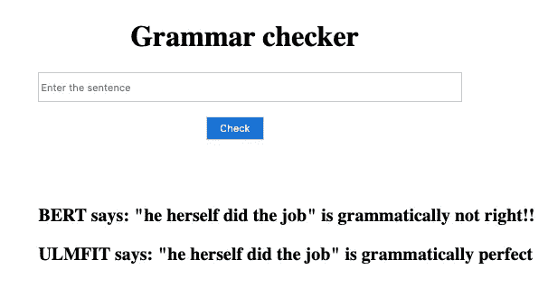
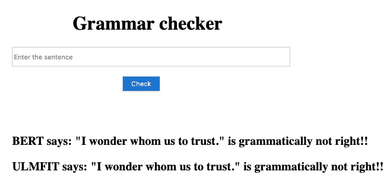
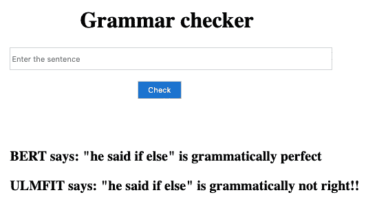

# 用 BERT 和 ULMFiT 检查语法。

> 原文：<https://towardsdatascience.com/checking-grammar-with-bert-and-ulmfit-1f59c718fe75?source=collection_archive---------18----------------------->

## 让我们来看看迁移学习的两个重量级人物在检查语法方面的表现。

[绿色变色龙](https://unsplash.com/@craftedbygc?utm_source=unsplash&utm_medium=referral&utm_content=creditCopyText)在 [Unsplash](https://unsplash.com/s/photos/write-book?utm_source=unsplash&utm_medium=referral&utm_content=creditCopyText) 上的照片

迁移学习对于所有 NLP 研究人员来说是一个游戏改变者，所以在开始之前，让我们快速回顾一下什么是迁移学习。

> ***迁移学习(Transfer learning)是一种机器学习方法，其中为一项任务开发的模型被重新用作第二项任务的模型的起点。***

简单地说，它将来自一个领域和任务的先验知识运用到不同的领域和任务中。幸运的是，我们有各种这样的模型，它们具有关于语言及其语义的先验知识，所以我们将只使用那些(有知识的)模型，并看看它们如何执行我们手头的任务(这里检查语法)。

但是我们许多人在各种 NLP 任务中面临的一个主要问题是缺乏良好的硬件(GPU 和 TPU)，这是 NLP 任务的一个必要条件，因为我们要处理高维密集向量。在本文中，我们将看到如何克服这一点，使用 Google Colab 来训练模型，并使用一台 CPU 机器来测试和使用我们的语法检查器。

# 让我们见见竞争者

一方面，我们有 fast.ai 的杰瑞米·霍华德和 NUI Galway Insight Center 的 Sebastian Ruder 提出的 ULMFiT。ULMFiT 使用以下新技术实现了最先进的结果:

*   区别微调
*   倾斜三角形学习率，以及
*   逐步解冻

该方法包括将在 [Wikitext 103 数据集](https://einstein.ai/research/the-wikitext-long-term-dependency-language-modeling-dataset)上训练的预训练语言模型(LM)微调到新的数据集，以使其不会忘记之前学习的内容。

为了与 Fast.ai 的 ULMFIT 竞争，我们有谷歌的 **BERT** (来自变压器的双向编码器表示)，它为大多数 NLP 任务提供了最先进的结果。BERT 的关键技术创新是将 Transformer(一种流行的注意力模型)的双向训练应用于语言建模。这与以前从左到右或者结合从左到右和从右到左训练来查看文本序列的努力形成对比。

在本文中，我们不会深入讨论每个模型的细节，而是看看它们在检查语法方面的表现。

# 那么数据在哪里呢？

我们将使用[语言可接受性语料库(CoLA)](https://nyu-mll.github.io/CoLA/) 数据集进行单句分类。它是一组被标记为语法正确或不正确的句子。它于 2018 年 5 月首次发布，是“GLUE Benchmark”中包括的测试之一，BERT 等模型正在进行竞争。

让我们看一下我们的数据:

数据集的一小部分。(0 ->错，1->对)。

# 让我们开始战斗吧

我们将使用 Google Colab 来微调预训练的模型，因为我们可以轻松地使用 Colab 免费提供给我们的 GPU，这将大大减少训练时间。

## 伯特

对于伯特，我们将使用[拥抱脸的 PyTorch](https://huggingface.co/transformers/index.html) 实现，因为它非常简单和直观。以下是我们大致遵循的步骤:

1.  加载[数据集](https://nyu-mll.github.io/CoLA/)并解析它。
2.  将句子编码成伯特可以理解的格式。
3.  训练(微调)，它涉及到这些步骤 **:**

*   打开我们的数据输入和标签
*   将数据加载到 GPU 上进行加速
*   清除上一步中计算的渐变。
*   正向传递(通过网络输入数据)
*   反向传递(反向传播)
*   告诉网络使用 optimizer.step()更新参数
*   跟踪用于监控进度的变量
*   我们将指定**BertForSequenceClassification**作为最后一层，因为它是一个分类任务**。**

4.将微调后的模型保存到我们的本地磁盘或驱动器。

5.下载保存的模型，并在我们的本地机器上做一些语法检查。

这里的[笔记本](https://gist.github.com/sayakmisra/dbb06efec99e760cf9e5d197175ad9c5#file-grammar-checker-bert-ipynb)包含了全部代码。

## 乌尔菲特

[Fast.ai](https://docs.fast.ai/) 提供了一个简单得多的接口来实现 ULMFIT。以下是涉及的步骤:

1.  加载[数据集](https://nyu-mll.github.io/CoLA/)并解析它。
2.  使用我们的数据集建立一个语言模型。
3.  只使用语言模型的编码器来构建分类器。
4.  微调分类器(这里是语法检查器)。
5.  保存微调后的模型。
6.  下载模型在我们的本地设置中玩。

这里是包含上述代码的[笔记本](https://gist.github.com/sayakmisra/3f5a3fc7eb18e0a6f93dac4a08b08dd8#file-grammar-checker-ulmfit-ipynb)。

# 那么谁是赢家呢？

为了可视化结果，让我们用 HTML 和 CSS 构建一个带有简单 UI 的小 flask 应用程序。这里是 Flask 应用程序的 [Github repo](https://github.com/sayakmisra/bert_ulmfit_grammar_checker) ，在这里你可以很容易地下载你自己的模型并使用这个应用程序。

让我们从一些句子开始:

下面是一个简单的陈述。

伯特和乌尔菲特都预测正确。

干得好，伯特，你不适合，你需要更多的训练。

太好了，你们俩都在这里。

这是一个棘手的问题，但乌尔菲特可能有优势。

玩了一天后，伯特似乎是这场战斗的明显赢家。尽管我们可以进一步微调超参数以改善结果。

评估模型的更好方法是通过使用[马修相关系数](https://scikit-learn.org/stable/modules/generated/sklearn.metrics.matthews_corrcoef.html)的预测，因为这是更广泛的 NLP 社区用来评估可乐性能的指标。按照这个标准，+1 是最好的分数，而-1 是最差的分数。通过这种方式，我们可以看到我们在这项特定任务中相对于最先进模型的表现有多好。

对于我们的车型，BERT 的 MCC 得分**为 0.55** 优于 ULMFiT 的 **0.4042** 。

# 结论

在这场战斗中，BERT 可能在理解语言语义方面比 fast.ai 的 ULMFiT 有优势，但我们可以进一步优化我们的模型，以获得更好的结果。我们也可以尝试其他迁移学习模式，如:脸书的 RoBERTa，XLNET，ALBERT 等。用于检查语法。

# 参考资料:

1.  Fast.ai 文档[https://docs.fast.ai/](https://docs.fast.ai/)
2.  拥抱脸变形金刚[https://huggingface.co/transformers/index.html](https://huggingface.co/transformers/index.html)
3.  Chris mcCormick 的博客文章[http://mccormickml . com/2019/11/11/Bert-research-EP-1-key-concepts-and-sources/](http://mccormickml.com/2019/11/11/bert-research-ep-1-key-concepts-and-sources/)