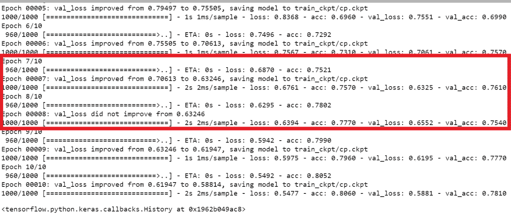
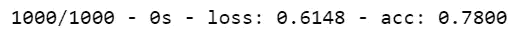
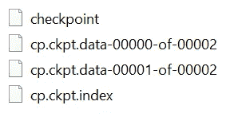
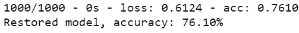
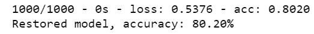
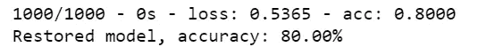

# Keras 中的检查点深度学习模型

> 原文：<https://towardsdatascience.com/checkpointing-deep-learning-models-in-keras-a652570b8de6?source=collection_archive---------4----------------------->

## 了解如何使用检查点保存深度学习模型，以及如何重新加载它们


**保存和加载深度学习模型的不同方法正在使用**

*   [JSON 文件](https://medium.com/@arshren/saving-and-loading-keras-model-42195b92f57a)
*   [YAML 档案](https://medium.com/@arshren/saving-and-loading-keras-model-42195b92f57a)
*   检查站

在本文中，您将了解如何对使用 Keras 构建的深度学习模型进行检查点检查，然后将模型架构和训练好的权重恢复到新模型，或者从您停止的地方恢复训练

## 检查点的使用

*   **允许我们使用预训练的模型进行推理，而不必重新训练模型**
*   **从我们停止的地方继续训练过程，以防训练中断或用于微调模型**

在训练因任何原因中断的情况下，它可以自动保存您的模型。

## 使用检查点保存和加载模型和权重的步骤

*   创建模型
*   指定我们要保存检查点文件的路径
*   创建回调函数来保存模型
*   在培训期间应用回调函数
*   根据测试数据评估模型
*   使用 l **oad_weights()** 或**从最近的检查点**恢复重量，将预训练的重量加载到新型号上

## 创建具有损失函数、指标和优化器的基础模型架构

我们为时尚 MNIST 数据集创建了多类分类模型

```
**# Define the model architecture 
def create_model():
    model = tf.keras.Sequential()
    # Must define the input shape in the first layer of the neural network
    model.add(tf.keras.layers.Conv2D(filters=64, kernel_size=2, padding='same', activation='relu', input_shape=(28,28,1))) 
    model.add(tf.keras.layers.MaxPooling2D(pool_size=2))
    model.add(tf.keras.layers.Dropout(0.3))
    model.add(tf.keras.layers.Conv2D(filters=32, kernel_size=2, padding='same', activation='relu'))
    model.add(tf.keras.layers.MaxPooling2D(pool_size=2))
    model.add(tf.keras.layers.Dropout(0.3))
    model.add(tf.keras.layers.Flatten())
    model.add(tf.keras.layers.Dense(256, activation='relu'))
    model.add(tf.keras.layers.Dropout(0.5))
    model.add(tf.keras.layers.Dense(10, activation='softmax'))

    #Compiling the model
    model.compile(loss='sparse_categorical_crossentropy',
             optimizer='adam',
             metrics=['accuracy'])

    return model**#create the model
**model_ckpt= create_model()**
```

**指定存储检查点文件的路径**

```
**checkpoint_path = "train_ckpt/cp.ckpt"**
```

**创建回调函数保存模型。**

在训练的不同阶段应用回调函数，以给出内部训练状态的视图。

我们使用 ***模型检查点*** 创建一个回调函数来保存模型权重。

如果我们将***save _ weight _ only***设置为 True，那么将只保存重量。模型架构、损失和优化器将不会被保存。

我们还可以指定是否要在每个时期或每隔 ***n*** 个时期保存模型。

```
# Create a callback that saves the model's weights
**cp_callback = tf.keras.callbacks.ModelCheckpoint(filepath=checkpoint_path,save_best_only=True, save_weights_only=True, verbose=1)**
```

**模型检查点回调类**具有以下参数:

*   **文件路径**:指定我们想要保存模型的路径或文件名
*   **监控**:我们想要监控的指标，比如损失或准确性
*   **详细度** : 0 表示调试模式，1 表示信息
*   **save_weights_only** :如果设置为 True，则只保存模型权重，否则保存整个模型，包括模型架构、权重、损失函数和优化器。
*   **save_best_only** :如果设置为 True，则根据我们监控的数量，仅保存最佳模型。如果我们正在监控精度并且 ***save_best_only*** 被设置为 True，那么模型将在我们每次获得比先前精度更高的精度时被保存。
*   **模式**:有三个选项- **自动、最小或最大**。**如果我们正在监控精度，则将其设置为最大值，**和**如果我们正在监控损耗，则将其设置为最小值**。如果我们将模式设置为自动，则方向会根据监控的数量自动推断
*   **save_freq 或 period** : **设置为‘epoch’或一个数字**。当它设置为 epoch 时，模型在每个 epoch 后被保存。当我们指定一个数字，比如说 5，那么模型在每五个时期后被保存，如下面的代码所示

```
# Create a callback that saves the model's weights every 5 epochs
**cp_callback = tf.keras.callbacks.ModelCheckpoint(
    filepath=checkpoint_path, 
    verbose=1, 
    save_weights_only=True,
    save_freq=5)**
```

**在培训过程中应用回调**

```
# Train the model with the new callback
# Pass callback to training
**model_ckpt.fit(train_images, 
          train_labels,  
          batch_size=64,
          epochs=10,
          validation_data=(test_images,test_labels),
          callbacks=[cp_callback])**
```



我们可以看到，如果 val_loss 没有改善，那么权重就没有保存。每当丢失减少时，这些权重就会保存到检查点文件中

**在测试图像上评估模型**

```
**loss,acc = model_ckpt.evaluate(test_images,  test_labels, verbose=2)**
```



## 检查点文件

检查点文件以二进制格式将训练好的权重存储到检查点格式化文件的集合中

tensor flow***save()***保存三种文件:检查点文件、索引文件、数据文件。它将**图形结构**与**变量值**分开存储。

**检查点文件:包含索引文件以及一个或多个数据文件的前缀**

**索引文件:指示哪些权重存储在哪个分片**。当我在一台机器上训练该模型时，我们看到***CP . ckpt . data-00000-of-00002***和***CP . ckpt . data-00001-of-00002***

**数据文件:保存所有变量的值，无结构。可以有一个或多个数据文件**



检查点文件

## 加载预训练的重量

加载预训练重量的原因

*   **从我们停止的地方继续或**
*   **中断后恢复或**
*   **加载预训练的重量进行推断**

我们创建一个新的模型来加载预训练的权重。

当加载具有预训练权重的新模型时，新模型应该具有与原始模型相同的架构。

```
# Create a basic model instance
**model_ckpt2 = create_model()**
```

我们使用***load _ weights()***将预训练的权重加载到我们的新模型中。

```
**model_ckpt2.load_weights(checkpoint_path)**
```

我们可以使用新模型对测试图像进行推断

```
**loss,acc = model_ckpt2.evaluate(test_images,  test_labels, verbose=2)
print("Restored model, accuracy: {:5.2f}%".format(100*acc))**
```



**未经训练的模型将随机执行(大约 10%的准确度)**

# 从我们停止的地方继续训练

```
**model_ckpt2.fit(train_images, 
          train_labels,  
          batch_size=64,
          epochs=10,
          validation_data=(test_images,test_labels),
          callbacks=[cp_callback])**
```

我们看到现在精确度已经改变了

```
loss,acc = model_ckpt2.evaluate(test_images,  test_labels, verbose=2)
print("Restored model, accuracy: {:5.2f}%".format(100*acc))
```



## 从最新的检查点加载权重

***latest _ check point()***查找最新保存的检查点文件的文件名

```
#get the latest checkpoint file
**checkpoint_dir = os.path.dirname(checkpoint_path)
latest = tf.train.latest_checkpoint(checkpoint_dir)**
```

我们创建一个新的模型，从最新的检查点加载权重并进行推理

```
Create a new model instance
**model_latest_checkpoint = create_model()**# Load the previously saved weights
**model_latest_checkpoint.load_weights(latest)**# Re-evaluate the model
**loss, acc = model_latest_checkpoint.evaluate(test_images,  test_labels, verbose=2)
print("Restored model, accuracy: {:5.2f}%".format(100*acc))**
```



**在文件名中包含纪元编号**

```
# Include the epoch in the file name (uses `str.format`)
**checkpoint_path = "training2/cp-{epoch:04d}.ckpt"**
```

[使用时尚 MNIST 保存模型和重新加载模型的代码](https://github.com/arshren/save-and-load-model-and-weights/blob/master/Fashion%20MNIST-Save%20and%20load%20models.ipynb)

## 结论:

我们现在了解了如何使用**模型检查点类、**创建不同的检查点文件来创建回调函数，以及如何恢复预训练的权重

**参考文献:**

[https://www.tensorflow.org/tutorials/keras/save_and_load](https://www.tensorflow.org/tutorials/keras/save_and_load)