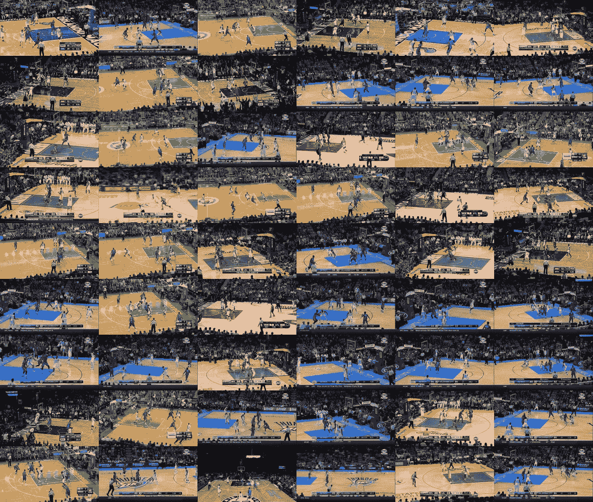
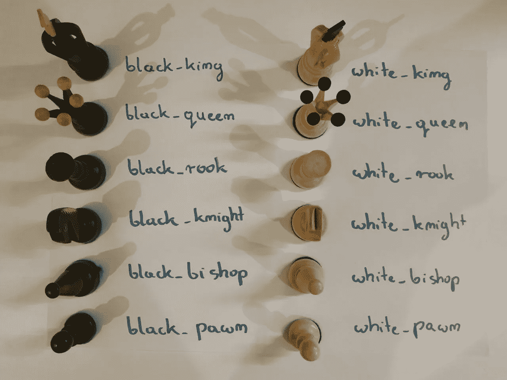
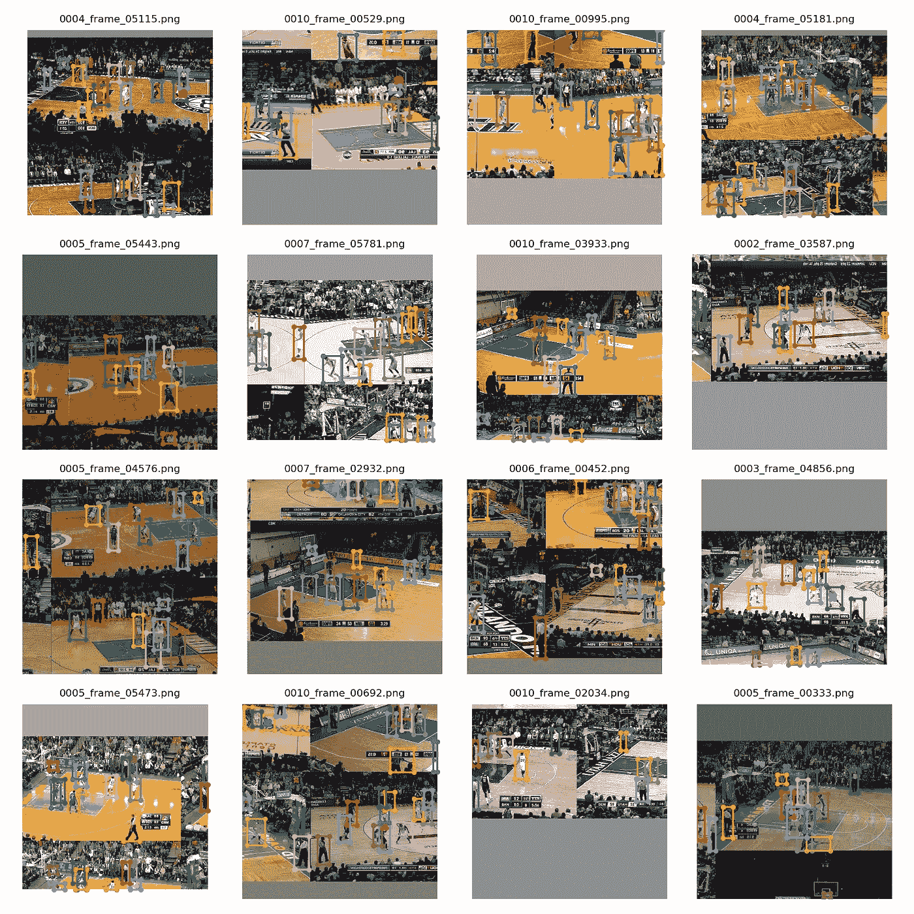
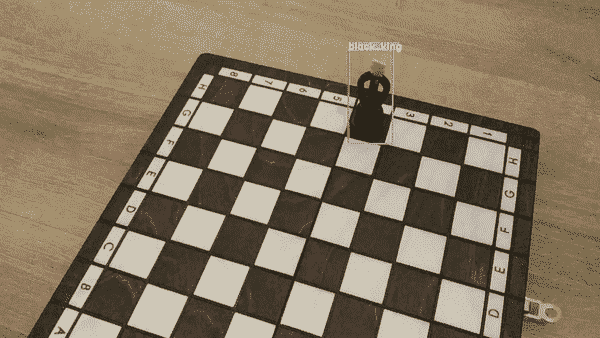

# 创建自定义对象检测模型的简单方法

> 原文：<https://towardsdatascience.com/chess-rolls-or-basketball-lets-create-a-custom-object-detection-model-ef53028eac7d?source=collection_archive---------11----------------------->

## 数据科学工具包第二部分

# 介绍

OLO 是我最喜欢的计算机视觉算法之一，很长一段时间以来，我一直计划专门为这个奇迹写一篇博文。然而，我决定我不想让它成为另一篇详细解释 YOLO 如何在幕后工作的文章。至少有一些媒体上的[出版物](https://medium.com/@jonathan_hui/real-time-object-detection-with-yolo-yolov2-28b1b93e2088)很好地涵盖了事物的理论方面。除此之外，如果你想拓宽你对这个架构的理解，直接从源头获取你的信息并阅读最初的[论文](https://arxiv.org/abs/1506.02640)也是一个很好的主意。


基于 [YouTube-8M](https://research.google.com/youtube8m/) 数据集，检测在篮球场上走动的球员

代替理论，这次我将向你展示**如何快速地，以相对较低的努力，并且不需要强大的机器**，创建定制的模型，能够检测你选择的任何物体。如果你需要在工作中快速测试你的想法，或者只是在家里愉快地建立你的小宠物项目，这是一个很好的方法。去年我有机会做了几个这样的实验，本文中出现的所有可视化都是这些项目的成果。

**注意:**这一次**，**我们将主要使用开源库和工具，因此我们网站上的编码量将是最小的。然而，为了鼓励你和 YOLO 一起玩，并给你一个项目的起点，**我还提供了脚本，允许你下载我预先训练的模型以及所有的配置文件和测试数据集**。像往常一样，你会在我的 [GitHub](https://github.com/SkalskiP/ILearnDeepLearning.py/tree/master/02_data_science_toolkit/02_yolo_object_detection) 上找到它。

# YOLO

一个 **你们都不知道 YOLO 是什么**——但出于好奇决定点击封面图片——**别担心，** **哪儿也别去！我现在会简单解释一下我在说什么。**

YOLO——或者你只看一次——是一种实时对象检测算法，它是首批平衡所提供预测的质量和速度的算法之一。这种类型中最强大的模型是建立在卷积神经网络之上的，这次也不例外。通过“对象检测模型”,我们的意思是，我们不仅可以使用它来指示给定照片中存在什么对象，还可以指示它们的位置和数量。这种模型在机器人和汽车工业中广泛使用，因此干涉的速度至关重要。自 2015 年以来，这种算法已经有了三次迭代，以及为 TinyYOLO 等移动设备设计的变体。移动版本的精度有限，但它的计算要求也更低，允许它运行更快。

# 资料组

和深度学习中的惯例一样，创建模型的第一步是准备数据集。监督学习是关于查看带标签的例子，并在数据中找到不明显的模式。我必须承认，创建数据集是一项相当乏味的任务。这就是为什么我准备了一个脚本，可以让你下载我的国际象棋数据集，看看 YOLO 是如何处理这个例子的。

但是那些想要建立自己的数据集的人面临一个挑战。为了实现这个目标，我们需要收集一组图像并创建匹配的标签文件。图片应该包含我们想要识别的物体。**还建议数据集群体中所有对象类的分布相似。**如你所见，在我的第一个项目——篮球探测器中，我使用了游戏视频中的帧。



篮球数据集中的图像示例

您的标签文件应该与图像具有相同的名称，但显然具有不同的扩展名，并且应该位于一个并行目录中。最佳数据结构如下所示。除了`images`和`labels`目录，我们还必须准备`class_names.txt`文件，它定义了我们计划检测的对象类的名称。这个文件的每一行都代表一个类，应该包含一个单词或多个单词，不带空格。

```
project
 └──dataset
    ├── class_names.txt
    ├── images
    │   ├── image_1.png
    │   ├── image_2.png
    │   └── image_3.png
    │       ...
    └── labels
        ├── image_1.txt
        ├── image_2.txt
        └── image_3.txt
            ...
```

# 标记

不幸的是，YOLO 需要一种特定的标签格式，大多数免费标签工具都不支持这种格式。为了消除从 VOC XML、VGG JSON 或其他广泛使用的格式解析标签的需要，我们将利用 [makesense.ai](https://www.makesense.ai/) 。这是我在 GitHub 上开发的一个免费开源项目。该编辑器不仅支持直接导出到 YOLO 格式，而且直观，不需要安装，因为它在浏览器中工作。此外，它支持多种功能，旨在加快您的贴标工作。用 MakeSense 看看 AI 支持的标注过程。


使用 [makesense.ai](https://www.makesense.ai/) 的人工智能支持的贴标过程

一旦工作完成，我们可以下载一个`.zip`，包含`.txt`文件。每个这样的文件对应于一个单独的标签图像，并描述了照片中可见的对象。如果我们打开其中一个文件，我们会发现，每一行都是`class_idx x_center y_center width height`格式。其中`class_idx`代表从`class_names.txt`文件中分配的标签的索引(从 0 开始计数)。其余参数描述围绕单个对象的边界框。它们可以取 0 到 1 之间的值(相对于图像尺寸)。幸运的是，大多数时候我们不需要考虑这些细节，因为编辑器会为我们处理好一切。YOLO 格式的标签示例如下所示。

```
4 0.360558 0.439186 0.068327 0.250741
7 0.697519 0.701205 0.078643 0.228243
3 0.198589 0.683692 0.076613 0.263441
```

# 环境设置

Y OLO 最初是在一个名为 [Darknet](https://github.com/pjreddie/darknet) 的深度学习小众框架中编写的。从那以后，出现了许多其他实现，其中大部分使用了两个非常流行的 Python 平台——Keras 和 PyTorch。在所有可用的解决方案中，有一个[是我特别喜欢的。它提供了一个用于训练和检测的高级 API，但也有丰富的有用功能。使用它时，我们所有的工作都归结为准备一个数据集和创建几个配置文件，然后责任就转移到了库上。](https://github.com/ultralytics/yolov3)

```
project
 ├── dataset
 └── yolov3
```

环境设置也很简单，因为它归结为运行几个命令，您可能会在下面找到(假设您已经在您的计算机上安装了 [Python](https://www.python.org/downloads/) 和 [Git](https://git-scm.com/book/en/v2/Getting-Started-Installing-Git) )。最好从`project`目录执行命令，以实现上面所示的结构。值得一提的是，该环境也可以通过 Docker 创建(这对 Windows 用户尤其有用)。你可以在这里找到关于这个主题[的更多说明。](https://github.com/ultralytics/yolov3/wiki/Docker-Quickstart)

```
# Clone framework
git clone [https://github.com/ultralytics/yolov3.git](https://github.com/ultralytics/yolov3.git)
# Enter framework catalogue [Linux/MacOS]
cd ./yolov3
# Setup Python environment
pip install -U -r requirements.txt
```

# 配置

正如我在上一段中提到的，我们现在需要做的就是创建几个配置文件。它们定义了我们的训练和测试集的位置、对象类的名称，并提供了所用神经网络架构的指南。



用于标注象棋数据集的参考照片

首先，我们需要将数据集分成训练集和测试集。我们在两个`.txt`文件的帮助下完成这项工作。它们中的每一个都包含从我们的数据集中指向特定图像的路径。为了加快我们的工作，我准备了一个 Python 脚本，它会自动为我们创建这些文件。您需要做的只是指出数据集的位置，并定义训练集和测试集之间的百分比分割。下面显示了`train.txt` / `test.txt`文件的一个片段。

```
./dataset/images/image_1.png
./dataset/images/image_2.png
./dataset/images/image_3.png
 ...
```

`.data`是我们需要提供的最终文件。让我们以我的下一个项目——象棋探测器为例来讨论它的内容。在这种情况下，我有 12 个唯一的对象类需要识别。接下来，我们给出定义哪些照片属于训练集和测试集的文件的位置，最后给出前面讨论的带有标签名称的文件的位置。为了一切正常工作，应将文件`chess.data`、`chess_train.txt`、`chess_test.txt`和`chess.names`移动到`project/yolov3/data`目录。

```
classes=12
train=./data/chess_train.txt
valid=./data/chess_test.txt
names=./data/chess.names
```

# 培养

现在我们准备好开始训练了。正如我前面提到的，我们使用的库有一个高级 API，所以终端中的一个命令和几个参数就足以启动这个过程。然而，在这背后，有几件重要的事情正在发生，大大增加了我们获得最终成功的机会。

```
python3 train.py
   --data ./data/project.data
   --cfg ./cfg/project.cfg
   --weights ./weights/yolov3.pt
```

首先，我们可以应用迁移学习——我们不必从头开始训练。我们可以使用在不同数据集上训练的模型的权重，这导致我们自己的网络的学习时间更短。我们的模型可以使用基本形状的知识，并专注于将这些信息与我们想要识别的新类型的对象联系起来。其次，该库执行数据扩充，因此它基于我们提供的照片生成新的示例。正因为如此，即使我们只有一个很小的数据集——几百张图片，我们也可以训练我们的模型。我们使用的库也为我们提供了作为增强结果而创建的图像样本。下面你可以看到在我的篮球探测器的训练过程中创建的例子。



在训练集上执行的数据扩充的可视化

# 侦查

终于，快乐的时刻到来了！我们致力于创建模型的工作得到了回报，因为我们现在可以用它在任何照片中找到我们想要的物体。同样，这是一个非常简单的任务，我们可以在终端中用一个简单的命令来完成。执行之后，我们将在输出目录中找到我们预测的结果。值得一提的是，我们还可以对来自网络摄像头的视频进行现场预测，这在我们希望通过展示演示给大家留下深刻印象时特别有用。

```
python3 detect.py
   --data ./data/project.data
   --cfg ./cfg/project.cfg
   --weights ./weights/best.py
   --source ./data/sample
```



使用 TinyYOLO 的国际象棋检测

# 结论

如果你设法来到这里，祝贺你。非常感谢你花时间阅读这篇文章。如果你喜欢这篇文章，考虑把它分享给你的朋友，或者两个或五个朋友。我希望我设法证明了训练你自己的定制 YOLO 模型并不困难，并且我的提示将在你未来的实验中有所帮助。

本文是“数据科学工具包”系列的另一部分，如果您还没有机会，请阅读[其他文章](/simple-method-of-creating-animated-graphs-127c11f58cc5)。此外，如果你喜欢我目前的工作，请在 [Twitter](https://twitter.com/PiotrSkalski92) 和 [Medium](https://medium.com/@piotr.skalski92) 上关注我，并在 [GitHub](https://github.com/SkalskiP) 和 [Kaggle](https://www.kaggle.com/skalskip) 上查看我正在进行的其他项目。保持好奇！

[](https://twitter.com/PiotrSkalski92)[](https://towardsdatascience.com/https-medium-com-piotr-skalski92-deep-dive-into-deep-networks-math-17660bc376ba)[](https://github.com/SkalskiP)