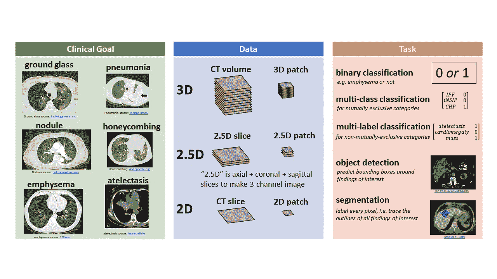
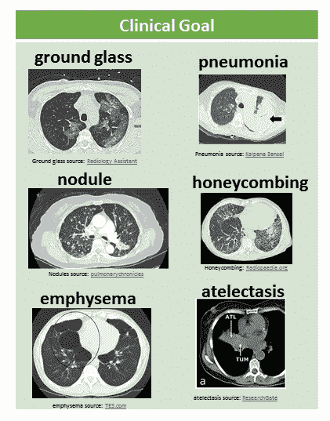
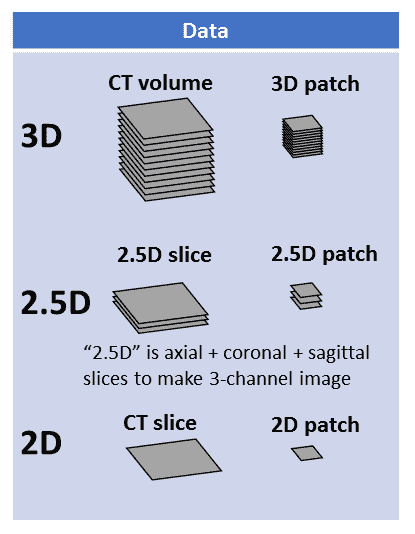
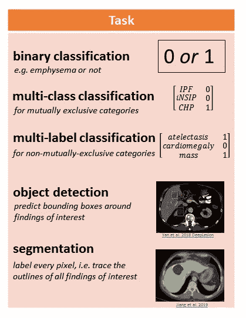
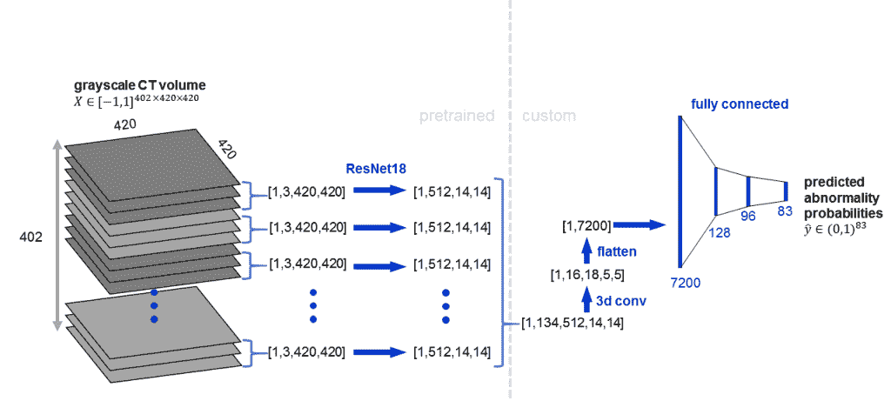
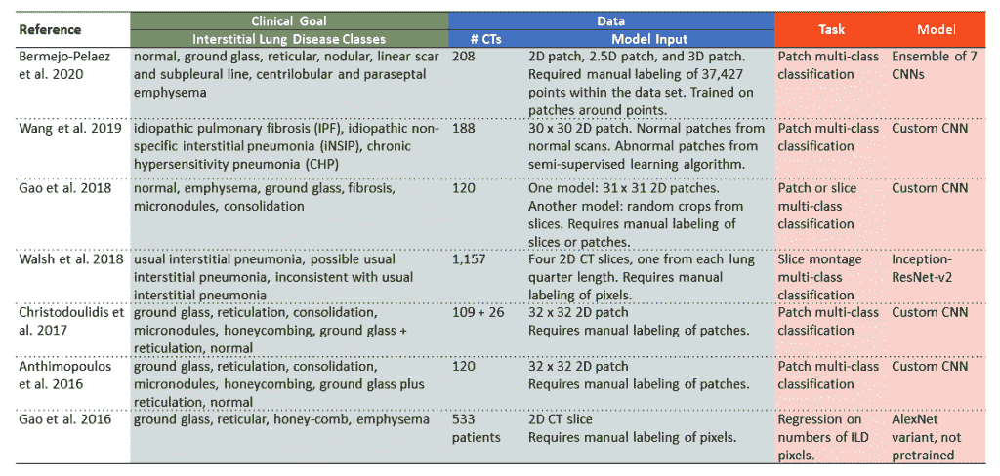

# 胸部 CT 扫描 5 分钟机器学习

> 原文：<https://towardsdatascience.com/chest-ct-scan-machine-learning-in-5-minutes-ae7613192fdc?source=collection_archive---------30----------------------->

## 临床目标、数据表示、任务、模型

作者图片

这篇文章提供了胸部 CT 扫描机器学习的概述，由临床目标，数据表示，任务和模型组织。

胸部 CT 扫描是一种灰度三维医学图像，描绘了胸部，包括心脏和肺。CT 扫描用于诊断和监测许多不同的疾病，包括癌症、骨折和感染。

# **临床目标**

临床目标是指作为研究重点的医学异常。下图显示了一些异常情况，显示为通过 CT 容积的 2D 轴向切片:

图片作者。子图片来自:毛玻璃[放射科助理](https://radiologyassistant.nl/chest/covid-19/covid19-imaging-findings)、肺炎[卡尔帕纳班萨尔](https://www.researchgate.net/figure/Pneumonia-Axial-CT-scan-lung-window-section-showing-left-lung-consolidation-arrow_fig6_276176939)、结节[肺部编年史](https://pulmonarychronicles.com/index.php/pulmonarychronicles/article/view/467/1018)、蜂窝肺[Radiopaedia.org](https://radiopaedia.org/cases/honeycombing-in-pulmonary-fibrosis)、肺气肿[TES.com](https://www.tes.com/lessons/tGSVv66fn8GrOQ/emphysema)、肺不张[研究门](https://www.researchgate.net/figure/Example-slices-of-typical-lung-CT-images-of-two-patients-with-atelectasis-ATL-and_fig1_313807162)

很多 CT 机器学习的论文都聚焦于[肺结节](https://link.springer.com/article/10.1007/s10278-020-00320-6)。

最近的其他工作关注了肺炎、肺气肿、肺癌、气胸和气胸，前者是肺部感染，后者是肺气肿，前者是吸烟导致的一种肺部损伤，后者是肺癌，后者是气胸。

我一直专注于多种异常预测，其中模型[同时预测 83 种不同的异常发现](https://arxiv.org/ftp/arxiv/papers/2002/2002.04752.pdf)。

# **数据**

在机器学习模型中，有几种不同的方法来表示 CT 数据，如下图所示:

作者图片

3D 表示包括大约 1000×512×512 像素的整个 CT 体积，以及可以大(例如整个体积的一半或四分之一)或小(例如 32×32×32 像素)的 3D 补片。

2.5D 表示使用不同的垂直平面。

*   轴面像腰带一样水平，冠状面像头带或旧式耳机一样垂直，矢状面像弓箭手面前的弓箭的平面一样垂直。
*   如果我们取一个轴向切片、一个矢状切片和一个冠状切片，并将它们堆叠成一个 3 通道图像，那么我们就有一个 2.5D 切片表示。
*   如果这是用小的小块来完成的，例如 32×32 像素，那么我们有一个 2.5D 的小块表示。

最后，还使用了 2D 表示法。这可以是一个完整的切片(例如 512 x 512)，也可以是一个 2D 面片(例如 16 x 16，32 x 32，48 x 48)。这些 2D 切片或贴片通常来自轴向视图。

# **任务**

胸部 CT 机器学习有很多不同的任务。

下图说明了一些任务:

图片作者。子图片来自[颜等 2018 深度病变](https://www.ncbi.nlm.nih.gov/pmc/articles/PMC6052252/)和[江等 2019](https://ieeexplore.ieee.org/document/8651448)

二元分类包括给 CT 表现分配 1 或 0，表示异常的存在(1)或不存在(0)。

[多级分类](https://glassboxmedicine.com/2019/05/26/classification-sigmoid-vs-softmax/)用于互斥的类别，如间质性肺病的不同临床亚型。在这种情况下，模型将 0 分配给除 1 类别之外的所有类别。

[多标签分类](https://glassboxmedicine.com/2019/05/26/classification-sigmoid-vs-softmax/)用于非互斥类别，如肺不张(肺组织萎陷)、心脏肥大(心脏增大)和肿块。CT 扫描可能有一些、全部或没有这些发现，并且模型确定存在哪些(如果有的话)。

目标检测包括预测感兴趣的异常周围的边界框的坐标。

[分割](https://glassboxmedicine.com/2020/01/21/segmentation-u-net-mask-r-cnn-and-medical-applications/)包括标记每个像素，这在概念上就像“描绘异常的轮廓并给它们着色”

训练这些模型需要不同的标签。需要异常的“存在或不存在”标签来训练分类模型，例如[肺不张=0，心脏肥大= 1，质量= 0]。需要包围盒标签来训练对象检测模型。训练分割模型需要分割掩模(轮廓中跟踪和填充的)。如果这些标签是从自由文本放射学报告中自动提取的(例如，36，316 CT 的 [RAD-ChestCT 数据集](https://arxiv.org/ftp/arxiv/papers/2002/2002.04752.pdf)),则只有“存在或不存在”标签可扩展到数万次 CT 扫描。获得分割掩模是最耗时的，因为它们必须在每个切片上手动绘制；因此，分割研究通常使用 100-1000 次 CT 扫描。

# **型号**

卷积神经网络是在 CT 数据上使用的最流行的机器学习模型。关于 CNN 的 5 分钟介绍，见本文。

*   3D CNNs 用于整个 CT 体积或 3D 补片
*   2D CNN 用于 2.5D 表示(3 个通道，轴向/冠状/矢状)，与 2D CNN 可以将 3 通道 RGB 图像作为输入(3 个通道，红/绿/蓝)的方式相同。
*   2D CNN 用于 2D 切片或 2D 补丁。

一些 CNN 结合了 2D 和 3D 卷积。CNN 也可以被“预训练”,这通常是指首先在像 ImageNet 这样的自然图像数据集上训练 CNN，然后在 CT 数据上精炼 CNN 的权重。

这里是一个[架构示例](https://arxiv.org/ftp/arxiv/papers/2002/2002.04752.pdf)，其中预训练的 2D CNN (ResNet18)应用于 3 个相邻切片的组，然后进行 3D 卷积:

作者图片

# **间质性肺病分类举例**

下表包括几个关注间质性肺病的研究实例，按临床目标、数据、任务和模型组织。

*   临床目标:这些论文都集中在间质性肺病。不同的研究使用的确切类别不同。一些研究侧重于临床分组，如特发性肺纤维化或特发性非特异性间质性肺炎(如王等人 2019 年和沃尔什等人 2018 年)。其他研究侧重于网状或蜂窝状等肺部模式(如 Anthimopoulos 等人 2016 年和高等人 2016 年)。
*   数据:数据集由 100–1，200 个 CT 组成，因为所有这些研究都依赖于片、切片或像素的手动标记，这非常耗时。进行碎片、切片或像素级分类的好处在于，除了诊断信息之外，它还提供了定位信息。
*   任务:任务大多是多类分类，其中每个片或片被分配给多个可能的类中的一个类。
*   模型:一些研究使用定制的 CNN 架构，等人 2019 和高等人 2018，而其他研究采用现有的 CNN 架构，如 [ResNet](https://arxiv.org/abs/1512.03385) 和 [AlexNet](https://papers.nips.cc/paper/4824-imagenet-classification-with-deep-convolutional-neural-networks.pdf) 。

# **补充阅读**

*   关于这个主题的更长、更深入的文章，请参见[使用机器学习自动解读胸部 CT 扫描](https://glassboxmedicine.com/2020/03/05/automatic-interpretation-of-chest-ct-scans-with-machine-learning/)
*   关于胸部 X 射线中的机器学习的文章，这是胸部的 2D 医学图像，而不是胸部的 3D 医学图像，请参见[自动胸部 X 射线解释](https://glassboxmedicine.com/2019/05/11/automated-chest-x-ray-interpretation/)
*   有关 CNN 的更多信息，请参见[5 分钟内的卷积神经网络](https://glassboxmedicine.com/2020/08/03/convolutional-neural-networks-cnns-in-5-minutes/)和[计算机如何看待:卷积神经网络简介](https://glassboxmedicine.com/2019/05/05/how-computers-see-intro-to-convolutional-neural-networks/)
*   有关分割任务的更多详情，请参见[分割:U-Net、Mask R-CNN 和医疗应用](https://glassboxmedicine.com/2020/08/04/chest-ct-scan-machine-learning-in-5-minutes/U-Net,%20Mask%20R-CNN,%20and%20Medical%20Applications)
*   有关分类任务的更多详细信息，请参见[多标签与多类分类:Sigmoid 与 Softmax](https://glassboxmedicine.com/2019/05/26/classification-sigmoid-vs-softmax/)

*原载于 2020 年 8 月 4 日 http://glassboxmedicine.com**T21*[。](https://glassboxmedicine.com/2020/08/04/chest-ct-scan-machine-learning-in-5-minutes/)