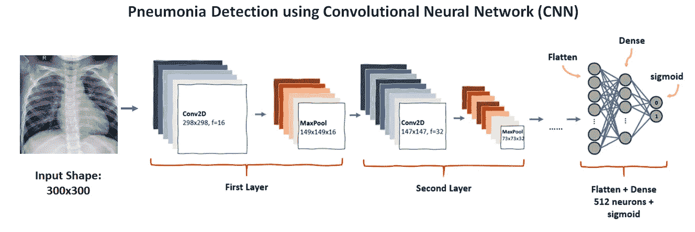
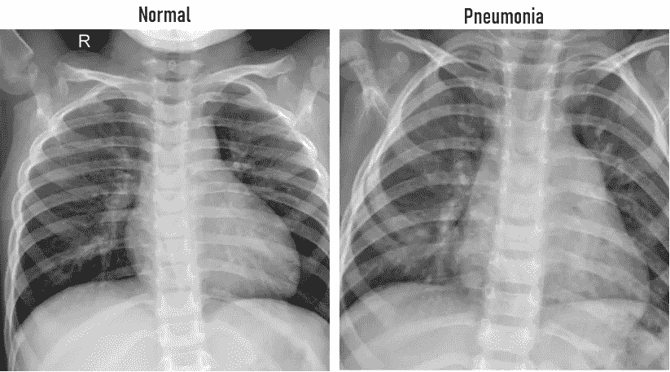
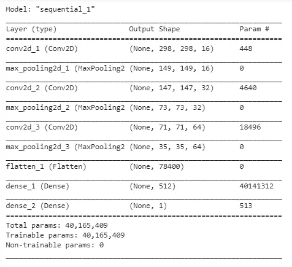
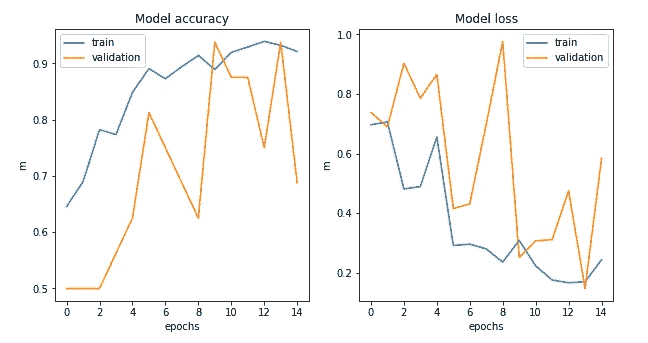
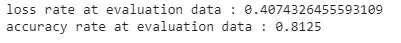
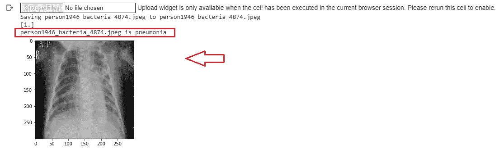

# 基于卷积神经网络的胸部 X 线肺炎检测

> 原文：<https://towardsdatascience.com/chest-x-rays-pneumonia-detection-using-convolutional-neural-network-63d6ec2d1dee?source=collection_archive---------13----------------------->

## 面向初学者的基本 Tensorflow 和 Keras 实现

对于初学者来说，卷积神经网络(CNN)可能看起来有些吓人。然而，该项目将概述如何使用 Tensorflow 和 Keras 从头构建一个模型来检测肺炎。

迷你项目的内容如下:

*   模型结构
*   模特培训
*   模型评估
*   最终模型预测

## 什么是肺炎？

[肺炎](https://www.webmd.com/lung/tc/pneumonia-topic-overview)是一种由病毒或细菌感染引起的肺部炎症，病情从轻微到严重不等。这种炎症使患者无法呼吸足够的氧气进入血液。当感染使肺部的气囊(肺泡)充满液体或脓液，可能影响一侧或两侧肺部时，就会发生这种情况。如果你的医生认为你可能患有肺炎，将进行胸部 x 光检查，以发现患者肺部的感染及其扩散程度。

## 资料组

该实验利用了来自 Kaggle 知识库的名为胸部 x 光图像(肺炎)的数据。点击查看数据集[。数据集由正常肺和肺炎肺两类组成，如下图所示。](https://www.kaggle.com/paultimothymooney/chest-xray-pneumonia)

## 履行

在我们开始构建卷积神经网络之前，以下是必要的库和依赖项。

## 模型开发

所以让我们直接进入代码。我们将要开发的模型由几个部分组成，它们是:

*   **tf.keras.layers.Conv2D()** :卷积层，通过隔离图像特征来提高图像识别
*   **TF . keras . layers . maxpooling2d()**:减少图像中的信息同时保持特征的层
*   **TF . keras . layers . flatten()**:将结果展平为一维数组
*   **TF . keras . layers . dense()**:添加密集连接层

将构建一个五层卷积网络，其中 Conv2D()和 MaxPooling2D()作为一层堆叠在一起。然后，最终卷积层的输出将变平，并适合完全连接的神经元。

此外，在模型适合训练之前，有必要按如下方式配置规格:

*   **丢失:**肺炎检测在最后一步使用乙状结肠激活，其结果为 0 或 1(正常或肺炎)。因此，**二元交叉熵**是最合适的损失函数
*   **优化器:将使用学习率为 0.001 的 RMSprop** (均方根传播)
*   **度量:准确度**是获得每个历元上的预测准确度的测量度量

下面是 **model.summary()** 的输出。

我们建立的模型概述如下:

作者插图

## 模特培训

在模型适合训练之前，我们将设置数据生成器从源文件夹中读取图像，而不是逐个标记图像。在基本概念中，[**imagedata generator**](https://keras.io/api/preprocessing/image/)**根据图像所在的目录对图像进行标注。这个生成器指向数据的子目录。下面的代码可以描述如下:**

*   **通过使用**重新缩放**参数，执行灰度归一化，以便 CNN 更快收敛。标准化将图像像素从[0…255]转换为[0…1]**
*   **创建两个生成器，即 **train_generator** 和 **eval_generator** 。其中 train_generator 指向训练数据的子目录，eval_generator 指向评估数据的子目录**
*   **然后，将模型训练 10 个时期，每个时期 10 步**

**此外，以下是在训练和验证数据集之间的模型训练之后的 10 个时期内的模型准确度和损失率的分析:**

****

## **模型评估**

**一旦模型被完全训练，测试数据集将被用于确保最终模型的无偏预测。此模型评估步骤对于衡量训练模型预测未知数据的能力非常有用。**

**训练后的模型准确率达到 81.25%，如下图所示:**

****

## **最终预测**

**现在模型已经准备好进行预测，下面的代码允许用户输入一个图像来确定 x 光图像是否被诊断为肺炎。完整的代码可以在 [GitHub](https://github.com/christienatashiaarchie/Pneumonia-Detection/blob/master/Pneumonia_Detection.ipynb) 上找到。**

**输出:**

****

## **结论**

**在开发用于肺炎预测的 CNN 模型的整个过程中，我们从零开始建立了一个模型，该模型由 5 层组成，随后是一个完全连接的神经网络。然后，使用单独的看不见的数据来评估训练的模型，以避免偏差预测。结果，测试数据集的准确率达到 81.25%，表明该模型是不错的。这个迷你项目允许初学者获得如何建立一个模型来解决现实世界问题的概述。**

**毫无疑问，通过执行数据扩充或实施迁移学习概念，可以更好地改进预测模型，从而为模型提供改进空间。因此，这将被添加到未来的故事中作为进一步的增强。**

## **参考**

** [## 胸部 x 光图像(肺炎)

### 5，863 张图片，2 个类别

www.kaggle.com](https://www.kaggle.com/paultimothymooney/chest-xray-pneumonia)  [## Keras 文档:图像数据预处理

### 从目录中的图像文件生成 tf.data.Dataset。如果您的目录结构是:然后调用…

keras.io](https://keras.io/api/preprocessing/image/)  [## 深度学习用于从 X 射线图像中检测肺炎

### 从 X 射线图像中自动检测肺炎

towardsdatascience.com](/deep-learning-for-detecting-pneumonia-from-x-ray-images-fc9a3d9fdba8)**