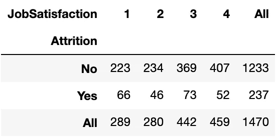

# Python 中独立性的卡方检验以及 IBM HR 分析数据集的示例

> 原文：<https://towardsdatascience.com/chi-square-test-for-independence-in-python-with-examples-from-the-ibm-hr-analytics-dataset-97b9ec9bb80a?source=collection_archive---------5----------------------->


[活动发起人](https://unsplash.com/@campaign_creators?utm_source=medium&utm_medium=referral)在 [Unsplash](https://unsplash.com?utm_source=medium&utm_medium=referral) 上的照片

假设您正在研究一个数据集，并且想要检查两个分类变量是否相互依赖。

动机可能是更好地理解结果变量和预测因子之间的关系，识别相关预测因子等。

在这种情况下，**卡方检验**可以成为有效的统计工具。

在这篇文章中，我将讨论如何用 Python(从头开始和使用 SciPy)进行这个测试，并用一个流行的 HR 分析数据集 IBM 员工流失和绩效数据集——做例子。

# 古玩目录

1.  [什么是卡方检验？](#ebe5)
2.  [我们要检验的分类变量是什么？](#3750)
3.  [如何从头开始进行这项测试？](#9974)
4.  [这样做有捷径吗？](#6627)
5.  我们还能做什么？
6.  [有哪些局限性？](#1431)

# 概观

卡方检验是一种[统计假设检验](https://www.statisticshowto.com/probability-and-statistics/hypothesis-testing/)，用于检验统计量在零假设下的卡方分布，特别是独立性卡方检验通常用于检验两个分类变量之间的独立性【1】。

与该测试相关的关键假设是:1 .从人群中随机抽取的样本。2.在任何变量中，每个主题不能属于一个以上的组。

为了更好地说明这个测试，我选择了来自 Kaggle ( [链接](https://www.kaggle.com/pavansubhasht/ibm-hr-analytics-attrition-dataset))的 IBM HR 数据集，其中包括一个关于减员、工作满意度、绩效等员工 HR 信息的样本。人们经常用它来揭示员工流失和其他因素之间的关系。

注意，这是由 IBM 数据科学家创建的虚构数据集[2]。

要查看完整的 Python 代码，请查看我的 [Kaggle 内核](https://www.kaggle.com/dehaozhang/chi-squared-test-on-attrition)。

事不宜迟，让我们进入细节！

# 探测

让我们首先检查雇员的数量和属性的数量:

```
data.shape
--------------------------------------------------------------------
(1470, 35)
```

员工 1470 人，属性 35 个。

接下来，我们可以检查这些属性是什么，并查看是否有任何与它们相关联的缺失值:

```
data.isna().any()
--------------------------------------------------------------------
Age                         False
Attrition                   False
BusinessTravel              False
DailyRate                   False
Department                  False
DistanceFromHome            False
Education                   False
EducationField              False
EmployeeCount               False
EmployeeNumber              False
EnvironmentSatisfaction     False
Gender                      False
HourlyRate                  False
JobInvolvement              False
JobLevel                    False
JobRole                     False
JobSatisfaction             False
MaritalStatus               False
MonthlyIncome               False
MonthlyRate                 False
NumCompaniesWorked          False
Over18                      False
OverTime                    False
PercentSalaryHike           False
PerformanceRating           False
RelationshipSatisfaction    False
StandardHours               False
StockOptionLevel            False
TotalWorkingYears           False
TrainingTimesLastYear       False
WorkLifeBalance             False
YearsAtCompany              False
YearsInCurrentRole          False
YearsSinceLastPromotion     False
YearsWithCurrManager        False
dtype: bool
```

**识别分类变量**

假设我们想检验“流失”和“工作满意度”之间是否有关系。

两类“损耗”的计数:

```
data['Attrition'].value_counts()
--------------------------------------------------------------------
No     1233
Yes     237
Name: Attrition, dtype: int64
```

按频率排序的四类“工作满意度”的计数:

```
data['JobSatisfaction'].value_counts()
--------------------------------------------------------------------
4    459
3    442
1    289
2    280
Name: JobSatisfaction, dtype: int64
```

请注意，对于“工作满意度”，1 表示“低”，2 表示“中”，3 表示“高”，4 表示“非常高”。

**原假设和替代假设**

对于我们这里的独立性卡方检验，零假设是**在‘流失’和‘工作满意度’之间没有**显著的关系。

另一个假设是,**在“流失”和“工作满意度”之间有**显著的关系。

**列联表**

为了计算卡方检验统计量，我们需要构建一个列联表。

我们可以使用 pandas 的“交叉表”功能来实现:

```
pd.crosstab(data.Attrition, data.JobSatisfaction, margins=True)
```



表中的数字代表频率。例如,“工作满意度”中的“2”和“流失”中的“是”都显示为“46 ”,这意味着在 1470 名员工中，有 46 名员工将他们的工作满意度评为“中等”,他们确实离开了公司。

**卡方统计**

卡方统计量(X)的计算公式如下所示:

X =总和[(观察值-预期值)/预期值]

术语'**观察到的**是指我们在列联表中看到的数字，术语'**期望的**是指零假设为真时的期望数字。

在零假设下，“流失”和“工作满意度”之间没有显著的关系，这意味着流失的百分比在工作满意度的四个类别中应该是一致的。例如，“4”和“流失”的预期频率应该是将工作满意度评为“非常高”的员工人数*(总流失/员工总数)，即 459*237/1470，或大约 74。

让我们计算所有预期的数字，并将它们存储在一个名为“exp”的列表中:

```
row_sum = ct.iloc[0:2,4].values
exp = []
for j in range(2):
    for val in ct.iloc[2,0:4].values:
        exp.append(val * row_sum[j] / ct.loc['All', 'All'])
print(exp)
--------------------------------------------------------------------
[242.4061224489796,
 234.85714285714286,
 370.7387755102041,
 384.99795918367346,
 46.593877551020405,
 45.142857142857146,
 71.26122448979592,
 74.00204081632653]
```

注意最后一项(74)验证了我们的计算是正确的。

现在我们可以计算 X:

```
((obs - exp)**2/exp).sum()
--------------------------------------------------------------------
17.505077010348
```

**自由度**

除了 X 之外，我们还需要一个参数，即自由度，其计算方法为(第一个变量中的类别数-1)*(第二个变量中的类别数-1)，在本例中为(2–1)*(4–1)，即 3。

```
(len(row_sum)-1)*(len(ct.iloc[2,0:4].values)-1)
--------------------------------------------------------------------
3
```

**释义**

对于 X 和自由度，我们可以使用卡方表/计算器来确定其对应的 p 值，并在给定 alpha 的指定[显著性水平的情况下，推断是否存在显著关系。](https://blog.minitab.com/blog/adventures-in-statistics-2/understanding-hypothesis-tests-significance-levels-alpha-and-p-values-in-statistics)

换句话说，给定自由度，我们知道在零假设下,“观察到的”应该接近“预期的”,这意味着 X 应该相当小。当 X 大于某个阈值时，我们知道 p 值(假设存在零假设，则出现如此大的 X 的概率)极低，我们会拒绝零假设。

在 Python 中，我们可以如下计算 p 值:

```
1 - stats.chi2.cdf(chi_sq_stats, dof)
--------------------------------------------------------------------
0.000556300451038716
```

假设显著性水平为 0.05。我们可以得出结论，在“流失”和“工作满意度”之间有着重要的关系。

**使用 SciPy**

在 Python 中有一个执行这个测试的捷径，它利用了 SciPy 库([文档](https://docs.scipy.org/doc/scipy/reference/generated/scipy.stats.chi2_contingency.html))。

```
obs = np.array([ct.iloc[0][0:4].values,
                  ct.iloc[1][0:4].values])
stats.chi2_contingency(obs)[0:3]
--------------------------------------------------------------------
(17.505077010348, 0.0005563004510387556, 3)
```

请注意，这三个术语分别是 X 统计量、p 值和自由度。这些结果与我们之前手工计算的结果一致。

**‘减员’和‘教育’**

员工是否离职与工作满意度有关，这多少有些直观。现在让我们看另一个例子，在这个例子中，我们检验“流失”和“教育”之间是否有显著的关系:

```
ct = pd.crosstab(data.Attrition, data.Education, margins=True)
obs = np.array([ct.iloc[0][0:5].values,
                  ct.iloc[1][0:5].values])
stats.chi2_contingency(obs)[0:3]
--------------------------------------------------------------------
(3.0739613982367193, 0.5455253376565949, 4)
```

p 值超过 0.5，因此在 0.05 的显著性水平上，我们无法拒绝“流失”和“教育”之间没有关系。

**按部门分解分析**

我们还可以检查是否存在按部门细分的重要关系。例如，我们知道“自然减员”和“工作生活平衡”之间有很大的关系，但我们想检验这是否与部门无关。首先，让我们看看有哪些部门以及每个部门的员工人数:

```
data['Department'].value_counts()
--------------------------------------------------------------------
Research & Development    961
Sales                     446
Human Resources            63
Name: Department, dtype: int64
```

为了确保卡方检验有足够的样本，我们在分析中将只关注 R&D 和销售。

```
alpha = 0.05
for i in dep_counts.index[0:2]:
    sub_data = data[data.Department == i]
    ct = pd.crosstab(sub_data.Attrition, sub_data.WorkLifeBalance, margins=True)
    obs = np.array([ct.iloc[0][0:4].values,ct.iloc[1][0:4].values])
    print("For " + i + ": ")
    print(ct)
    print('With an alpha value of {}:'.format(alpha))
    if stats.chi2_contingency(obs)[1] <= alpha:
        print("Dependent relationship between Attrition and Work Life Balance")
    else:
        print("Independent relationship between Attrition and Work Life Balance")
    print("")
--------------------------------------------------------------------
For Research & Development: 
WorkLifeBalance   1    2    3   4  All
Attrition                             
No               41  203  507  77  828
Yes              19   32   68  14  133
All              60  235  575  91  961
With an alpha value of 0.05:
Dependent relationship between Attrition and Work Life Balance

For Sales: 
WorkLifeBalance   1    2    3   4  All
Attrition                             
No               10   78  226  40  354
Yes               6   24   50  12   92
All              16  102  276  52  446
With an alpha value of 0.05:
Independent relationship between Attrition and Work Life Balance
```

从这些输出中，我们可以看到在 R&D 部门中有一个重要的关系，但在销售部门中没有。

# 警告和限制

进行此分析时有一些注意事项，以及此测试的一些限制:

1.  为了得出有意义的结论，每个场景中的样本数量需要足够大，但现实中可能并非如此。
2.  重要的关系并不意味着**而不是**意味着因果关系。
3.  卡方检验本身并不能提供除“显著关系与否”之外的额外见解。例如，测试没有告知随着工作满意度的增加，离开公司的员工比例趋于减少。

# 摘要

让我们快速回顾一下。

我们对独立性进行了卡方检验，以检查 IBM HR 分析数据集中变量之间的关系。我们讨论了用 Python 实现这一点的两种方法，一种是从头开始，另一种是使用 SciPy。最后，我们表明，当一个重要的关系存在，我们也可以分层，并检查它是否是真实的每一个水平。

我希望你喜欢这篇博文，并请分享你的想法:)

查看我的另一篇关于通过 Streamlit 和 PyTorch 构建图像分类的文章:

[](/create-an-image-classification-web-app-using-pytorch-and-streamlit-f043ddf00c24) [## 使用 PyTorch 和 Streamlit 创建影像分类 Web 应用程序

### 用 50 行代码搭建一个简单的图像分类 app！

towardsdatascience.com](/create-an-image-classification-web-app-using-pytorch-and-streamlit-f043ddf00c24) 

# 参考

[1][https://en.wikipedia.org/wiki/Chi-squared_test](https://en.wikipedia.org/wiki/Chi-squared_test)
【2】[https://www . ka ggle . com/pavansubhasht/IBM-HR-analytics-attraction-dataset](https://www.kaggle.com/pavansubhasht/ibm-hr-analytics-attrition-dataset)