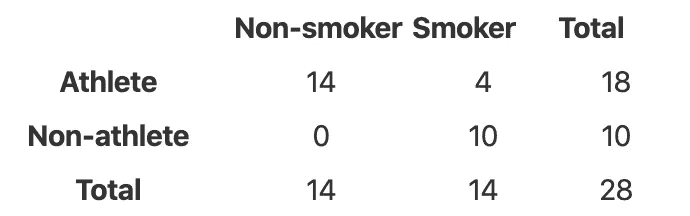
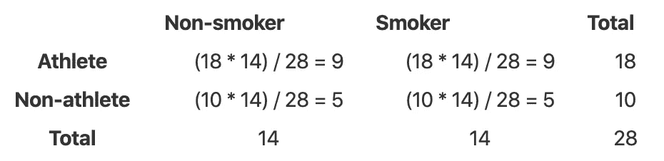
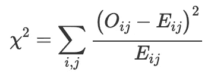
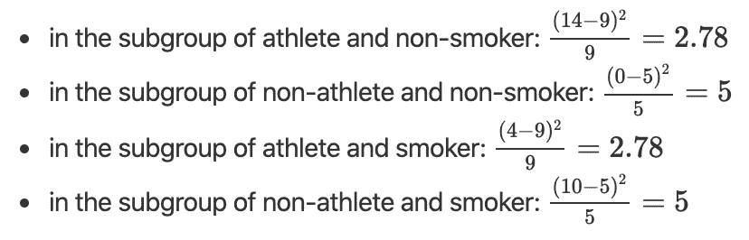
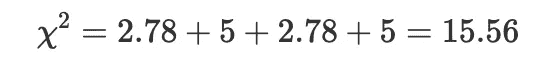
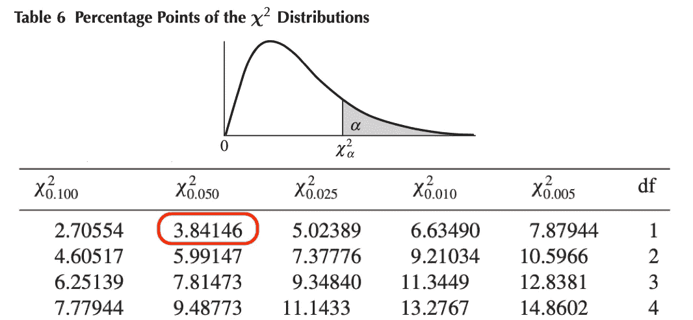

# 手工卡方独立性检验

> 原文：<https://towardsdatascience.com/chi-square-test-of-independence-by-hand-e87c0d36e7cd?source=collection_archive---------11----------------------->

## 或者如何测试两个定性变量之间的关联

戴维·潘宁顿的照片

# 介绍

C 独立性的卡方检验检验两个[定性变量](https://www.statsandr.com/blog/variable-types-and-examples/#qualitative)是否独立，即两个分类变量之间是否存在关系。换句话说，该测试用于确定两个定性变量之一的值是否依赖于另一个定性变量的值。

如果测试显示两个变量之间没有关联(即变量是独立的)，这意味着知道一个变量的值不会给出另一个变量的值的信息。相反，如果测试显示变量之间的关系(即变量是相关的)，这意味着知道一个变量的值就提供了关于另一个变量的值的信息。

本文重点介绍如何手工执行独立性的卡方检验，以及如何用一个具体的例子来解释结果。要了解如何在 R 中进行这个测试，请阅读文章“[R 中独立性的卡方测试](https://www.statsandr.com/blog/chi-square-test-of-independence-in-r/)”。

# 假设

独立性的卡方检验是一种假设检验，因此它有一个零假设(H0)和一个替代假设(H1):

*   H0:变量是独立的，两个分类变量之间没有关系。知道一个变量的值无助于预测另一个变量的值
*   H1:变量是相关的，两个分类变量之间有关系。知道一个变量的值有助于预测另一个变量的值

# 测试是如何进行的？

独立性卡方检验的工作原理是，如果两个分类变量之间没有关系，则将观察到的频率(即样本中观察到的频率)与预期频率(即零假设为真时的预期频率)进行比较。

如果观察频率和预期频率之间的差异**很小**，我们不能拒绝独立性的零假设，因此我们不能拒绝两个**变量不相关的事实**。另一方面，如果观察频率和预期频率之间的差异**很大**，我们可以拒绝独立性的零假设，因此我们可以得出两个**变量相关的结论**。

小差异和大差异之间的阈值是来自卡方分布的值(因此称为测试)。该值称为临界值，取决于显著性水平α(通常设置为等于 5%)和自由度。这个临界值可以在卡方分布的统计表中找到。关于这个临界值和自由度的更多信息将在本文后面介绍。

# 例子

以我们的例子为例，我们想确定吸烟和成为职业运动员之间是否有统计学上的显著联系。吸烟只能是“是”或“不是”，做职业运动员只能是“是”或“不是”。感兴趣的两个变量是定性变量，因此我们需要使用独立性的卡方检验，并且已经收集了 28 个人的数据。

注意，为了简单起见，我们选择了二元变量(二元变量=具有两个水平的定性变量)，但是独立性的卡方检验也可以在具有两个以上水平的定性变量上进行。例如，如果变量吸烟有三个水平:(I)不吸烟者，(ii)中度吸烟者和(iii)重度吸烟者，测试的步骤和结果的解释与两个水平的测试相似。

# 观察到的频率

我们的数据汇总在下表中，报告了每个亚组的人数、按行、按列的总数以及总计:

# 预期频率

请记住，对于独立性的卡方检验，我们需要确定如果两个变量之间没有关联，观察到的计数是否与我们预期的计数显著不同。我们有观察到的计数(见上表)，所以我们现在需要计算变量独立情况下的预期计数。使用以下公式逐一计算每个子组的这些预期频率:

obs 在哪？符合观察结果。给定我们上面的观察频率表，下面是为每个亚组计算的预期频率表:

请注意，只有当所有组中的**预期**频率等于或大于 5 时，才应进行独立性卡方检验。我们的例子满足了这个假设，因为预期频率的最小数量是 5。

# 检验统计量

我们有观察到的和预期的频率。我们现在需要比较这些频率，以确定它们是否有显著差异。观察频率和预期频率之间的差异称为检验统计量(或 t-stat ),用χ2 表示，计算如下:

其中 O 代表观察频率，E 代表预期频率。我们使用观察频率和预期频率之间的差值的平方来确保负差值不会被正差值所补偿。该公式看起来比实际更复杂，所以让我们用例子来说明它。我们首先根据以下公式逐一计算每个子组中的差异:

然后我们将它们相加，得到检验统计量:

# 临界值

单独的检验统计不足以得出两个变量之间的独立性或依赖性的结论。如前所述，这个测试统计量(在某种意义上是观察到的频率和预期的频率之间的差异)必须与临界值进行比较，以确定差异是大还是小。如果不从临界值的角度来看，就无法判断一个检验统计量是大还是小。

如果测试统计值高于临界值，这意味着观察到观察频率和预期频率之间的差异的可能性不大。另一方面，如果检验统计低于临界值，则意味着观察到这种差异的概率是可能的。如果有可能观察到这种差异，我们不能拒绝这两个变量是独立的假设，否则我们可以得出结论，变量之间存在关系。

临界值可在卡方分布的统计表中找到，并取决于显著性水平(表示为αα)和自由度(表示为 dfdf)。显著性水平通常设置为等于 5%。独立性卡方检验的自由度如下:

df =(行数 1) ⋅(列数 1)

在我们的例子中，自由度因此是 df =(21)⋅(21)= 1，因为列联表中有两行和两列(总数不作为一行或一列计算)。

我们现在有了在卡方表中找到临界值的所有必要信息(α = 0.05，df = 1)。为了找到临界值，我们需要看看下图中 df = 1 的行和χ^2_0.050(因为α = 0.05)的列。临界值是 3.84146。 [1](https://www.statsandr.com/blog/chi-square-test-of-independence-by-hand/#fn1)

卡方表——α= 5%和 df = 1 时的临界值

# 结论和解释

既然我们已经有了检验统计量和临界值，我们可以比较它们来检查变量独立性的零假设是否被拒绝。在我们的例子中，

测试统计= 15.56 >临界值= 3.84146

像任何统计检验一样，当检验统计量大于临界值时，我们可以在指定的显著性水平上拒绝零假设。

在我们的案例中，我们因此可以在 5%的显著性水平上拒绝两个分类变量之间独立性的零假设。

这意味着吸烟习惯与是否是运动员之间有很大关系。知道一个变量的值有助于预测另一个变量的值。

感谢阅读。我希望这篇文章能帮助您手工执行独立性卡方检验并解释其结果。如果你想了解如何在 R 中做这个测试，请阅读文章“[R 中独立性的卡方测试](https://www.statsandr.com/blog/chi-square-test-of-independence-in-r/)”。

和往常一样，如果您有与本文主题相关的问题或建议，请将其添加为评论，以便其他读者可以从讨论中受益。

**相关文章:**

*   [我的数据服从正态分布吗？关于最广泛使用的分布以及如何检验 R 中的正态性的注释](https://www.statsandr.com/blog/do-my-data-follow-a-normal-distribution-a-note-on-the-most-widely-used-distribution-and-how-to-test-for-normality-in-r/)
*   [手工描述性统计](https://www.statsandr.com/blog/descriptive-statistics-by-hand/)
*   [总体和样本有什么区别？](https://www.statsandr.com/blog/what-is-the-difference-between-population-and-sample/)
*   [一个闪亮的手动推断统计应用](https://www.statsandr.com/blog/a-shiny-app-for-inferential-statistics-by-hand/)

*原载于 2020 年 1 月 27 日 https://statsandr.com***。**